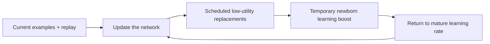
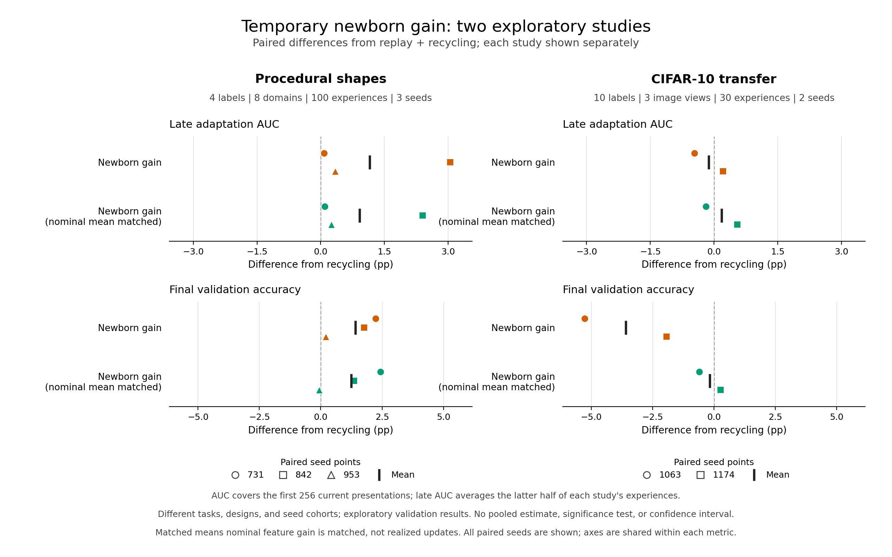
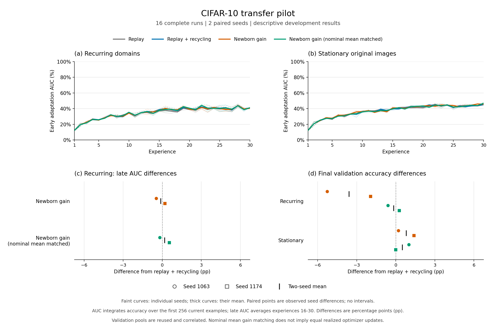

# Adam

[](https://github.com/switchfire6/ACP-CL/actions/workflows/ci.yml)

**Learning when knowledge applies, and when it must change.**

Adam is the working project name. An optional expansion is **Adaptive Dynamics
and Associative Memory**; it describes the research direction, not a validated
algorithm. The project name is separate from the Adam optimizer used in these
experiments.

This project studies learning representations from scratch, inferring when
retained knowledge applies, and revising it as conditions change. The accepted
[research charter](docs/research_charter.md) separates these hypotheses from
the evidence for them. We publish controls, protocols, source archives, and
unsuccessful results alongside positive findings.

## Latest: calibrated continual learning (Sept–Oct 2026)

**Read the write-up:**
[Calibrated continual learning: what an exact ideal agent reveals about online learners](reports/calibrated_continual_learning_findings.md).
It starts with a plain-language explanation, then gets technical.

**What was tested.** Can a learner keep a shared, steadily averaged core of
knowledge plus small "tags" for recurring situations, and so recover old
knowledge faster than relearning it? Every learner was scored against an
**exact ideal agent with the same information**.

**What we found.**

- The early failures were about how the learner learned, not about missing
  information.
- Weight averaging and replay fixed most of the single-situation gap.
- Learners that choose their own data fall into **exploration traps**. A fading
  count bonus fixed them in 24/24 seeds, and the extra exploration paid for
  itself.
- In the decisive go/no-go study, a simple learner that reads only the last
  episode **beat the tag mechanism**, and even beat oracle-indexed tags. The
  situation was readable from recent experience, so the mechanism was retired.

The ingredients all have precedents, and the write-up says so plainly.

| Step | Report |
|---|---|
| Information audit | [information_audit](reports/information_audit/README.md) |
| Competence gap | [B](reports/competence_gap/summary.md), [B2](reports/competence_ceiling/summary.md) |
| Consolidated recall (stopped) | [C](reports/consolidated_recall/dev/summary.md) |
| Commons world | [D0](reports/commons_d0/summary.md), [D0b](reports/commons_d0b/summary.md) |
| Learner competence | [D1](reports/commons_d1/summary.md), [D1b](reports/commons_d1b/summary.md) |
| Go/no-go | [D2](reports/commons_d2/dev/summary.md), [D2w](reports/commons_d2w/summary.md) |

## Earlier studies

The [causal-access experiment](reports/causal_access_results.md) completed
six fresh seeds per architecture and 196,608 frozen-stream arrivals, including
every environmental transition. **Both architectures fail qualification and the
raw online screen; this frozen-core/additive-residual branch is stopped.**
Recurrent feedback-based mixing lowers whole-stream error from .172644 to
.132948 and beats fixed averaging in five of six seeds, but old competence and
novel-condition guards fail. Conditional mixing does not reliably beat fixed
averaging. These are useful access observations, not a general continual learner.
The [all-seed plot](reports/causal_access/development/policy_brier.png) and
[competence checks](reports/causal_access/development/availability_cues.png)
show both the gains and limitations. The protocol permits small retention
losses; it does not test optimal forgetting or consolidation during learning.

The preceding [saved-output diagnostic](reports/core_residual_output_results.md)
reuses 48 saved states with zero training. Across both architectures, the
correction improves novel-environment prediction but interferes with the core
at old-environment return entry. Both fixed exploratory effort-allocation
heuristics pass; the original learning screens remain failed. Absolute
competence is still a problem: the recurrent old core is weak, and conditional
supply-timing cue use remains negligible. See the
[all-seed plot](reports/core_residual_outputs/development/allocation.png).
That diagnosis motivated the completed [causal-access protocol](docs/causal_access_protocol.md)
above. No window, temperature, architecture or replay sweep followed its failures.

The preceding [learned-core and adaptive-residual comparison](reports/core_residual_results.md)
completed six fresh seeds per architecture, 36 continuing learned trajectories
and 12 fresh references. **Freezing the learned core fails the fixed combined
acquisition/retention screen in both architectures**, despite passing task
qualification. Conditional new-dependency Brier AUC is .10289 versus .08604 for
joint training; recurrent is .09173 versus .08781. Return performance improves
for conditional and worsens for recurrent. The recurrent adaptive visual encoder
does beat fixed random features in all six seeds, but that narrower result does
not promote the failed freezing rule. All 268 scoped tests and independent
numerical/checkpoint/portable audits pass. See the [plots and full archive](reports/core_residual/README.md).

The preceding [state-and-environment diagnostic](reports/rehearsal_state_results.md)
completed 24 fresh learning trajectories, 48 assessments and 3,456 rehearsal
forks. It independently varied weights, complete Adam state and recent causal
experience, then tested paired current/returning environments. The earlier loss
of selection usefulness **did not meet the fixed replication criteria in either
architecture**. The conditional average moved in the opposite direction; the
recurrent result met the magnitude requirement but missed seed consistency.
Component effects remain descriptive. Better memory ranking also did not
establish better absolute predictions or an advantage over no extra rehearsal.

Ordinary uniform replay remains the working reference. The
[predictive-retention note](docs/predictive_retention.md) separates prediction
accuracy, the value of additional rehearsal, and the value of an actual retention
policy. The tested scalar score and state rollbacks will not be expanded or
tuned on these seeds. The learned-core/raw-input-residual comparison is now
complete with uniform replay, matching total architecture and learning exposure.
Its negative primary results motivated the completed core/residual/context
diagnosis and causal-access test above. Further nearby tuning would repeat
the same unsuccessful search. The [preceding predictive-value study](reports/predictive_value_results.md)
and its failed local/return criteria remain unchanged.
The [earlier historical review and selective-update study](reports/adam_revision_results.md)
remains negative and unchanged. The [research synthesis](docs/research_synthesis.md)
and [focused related-work review](docs/predictive_value_related_work.md) distinguish
supported observations from open hypotheses. General continual learning,
long-term compounding and a novel, broadly effective algorithm remain unestablished.

ACP-CL names the original critical-period experimental line. Existing package
and command names (`acp_cl`, `acp-cl`) retain compatibility with its archived
experiments. The studies below record the development of the broader project.

A new [architectural prototype](docs/dual_path.md) separates a fast raw-input
learner from a stable predictor, with periodic replay-based consolidation.
Both learn from scratch. It includes controls with the same two-pathway
architecture, fresh-model references, and explicit consolidation diagnostics.
This starts a new experimental line; it does not revise the archived gain studies.
The [initial 12-run CIFAR-100 diagnostic](reports/dual_path_results.md) was negative:
separated learning averaged 2.08% final accuracy versus 3.30% for joint training
of the same architecture. All methods had weak retention; sustained plasticity
has not been demonstrated.

A new [joint-persistence experiment](docs/joint_persistence.md) tests whether
recurrence and predicted survival relevance can guide bounded experience memory.
The [completed 288-run pilot](reports/persistence_results.md) found that replay
and continued feature learning helped, but the proposed combined selection rule
did not beat uniform replay: its primary return-survival difference was −0.78
percentage points. The source, controls, full results and audits are preserved.

A [conditional-reuse follow-up](docs/conditional_relationships.md) learns which
stored consequence mapping applies from recent action/outcome evidence. The
[144-run pilot](reports/conditional_results.md) improved return survival by
11.60 percentage points over pooled predictions with no weight updates during
the probe, positive in all eight seeds. Learning a new dependency was slower;
final late-gate performance was 1.83 points below pooling. This supports the
reuse mechanism within the testbed, while leaving general continual learning open.

A [matched-history comparison](reports/contextual_results.md) completed 96
prefix fits and 288 challenge branches with eight fresh seeds. Original
conditional routing improved old-condition return by 7.10 points over a
qualified recurrent learner and retained old knowledge 4.11 points better after
new learning. The proposed query-routing correction failed its new-learning
screen: -0.38 points versus recurrence and +0.22 versus the original router.
Continued visual adaptation helped the recurrent model's new-learning AUC by
4.14 points versus freezing. The original router remains the working reference.

A [continued-acquisition diagnostic](reports/acquisition_results.md) completed
12 prefix fits and 180 episodes across six fresh seeds and two architectures.
Learned weights remained useful after optimizer/replay reset; resetting that
state improved acquisition and worsened valid-old retention in every seed
average. The conditional fresh-model delay-cue check missed its predefined
threshold (.00194 versus .002). This motivated separating optimizer history
from replay effects before choosing an intervention.

The [optimizer-by-replay diagnostic](reports/training_state_results.md)
completed 12 prefixes and 372 episodes after 72 independent development fits.
Both architectures passed every fresh-model qualification check. Replay reset
with Adam retained improved acquisition in every seed average. It reduced
conditional-model forgetting during new learning but increased recurrent-model
forgetting; both retained less old knowledge on return and became more
vulnerable to noise. The [full contrast tables](reports/training_state/summary.md)
preserve every arm. This motivated the replay-renewal studies below.

The [replay-renewal studies](reports/replay_renewal_results.md) completed 48
prefix fits and 372 episodes across two independent six-seed cohorts. Packet
deletion and reservoir-age rebasing both contribute to the local acquisition
benefit. A continuous recent-8/historical-8 policy lowers acquisition Brier AUC
by .004667 conditional and .005237 recurrent, improving all six seeds in each.
It raises terminal valid-old error and exceeds the allowed extra noise penalty;
both architectures fail the prospective combined screen despite passing fresh
qualification and survival guardrails. Every outcome is retained. The
[memory explanation](docs/replay_memory_mechanism.md) describes the tested
samplers; it is not a claim that memory age alone determines usefulness.

The [evidence-consolidation study](reports/evidence_consolidation_results.md)
tested frozen proposals on subsequent observations before accepting their
weights. Across six seeds and both architectures, repeated evidence helped
during noisy periods but increased whole-stream prediction error in every
seed and exceeded the allowed return cost. Both failed their combined screen
despite passing fresh learnability checks. The uncertain narrowing of the gap
in later cycles did not establish compounding learning. All acceptance rules
shared one draft, so they did not test improved representation learning.

[Latest report](reports/rehearsal_state_results.md) ·
[Research charter](docs/research_charter.md) ·
[Research review](docs/research_review.md) ·
[Reproduce the experiments](docs/reproduction.md) ·
[Contributing](CONTRIBUTING.md)

## Original critical-period hypothesis

Biological critical periods motivate a stability–plasticity question: can a
network preserve mature representations while giving new or renewed features
a temporary opportunity to learn quickly? Our initial proposal combined
closure, local reopening, recycling, and consolidation. Later experiments
isolated a narrower intervention: **temporarily increase learning for a unit
after it is replaced, then return it to the mature learning rate**.

The main comparisons build on a fixed-size network and a small replay buffer:

1. **Replay:** rehearse a sample of earlier examples alongside current data.
2. **Recycling:** periodically replace a few low-utility feature units.
3. **Newborn gain:** give replaced units a short, decaying learning boost.
4. **Budget-matched control:** fund that boost by reducing gain elsewhere,
   keeping the nominal mean feature gain equal to the recycling baseline.



This is a schematic of the gain variant. Protection and consolidation were
also tested separately. The classifier stays trainable, and ordinary learners
receive no domain IDs or evaluation feedback. Equal nominal gain does not
ensure equal realized updates after gradient clipping. The
[allocation rules](docs/algorithm_v3.md) describe the exact implementation.

## What we have learned

The three main studies below contain **185 comparative runs**. Scratch fits
and engineering smoke checks are recorded separately.

| Study | Scope | Main finding |
|---|---|---|
| [V2: combined mechanism](reports/v2_results.md) | 102 exploratory comparative runs | The combined policy did not establish an advantage over replay plus recycling. A simpler constant-gain diagnostic motivated isolating allocation. |
| [V3: isolated mechanisms](reports/v3_results.md) | 16 development + 51 locked evaluation runs | Newborn gain improved recurring-shape late acquisition AUC by **1.15 pp**; nominal matching improved it by **0.92 pp**. Most improvement came from one of three seeds. |
| [CIFAR-10 transfer](reports/cifar10_transfer_results.md) | 16 fixed development runs; two paired seeds | Newborn gain changed recurring late AUC by **−0.12 pp** and final accuracy by **−3.60 pp** versus recycling. The predeclared continuation rule failed. |

### Completed v3 study



Every point is a within-study seed-paired difference versus replay plus
recycling; black marks show means. Higher is better. **These are different
experiments, not a pooled estimate:** shapes use three evaluation seeds,
whereas CIFAR-10 uses two development seeds and unique current-image arrivals.
Both acquisition metrics integrate the first 256 current presentations and
average the latter half of their respective streams. Small cohorts limit
inference; no significance claim is made here.

The [v3 report](reports/v3_results.md) preserves every variant, including
stationary and early-bias checks. Its
[reproduction instructions](docs/reproduction.md#completed-v3-study) cover
development selection and the separate locked evaluation cohort.

## CIFAR-10 transfer pilot

We carried the v3 settings to natural images with ten fixed labels, 45,000
unique current arrivals per run, and recurring original/grayscale/blur domains.
A paired stationary control used the same base images without domain changes.
The protocol, seeds, source, and continuation thresholds were committed before
training. All 16 planned runs completed, with no excluded runs or retries.

Mean validation results across two seeds:

| Method | Recurring final accuracy | Recurring late acquisition AUC | Stationary final accuracy |
|---|---:|---:|---:|
| Replay | 42.83% | 39.40% | **47.90%** |
| Replay + recycling | **43.40%** | 40.24% | 44.60% |
| Newborn gain | 39.80% | 40.12% | 45.40% |
| Newborn gain, nominal mean matched | 43.23% | **40.42%** | 45.10% |

The baselines passed the learning-adequacy screen. Both gain variants failed
our required signal and retention checks. **Decision: stop scaling this
recipe.** A +0.18 pp mean AUC difference for the matched variant, with mixed
seed signs, did not meet the rule fixed before outcomes.

<details>
<summary>View the CIFAR-10 learning curves and individual seed contrasts</summary>



Thin curves show individual seeds; thick curves show their mean. Repeated
validation views share base images and are correlated. AUC measures retained
knowledge, transfer, and adaptation together; it is not pure learning speed.

</details>

See the [protocol](docs/cifar10_transfer_protocol.md),
[all per-seed outcomes](reports/cifar10_transfer/summary.md),
[independent local audit](reports/cifar10_transfer/independent_audit.md), and
[training/reproduction commands](docs/reproduction.md#cifar-10-transfer-pilot).
The artificial domain changes and short horizon do not establish performance
on natural distribution shifts or prevention of long-term plasticity loss.
Changing several aspects of the shape experiment also prevents assigning the
failed transfer to a single synthetic shortcut.

## What would justify more work?

A precise gap in prior work, a published benchmark that can test it, competitive
baselines with equal declared tuning budgets, and fresh evaluation seeds.
We will not add parameters or seeds to rescue the failed pilot retrospectively.
The useful outcome so far is a controlled transfer result and a reusable
experimental platform; scientific novelty remains unproven.

The ingredients have close precedents in
[continual backpropagation](https://www.nature.com/articles/s41586-024-07711-7),
[Neurogenesis Deep Learning](https://arxiv.org/pdf/1612.03770), and other
[renewal and maturation approaches](docs/algorithm_v3.md#close-computational-precedents).
This project does not claim invention of those ingredients or biological equivalence.

## Setup

Use Python 3.10 for the closest match to recorded experiments. Follow the
[platform-specific installation guide](docs/reproduction.md#setup) for Windows,
Linux, macOS, or CUDA. After installation, run a small download-free CPU check:

```powershell
.venv/Scripts/python.exe -m acp_cl run --config configs/v3_smoke.json --output runs/my_smoke --device cpu --no-plots
```

On Linux/macOS, substitute `.venv/bin/python`. This smoke checks execution;
its accuracy is not research evidence. The detailed guide includes all study
commands, runtime requirements, method definitions, and analysis tools.

## Evidence and verification

- **546 local CPU tests passed**, with three platform/device skips; Ruff passed.
- Eight separate real-CIFAR engineering runs covered all four pilot methods
  on CPU and GPU.
- Independent local arithmetic audits checked all v3 locked runs and all
  16 CIFAR-10 runs. These are artifact checks, not external scientific replication.
- Plans, source/runtime hashes, paired outcomes, curves, and negative results
  are retained. Large datasets, raw checkpoints, and full local run directories
  are omitted from Git; reports identify their hashes and reproduction steps.

The [CPU workflow](https://github.com/switchfire6/ACP-CL/actions/workflows/ci.yml)
runs tests, lint, and download-free smoke experiments on GitHub. Its status
does not reproduce the archived CUDA study trajectories.

The original [research report](docs/deep-research-report.md) and
[evidence review](docs/research_review.md) document the starting hypothesis.
Historical artifact seals refer to their recorded Git snapshots: `a038786`
for v3 and `5985b77` for CIFAR-10. Later README edits do not replace those seals.

This is a public research notebook. No distribution license has been selected;
publication alone does not grant an open-source license. See
[contribution guidance](CONTRIBUTING.md) for experiment-preservation practices.
