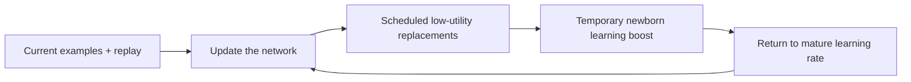

# Adaptive Critical-Period Continual Learning

[](https://github.com/switchfire6/ACP-CL/actions/workflows/ci.yml)

**Can a brief learning window for newly replaced neurons help a neural network keep learning without sacrificing what it already knows?**

ACP-CL is a PyTorch research notebook testing that hypothesis. We publish the
algorithms, controls, experiment plans, and unsuccessful results together.
**Current finding:** a small benefit on procedural shapes did not transfer
convincingly to our CIFAR-10 pilot. We stopped scaling that frozen recipe.
The broader hypothesis remains open; a novel, generally effective algorithm
has not been established.

[Latest report](reports/cifar10_transfer_results.md) ·
[Research review](docs/research_review.md) ·
[Reproduce the experiments](docs/reproduction.md) ·
[Contributing](CONTRIBUTING.md)

## The hypothesis

Biological critical periods motivate a stability–plasticity question: can a
network preserve mature representations while giving new or renewed features
a temporary opportunity to learn quickly? Our initial proposal combined
closure, local reopening, recycling, and consolidation. Later experiments
isolated a narrower intervention: **temporarily increase learning for a unit
after it is replaced, then return it to the mature learning rate**.

The main comparisons build on a fixed-size network and a small replay buffer:

1. **Replay:** rehearse a sample of earlier examples alongside current data.
2. **Recycling:** periodically replace a few low-utility feature units.
3. **Newborn gain:** give replaced units a short, decaying learning boost.
4. **Budget-matched control:** fund that boost by reducing gain elsewhere,
   keeping the nominal mean feature gain equal to the recycling baseline.



This is a schematic of the gain variant. Protection and consolidation were
also tested separately. The classifier stays trainable, and ordinary learners
receive no domain IDs or evaluation feedback. Equal nominal gain does not
ensure equal realized updates after gradient clipping. The
[allocation rules](docs/algorithm_v3.md) describe the exact implementation.

## What we have learned

The three main studies below contain **185 comparative runs**. Scratch fits
and engineering smoke checks are recorded separately.

| Study | Scope | Main finding |
|---|---|---|
| [V2: combined mechanism](reports/v2_results.md) | 102 exploratory comparative runs | The combined policy did not establish an advantage over replay plus recycling. A simpler constant-gain diagnostic motivated isolating allocation. |
| [V3: isolated mechanisms](reports/v3_results.md) | 16 development + 51 locked evaluation runs | Newborn gain improved recurring-shape late acquisition AUC by **1.15 pp**; nominal matching improved it by **0.92 pp**. Most improvement came from one of three seeds. |
| [CIFAR-10 transfer](reports/cifar10_transfer_results.md) | 16 fixed development runs; two paired seeds | Newborn gain changed recurring late AUC by **−0.12 pp** and final accuracy by **−3.60 pp** versus recycling. The predeclared continuation rule failed. |

### Completed v3 study


Every point is a within-study seed-paired difference versus replay plus
recycling; black marks show means. Higher is better. **These are different
experiments, not a pooled estimate:** shapes use three evaluation seeds,
whereas CIFAR-10 uses two development seeds and unique current-image arrivals.
Both acquisition metrics integrate the first 256 current presentations and
average the latter half of their respective streams. Small cohorts limit
inference; no significance claim is made here.

The [v3 report](reports/v3_results.md) preserves every variant, including
stationary and early-bias checks. Its
[reproduction instructions](docs/reproduction.md#completed-v3-study) cover
development selection and the separate locked evaluation cohort.

## CIFAR-10 transfer pilot

We carried the v3 settings to natural images with ten fixed labels, 45,000
unique current arrivals per run, and recurring original/grayscale/blur domains.
A paired stationary control used the same base images without domain changes.
The protocol, seeds, source, and continuation thresholds were committed before
training. All 16 planned runs completed, with no excluded runs or retries.

Mean validation results across two seeds:

| Method | Recurring final accuracy | Recurring late acquisition AUC | Stationary final accuracy |
|---|---:|---:|---:|
| Replay | 42.83% | 39.40% | **47.90%** |
| Replay + recycling | **43.40%** | 40.24% | 44.60% |
| Newborn gain | 39.80% | 40.12% | 45.40% |
| Newborn gain, nominal mean matched | 43.23% | **40.42%** | 45.10% |

The baselines passed the learning-adequacy screen. Both gain variants failed
our required signal and retention checks. **Decision: stop scaling this
recipe.** A +0.18 pp mean AUC difference for the matched variant, with mixed
seed signs, did not meet the rule fixed before outcomes.

<details>
<summary>View the CIFAR-10 learning curves and individual seed contrasts</summary>


Thin curves show individual seeds; thick curves show their mean. Repeated
validation views share base images and are correlated. AUC measures retained
knowledge, transfer, and adaptation together; it is not pure learning speed.

</details>

See the [protocol](docs/cifar10_transfer_protocol.md),
[all per-seed outcomes](reports/cifar10_transfer/summary.md),
[independent local audit](reports/cifar10_transfer/independent_audit.md), and
[training/reproduction commands](docs/reproduction.md#cifar-10-transfer-pilot).
The artificial domain changes and short horizon do not establish performance
on natural distribution shifts or prevention of long-term plasticity loss.
Changing several aspects of the shape experiment also prevents assigning the
failed transfer to a single synthetic shortcut.

## What would justify more work?

A precise gap in prior work, a published benchmark that can test it, competitive
baselines with equal declared tuning budgets, and fresh evaluation seeds.
We will not add parameters or seeds to rescue the failed pilot retrospectively.
The useful outcome so far is a controlled transfer result and a reusable
experimental platform; scientific novelty remains unproven.

The ingredients have close precedents in
[continual backpropagation](https://www.nature.com/articles/s41586-024-07711-7),
[Neurogenesis Deep Learning](https://arxiv.org/pdf/1612.03770), and other
[renewal and maturation approaches](docs/algorithm_v3.md#close-computational-precedents).
This project does not claim invention of those ingredients or biological equivalence.

## Setup

Use Python 3.10 for the closest match to recorded experiments. Follow the
[platform-specific installation guide](docs/reproduction.md#setup) for Windows,
Linux, macOS, or CUDA. After installation, run a small download-free CPU check:

```powershell
.venv/Scripts/python.exe -m acp_cl run --config configs/v3_smoke.json --output runs/my_smoke --device cpu --no-plots
```

On Linux/macOS, substitute `.venv/bin/python`. This smoke checks execution;
its accuracy is not research evidence. The detailed guide includes all study
commands, runtime requirements, method definitions, and analysis tools.

## Evidence and verification

- **546 local CPU tests passed**, with three platform/device skips; Ruff passed.
- Eight separate real-CIFAR engineering runs covered all four pilot methods
  on CPU and GPU.
- Independent local arithmetic audits checked all v3 locked runs and all
  16 CIFAR-10 runs. These are artifact checks, not external scientific replication.
- Plans, source/runtime hashes, paired outcomes, curves, and negative results
  are retained. Large datasets, raw checkpoints, and full local run directories
  are omitted from Git; reports identify their hashes and reproduction steps.

The [CPU workflow](https://github.com/switchfire6/ACP-CL/actions/workflows/ci.yml)
runs tests, lint, and download-free smoke experiments on GitHub. Its status
does not reproduce the archived CUDA study trajectories.

The original [research report](docs/deep-research-report.md) and
[evidence review](docs/research_review.md) document the starting hypothesis.
Historical artifact seals refer to their recorded Git snapshots: `a038786`
for v3 and `5985b77` for CIFAR-10. Later README edits do not replace those seals.

This is a public research notebook. No distribution license has been selected;
publication alone does not grant an open-source license. See
[contribution guidance](CONTRIBUTING.md) for experiment-preservation practices.
