# ACP-CL reference algorithm, version 0.1

The later `acp_v2` revision is documented separately in [algorithm_v2.md](algorithm_v2.md).

This is a deterministic experimental candidate derived from the supplied report. It is not a biological simulation, a canonical SI/CBP reproduction, or an established improvement over replay. The narrower claim and primary-source audit are in [research_review.md](research_review.md); the planned scientific study is in [experiment_protocol.md](experiment_protocol.md).

## What is implemented

The learner receives only a current minibatch `(x, y)`. It has no experience index, boundary notification, validation loss, future classes, or task-conditioned inference. The runner knows experience boundaries for data delivery and evaluation. Every model uses a fixed shared output space from initialization, including as-yet unseen labels. The classifier head always has gain one and no consolidation; its old behavior is protected by replay.

The MLP has two recyclable hidden populations. The small CNN and CIFAR-stem GroupNorm ResNet-18 have a final Linear/ReLU adapter before their classifier. Only that adapter is recycled in the image models. No convolutional channel with residual or GroupNorm coupling is independently reset. The predictive architecture is identical across compared methods.

The implementation is split into `controller.py` (phase decisions), `monitor.py` (training signals), `plasticity.py` (parameter state/updates/recycling), and `learner.py` (their ordered interaction).

## Objective and parameter update

On each presentation, sample replay before inserting the current examples:

\[
L_{data}=\operatorname{mean} CE(B_t)+\lambda_R\operatorname{mean} CE(B_R).
\]

An empty replay buffer contributes zero. The default is `lambda_R=1`, so the smaller replay batch is not implicitly downweighted by concatenating and averaging all examples. Current and replay gradients are computed separately for every method; ACP uses their local alignment at monitoring windows.

Each parameter tensor is grouped by its first axis: output channels for linear/convolutional weights and entries for biases/normalization parameters. These are separate row statistics, not a single shared importance value across every tensor associated with a biological “unit.” Maintain row consolidation `c`, importance `U`, and maturity age. Maintain tensor-valued data momentum `m`, anchor `a`, window start `s`, and path integral `w`.

For row `j` in block `l`:

\[
m_t=\beta m_{t-1}+\nabla L_{data},\qquad
q_j=g_{min}+(g_l-g_{min})(1-c_j^{eff})^\gamma.
\]

\[
\Delta\theta=-\eta q m_t-\eta q\lambda_W\theta
-\eta\lambda_A c(\theta-a).
\]

The gain is applied **after** accumulating momentum. Thus old momentum cannot bypass a closed gate. The final data gain lies in `[g_min,1]`; consolidation cannot shrink it below the declared floor. Weight decay is separately applied and scaled, rather than accumulated inside momentum. The anchor remains independently active with stored `c`, even while data plasticity is temporarily relaxed. Consequently this is an SGD-style optimizer with scaled decoupled decay, not exactly `torch.optim.SGD(weight_decay=...)`.

At `g_l=g_min`, all rows share the data gain floor: adult consolidation acts through the anchor. Importance differentiates data gains when a block is open or reopened. This precise choice should receive an ordinary-SGD and alternative-floor control before making broad optimizer claims.

## Online measurements

The monitoring cadence is measured in optimizer steps and is independent of the evaluator's experience boundaries.

* **Surprise:** positive current-window mean-loss innovation divided by the previous EMA absolute-deviation scale, with a scale floor and a cap of six. This is a robust scale proxy, not a calibrated statistical z-score.
* **Drift:** aggregate feature sums, squares, and counts across the entire monitoring window. Compare its penultimate-feature mean with the previous EMA mean, standardize by reference variances, and subtract an independent-sampling estimate of mean-estimation noise before taking the square root. This correction is heuristic for temporally correlated data. Model learning and structural resets can still create apparent feature drift.
* **Health:** average of relative-activation dormancy and positive normalized-effective-rank loss against the running maximum. Centered entropy effective rank uses singular values and is normalized by `min(batch_size-1,width)`. Rank is computed only at monitoring windows on the current batch; it is a diagnostic, not an objective.
* **Replay damage:** an independent sampling RNG selects an in-budget replay probe. Measure cross-entropy on those exact unaugmented images immediately before and after the monitored update, including any recycling. Use `max(0,(after-before)/max(before,0.1))`. The controller sees this at the **next monitoring event**. It does not measure accumulated damage during all intervening updates, provide rollback, or guarantee old-task safety. The probe may overlap the training replay batch by chance; it stores no additional persistent images.

The scalar command is

\[
\nu=\sigma(S+D+0.5P-1.5R-b).
\]

The prototype's block score standardizes **RMS** current-gradient magnitude across blocks, subtracts positive current/replay gradient conflict, and subtracts mean consolidation. RMS avoids favoring a large block merely because it has more parameters. The head is not a candidate. Score coefficients are one in this version.

## Phase transitions

```mermaid
stateDiagram-v2
    [*] --> Scaffold
    Scaffold --> Open: minimum scaffold steps
    Open --> Closing: minimum open steps and consecutive stable windows
    Closing --> Adult: closing ramp completes; consolidate
    Adult --> Reopened: sustained novelty after cooldown
    Reopened --> Adult: stable adaptation or duration limit; consolidate
```

“Stable” requires small absolute relative loss change, small drift, and acceptable observed replay damage. Adaptive initial closure has no time-forced fallback; a permanently open controller is an observable failure mode. Minimum open steps are counted after leaving scaffold. Closure and novelty counters advance only on monitoring observations, not once per minibatch.

Scaffold/open use broad gain one. Closing interpolates toward the floor. Stability is required to enter closing; once started, the finite closing ramp completes without a second stability requirement. Adult uses the floor. Reopened grants `g_min+(1-g_min)*nu` only to the selected top blocks. Excess observed replay damage contracts all feature gates to the floor, including during early development; it can therefore affect behavior before the first closure. Reopening is bounded in both windows and elapsed steps and followed by cooldown. Its bound controls how long a permission lasts, not the magnitude of total parameter motion.

The `fixed` ablation uses absolute initial step boundaries, closes without a stability test, and never reopens. It shares the same component implementation and instrumentation. Its open duration is not automatically matched to adaptive duty cycle; a separately tuned or schedule-matched control remains necessary for strong temporal attribution.

## Consolidation

Accumulate the data-gradient work along its gated momentum displacement:

\[
w_i\leftarrow w_i-\nabla_iL_{data}\,\Delta\theta_i^{data},\qquad
U_j=\frac{\max(0,\sum_{i\in j}w_i)}{\sum_{i\in j}(\theta_i-s_i)^2+\xi}.
\]

The path excludes anchor/decay displacement; it includes momentum. It spans all updates since that block's last consolidation, including adult-floor updates. This is a declared SI-inspired estimator. The window origin `s` is distinct from the moving regularization anchor `a`.

Normalize nonnegative utility by its tensor's 90th percentile and clamp to `[0,1]`, treating an all-zero vector as zero. Mature rows commit:

\[
c_j\leftarrow1-(1-c_j)\exp(-\alpha\widetilde U_j),\qquad
a_j\leftarrow(1-\rho)a_j+\rho\theta_j.
\]

Reset committed paths to zero and window origins to current weights. Initial closure commits all feature blocks once; leaving reopening commits only the selected blocks. With `alpha=.1`, a single event can raise `c` only to about `.095`; it does not create strong protection instantly. With initial `rho=.5`, the first anchor retains a component of initialization. These are tunable design choices, not established optima.

During reopening, `c_eff=c*(1-r_max*(1-normalized_importance))`. A positive-importance top fraction by `c*U` gets zero relaxation. This core protects against relaxation; the separate recycling cutoff protects against reset. Neither rule proves information preservation. Stored consolidation is monotone until a permitted unit reset, so permanently high-protection capacity can eventually become exhausted.

## Recycling

The reference utility is an EMA of `mean(abs(activation))*L1(outgoing_weights)`, corrected for unit age when ranking candidates. This is **CBP-inspired**, not canonical continual backpropagation's full utility/normalization algorithm.

Eligible units must be mature and below the consolidation cutoff on incoming weights and bias. Any protected downstream row vetoes changing its incident column. Replacement budgets accumulate fractionally across checks; a sub-unit budget is not rounded up to one every time. Adult/reopened phases use a smaller replacement fraction. The random-recycling ablation changes the choice, not eligibility or budget.

Reset incoming rows using the original ReLU Kaiming-uniform initialization, zero their bias, and zero outgoing columns. Clear all changed momentum/path slices, incoming consolidation/importance/age, unit utilities, and changed anchor/window-start slices. Registered populations are processed downstream first so adjacent resets cannot recreate an upstream unit's outgoing column. Zeroing a previously nonzero contribution can change predictions; no exact function-preservation claim is made.

## Reproducibility and interpretation

Replay membership, training draws, monitoring draws, augmentations, and recycling use separate private RNGs. Evaluation consumes no learner state except its accounting counter. All paired methods receive the same initialization, sample order, and reservoir membership at equal exposure. Source, configuration, execution device, class order, environment, and split indices are recorded. Checkpoints include model, all controller/monitor/optimizer/replay state, pending monitoring windows, and RNGs; the runner resumes at completed-experience boundaries.

Current reservoir insertion counts **presentations**, including repeated epochs. This is paired across methods but differs from a unique-source-arrival reservoir. The prototype allocates shared instrumentation state even to simple baselines; its measured allocated memory must not be mistaken for their optimal native implementation cost. Wall time includes evaluation and checkpoint writes. Forward/backward example accounting is not measured FLOPs. The full confirmatory protocol calls for stronger memory/compute controls.

A good accuracy value without closing/reopening is not evidence for the critical-period controller. Always inspect phase occupancy, transitions, replay risk contractions, consolidation, recycling, and acquisition curves alongside final accuracy. The first archived synthetic pilot demonstrates this exact pitfall.
