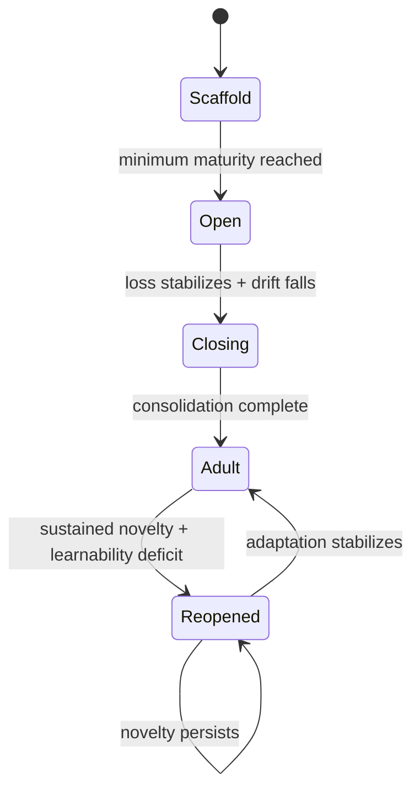
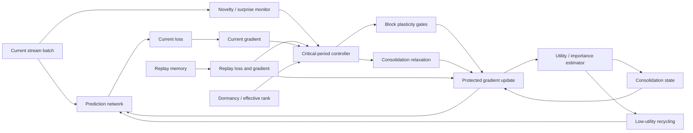
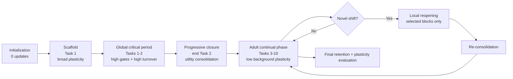

# An Algorithmic “Critical Period” for Continual AI: Plasticity Gating, Consolidation, Structural Turnover, and Selective Reopening

## Executive summary

The most useful computational analogue of a biological critical period is **not** “train aggressively early, then freeze the network.” The neuroscience instead suggests a more interesting control system: plasticity is **opened**, **localized**, **stabilized**, and sometimes **reopened** according to circuit maturity, experience, neuromodulatory context, competition, and structural constraints. In visual cortex, maturation of GABAergic/PV interneuron circuitry helps determine critical-period onset; Otx2 accumulation in PV cells can accelerate that maturation; transient disinhibition can initiate experience-dependent reorganization; silent-synapse maturation and PSD-95 contribute to closure; NgR/myelin and Lynx1 constrain later plasticity; and adult plasticity can be increased by manipulating some of these brakes. citeturn13search3turn13search2turn14search0turn14search8turn14search1turn13search4

That biological picture is especially relevant because continual-learning systems face **two related but distinct failure modes**. Catastrophic forgetting means new learning damages previously acquired behavior; **loss of plasticity** means the network progressively becomes worse at learning new things at all. The latter is now experimentally well documented in long-running deep networks: Dohare et al. found rising dormant-unit fractions, declining representation rank, and degraded new-task learning, while selective reinitialization of low-utility units in *continual backpropagation* substantially preserved plasticity. citeturn16search1 A critical-period-inspired algorithm should therefore protect old knowledge **without protecting so much of the network that it eventually becomes unlearnable**.

My recommended design is **Adaptive Critical-Period Continual Learning (ACP-CL)**. It combines five mechanisms:

1. **Neuromodulatory plasticity gating:** an online novelty/stability controller decides *where and when* large updates are allowed.
2. **Progressive consolidation:** parameters or channels acquire increasing protection only when they repeatedly contribute useful information, analogous at a functional—not molecular—level to synaptic maturation and biological “brakes.”
3. **Sparse structural turnover:** low-utility, weakly consolidated units are periodically recycled so the network retains naïve degrees of freedom.
4. **Small episodic replay:** old samples provide both rehearsal and a real-time measure of whether opening plasticity is damaging existing knowledge.
5. **Local adult reopening:** sufficiently novel inputs can temporarily relax consolidation in selected modules without globally destabilizing the model.

This deliberately synthesizes mechanisms that existing continual-learning methods usually implement separately. EWC and Synaptic Intelligence protect important weights; GEM and replay constrain interference; PackNet/HAT isolate parameters; OML/ANML meta-learn representations or gates; RigL dynamically changes sparse connectivity; continual backpropagation preserves unused learning capacity. citeturn16search3turn16search0turn16search2turn17search0turn12search0turn18search2turn18search0turn17search1turn16search1 ACP-CL's hypothesis is that **the missing ingredient is the temporal controller that coordinates those operations as phases of one stability–plasticity process**.

The central hypothesis is therefore:

> **A continual learner will be more stable over long horizons if plasticity is treated as a renewable, locally allocated resource rather than as a global learning rate: broad plasticity should dominate early development, useful representations should progressively consolidate, unused capacity should continually be rejuvenated, and novelty should trigger bounded local reopening under an explicit old-knowledge safety signal.**

The proposal should first be tested in controlled class-incremental vision with **CIFAR-100**, then on the more natural CORe50 stream, and finally on a long-horizon benchmark such as Infinite dSprites. CORe50 was explicitly designed for continuous object recognition, while Infinite dSprites was introduced because short task sequences can hide eventual degradation and has demonstrated deterioration of major continual-learning method families over sufficiently long horizons. citeturn19search0turn19search2 A reinforcement-learning replication on Continual World would be a valuable later test because that benchmark explicitly evaluates both forgetting and forward transfer across robotic tasks. citeturn19search3

The uploaded research synthesis is a useful starting map, particularly its emphasis on inhibitory maturation, Otx2/PV cells, disinhibitory gating, PSD-95, extracellular constraints, Lynx1/NgR, and the analogy to selective parameter protection. fileciteturn0file0 I would, however, weaken two claims in that synthesis. First, the brain should not be described as having “solved catastrophic forgetting” in the machine-learning sense; biological memory also forgets and interferes. Second, “PNNs close the critical period” is no longer safe as a simple mechanistic statement: a July 2026 bioRxiv study found that deleting aggrecan in inhibitory neurons could eliminate PNNs without preventing critical-period closure, whereas deleting aggrecan in excitatory neurons preserved adult ocular-dominance plasticity. That finding is potentially important but remains a **preprint as of September 2026**. citeturn13search0turn13search1

## What critical-period neuroscience actually suggests for algorithms

Most mechanistic critical-period evidence comes from animal sensory systems, especially mouse visual cortex, rather than directly from the developing human brain. The algorithmic mappings below should therefore be treated as **functional hypotheses**, not claims that an artificial network should literally reproduce particular molecules or cell types.

### Opening plasticity is a controlled state transition

A classic result from Fagiolini and Hensch showed that a threshold of cortical inhibition is required for normal initiation of ocular-dominance critical-period plasticity. Subsequent work found that experience-dependent Otx2 accumulation in PV interneurons promotes their maturation and can accelerate critical-period timing. These observations argue against a naïve model in which maximal plasticity simply exists at birth and monotonically decays. Instead, a circuit can become *competent* for a powerful form of experience-dependent learning only after reaching an appropriate state. citeturn13search3turn13search2

That distinction matters algorithmically. A randomly initialized deep network is highly mutable but is not necessarily usefully plastic. Before allowing unlimited continual modification, an artificial learner may benefit from first developing a sufficiently rich and well-conditioned representation. This suggests an algorithmic **maturity criterion** based on representation diversity, activation coverage, gradient flow, or performance—not simply wall-clock age.

BDNF-associated maturation and inhibitory-circuit development further demonstrate that the timing of plasticity depends on activity and circuit state rather than an independent developmental stopwatch. The important abstraction for AI is therefore not a particular transmitter but **state-dependent gain on learning**. citeturn13search2

### Plasticity is gated by disinhibition rather than applied everywhere

Kuhlman et al. found that monocular deprivation during the critical period produces rapid changes in inhibitory circuitry and that transient reduction of PV-cell activity is required for ocular-dominance plasticity; experimentally raising inhibition could block that plasticity. citeturn14search0 Adult cortical representations can also be reorganized when sensory stimuli are paired with nucleus-basalis activation, supporting a more general role for behavioral/neuromodulatory context in determining which inputs merit cortical change. citeturn15search1

For continual learning, the direct lesson is **selective update permission**. A surprising sample should not automatically produce a large gradient through every layer. A plasticity controller should decide:

\[
g_\ell(t)\in[0,1]
\]

for each layer, block, expert, or channel group \(\ell\), with \(g_\ell\) governing effective learning rate. This is closer to a disinhibitory gate than ordinary global learning-rate annealing.

ANML already provides an important computational precedent: it meta-learns a neuromodulatory network whose activation gates determine which parts of a prediction network participate in a given context, indirectly controlling which parameters receive gradients. citeturn18search0turn18search3 The critical-period proposal extends that idea by making the gate explicitly developmental and coupling it to consolidation, structural turnover, and reopening.

### Competition and pruning are constructive, not merely destructive

Developing circuits do not preserve every connection. Complement components C1q/C3 participate in developmental synapse elimination, and mice deficient in those components show failures of normal retinogeniculate refinement. Microglia likewise participate in developmental synaptic pruning. citeturn15search2turn15search5 At the same time, homeostatic synaptic scaling changes synaptic efficacy in response to prolonged changes in neuronal activity, providing a mechanism that stabilizes overall network activity while local Hebbian changes occur. citeturn15search0

The computational implication is subtle: **permanent protection of every previously useful parameter is undesirable**. Continual learners require active garbage collection. Connections or units that have low long-term utility should be candidates for elimination or reinitialization, while more consequential structure becomes difficult to alter.

This maps especially well to two artificial mechanisms. RigL periodically alters sparse network topology rather than locking a sparse mask for all of training. citeturn17search1 Continual backpropagation selectively reinitializes less-used units and was found to maintain representation diversity and new-task plasticity across long streams. citeturn16search1 A critical-period algorithm should therefore have both **consolidation** and **turnover**; either alone creates pathological extremes.

### Closure is progressive consolidation, not necessarily complete freezing

Several biological results support distinct but complementary constraints on mature plasticity. PSD-95-dependent maturation of silent glutamatergic synapses is sufficient to affect critical-period duration in mouse visual cortex; removal of PSD-95 after the developmental window can restore silent synapses and juvenile-like ocular-dominance plasticity. citeturn14search8 NgR knockout leaves normal juvenile plasticity but allows unusually juvenile-like ocular-dominance plasticity at later ages, implicating myelin-associated signaling in consolidation. citeturn14search1 Lynx1 rises in mature visual cortex and limits cholinergic signaling; loss of Lynx1 permits enhanced adult plasticity and recovery in an amblyopia model. citeturn13search4

The computational analogy is a **continuously varying protection state** rather than a binary trainable/frozen flag:

\[
c_i(t)\in[0,1]
\]

where \(c_i\approx0\) denotes a highly plastic parameter or channel and \(c_i\approx1\) denotes a consolidated one.

This also aligns with theoretical work on complex biological synapses. Fusi, Drew, and Abbott showed that multiple metaplastic states can improve the trade-off between rapid storage and retention, while Benna and Fusi showed that interacting variables across fast and slow timescales can transfer memories progressively into more persistent states. citeturn20search1turn20search0 That is a stronger computational inspiration than a one-time “freeze after pretraining” rule.

### Closed periods remain conditionally reopenable

Pizzorusso et al. showed that digesting extracellular chondroitin-sulfate structures with chondroitinase ABC can reactivate ocular-dominance plasticity in adult visual cortex. citeturn14search2 The exact ECM interpretation is now less simple than the traditional PNN story: the 2026 Crouse et al. preprint argues that aggrecan in the surrounding neuropil, particularly from excitatory neurons, rather than PNNs themselves, may be the relevant constraint in their visual-cortex experiments. citeturn13search0

The algorithmic lesson survives the mechanistic revision: **mature stability is actively maintained and can sometimes be relaxed**. Thus an AI critical period should not close irrevocably. It should preserve a low adult background plasticity and have a mechanism for restricted reactivation when the environment supplies compelling evidence of distributional novelty.

The synthesis can be summarized as follows:

| Biological observation | Strongest computational abstraction | Proposed implementation | Important caveat |
|---|---|---|---|
| Inhibitory maturation helps determine critical-period onset. citeturn13search3turn13search2 | Plasticity should depend on model maturity, not only age | Minimum-maturity phase plus representation-diversity criterion | E/I balance is not literally a learning rate |
| Transient disinhibition enables experience-driven change. citeturn14search0 | Local learning permission | Layer/block plasticity gates \(g_\ell\) | The ANN gate is a functional analogy |
| Neuromodulatory pairing can target adult cortical reorganization. citeturn15search1 | Salience/novelty-dependent update gain | Novelty + surprise controller | “Novelty” must not equal mere high loss |
| Complement/microglia eliminate immature connections. citeturn15search2turn15search5 | Remove persistently low-utility capacity | Sparse prune/reinitialize cycle | Artificial unit deletion is not biological phagocytosis |
| Synaptic scaling stabilizes activity. citeturn15search0 | Maintain representation/weight operating range | L2, activation/rank monitoring, normalization where validated | Normalization itself does not guarantee continual plasticity |
| PSD-95/silent-synapse maturation relates to critical-period closure. citeturn14search8 | Frequently useful structure should become harder to rewrite | Utility-based consolidation coefficient \(c_i\) | One molecular pathway should not be equated to EWC |
| NgR and Lynx1 constrain mature cortical plasticity. citeturn14search1turn13search4 | Mature networks require active “brakes” | Anchoring + low adult plasticity floor | Brain brakes have many biological functions |
| Multi-timescale synapse models resist overwriting. citeturn20search1turn20search0 | Fast acquisition followed by slower consolidation | Fast/slow state or progressive anchoring | Primarily a theoretical neuroscience result |
| Adult visual plasticity can be experimentally reopened. citeturn14search2turn13search4 | Consolidation should sometimes be reversible | Novelty-triggered local reopening | Global reopening risks catastrophic interference |

The resulting design principle is **asymmetric plasticity**: learning capacity is deliberately heterogeneous across parameters and across time.

## Continual learning landscape and the gap a critical-period mechanism could fill

Existing continual-learning algorithms already contain pieces of this architecture, but usually not the full developmental control loop.

EWC estimates parameter importance using the Fisher information and discourages changes to parameters important for previous tasks. citeturn16search3 Synaptic Intelligence instead accumulates online information about how parameter changes contributed to loss reduction and subsequently uses that information to protect important weights. citeturn16search0 These methods are natural counterparts to **consolidation**, but if protection monotonically accumulates, an indefinitely long-lived finite network risks running out of easy-to-modify capacity.

Replay attacks the problem from another direction. GEM stores examples and projects updates so that losses on remembered tasks do not increase, while DER/DER++ use stored examples and past predictions/labels to regularize the current model toward its historical behavior. citeturn16search2turn12search1 Replay is valuable in ACP-CL not just as memory but as a **sensor**: it tells the plasticity controller how much damage a proposed reopening is causing.

Parameter-isolation systems explicitly reserve different pieces of a network. PackNet repeatedly prunes a trained network to free parameters for later tasks; HAT learns task-conditioned hard-attention masks; SupSup learns task-specific subnetworks on top of fixed weights and demonstrated unusually long task sequences in its experiments. citeturn17search0turn12search0turn19search5 Their limitation as a biological critical-period analogue is that stable isolation alone gives no general mechanism for recovering spent capacity or deciding when a mature representation truly should be modified.

Meta-learning supplies a complementary component. OML explicitly learns representations that can undergo sequential online updates with reduced interference and observed naturally sparse representations in its experiments. citeturn18search2 ANML meta-learns context-sensitive activation gating, while La-MAML meta-learns aspects of its continual-update process, including adaptable per-parameter learning rates. citeturn18search0turn17search20 These approaches most directly resemble **learning how to be plastic**, but they require an appropriate meta-training distribution and can inherit its assumptions.

Sparse and structural methods attack capacity itself. RigL prunes and regrows connectivity during training; PackNet allocates freed weights sequentially; continual backpropagation explicitly replaces low-utility units and demonstrated that maintaining network variability can prevent a distinct, long-horizon loss of learnability. citeturn17search1turn17search0turn16search1

The key distinction exposed by the 2024 plasticity-loss results is that **retention is not enough**. A model can retain old-task accuracy while its remaining trainable representation becomes increasingly poor for new tasks. Conversely, aggressively rejuvenating a network may preserve new-task learning while destroying old information. citeturn16search1 An algorithmic critical period should explicitly optimize both axes.

| Method family | Representative primary work | Main protective mechanism | Plasticity preservation | Main weakness for indefinite learning | Critical-period component it resembles |
|---|---|---|---|---|---|
| Regularization | EWC, SI citeturn16search3turn16search0 | Penalize movement of important weights | Indirect | Protection can accumulate | Consolidation |
| Replay | GEM, DER citeturn16search2turn12search1 | Rehearse/protect prior behavior | Moderate | Requires memory; replay alone does not guarantee fresh capacity | Reactivation/rehearsal |
| Parameter isolation | PackNet, HAT citeturn17search0turn12search0 | Allocate/freeze subnetworks | Good while free capacity remains | Capacity exhaustion | Structural stabilization |
| Mask/superposition | SupSup citeturn19search5 | Stable task-specific subnetworks | High under its assumptions | Task/context inference and transfer can be difficult | Contextual gating |
| Meta-learning | OML, ANML, La-MAML citeturn18search2turn18search0turn17search20 | Learn representations/gates/update behavior | Potentially high | Meta-distribution dependence and added complexity | Learned neuromodulation |
| Dynamic sparsity | RigL citeturn17search1 | Prune/regrow connections | Structural | Not itself a memory-protection mechanism | Synaptic turnover |
| Continual rejuvenation | Continual backpropagation citeturn16search1 | Replace mature low-utility units | Explicitly high | Needs another mechanism to protect stored information | Adult neurostructural turnover |
| **ACP-CL, proposed** | This report | Gating + consolidation + replay + turnover + reopening | **Explicitly optimized** | More state variables and controller hyperparameters | Full open–close–reopen cycle |

This yields an important architectural prediction: **the best critical-period-inspired system should probably combine replay with selective rejuvenation rather than choosing one or the other**. Replay addresses forgetting; rejuvenation addresses plasticity loss. Adaptive consolidation mediates the conflict.

## Proposed algorithms

### Adaptive Critical-Period Continual Learning

ACP-CL is the main proposal. It can be implemented without biologically specialized neurons or spiking dynamics and therefore fits conventional ResNets, transformers, recurrent networks, and actor–critic systems.

For each plastic module or output channel \(j\), maintain:

\[
c_j\in[0,1] \qquad \text{consolidation}
\]

\[
u_j\ge 0 \qquad \text{long-term utility}
\]

\[
a_j \qquad \text{age since creation/reset}
\]

and, for each network block \(\ell\),

\[
g_\ell\in[g_{\min},1] \qquad \text{plasticity gate}.
\]

A protected snapshot \(\theta^\star\) stores the consolidated reference solution. The normal network parameters remain \(\theta\).

The update to parameter \(i\), belonging to block \(\ell\) and channel \(j\), is

\[
\Delta\theta_i =
-\eta_0 g_\ell
\left[\epsilon+(1-c_j)\right]^\gamma
\nabla_{\theta_i}
\left(
L_{\text{new}}
+\lambda_R L_{\text{replay}}
\right)
-\eta_0\lambda_Ac_j(\theta_i-\theta_i^\star).
\]

This has three independent controls:

- \(g_\ell\) says whether the **region** is currently allowed to learn.
- \(c_j\) says how strongly an individual **representation** is consolidated.
- The anchor term restores highly consolidated weights if transient gradients move them away from their stored solution.

The model therefore does not merely lower its global learning rate as it gets older.

#### The neuromodulatory controller

At each update window, compute four observable quantities:

\[
S_t = \text{standardized prediction surprise},
\]

\[
D_t = \text{representation distribution drift},
\]

\[
P_t = \text{plasticity deficit},
\]

\[
R_t = \text{replay damage}.
\]

A practical first implementation is:

\[
\nu_t =
\sigma
\left(
1.0S_t+
1.0D_t+
0.5P_t-
1.5R_t-b
\right).
\]

Here:

- **surprise** is the robust z-score of current-example loss against an EMA of recent loss;
- **drift** is the Mahalanobis or cosine distance of current penultimate-layer statistics from an EMA reference;
- **plasticity deficit** increases when effective rank declines or dormant-unit fraction rises;
- **replay damage** measures the relative increase in loss on buffer examples.

The negative replay term is important. A genuinely unfamiliar environment creates an argument for reopening, but substantial damage to old skills creates an argument for narrowing that reopening.

A block-level score then selects *where* to reopen:

\[
q_\ell =
z(\|\nabla_\ell L_{\text{new}}\|)
-
\kappa\max
\left(
0,-\cos(\nabla_\ell L_{\text{new}},
\nabla_\ell L_{\text{replay}})
\right)
-\mu\bar c_\ell .
\]

The top \(k\) blocks receive

\[
g_\ell = g_{\min}+(1-g_{\min})\nu_t,
\]

while the rest remain near \(g_{\min}\).

This makes gradient conflict a local plasticity signal instead of simply globally rejecting an update, conceptually related to the interference control used in GEM. citeturn16search2

#### The developmental state machine

ACP-CL has four states.

**Scaffold/opening.** Newly initialized modules receive a minimum amount of broad training before they may consolidate. This prevents a random lucky gradient from permanently protecting immature structure.

**Open critical period.** All or most blocks have \(g_\ell\approx1\). Consolidation increases slowly; structural turnover is relatively high.

**Closing/consolidation.** When new-data loss has plateaued, replay loss is stable, and representation drift becomes small, the controller gradually increases \(c_j\), updates \(\theta^\star\), lowers \(g_\ell\), and reduces structural turnover.

**Adult/reopened.** Normal learning occurs at a small floor \(g_{\min}\). Sustained novelty can transiently reopen selected blocks, but the highest-utility channels remain protected.

The key point is that **closure is conditional on successful learning**, not a fixed epoch number.



#### Consolidation rule

Within an open/reopened window, accumulate a Synaptic-Intelligence-like contribution statistic:

\[
\omega_j
\leftarrow
\omega_j+
\sum_{i\in j}
-\nabla_{\theta_i}L\;\Delta\theta_i.
\]

At consolidation:

\[
U_j =
\frac{\max(0,\omega_j)}
{\|\theta_j-\theta_j^\star\|_2^2+\xi},
\]

followed by layer-wise robust normalization \(\tilde U_j\in[0,1]\), and

\[
c_j\leftarrow
1-(1-c_j)\exp(-\alpha_c\tilde U_j).
\]

This borrows the useful idea behind SI—that parameters which demonstrably contributed to optimization should subsequently become less plastic—while allowing that protection to be controlled by the developmental state. SI's original continual-learning formulation accumulates task-relevant synaptic importance online. citeturn16search0

The anchor is then updated:

\[
\theta_j^\star\leftarrow
(1-\rho_c)\theta_j^\star+
\rho_c\theta_j.
\]

Consolidation is therefore gradual rather than a one-time Fisher calculation.

#### Structural turnover

For channel \(j\), define a contribution utility such as

\[
v_j =
\operatorname{EMA}
\left(
|h_j|\,
\|W^{\text{out}}_{:,j}\|_1
\right).
\]

A unit is recyclable only when:

\[
a_j > a_{\min},
\qquad
c_j<c_{\text{recycle}},
\]

and its \(v_j\) falls within the lowest eligible percentile.

Recycling performs:

1. reinitialize incoming weights from the model's original initialization distribution;
2. zero or gently initialize outgoing weights so the reset does not immediately disturb predictions;
3. set \(c_j=0\);
4. reset age and optimizer state.

This is directly inspired at the algorithmic level by continual backpropagation's selective replacement of low-utility mature units, whose long-horizon experiments showed sustained representational variability and plasticity. citeturn16search1

Crucially, **highly consolidated channels are never automatically recycled**.

#### Selective reopening

Let a mature block reopen only when

\[
\nu_t>\tau_{\text{open}}
\]

for \(K\) consecutive monitoring windows.

During reopening, use an *effective* consolidation

\[
c_j^{\text{eff}}
=
c_j(1-r_j)
\]

where

\[
r_j=r_{\max}(1-\tilde U_j)
\]

for eligible channels. High-importance channels thus relax little or not at all, while low/medium-importance mature channels can become temporarily more modifiable.

The top 10–20% most consolidated channels should be designated a **hard stability core** with \(r_j=0\). This is deliberately conservative: biologically inspired reopening should not be interpreted as global erasure.



### Simpler and more ambitious alternatives

Three variants are worth evaluating because they isolate how much complexity is really required.

| Proposal | Plasticity schedule | Consolidation | Structural mechanism | Reopening | Best use | Main risk |
|---|---|---|---|---|---|---|
| **Fixed CP-SI** | Broad high LR for first 20% of curriculum, then decay | SI-style importance | Low-utility pruning only during early period | None | Minimal proof of concept | Brittle dependence on task ordering |
| **ACP-CL** | State- and novelty-dependent local gates | Continuous channel-wise consolidation + anchors | Continual selective recycling | Yes, local and bounded | **Recommended primary design** | Controller complexity |
| **Meta-ACP** | Gate learned by meta-training | Meta-learned or learned update coefficients | Learned reset/recruitment policy | Learned | Large families of related streams | Meta-overfitting; much higher compute |
| **Sparse ACP** | ACP controller | Consolidated sparse edges | RigL-like prune/regrow only in plastic subnetwork | Yes | Edge/embedded inference | Sparse kernels and tuning complexity |

**Fixed CP-SI** answers the basic scientific question: is a temporally phased plasticity schedule itself helpful? It is deliberately simple but probably insufficient in non-stationary environments whose important changes occur late.

**Meta-ACP** replaces the hand-designed \(\nu_t\) equation with a neuromodulatory network \(N_\phi(x,h,\text{loss statistics})\) whose parameters are optimized across many continual-learning episodes. ANML demonstrates that activation gating of this kind can itself be meta-learned. citeturn18search0 I would not begin there, because failure would be difficult to interpret: one would not know whether the critical-period hypothesis was bad or the meta-controller simply failed to generalize.

**Sparse ACP** combines the controller with RigL-style dynamic sparse topology, permitting structural reallocation only inside currently plastic subspaces. RigL establishes that fixed-compute networks can successfully train while their sparse topology changes. citeturn17search1 This is arguably the closest artificial analogue of simultaneous pruning and growth, but it should be a second-generation experiment.

## Virtual experiment and evaluation

### Experimental question

The primary experiment should test the following falsifiable proposition:

> **At equal model size and replay-memory budget, ACP-CL will maintain a better joint retention/learnability frontier across a long sequential curriculum than replay alone, weight regularization, parameter isolation, or selective unit recycling alone.**

This is stronger than asking whether final accuracy rises. ACP-CL only succeeds scientifically if the mechanism improves **both** retention and continued learning capacity.

### Primary environment and architecture

Use **CIFAR-100 class-incremental learning** as the controlled main experiment. CIFAR-100 is sufficiently complex to expose representational interference but inexpensive enough for dozens of statistically paired runs and large ablation sweeps; class-incremental CIFAR-100 was also one of the settings in which Dohare et al. diagnosed plasticity loss. citeturn16search1

Protocol:

- 100 classes.
- 10 experiences of 10 previously unseen classes each.
- Single expanding 100-way classifier head.
- **No task identifier at inference.**
- Five to twenty independently randomized class orders during development; final confirmatory analysis uses 20 preregistered independent order/initialization pairs.
- Same order and random-data stream for every compared algorithm in a pair.
- Replay budget fixed at **2,000 examples** for all replay-capable methods.

Main architecture: **CIFAR-adapted ResNet-18** with the initial \(7\times7\) stride-2 stem/max-pool replaced by a \(3\times3\), stride-1 stem. Use GroupNorm or carefully controlled normalization so task-dependent running statistics do not become an uncontrolled source of forgetting. The main scientific variable should be the critical-period controller rather than architecture.

A second experiment should replicate on **CORe50**, which was explicitly constructed around continuous object recognition and includes changes in object instances, sessions, backgrounds, poses, and illumination. citeturn19search0

A third, long-horizon stress test should use **Infinite dSprites**, because it can generate arbitrary-length continual sequences with controllable generative factors. Its originating study specifically reports deterioration of major continual-learning method families over sufficiently long horizons, making it well suited to determining whether ACP-CL merely delays failure or qualitatively changes scaling with sequence length. citeturn19search2

| Architecture / environment | Purpose | Strength | Weakness | Priority |
|---|---|---|---|---|
| ResNet-18 / CIFAR-100 | Controlled primary test | Cheap enough for extensive statistics and ablations | Artificial class boundaries | **Primary** |
| ResNet-18 / CORe50 | Natural visual stream replication | Real object/session variation; CL-specific dataset citeturn19search0 | Larger storage and protocol complexity | Secondary |
| Small CNN/MLP / Infinite dSprites | Long-horizon plasticity test | Hundreds of experiences feasible; factor control citeturn19search2 | Synthetic images | **Secondary but important** |
| ViT-Tiny / CIFAR-100 or ImageNet subset | Architecture-generalization | Block gating maps naturally to transformer layers | More compute; different optimization dynamics | Later |
| SAC actor–critic / Continual World | Reinforcement-learning validation | Tests forward transfer and policy learning across robotic tasks citeturn19search3 | High variance and substantially more compute | Follow-up |

### Developmental curriculum

The first CIFAR-100 experiment should intentionally contain an early “developmental” phase but permit later reopening.



For the controlled experiment:

| Phase | Approximate duration | ACP behavior |
|---|---:|---|
| Scaffold | First 300 optimizer updates | \(g_\ell=1\); no consolidation for channels younger than maturity threshold |
| Global open period | Through end of experience 2 | All blocks trainable; high recycling allowance |
| Closing | Last 100–200 updates of experience 2 or when stability criterion triggers | Consolidation ramps upward; anchors committed |
| Adult stream | Experiences 3–10 | \(g_{\min}\) outside locally reopened blocks |
| Local reopening | Up to 250–500 updates per event | Top-scoring 1–2 residual stages reopened; low-importance consolidation partly relaxed |
| Re-consolidation | 100 updates after adaptation stabilizes | Recompute utility and update anchor |

This schedule contains a fixed developmental prior only for the *initial* open period. All subsequent opening and closure decisions should be signal driven.

### Baselines

The comparison should separate different hypotheses rather than simply collect many methods.

**Fine-tuning** establishes catastrophic-interference severity.

**Experience replay/DER++** establishes how much can be achieved by a small memory alone. DER was developed as a simple rehearsal-plus-functional-regularization baseline for general continual learning. citeturn12search1

**EWC** tests parameter-importance regularization. citeturn16search3

**SI** tests online synaptic consolidation. citeturn16search0

**GEM** tests replay plus explicit gradient interference constraints. citeturn16search2

**PackNet or HAT** tests parameter isolation. citeturn17search0turn12search0

**Continual Backprop + the identical replay buffer** is particularly important: it isolates whether ACP-CL's gating/consolidation adds anything beyond selective rejuvenation. citeturn16search1

**Joint offline training** with access to all encountered data is an oracle/reference rather than a valid continual-learning competitor.

ANML should be included only in the second stage because its meta-training requirements create a different information budget. citeturn18search0

### Metrics

Let \(R_{i,j}\) be test accuracy on task \(j\) after training through experience \(i\), and \(T\) the number of experiences. The transfer terminology follows the evaluation framework introduced with GEM. citeturn16search2

**Final average accuracy**

\[
ACC=
\frac{1}{T}
\sum_{j=1}^{T}R_{T,j}.
\]

This is necessary but insufficient.

**Backward transfer**

\[
BWT=
\frac{1}{T-1}
\sum_{j=1}^{T-1}
(R_{T,j}-R_{j,j}).
\]

Negative values indicate net degradation after later learning.

**Average forgetting**

\[
F=
\frac{1}{T-1}
\sum_{j=1}^{T-1}
\left[
\max_{i\in\{j,\ldots,T\}}R_{i,j}
-
R_{T,j}
\right].
\]

**Forward transfer**

\[
FWT=
\frac{1}{T-1}
\sum_{j=2}^{T}
(R_{j-1,j}-b_j),
\]

where \(b_j\) is the performance of a specified untrained/random or scratch baseline before experience \(j\).

**New-task sample efficiency** should be the area under the accuracy-versus-number-of-new-examples curve during each experience. This catches a failure mode in which a highly consolidated model eventually reaches good accuracy only after consuming far more data.

I recommend a new diagnostic metric, the **Plasticity Retention Ratio**:

\[
PRR_j=
\frac{AUC_{\text{early},j}}
{AUC_{\text{early},1}},
\]

with the early AUC measured over, for example, the first 20% of updates for each new experience. A healthy continual learner should not exhibit a systematic \(PRR_j\rightarrow0\).

Dohare et al.'s mechanistic observations motivate two additional diagnostics: **dormant-unit fraction** and **effective/stable representation rank**. These are not end goals, but changes in them can reveal whether a retention method is covertly exhausting its ability to learn. citeturn16search1

| Metric | What it measures | Desired direction | Failure mode exposed |
|---|---|---:|---|
| Final \(ACC\) | Overall retained competence | ↑ | Global poor performance |
| \(BWT\) | Effect of later training on prior tasks | ↑ toward/above 0 | Catastrophic forgetting |
| Forgetting \(F\) | Peak-to-final loss | ↓ | Knowledge erosion |
| \(FWT\) | Prior experience helping unseen tasks | ↑ | Failure to accumulate reusable structure |
| Early-learning AUC | Sample efficiency on new tasks | ↑ | Slow adaptation |
| \(PRR\) | Preservation of new-task learnability over lifetime | ≈1 or ↑ | **Loss of plasticity** |
| Dormant-unit fraction | Underused representation capacity | ↓ | Representation ossification |
| Effective rank | Feature diversity | Stable/high | Representational collapse |
| Replay-buffer bytes | Memory cost | ↓ at equal performance | Hidden resource advantage |
| Train FLOPs / wall time | Computational overhead | ↓ | Impractical controller |
| Reopening frequency/duration | Controller behavior | Diagnostic | Pathological permanent reopening |
| Fraction \(c_j>0.9\) | Consolidated capacity | Diagnostic | Capacity exhaustion |

The central result should be a **stability–plasticity Pareto curve**, not a single composite number. Sweep consolidation strength and/or replay ratio and plot forgetting against late-task early-learning AUC. ACP-CL is successful if its frontier dominates simpler methods.

### Statistical plan

Use **20 independently generated `(class order, initialization, data-order)` tuples**. Every algorithm receives exactly the same tuple for a matched comparison. This produces 20 paired observations per primary endpoint.

Pre-register final average accuracy as the main performance endpoint, with forgetting and late-stream early-learning AUC as mechanistic co-primary endpoints.

For ACP-CL versus each of the two most important baselines—**ER/DER++** and **ER + continual backpropagation**—use paired two-sided randomization/sign-flip tests. With 20 pairs, all \(2^{20}\) sign configurations are computationally feasible. Apply Holm correction across the preregistered primary comparisons. Report paired effect sizes and 95% bootstrap confidence intervals in addition to \(p\)-values.

For learning curves, fit a hierarchical model such as

\[
y_{r,t}
=
\beta_0+
\beta_1\text{Algorithm}+
\beta_2t+
\beta_3(\text{Algorithm}\times t)
+b_r+\epsilon_{r,t},
\]

where \(b_r\) is a run-level random intercept. The interaction is particularly informative for plasticity loss: ACP-CL's benefit should grow rather than disappear with task index.

### Ablation matrix

The most informative ablations are mechanistic:

| Ablation | Question |
|---|---|
| No consolidation \(c_j=0\) | Does protection actually prevent forgetting, or is replay sufficient? |
| No replay | Can the controller recognize interference without direct old-data feedback? |
| No structural recycling | Does late-task plasticity deteriorate when naïve capacity is never replenished? |
| Fixed global critical-period schedule | Is adaptive reopening better than ordinary LR decay/freeze? |
| No local gating; whole network reopens | Is spatially restricted plasticity essential for stability? |
| No consolidation relaxation during reopening | Can spare capacity alone handle novelty? |
| No replay-damage term in controller | Does the “safety signal” prevent destructive opening? |
| Random recycling rather than utility-based recycling | Is selective replacement important? |
| Remove representation-rank/dormancy signal | Does the controller need an explicit plasticity-loss sensor? |

A particularly revealing negative result would be: ACP-CL improves final accuracy but the same improvement survives removal of its developmental controller. That would indicate that the benefit came merely from replay plus recycling, not from a critical-period mechanism.

## Implementation blueprint, expected outcomes, and key references

### Recommended starting hyperparameters

These values are **experimental priors**, not literature-derived optima. They should be tuned only on a held-out set of task orders before the confirmatory experiment.

| Component | Initial setting |
|---|---:|
| Backbone | CIFAR ResNet-18 |
| Optimizer | SGD, momentum 0.9 |
| Base learning rate \(\eta_0\) | 0.05 |
| Weight decay | \(10^{-4}\) |
| Batch size | 128 |
| Current/replay composition | 96 current + 32 replay |
| Replay capacity | 2,000 images |
| Replay sampling | Reservoir or class-balanced reservoir |
| Adult plasticity floor \(g_{\min}\) | 0.05 |
| Consolidation exponent \(\gamma\) | 2 |
| Anchor regularizer \(\lambda_A\) | \(10^{-3}\), sweep \(10^{-4}\)–\(10^{-2}\) |
| Consolidation rate \(\alpha_c\) | 0.1 |
| Anchor EMA \(\rho_c\) | 0.5 |
| Minimum channel maturity | 250 updates |
| Reopening threshold \(\tau_{\text{open}}\) | 0.70 |
| Consecutive detection windows \(K\) | 3 |
| Monitoring-window size | 25 updates |
| Maximum reopening duration | 300 updates |
| Blocks reopened | Top 1–2 residual stages |
| Maximum consolidation relaxation \(r_{\max}\) | 0.5 |
| Permanently protected utility percentile | Top 20% |
| Recycling check interval | 250 updates |
| Open-period recycling fraction | Bottom 0.5% eligible channels/check |
| Adult recycling fraction | Bottom 0.05–0.1% eligible channels/check |
| Recycling consolidation cutoff | \(c_j<0.3\) |
| Drift reference EMA | 0.99 |
| Utility EMA | 0.99 |

One caution follows from the long-horizon plasticity experiments: standard optimization choices should not be assumed neutral. Dohare et al. found substantial optimizer/regularizer differences in their studied settings and found that maintaining small weights and injecting selective variability helped preserve plasticity. Those findings should motivate explicit optimizer controls rather than be generalized as a universal claim that, for example, Adam or normalization is always harmful. citeturn16search1

### Reference pseudocode

```text
initialize network parameters θ
initialize protected anchor θ* ← θ
initialize channel consolidation c ← 0
initialize channel utility u ← 0
initialize channel age a ← 0
initialize replay buffer M
state ← SCAFFOLD

for each stream minibatch B:

    # Forward pass and replay sample
    B_old ← sample(M)
    L_new ← loss(θ, B)
    L_old ← loss(θ, B_old) if B_old exists else 0

    # Monitor environment and model health
    surprise ← robust_zscore(L_new, loss_EMA)
    drift ← feature_distribution_shift(B, reference_EMA)
    dormant ← dormant_unit_fraction()
    rank_loss ← normalized_rank_decline()
    plasticity_deficit ← combine(dormant, rank_loss)
    replay_damage ← relative_increase(L_old, replay_loss_reference)

    # Neuromodulatory / critical-period signal
    ν ← sigmoid(
        surprise
        + drift
        + 0.5 * plasticity_deficit
        - 1.5 * replay_damage
        - bias
    )

    # Compute current and replay gradients by block
    g_new ← gradient(L_new)
    g_old ← gradient(L_old) if B_old exists else 0

    for each block ℓ:
        conflict_ℓ ← max(0, -cosine(g_new[ℓ], g_old[ℓ]))
        score_ℓ ← zscore(norm(g_new[ℓ]))
                   - κ * conflict_ℓ
                   - μ * mean_consolidation(ℓ)

    # Developmental state control
    if state == SCAFFOLD and minimum_maturity_reached():
        state ← OPEN

    if state == OPEN and stability_criteria_met():
        state ← CLOSING

    if state == CLOSING and consolidation_complete():
        state ← ADULT

    if state == ADULT and ν > open_threshold for K windows:
        selected_blocks ← top_k(score)
        state ← REOPENED

    if state == REOPENED and adaptation_stable():
        consolidate(selected_blocks)
        state ← ADULT

    # Set spatial plasticity gates
    gates ← adult_floor
    if state in {SCAFFOLD, OPEN}:
        gates[:] ← 1
    elif state == CLOSING:
        gates[:] ← closing_schedule()
    elif state == REOPENED:
        gates[selected_blocks] ← adult_floor + (1-adult_floor) * ν

    # Temporarily relax only low/intermediate importance
    c_eff ← c
    if state == REOPENED:
        for eligible channel j in selected_blocks:
            c_eff[j] ← c[j] * (1 - r_max * (1 - normalized_utility[j]))

    # Protected parameter update
    for each parameter i in channel j, block ℓ:
        grad_i ← grad(L_new + λR * L_old, θ_i)

        plastic_grad ← gates[ℓ] * (ε + 1 - c_eff[j])^γ * grad_i
        anchor_grad ← λA * c[j] * (θ_i - θ*_i)

        Δθ_i ← -η * (plastic_grad + anchor_grad)
        θ_i ← θ_i + Δθ_i

        accumulate_utility(j, grad_i, Δθ_i)

    # Selective structural renewal
    if recycling_interval_reached():
        candidates ← channels where:
            age > minimum_age
            and c < recycling_cutoff

        reset bottom utility percentile of candidates
        clear optimizer state for reset channels

    # Store stream samples under fixed memory budget
    update_replay_buffer(M, B)

    # Update monitors
    update_EMAs()
    age_channels()
```

A production implementation should keep the **controller deterministic during the first study**. Only after the state variables and thresholds are shown to produce useful causal effects should the controller itself be meta-learned.

### Fast/slow synapse extension

A more biologically ambitious version can replace the anchor with explicit fast and slow weights:

\[
\theta_i =
\theta_i^{\text{slow}}
+
\theta_i^{\text{fast}}.
\]

New experience primarily changes \(\theta^{\text{fast}}\). During consolidation,

\[
\theta_i^{\text{slow}}
\leftarrow
\theta_i^{\text{slow}}
+
\kappa_i\theta_i^{\text{fast}},
\]

\[
\theta_i^{\text{fast}}
\leftarrow
(1-\kappa_i)\theta_i^{\text{fast}}.
\]

Repeatedly useful features receive high \(\kappa_i\); one-off or contradictory modifications remain fast and can decay. This more closely reflects the computational principle of interacting fast and slow synaptic variables studied by Benna and Fusi. citeturn20search0 I would treat it as a separate ablation because doubling state for every weight complicates attribution.

### Compute and software requirements

The primary CIFAR-100 experiment is intentionally sized so that the scientific question can be answered without cluster-scale training. A ResNet-18, 2,000-image buffer, anchor copy, consolidation metadata, and optimizer state fit comfortably within ordinary modern GPU memory. The anchor can be stored in FP16 during training if numerical tests show no meaningful effect; channel-level consolidation and utility variables are negligible relative to network weights.

A practical study budget is approximately:

| Work package | Runs |
|---|---:|
| 8 main methods × 20 matched replicates | 160 |
| ACP hyperparameter pilot | ~30–50 |
| 8 mechanistic ablations × 10 exploratory replicates | 80 |
| Confirmatory ablations | ~40 |
| CORe50 replication | ~40–60 |
| Infinite dSprites long-horizon runs | ~40–60 |

That implies roughly **350–450 training jobs**. Actual GPU-hours should be measured with a 5-run pilot rather than inferred from theoretical FLOPs; hardware, augmentation pipeline, replay implementation, and separate gradient computations can easily dominate nominal model cost. Four to eight commodity datacenter GPUs would be adequate for a reasonably paced study; a single GPU is sufficient for development and individual runs.

Recommended stack:

- PyTorch for models and custom gradient control.
- CIFAR-100 from torchvision for the controlled experiment.
- Official CORe50 benchmark/data protocol for real-stream validation; CORe50 was introduced specifically as a continual-object-recognition benchmark. citeturn19search0
- Infinite dSprites for arbitrary-length controlled streams. citeturn19search2
- Continual World/Meta-World only after the supervised mechanism is established. Continual World comprises diverse robotic tasks and was expressly designed to expose both forgetting and transfer issues in continual RL. citeturn19search3

### Expected outcomes and falsification criteria

The **expected** outcome is not that ACP-CL eliminates forgetting. A finite network learning an indefinitely complex sequence cannot protect arbitrary task-specific information forever; Infinite dSprites was partly motivated by precisely this long-horizon limitation. citeturn19search2 The more credible hypothesis is that ACP-CL changes how gracefully the model spends capacity.

A favorable result would have four signatures simultaneously:

**Retention:** final old-task performance exceeds replay-only training because utility-dependent consolidation protects stable features.

**Plasticity:** late-stream early-learning AUC exceeds EWC/SI or aggressive parameter-isolation baselines because low-utility structure remains renewable.

**Representation health:** dormant-unit fraction does not monotonically rise and feature rank remains closer to its early-training value, paralleling the diagnostic variables implicated in loss of plasticity. citeturn16search1

**Adaptive locality:** most adult inputs leave the network effectively closed, while genuine distribution shifts produce brief, spatially restricted reopening rather than permanent high plasticity.

Reasonable preregistered *practical* thresholds for declaring the idea worthy of further development would be:

- at least **3 percentage points** improvement in final average accuracy versus equal-budget ER/DER++;
- at least **20% relative reduction** in average forgetting;
- no more than **2 percentage points** degradation in early new-task AUC versus ER + continual backpropagation;
- late-stream \(PRR\ge0.90\);
- the benefit surviving at least two very different class orders and the CORe50 replication;
- a clear stability–plasticity Pareto improvement rather than merely shifting from one side of the trade-off to the other.

These are proposed engineering criteria, not predicted empirical facts.

The hypothesis should be considered **substantially falsified** if ACP-CL performs no better than ER + continual backpropagation after matching replay, compute, and model capacity; if the adaptive controller can be replaced by a fixed schedule with no loss; if local reopening causes more forgetting than its added sample efficiency justifies; or if consolidation consistently saturates until the network behaves like a frozen feature extractor.

### The broader architectural implication

The deepest lesson from the biology is that a critical period appears less like a one-time learning-rate trick and more like **metaplasticity: control over the conditions under which ordinary synaptic plasticity is allowed to operate**. Theoretical synapse models similarly show that a hierarchy of plasticity states can improve the storage/retention trade-off. citeturn20search1turn20search0

That suggests a different conceptual decomposition for lifelong AI:

\[
\boxed{
\text{Continual intelligence}
=
\text{ordinary learning}
+
\text{learning-capacity regulation}
}
\]

Today's continual-learning methods largely optimize the first term while adding defenses against interference. ACP-CL makes the second term explicit. The controller decides when to expose capacity, consolidation decides what becomes hard to overwrite, replay measures whether modification is safe, structural turnover preserves unused degrees of freedom, and reopening allows mature representations to remain corrigible.

In that sense, the closest algorithmic analogue of a critical period is **not a period at all**. It is a reusable control primitive:

\[
\text{open}
\rightarrow
\text{learn}
\rightarrow
\text{compete/prune}
\rightarrow
\text{consolidate}
\rightarrow
\text{monitor}
\rightarrow
\text{selectively reopen}.
\]

### Key primary references

| Topic | Key primary source and relevance |
|---|---|
| Inhibitory control of critical-period onset | Fagiolini & Hensch, *Nature* (2000), inhibitory threshold for critical-period activation. citeturn13search3 |
| Otx2/PV maturation | Sugiyama et al., *Cell* (2008), experience-dependent Otx2 transfer into PV cells regulates timing. citeturn13search2 |
| Disinhibitory opening | Kuhlman et al., *Nature* (2013), transient inhibitory-circuit changes initiate ocular-dominance plasticity. citeturn14search0 |
| Neuromodulatory targeting | Kilgard & Merzenich, *Science* / *Nature Neuroscience* (1998), nucleus-basalis pairing drives adult auditory cortical reorganization. citeturn15search1turn15search3 |
| Homeostatic plasticity | Turrigiano et al., *Nature* (1998), activity-dependent synaptic scaling. citeturn15search0 |
| Developmental pruning | Stevens et al., *Cell* (2007), complement-mediated synapse elimination; Paolicelli et al., *Science* (2011), microglial pruning. citeturn15search2turn15search5 |
| Extracellular plasticity constraints | Pizzorusso et al., *Science* (2002), chABC reactivates adult visual plasticity. citeturn14search2 |
| Updated ECM interpretation | Crouse et al., bioRxiv (2026), **preprint**, argues neuropil aggrecan rather than PNN elimination per se controls closure in their model. citeturn13search0 |
| Myelin-associated brake | McGee et al., *Science* (2005), NgR deletion extends juvenile-like ocular-dominance plasticity. citeturn14search1 |
| Cholinergic brake | Morishita et al., *Science* (2010), Lynx1 constrains mature visual-cortex plasticity. citeturn13search4 |
| Silent-synapse maturation | Huang et al., *PNAS* (2015), PSD-95 and silent-synapse maturation govern critical-period duration. citeturn14search8 |
| Metaplastic synapse theory | Fusi, Drew & Abbott, *Neuron* (2005), cascade states trade rapid learning against retention. citeturn20search1 |
| Multi-timescale consolidation theory | Benna & Fusi, *Nature Neuroscience* (2016), interacting fast/slow variables improve memory retention. citeturn20search0 |
| EWC | Kirkpatrick et al., *PNAS* (2017), Fisher-weighted parameter consolidation. citeturn16search3 |
| Synaptic Intelligence | Zenke, Poole & Ganguli, ICML (2017), online accumulation of parameter importance. citeturn16search0 |
| GEM and CL metrics | Lopez-Paz & Ranzato, NeurIPS (2017), episodic gradient constraints and transfer metrics. citeturn16search2 |
| Parameter isolation | Mallya & Lazebnik, CVPR (2018), PackNet iterative pruning/allocation; Serra et al., ICML (2018), HAT task-conditioned masks. citeturn17search0turn12search0 |
| Meta-learned continual representations | Javed & White, NeurIPS (2019), OML learns representations suited to online updates. citeturn18search2 |
| Neuromodulatory meta-learning | Beaulieu et al., ECAI (2020), ANML learns activation gates controlling selective plasticity. citeturn18search0 |
| Dynamic sparse topology | Evci et al., ICML (2020), RigL prune/regrow training. citeturn17search1 |
| Long-lived masked subnetworks | Wortsman et al., NeurIPS (2020), SupSup. citeturn19search5 |
| Replay baseline | Buzzega et al., NeurIPS (2020), DER/DER++ for general continual learning. citeturn12search1 |
| Plasticity loss and rejuvenation | Dohare et al., *Nature* (2024), long-horizon plasticity loss and continual backpropagation. citeturn16search1 |
| Natural continual vision | Lomonaco & Maltoni, CoRL (2017), CORe50. citeturn19search0 |
| Long-horizon CL stress test | Dziadzio et al., Lifelong Learning Agents (2025), Infinite dSprites. citeturn19search2 |
| Continual reinforcement learning | Wołczyk et al., NeurIPS (2021), Continual World and emphasis on forward transfer as well as forgetting. citeturn19search3 |

The most consequential experimental comparison is therefore not **ACP-CL versus EWC**. It is **ACP-CL versus replay plus continual backpropagation**. The latter already combines a strong forgetting mechanism with a strong plasticity-preserving mechanism. If adaptive opening, progressive consolidation, and selective reopening outperform that combination under matched memory and compute, there would be credible evidence that a genuine **critical-period control principle**, rather than merely a collection of existing continual-learning tricks, contributes something new.