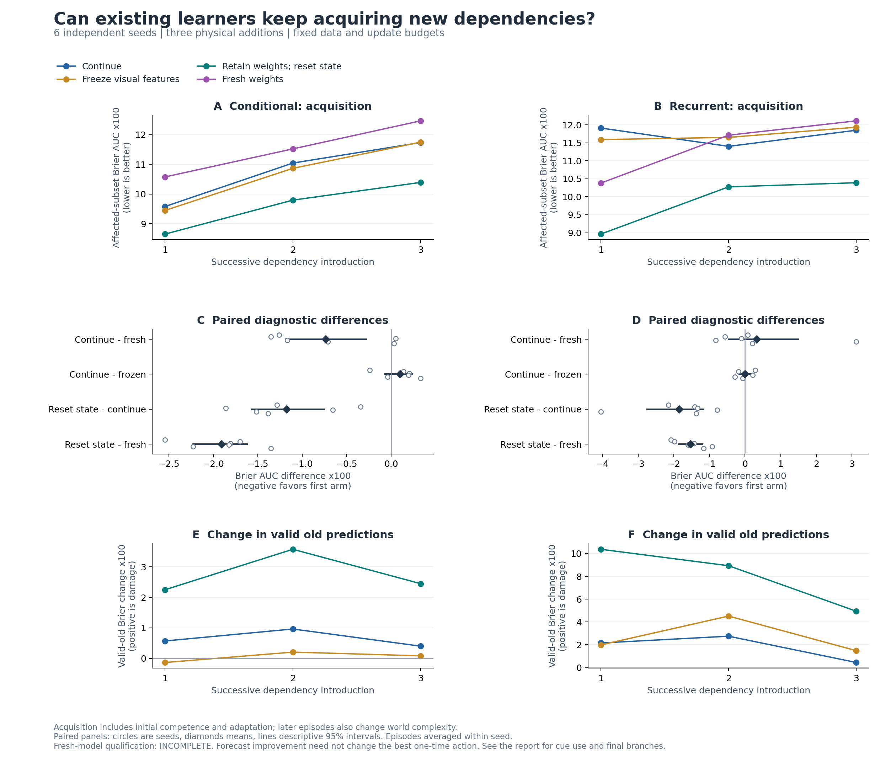

# Continued acquisition: useful weights, costly training history

The diagnostic completed **12 prefix fits and 180 episodes**, covering six new
seeds and two existing architectures. Resetting optimizer and replay state
improved new-dependency prediction in both learners, but increased damage to
still-valid knowledge. Retaining learned weights after that reset outperformed
starting from random weights at the same exposure budget. This points toward
how training history is used as the next question; it does not establish a
solution to continual learning or general exhaustion of learned features.

**Qualification is incomplete.** The fresh conditional model's delay-cue
benefit was .00193868, below the predefined .002 threshold. Every other
qualification group passed, including all recurrent-model groups. The miss is
small but remains a failed check. The complete comparison below is descriptive;
we do not treat the whole three-dependency diagnostic as fully qualified or
adjust its threshold or exposure retrospectively.

[All episode outcomes](acquisition/summary.md) ·
[Machine-readable summary](acquisition/summary.json) ·
[Prospective protocol](../docs/acquisition_diagnostic.md) ·
[Development ledger](acquisition/development_ledger.md) ·
[Checkpoint audit](acquisition/audit.json)

## What was tested

Both learners start from random weights and first learn four original-law
blocks, A,B,A,B. Three pulse-order image signals are present throughout but
initially irrelevant. Successive physical changes make them govern directional
transfer efficiency, arrival delay, and supply timing. The six seeds cover all
six introduction orders once. Earlier additions stay active. This changes
physical dependencies, rather than merely combining previously learned mappings.

At each introduction, clone the same accumulated learner into four arms:
ordinary continuation, frozen visual features, retained weights with fresh
optimizer/replay, and original random weights with fresh optimizer/replay.
Recent history, new records, and update budgets are matched. Only continuation
provides the next starting state. All arms get 2,048 arrivals and 768 updates;
ordinary training receives one performed action's outcomes per record.
Boundary-timed resets and freezes are privileged diagnostic controls.

The primary endpoint is the normalized area under prediction Brier error over
those arrivals, restricted to the newly affected subset. Lower is better.
Independent support probes and query-cue flips assess whether predictions use
the new relationship. Retention probes include both original base modes, with
queries and clean support restricted to relationships whose physics remains
unchanged. This evaluator-selected support is not an ability of the learner.

Before any learner training, the structural audit found that efficiency and
delay could change survival forecasts without changing the optimal one-time
transfer. Prediction error was therefore declared primary before development;
action survival is a separate outcome. Conservation and cue-irrelevance checks
passed; the largest numerical conservation residual was 2.85e-14 or less.

## Qualification, without moving the threshold

Fresh-only development on seeds 211/212 passed at the first declared budget,
2,048 arrivals. The 4,096/8,192 grid entries were not run. The development delay
margin was narrow, as recorded before the fresh comparison.

Qualification requires terminal all-case Brier improvement of at least .02 over
a training-only action/horizon marginal predictor, and affected-subset cue-flip
benefit of at least .002. Both criteria must pass separately for every stage
and every cue type within each architecture. Comparison-cohort cue groups:

| Architecture | New dependency | Marginal improvement | Cue benefit | Pass |
|---|---|---:|---:|---|
| Conditional | Efficiency | .142131 | .006744 | Yes |
| Conditional | Delay | .148585 | .001939 | **No** |
| Conditional | Supply timing | .132966 | .143688 | Yes |
| Recurrent | Efficiency | .143006 | .009043 | Yes |
| Recurrent | Delay | .148535 | .002587 | Yes |
| Recurrent | Supply timing | .133795 | .148896 | Yes |

All stage-group checks passed. Pooling the easier timing cue with delay would
hide the failed conditional check, which is why both groupings were required.
The miss limits attribution of difficulty on delay; it is not evidence that
the general relational-learning hypothesis is false.

## Acquisition and retention tradeoff

All Brier numbers in the following tables are **raw Brier units multiplied by
100**, not percentage-point accuracy gains. Acquisition averages the three
introductions within seed, then the six seeds. Valid-old change is after minus
before; positive values mean deterioration on unchanged relationships.

| Arm | Conditional acquisition | Conditional valid-old change | Recurrent acquisition | Recurrent valid-old change |
|---|---:|---:|---:|---:|
| Continue | 10.785 | +0.645 | 11.723 | +1.784 |
| Freeze visual features | 10.686 | +0.050 | 11.727 | +2.661 |
| Retain weights; reset optimizer/replay | **9.610** | +2.760 | **9.877** | +8.083 |
| Fresh weights | 11.520 | — | 11.402 | — |

Fresh models have no previously learned knowledge to retain, so their change
from random predictions is not a comparable forgetting score. For context,
terminal valid-old error was 8.795 versus 10.911 for conditional continuation
versus state reset, and 17.118 versus 23.416 for their recurrent counterparts.

Paired differences below use 20,000 seed bootstrap resamples; intervals are
descriptive, with only six independent seeds. Negative favors the first arm.
The 180 episodes, actions, and prediction horizons are not independent samples.

| Acquisition difference | Conditional: mean [95% interval] | Recurrent: mean [95% interval] |
|---|---:|---:|
| Continue minus fresh | -0.735 [-1.185, -0.282] | +0.320 [-0.465, +1.492] |
| Continue minus frozen | +0.099 [-0.066, +0.235] | -0.004 [-0.161, +0.156] |
| Reset state minus continue | **-1.174 [-1.570, -0.753]** | **-1.846 [-2.745, -1.166]** |
| Reset state minus fresh | -1.909 [-2.227, -1.622] | -1.526 [-1.853, -1.198] |

State reset improved acquisition in all six seed averages in each architecture.
It also increased valid-old damage in all six: an additional **2.116**
[1.123, 3.225] conditional and **6.298** [4.171, 8.181] recurrent Brier units x100.
Thus a full reset is a useful diagnostic, but has not met our combined goal.
This comparison changes optimizer and replay together and cannot identify which
causes either side of the tradeoff.

Retained weights remain useful after removing carried optimizer/replay state:
that arm beats fresh initialization in every seed average. This does not prove
unchanged intrinsic plasticity, because the AUC includes initial competence and
transfer. It gives no reason to conclude that all previously learned features
must be discarded. Relative late-minus-early acquisition differences were
inconclusive in both architectures; episode order also changes world complexity,
and base mode by order is not a full factorial design. No causal aging or
long-horizon plasticity claim is established here.

## Learning a new cue is distinct from retaining general competence

Freezing features showed no clear aggregate acquisition-AUC disadvantage, but
it reduced terminal use of newly relevant cues. The strongest separation was
supply timing, for which both fresh-model checks passed:

| Supply-timing cue benefit x100 | Continue | Frozen | Reset state | Fresh |
|---|---:|---:|---:|---:|
| Conditional | 6.365 | 0.393 | 14.117 | 14.369 |
| Recurrent | 6.065 | 1.509 | 14.296 | 14.890 |

Cue benefit means error after flipping the query cue minus error with the
correct cue, with physics and support held fixed. The ordinary continuing
models learn useful cue dependence, but much less than after state reset.
The feature-freeze effect varies by dependency: freezing reduced error AUC for
efficiency/delay on average, while continued feature updates improved it for
supply timing. We therefore do not interpret the pooled AUC as proof that
feature adaptation is unnecessary, or cue use alone as proof of better overall
prediction. Neither result selects a general feature-replacement rule.

## Return, obsolete rules, and noise

After the third addition, independent branches restore the exact initial
A-world, reverse the efficiency cue's meaning, or corrupt 20% of reports while
leaving physical laws fixed. Each starts from the same continuing learner and
gets 2,048 further arrivals. Before/after probes supply 32 independent
support records from the branch's feedback distribution without weight updates;
support is corrupted in the noise branch and correct in the others. The before/after model weights differ
because of the intervening training. Brier refers to the changed lossy subset
for revision and all queries for return/noise.

| Architecture | Branch | Brier before → after, x100 | Valid-old change, x100 |
|---|---|---:|---:|
| Conditional | Return | 12.657 → 7.846 | -2.208 |
| Conditional | Revision | 11.518 → 10.563 | +0.196 |
| Conditional | Noise | 12.640 → 11.000 | +0.950 |
| Recurrent | Return | 29.788 → 7.697 | -7.222 |
| Recurrent | Revision | 12.141 → 10.960 | +0.617 |
| Recurrent | Noise | 11.237 → 11.620 | -0.903 |

On return, conditional predictions started substantially closer to the old
world, while both models improved with further training. Return survival in
the fresh-support probe changed from 69.12% to 73.91% conditional and 58.53%
to 73.60% recurrent. This distinguishes retained competence from relearning.

After reversal, mean cue benefit changed from negative to weakly positive:
-.007301 to .002003 conditional and -.004593 to .001353 recurrent, in raw
Brier units. This is evidence of partial revision, not reliable mastery of
the reversed rule. Five of six seeds per architecture improved affected-subset
prediction error. The separate development qualification threshold was not a
predeclared success criterion for these final branches.

Under noisy reports, conditional valid-old error increased in all six seeds;
recurrent changes were mixed. Overall conditional improvement under noise is
strongly influenced by one seed and does not establish noise robustness.
There is no matched final clean-continuation branch, so these observations do
not isolate the causal effect of adding noise versus continuing training.

Documentation correction, recorded during the training-state follow-up:
the original report described all fresh-support probes as correct. The noisy
branch actually used noisy fresh support, as the archived code and records
show. Valid-old retention probes did use correct support. The wording above
is corrected; no outcomes or sealed acquisition artifacts have changed.

## Next bounded experiment

Keep the accepted hypothesis, but make its next test about **using training
history without blocking revision or erasing still-useful relationships**.

1. Qualify delay-cue learning on new development seeds using a prospectively
   declared exposure rule. Preserve this cohort's failed check and complete
   outcomes; do not tune on seeds 7001–7006 or relabel this study as passing.
2. Split the combined state reset into a two-by-two diagnostic: keep/reset
   optimizer crossed with keep/reset replay, holding learned weights, recent
   history, arrivals, and updates fixed. Measure both new-cue learning and
   valid-old damage. This identifies whether optimizer history, replayed
   experience, or their interaction deserves the next intervention.
3. Only then select one bounded update or replay change, with a declared
   acquisition gain and retention limit, and test it on fresh comparison seeds.
   Autonomous detection of when to apply it is a separate requirement.

The immediate priority is this smaller causal question. A new architecture,
critical-period schedule, and claims of broad continual learning remain open.
The joint-persistence objective itself was not compared with other objectives.

## Reproduction and verification

The [reproduction guide](../docs/reproduction.md#continued-acquisition-diagnostic)
contains training, analysis, audit, and plotting commands. CPU training used
four workers with one thread each. Mean training time per acquisition episode
was 7.62 seconds conditional versus 17.05 seconds recurrent for continuation;
freezing features was cheaper. Equal arrivals and updates are not equal compute,
and these concurrent local timings are not hardware benchmark results.

The source/protocol lock was written at 2026-09-27 15:19:59 UTC; all training
finished at 15:31:40 UTC. Scientific source remained unchanged through development
and comparison, with SHA-256
`343d1a5ce63c35a48e0c5e552c9480c863114614aaa08e407ad94eca07ed6c58`.
The full config, runtime, and protocol identities are in the
[lock](acquisition/protocol_lock.json). Earlier conditional and contextual
scientific sources still match their archives.

All 12 prefix checkpoints and 180 starting/final checkpoint pairs passed local
checks of exact forks, regenerated performed-action data, causal replay/history,
and recomputed initial/final predictions. Evaluations left weights, optimizer,
history, and replay randomness unchanged. Intermediate curves are preserved but
not all recomputed from separately retained intermediate weights. This is a
local implementation audit, not an independent replication.

The full CPU suite passed **686 tests, with two Windows platform skips**; lint
passed. The 30-episode engineering smoke and 12-fit development study also
passed their checkpoint audits. Portable outcomes, exact training source,
analysis source, protocol snapshots, figures, and artifact hashes are in
`reports/acquisition/`. Full trusted model checkpoints remain in `runs/`.
