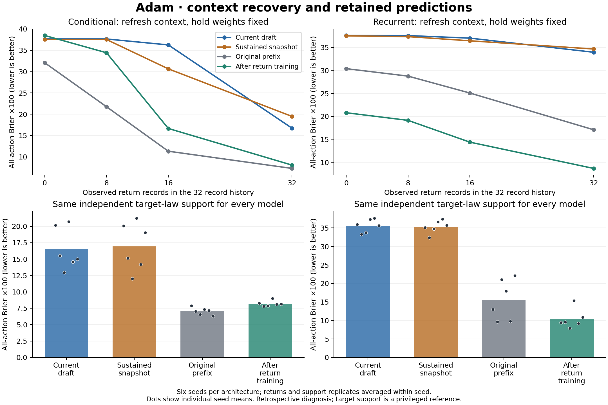
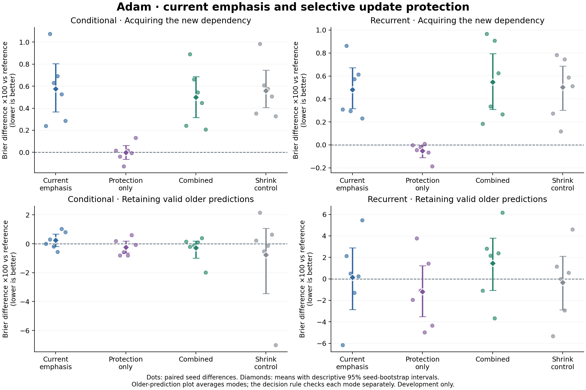

# Adam: context recovery, learning interference and predictive retention

The historical review, matched-return diagnosis and 72-episode selective-update
experiment are complete. The diagnosis finds both a context effect and
deterioration of accessible historical predictions. The attempted remedy,
stronger current-learning emphasis plus projection of conflicting updates,
**fails the fixed development screen in both architectures**. It worsens
acquisition error in every seed and exceeds at least one mean retention limit.
Both architectures pass the fresh-model qualification checks.

The immediate uniform-replay learner remains the reference. Stop expansion of
this fixed combined recipe. The user's proposed marginal predictive-value
criterion remains untested; the next useful step is a small validation of that
score on later observations and returns, before changing memory selection.

The [full research synthesis](../docs/research_synthesis.md) revisits the original
critical-period controllers, local renewal, image transfer, dual pathways,
joint persistence, conditional reuse, training-state resets, replay policies
and evidence-based deployment. The strongest positive thread is learning useful
features and recovering predictions from correctly bound context. Earlier
replay resets and recency-biased buffers accelerated acquisition but cost
retained knowledge; global delay has not solved that tradeoff.

## Matched return diagnosis

The [protocol](../docs/return_context_protocol.md) was specified after the
original pilot results were known and before these additional checkpoint
predictions. This is a retrospective explanatory analysis, with no new
pass/fail threshold. It retains all six seeds, both architectures and all three
returns from the completed evidence study.

For each return, the same 512 query observations and truthful evaluator-only
outcomes are crossed with earlier and later parameter states and several
support histories. The preceding history belongs to the previous law. The
first 8, 16 or 32 actual return observations refresh that history while weights
remain fixed. Independent target-law support supplies a privileged reference.
All return and support averages are formed within seed before uncertainty is
estimated across seeds.

Selected differences are Brier multiplied by 100; lower is better. Intervals
are descriptive 95% paired-seed bootstrap intervals, with 20,000 resamples.

| Matched comparison | Conditional | Recurrent |
|---|---:|---:|
| Actual history minus first 32 return records, current draft | +20.921 [18.598, 23.245] | +3.648 [1.473, 6.066] |
| Current-start minus prefix parameters, fresh target support | +9.461 [7.525, 11.471] | +20.033 [15.684, 24.252] |
| Current-start minus prior-return parameters, fresh target support | +6.233 [4.996, 7.392] | +25.232 [23.769, 26.529] |
| Return-end minus return-start parameters, fresh target support | -8.294 [-10.331, -6.283] | -25.228 [-26.842, -23.611] |

The prior-return comparison pairs returns two and three only. Current parameters
are worse than both named historical references in every seed. End-of-return
training recovers much of the deficit. These are effects of particular
parameter states under fixed support, not a causal age-response curve or proof
that particular neurons erased a concept.

The deployed sustained snapshot has no consistent advantage over the draft
on the matched independent-support panel: +0.448 conditional and -0.276
recurrent, with both intervals crossing zero. Its gap also changes with which
support sample is used. The exact context/parameter decomposition is retained
in the [complete diagnostic tables](return_context_v2/summary.md); it must not
be interpreted as a causal decomposition of the entire online return penalty.
The snapshot's acceptance history and its age are not independently manipulated.

The hidden transition is not announced by the current image distribution.
Immediate errors before new feedback therefore include an information limit.
Correct target-law supports and future end-of-return parameters are diagnostic
interventions, not free information supplied to an ordinary learner. The
conditional best-single-head reference additionally uses query outcomes and
is explicitly nondeployable. A mixture can outperform every single head.

The original deployment study's failed prospective screen remains unchanged.
Historical checkpoints can help a base-law return without learning the newer
dependencies; simply retrieving an old checkpoint is not a general learning
solution.

## Prediction as a retention signal

The user's new suggestion is developed in
[predictive retention](../docs/predictive_retention.md). Reliable predictions
and useful memories are different measurements. A proposed local usefulness
score is the future loss increase caused by a specified matched ablation:

    value(component) = mean future loss without it - mean future loss with it.

Predictions must be made before observing those future labels. Removing a
replay entry does not remove its influence already learned into weights, so
the intervention and comparison need a precise definition. Short matched
training forks are one possible, costly estimator. Redundancy, rare events,
corrupted feedback and obsolete knowledge can distort simpler proxies.

The completed development experiment uses sampled replay interference as a bounded
proxy for threatened historical prediction. It does not yet estimate this
future marginal-value score or learn which experiences intrinsically matter.

## Selective-update development experiment

The [selective-update protocol](../docs/selective_updates_protocol.md) combines
the full uniform historical reservoir with current-loss emphasis and a
projection that removes the component of an actual Adam displacement that
would increase sampled replay BCE to first order. A two-by-two comparison
isolates emphasis and projection; a fifth control matches the local projected
step norm by shrinking its own update without redirecting it. All arms perform
the same additional experimental gradient and diagnostic work.

Six fresh seeds, both architectures and 12 shared prefixes lead to 72 local
first-introduction episodes, including fresh-model qualification. The sole
primary candidate is the .75-current-weight projected rule. Per-architecture
continuation requires useful acquisition improvement, seed consistency,
per-mode retention and survival guardrails, and fresh qualification. Attribution
to direction rather than update magnitude has a separate stricter comparison.

The intervention has close prior art in
[A-GEM](https://arxiv.org/abs/1812.00420). The current adaptation acts on Adam's
actual displacement and leaves its mixed-loss moments intact. Its constraint
is local and first order; it does not guarantee finite-step replay improvement,
validity of remembered reports, or preserved physical knowledge. This is a
controlled development question, not a novelty claim.

The cohort completed all 12 shared prefixes and 72 episodes without training
interruption. Source, configuration, runtime, protocol and analysis were locked
before scientific fitting at 2026-09-27 23:05:43 UTC. All outcomes below include
all six seeds; the full [tables and seed records](selective_updates/development/summary.md)
retain every arm and cue group.

Combined minus reference, Brier multiplied by 100; lower is better. Survival
uses percentage points. Intervals are descriptive paired-seed bootstrap
intervals, not formal superiority or noninferiority tests.

| Outcome | Conditional | Recurrent |
|---|---:|---:|
| New-dependency acquisition AUC | +0.499 [0.315, 0.687] | +0.547 [0.310, 0.795] |
| Seeds with improved acquisition | 0 of 6 | 0 of 6 |
| Valid-old error, mode 0 | -1.237 [-3.384, 0.196] | +1.810 [-3.028, 6.729] |
| Valid-old error, mode 1 | +0.679 [-0.028, 1.492] | +1.106 [-0.446, 3.035] |
| Survival AUC | -0.509 [-0.852, -0.235] | -0.291 [-0.545, -0.044] |
| Fresh learnability checks | Pass | Pass |
| Combined continuation / protection attribution | Fail / Fail | Fail / Fail |

The required acquisition gain was at least 0.200 in these scaled units, with
improvement in at least five seeds. Instead every seed worsened. Allowed
retention cost was at most +0.500 in each old mode: conditional mode 1 and both
recurrent modes exceed it. Conditional mode-averaged retention improves by
0.279, but this average hides its failed mode-1 guardrail. Survival decreases
in both models but stays within the allowed one-point cost. The broad retention
intervals emphasize uncertainty; they do not convert failed mean-based
allocation criteria into passes.

## What the controls tell us

The .75 current weight alone increases acquisition error by +0.575 conditional
and +0.480 recurrent, again in every seed. More emphasis on current examples
therefore did not accelerate learning in this test. This does not contradict
the earlier recent-memory result: changing loss weights while retaining a
uniform reservoir is a different intervention from changing its contents and
sampling distribution.

Protection alone at the original .50 weight changes acquisition by -0.002
[-0.063, 0.062] conditional and -0.052 [-0.110, -0.008] recurrent. These small
effects do not meet the primary recipe's required gain magnitude. Its mean
retention changes are -0.244 and -1.194, with both intervals crossing zero.
It remains a secondary development observation, not a replacement winner.

Adding protection to current emphasis slightly helps conditional acquisition
(-0.076) and mean retention (-0.516). It does not establish a directional
protection advantage: combined has worse mean retention than the shrink-only
control (+0.494), with a wide interval [-1.089, 2.525]. In recurrence, combined
retention is worse than current emphasis alone (+1.310) and shrinkage (+1.784
[0.555, 2.997]). Both architectures fail the separately specified attribution
screen. The shrink control matches its own local projected step norm, not a
different arm's entire evolving trajectory.

These results reject the tested combination under this budget. They do not
show that every interference-control method fails, that prediction-based
retention cannot work, or that general continual learning is impossible. This
study tests one first introduction; it supplies no evidence for long-term
compounding, successful revisions or greater physical planning horizons.

## Mechanism and resource checks

The combined rule projects 26.11% of updates in the conditional model and
24.20% in recurrence. The mean retained displacement-norm ratios across all
updates are 0.99930 and 0.99951; the correction magnitudes average 1.42% and
1.14% of the proposed step norm. All five trained arms have identical replay
draws and mean sampled age. The geometry operates as specified, but a local
constraint on reported replay BCE is not a guarantee about finite-step loss
or clean environmental predictions.

The final update of each packet has an actual replay BCE increase in 18.10%
and 15.23% of packet checks respectively. These are measurements on the last
update, not all updates or specifically projected updates; the bounded logs
do not record their joint classification. They must not be described as a
projection-failure rate. Mean measured replay loss changes are negative in
both models despite the overall acquisition and retention failures.

Each episode has 256 packets, 3,072 ordinary optimizer steps, 6,144 training
forwards, 3,072 extra replay-gradient calculations and 256 diagnostic forwards.
All arms perform this extra experimental work. An ordinary deployed baseline
does not need the discarded projection and diagnostic work, so matched measured
times do not demonstrate a free protection mechanism. Mean training times for
combined/reference are 35.30/34.76 seconds conditional and 70.06/71.04 seconds
recurrent; these exclude evaluation and other experiment overhead.

The models have 57,852 and 57,831 parameters. Each retains 16 replay packets,
with peak replay storage 790,656 bytes and recent-history storage 24,704 bytes.
The conservative explicit parameter/gradient buffer estimates are about
4.40 MB each; these are not measured peak RAM and exclude graph and allocator
workspace. [Complete resource rows](selective_updates/development/summary.json)
preserve exact work counts, memory estimates and diagnostic aggregates.

## Decision and next question

Do not expand or retune the failed .75-plus-projection recipe on these seeds.
The strongest immediate next question is whether a predictive-value estimate
actually forecasts later usefulness. Keep uniform memory unchanged, compare
bounded matched rehearsal forks with a declared replacement, score them on
future observations, and validate the resulting ranking on a separate later
window. Compare against uniform choice and original prequential packet error.
Include delayed returns so that near-term relevance is not mistaken for
long-term importance. The [predictive-retention note](../docs/predictive_retention.md)
specifies this proposed diagnostic and its controls; it has not been run or
locked as a new experiment.

There is a useful algebraic caution: with one common replacement predictor,
ranking rehearsal gains on the same window is equivalent to ranking those
shadow predictors' accuracy. Those two rankings cannot be independent controls.
Similarly, multiplying a single hard replay-gradient constraint by a positive
importance scalar leaves the projection unchanged. A useful importance signal
must change a meaningful operation, such as rehearsal selection, rather than
just attach a new name to the same calculation.

## Selective-update verification

The 94 learner, runner, analysis and checkpoint-audit tests passed before the
scientific cohort. The later portable verifier adds 11 passing tests. All
new code passes Ruff. The full development audit verifies all 12 prefix,
72 starting and 72 final checkpoints: exact forks, optimizer state, causal
replay/history, input streams, budgets, and initial/final predictions. All
246 stable training files pass integrity checks. The engineering smoke cohort
also completes and passes its audit; it does not supply scientific evidence.

The [engineering ledger](adam_revision/engineering_ledger.json) records failed
preflight and test attempts as well as their corrections. The
[portable archive](selective_updates/README.md) preserves complete records,
prospective source/analysis snapshots, figures and a separate verifier that
recomputes primary contrasts, intervals, qualification and decision criteria
without importing the analysis code. These checks verify recorded evidence;
they are not independent scientific replication or retraining of every update.

The [portable verification](adam_revision/portable_archive_verification.json)
passes all 40 sealed artifacts, 84 episode metric rows and 60 critical paired
contrasts across smoke and development. Its initial invocation correctly
rejected a bytecode cache generated by the verification harness after sealing;
removing that cache and disabling bytecode generation preserved the original
seal and passed. Both [verification attempts](adam_revision/portable_verification_attempts.json)
are recorded separately from the already sealed engineering snapshot.

## Diagnostic provenance

The first lock and interrupted attempt are preserved in
[return_context](return_context/failed_attempt.json). Exact probability-range
validation rejected a float32 mixture excursion. The documented amendment
permits bounded rounding without clipping or changing scores. The rerun found
five affected rows and a largest excursion of exactly one float32 epsilon:
[numerical validation](adam_revision/numerical_validation.json).

The completed [corrected analysis lock](return_context_v2/analysis_lock.json)
predates its 1,428 evaluations over 36 return states. It covers 30 code/protocol
files and verifies 137 input files, including 84 checkpoint files. Evaluation
preserved model parameters, gradients, mode flags, optimizer, causal memory,
RNG and history. No training updates occurred. All 25 diagnostic tests and
Ruff passed. All 338 earlier research artifacts and the old scientific source
passed [the before check](adam_revision/preservation_before.json) and
[the after check](adam_revision/preservation_after.json). Both diagnostic locks,
all 39 earlier analysis files, and all 292 stable smoke/development training
files also remained unchanged through the audits.
