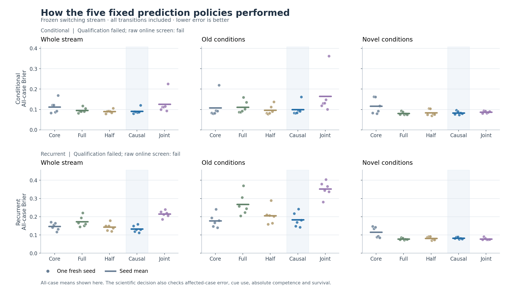
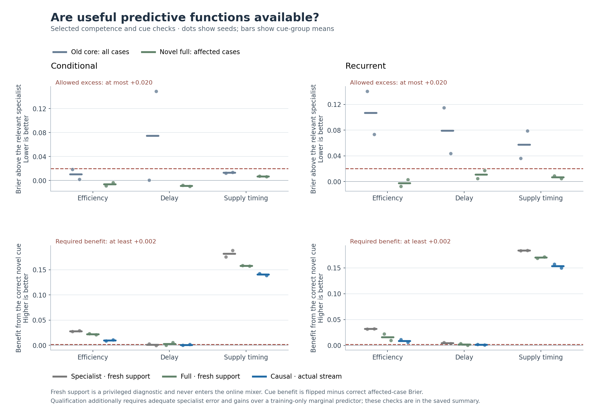

# Causal access helps some predictions, but the tested recipe does not qualify

Completed 2026-09-28. **Both architectures are ineligible, and both also fail
the raw online screen. Stop the frozen-core/additive-residual branch under this
recipe.** The recurrent model provides a useful narrower observation: past
performed-action feedback improves access beyond a fixed mixture. It does not
repair the available functions sufficiently to meet the combined requirements.

This is the outcome of the [pre-score protocol](../docs/causal_access_protocol.md),
not a revised interpretation of the earlier failed architecture study. All
criteria were locked before fitting. The independent [numerical report](causal_access/development/summary.md)
and [per-seed JSON](causal_access/development/summary.json) include every gate,
qualification failure and comparison, including unfavorable results.

## What was tested

Two architectures, six fresh seeds each (17001--17006), learned from random
initialization. Each job fitted a shared core, then matched joint and separate
learning arms, plus independent old-law and novel-law specialists. Separate
froze its core during residual learning. There were 120 fit phases, 466,944
training arrivals and 175,104 optimizer updates. The main run completed in
734.32 seconds after its lock using six single-thread CPU workers.

After fitting, every predictor, optimizer, gradient and replay state stayed
fixed. A 16,384-arrival stream per job alternated old and novel environments
16 times, old first. All 196,608 cohort arrivals count, including every switch
and recognition delay. The five policies were always core, always full,
fixed half, the causal mixer, and the matched joint learner.

The mixer combined core/full probabilities using only the last 32 performed
terminal-outcome likelihood differences, recorded from their original forecasts.
Its first weight was .5; no environmental identifier, boundary reset or current
packet's outcomes entered that packet's predictions. All policies received
identical random performed actions and causal feedback. Greedy survival is an
evaluator's counterfactual score, not an action policy that changed future data.

## Prediction performance across the complete stream

Brier is mean squared probability error; lower is better. Values below are
equally weighted seed means. Each seed includes all actions and horizons.

| Architecture | Always core | Always full | Fixed half | Causal mixer | Joint |
|---|---:|---:|---:|---:|---:|
| Conditional | .112355 | .095855 | .090506 | .091293 | .126299 |
| Recurrent | .146413 | .172644 | .143409 | .132948 | .214994 |

| Architecture | Causal minus comparator | Mean difference [descriptive 95% interval] | Lower error seeds |
|---|---|---:|---:|
| Conditional | Always full | -.004563 [-.017461, +.006419] | 5/6 |
| Conditional | Fixed half | +.000787 [-.004118, +.006833] | 3/6 |
| Conditional | Joint | -.035006 [-.064518, -.016131] | 6/6 |
| Recurrent | Always full | -.039696 [-.054156, -.025737] | 6/6 |
| Recurrent | Fixed half | -.010461 [-.015978, -.004963] | 5/6 |
| Recurrent | Joint | -.082046 [-.093568, -.073611] | 6/6 |

The recurrent whole-stream error reduction versus full is about 23%. Its
comparison with fixed half passes the predeclared adaptive-access attribution
requirement. Conditional improves versus full but does not establish value
from feedback beyond constant averaging. Fixed half is a control here; it
does not become a newly promoted alternative after seeing the results.

The largest recurrent benefit occurs under old conditions: causal minus full
error is -.084218. Those conditions also expose the weak frozen models:
old-stream error is .183444 for causal, .177787 for core, .267662 for full and
.352016 for joint. Improvement against these controls should not be mistaken
for sufficient absolute competence.

## Why neither qualifies

Qualification used separate held-out cases and two fresh target-law supports.
These supports diagnose available competence; they are privileged probes,
not online evidence of immediate recognition. The old core could be at most
.02 worse than a single-law specialist, overall and within each cue family.

| Architecture | Old core error | Old specialist error | Excess | Allowed excess |
|---|---:|---:|---:|---:|
| Conditional | .101191 | .068660 | +.032531 | +.020000 |
| Recurrent | .152426 | .071223 | +.081204 | +.020000 |

Conditional's old-core failure is concentrated in the arrival-delay group,
particularly seed 17006; the other five individual old-core excesses are within
.02. Its novel specialist also misses the delay cue-benefit requirement:
.001385 versus the required .002. Recurrent's old core exceeds the tolerance
in every cue group and every seed. Its full novel predictor narrowly misses
delay cue qualification (.001940 versus .002). All specialist all-case error
ceilings and marginal-improvement requirements pass. All full-novel affected
error comparisons against specialists pass. The failures concern specific
available functions and cue use, not universal inability to predict the task.

The actual online guards fail separately:

- Conditional fails the fixed-half improvement and consistency requirements.
  Its novel arrival-delay cue benefit is .000948, below .002.
- Recurrent increases novel affected-case error by .005512 versus full
  [+.004186, +.006841], exceeding the allowed .005; all six seeds worsen.
  Its arrival-delay cue benefit is .001379, below .002.
- Conditional's novel affected error increase is .002581, within tolerance.
  Both architectures pass all four mean survival tolerances. Recurrent's novel
  survival cost versus joint is .009867, just within the permitted .01, but
  all six seeds worsen and the descriptive interval for the signed difference
  is [-.018311, -.004354]. This is not evidence of statistical noninferiority.

Always-full online delay cue benefits are also below .002 (.001439 conditional,
.001650 recurrent), so the mixer is not the sole source of weak cue use.

Supply-timing cue use is substantial in this fresh cohort, unlike the weak
conditional timing use in the previous cohort. Delay is the current weak family.
Do not generalize either cohort's difficult cue into an architectural impossibility,
exclude it, or reinterpret the six independent seeds as hundreds of replications.

## What good-enough retention means here

The user's concern is appropriate as a design question: the objective is useful
behavior over changing conditions. Preservation of every parameter or past
response is not itself the objective. This study already allows imperfect
performance: .02 component excess error, specified .005 online error costs
and a one-percentage-point survival loss. It still requires an overall gain,
competent components and meaningful use of newly learned dependencies.

These failures are therefore not rejections for any nonzero forgetting.
The recurrent old-core competence gap is substantially larger than the allowed
loss, and conditional adaptive selection lacks the required fixed-half gain.
The close recurrent novel error and survival margins deserve their numerical
context, without relaxing the rules after seeing them.

This study does not compare perfect parameter protection against partial
protection during ongoing learning. Nor does it test consolidation, pruning,
capacity renewal, noisy feedback, longer physical planning, compounding
representation acquisition or recursive self-improvement. Its predictors are
fixed during the recurring stream. The useful observation is conditional
predictive access under this finite schedule.

## Decision and next direction

Shelve this exact frozen-core/additive-residual recipe. Do not run another
window, temperature, width, replay-dose or cue-exclusion sweep to rescue it.
Retain the narrower recurrent result as motivation for separating competence
from access in future designs, with the same fixed-mixture control.

If the broader project continues, the next design should first demonstrate
reliable acquisition and reusable old-condition competence with a backbone
that remains able to learn. Then compare graded protection or consolidation
against ordinary joint learning with replay, under a fixed total resource
budget and repeated new dependencies. That would test useful retention over
time directly. This is a proposed change of direction, not a new experiment
run in this study or an established solution.

## Verification and limitations

- 71 targeted tests and eight independent scorer synthetic checks passed;
  scoped Ruff checks passed. The corrected engineering smoke passed full
  reconstruction, checkpoint checks and completed-run resumption.
- The independent NumPy scorer verified every saved array, reconstructed all
  6,144 causal packet weights and mixtures, and recalculated all qualification,
  Brier, survival, cue and fixed-gate results. Source/configuration/protocol and
  decision-bearing analysis were locked before main fitting.
- A separate [checkpoint audit](causal_access_checks/development_checkpoint_audit.json)
  restored 48 checkpoints including gradients; reproduced the first and last
  packet of every block (384 packets) and all 48 qualification replicates;
  checked 2,592 saved native forecast arrays exactly; and verified complete
  learner/RNG invariance, physical data, preceding supports and work counters.
  That count includes unchanged old-condition probe aliases. Training was not
  rerun, and interior stream forecasts were not reconstructed from checkpoints.
- Six seeds per architecture are the independent units; cue checks have only
  two seeds each. Bootstrap intervals use 20,000 paired resamples with seed 17291
  and are descriptive. The practical mean guards do not prove equivalence.
- Shared component forwards are recorded for each learner. Each job executed
  774 component calls for separate and 774 for joint, plus 2 old-reference and 4
  novel-reference calls. The four separate-derived policies share forecasts;
  this study makes no deployment-FLOP efficiency claim.
- The original smoke's count-dtype validation failure is preserved and documented
  in the [engineering record](causal_access_checks/engineering.md). It was fixed
  before main fitting without changing scores, models, budgets or thresholds.
- A second read-only analysis independently recomputed 816 raw metrics and all
  24 specialist training marginals; agreement was within 1.12e-16.

The new older-file preservation inventory has two digest discrepancies among
3,314 protected files. Both current files match their earlier archived hashes
and original phase records; no old file was restored or rewritten. The initial
inventory and failed comparison are retained, with the discrepancy documented
in the [preservation review](causal_access_checks/preservation_review.md).
This inventory issue does not involve the new study's locked sources or data.

The [archive guide](causal_access/README.md) links raw data, plots and reports;
the [independent interpretation](causal_access_checks/outcome_review.md) records
the outcome review. Earlier scientific decisions remain unchanged.
