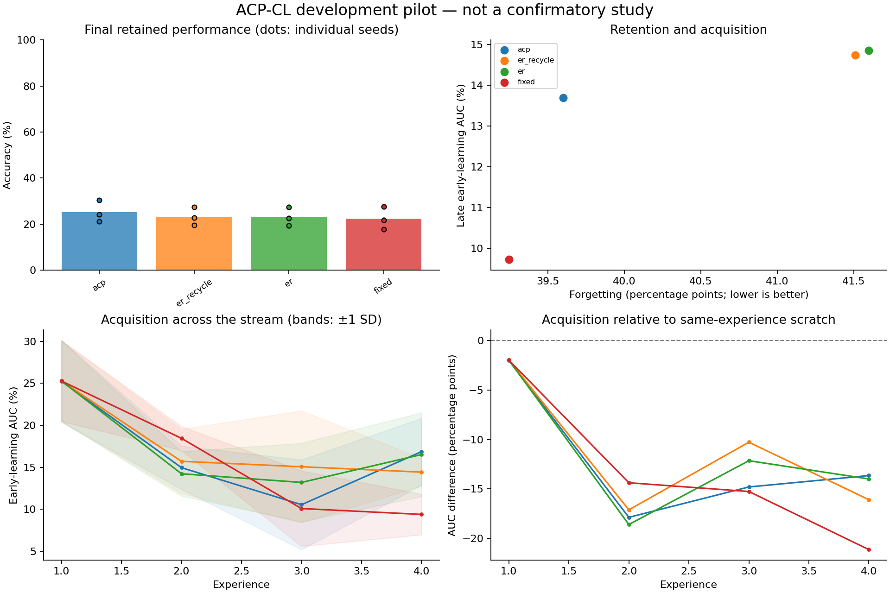

# Exploratory experiment results

Evaluation split: **validation**. Values below are percentages or percentage points.
These runs test implementation and generate hypotheses; they are not confirmatory evidence.

| Method | Seeds | Final accuracy | Forgetting | Late early AUC | Scratch-adjusted AUC | Seconds/run |
|---|---:|---:|---:|---:|---:|---:|
| acp | 3 | 25.20 | 39.60 | 13.70 | -14.22 | 9.3 |
| er_recycle | 3 | 23.17 | 41.51 | 14.74 | -13.18 | 9.2 |
| er | 3 | 23.10 | 41.60 | 14.85 | -13.07 | 8.7 |
| fixed | 3 | 22.27 | 39.24 | 9.73 | -18.19 | 9.4 |

Paired ACP differences (95% unadjusted percentile bootstrap intervals; small-seed intervals are unstable):

| Comparator | Endpoint | Pairs | Difference [95% CI], pp |
|---|---|---:|---:|
| acp - er_recycle | final_accuracy | 3 | +2.03 [+1.50, +3.00] |
| acp - er_recycle | forgetting | 3 | -1.91 [-3.47, +0.00] |
| acp - er_recycle | late_early_auc | 3 | -1.04 [-3.42, +2.02] |
| acp - er_recycle | late_plasticity_gap | 3 | -1.04 [-3.42, +2.02] |
| acp - er | final_accuracy | 3 | +2.10 [+1.60, +2.90] |
| acp - er | forgetting | 3 | -2.00 [-3.47, -0.27] |
| acp - er | late_early_auc | 3 | -1.15 [-4.65, +1.13] |
| acp - er | late_plasticity_gap | 3 | -1.15 [-4.65, +1.13] |
| acp - fixed | final_accuracy | 3 | +2.93 [+2.50, +3.50] |
| acp - fixed | forgetting | 3 | +0.36 [-0.53, +1.87] |
| acp - fixed | late_early_auc | 3 | +3.97 [+2.04, +7.57] |
| acp - fixed | late_plasticity_gap | 3 | +3.97 [+2.04, +7.57] |

Lower forgetting is better; higher accuracy and acquisition AUC are better.
Scratch-adjusted AUC subtracts a fresh model's AUC on the identical experience; it is a diagnostic, not pure transfer.
Timing includes evaluation, diagnostics, and checkpoint writes. It is not a matched-compute comparison.
The recycling and DER++ comparators are explicitly documented implementation variants.

