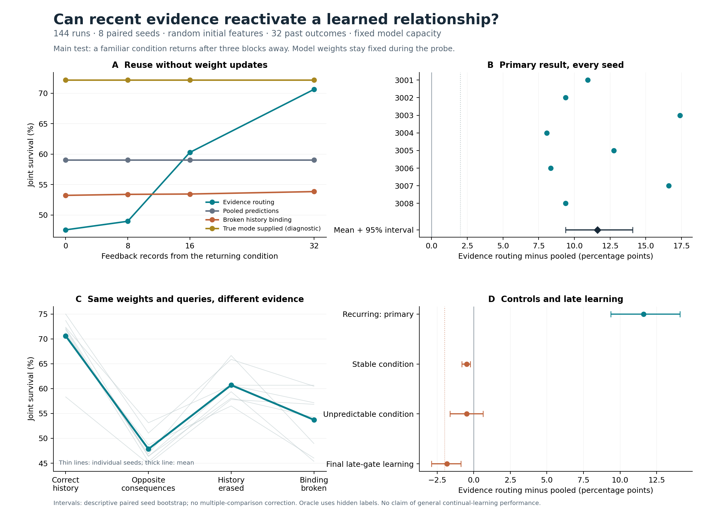

# Conditional reuse works in this pilot; learning new structure remains weaker

The follow-up experiment is complete: **144 runs, eight paired seeds, six
methods, and three schedules**. A small bank of learned consequence predictors
could use recent action/outcome evidence to recover a familiar relationship
without changing its weights. This supports the narrower contextual-reuse
hypothesis. It does not establish a general continual-learning algorithm.

The predeclared primary difference was **+11.60 percentage points** over pooled
predictions, positive in all eight seeds. The practical continuation screen
passed. There is a material cost: acquisition of a later new dependency was
slower, and its final performance was **1.83 points below pooling**. Both findings
belong in the interpretation.

## What changed

The [previous experiment](persistence_results.md) tested which raw experiences
to retain. Its frequency/sensitivity priority rule failed. This experiment
uses uniform replay and instead changes how the learner decides which learned
consequence mapping currently applies.

Every arrival batch includes the full eight-cell grid of visual motion, loss,
and delay conditions, removing the earlier static-glyph shortcut. A hidden
environmental mode can reverse the consequences of otherwise identical images
and actions. The raw visual information alone therefore cannot identify the
current mode. Recent actual-action feedback provides evidence about it.

A shared image encoder and within-trial GRU feed four independently initialized
prediction heads. All features and heads learn from scratch. The likelihood of
the previous 32 observed outcomes under each head determines its weight in the
next prediction. There are no supplied mode labels or announced changes for
ordinary learners. Uniform replay preserves each query batch together with
the support records that actually preceded it.

The objective remains the probability that both participants survive a finite
12-step resource-transfer trial. The conserving physical world is unchanged.
The new data distribution includes conflicting hidden mappings, so its absolute
scores should not be compared directly with the earlier pilot's scores.

## Main result: recovering an old mapping

After a familiar mode had been absent for three blocks, each saved model was
given 32 fresh randomized-action outcomes. Those records preceded a separate
384-trial query set. Four independent support sets were averaged within each
seed. **No optimizer steps or model-weight changes occurred in this probe.**

| Method | Joint survival after 32 feedback records |
|---|---:|
| Pooled predictions, uniform replay | 59.02% |
| **Evidence routing, uniform replay** | **70.62%** |
| Evidence routing with broken history binding | 53.84% |
| Evidence routing without old replay | 52.38% |
| Evidence routing, features frozen after four blocks | 71.22% |
| True mode supplied, privileged diagnostic | 72.17% |

The paired evidence-routing minus pooled difference was **+11.60 points**,
with a descriptive 95% paired bootstrap interval of **+9.38 to +14.09**.
Every seed was positive. The mode-aware diagnostic exceeded no transfer by
12.79 points and pooling by 13.15, passing the predeclared adequacy check.
No transfer scored 59.38%; the realized-action clairvoyant upper bound was
77.80%. That upper bound knows realized future outcomes and is not an attainable
online policy.

Recognition required feedback. With stale history and no new evidence, the
conditional model scored **47.56%**. Its score rose as the new evidence replaced
the old window. This demonstrates reactivation after observing consequences,
not instantaneous recognition of an unannounced, visually invisible change.



## Evidence for the mechanism

With the **same learned weights and query trials**, replacing correct support
with opposite-mode support reduced survival from **70.62% to 47.84%**. The
support images and performed actions were identical; their consequences
differed. The paired drop was **22.79 points**, interval **19.60 to 25.41**,
positive in all eight seeds. Erasing history yielded 60.71%, and breaking its
image/action-outcome binding yielded 53.72%. These interventions show that
the meaning of recent feedback materially affects the learned policy.

Replay also mattered. Keeping old causal packets improved return survival by
**18.24 points** over the same conditional architecture trained on current
packets only, interval **14.44 to 21.50**. The current-only control duplicated
current data to preserve optimizer steps and query-batch size. This supports
retaining the mappings needed for later inference under this training recipe.

The separate model trained with broken history binding scored 53.84%, versus
70.62% for correctly bound evidence, a **16.78-point** difference. This is distinct
from corrupting history only at evaluation in an already trained conditional
model; both comparisons are retained.

The benefit was specific to the recurring-condition test. In the stable stream,
conditional routing scored 73.63% versus pooling's 74.12%. In the unpredictable
stream, where every trial's mode was independent, it scored 65.43% versus
65.92%: a **-0.49-point** difference, interval **-1.62 to +0.63**. No useful
advantage was demonstrated when recent outcomes could not predict the next mode.

## The remaining weakness: new dependencies

The final three blocks introduced a visible gate whose meaning had to be
learned. In the recurring stream:

| Outcome | Evidence routing | Pooling | Difference |
|---|---:|---:|---:|
| First new-gate block, learning AUC | 61.23% | 64.56% | -3.34 pp |
| First new-gate block, endpoint | 61.91% | 65.76% | -3.84 pp |
| Final gate performance across both modes | 63.40% | 65.23% | -1.83 pp |
| Final original mappings, with correct support | 69.97% | 65.56% | +4.41 pp |

The final gate loss met the predeclared mean-loss tolerance of 2 points, but
only narrowly. Its interval was **-2.88 to -0.88**; passing that practical
threshold is not a statistical demonstration of noninferiority. Early gate
learning was worse in all eight seeds. The model favors reuse in this test
while handling newly introduced structure less well.

Freezing early features preserved old-rule reuse: that control reached 71.22%
on the primary probe. Keeping features adaptable improved its final gate score
by only 0.79 points in the recurring stream, interval -0.40 to +2.08. In the
stable stream, however, the same feature-plasticity comparison favored continued
learning by 9.29 points, interval 6.88 to 11.43. Feature adaptation helps in some
conditions, but these data do not establish a universal critical-period schedule.

## What this supports, and what comes next

We now have a working example of learning visual predictors from scratch,
preserving earlier consequence mappings, and using recent evidence to select
among them. This supports **conditional reuse as a component** of the broader
idea. The previous failed retention rule remains failed.

Keep this implementation as a reference prototype. The next question should
be whether it can acquire a new relationship while retaining this reuse benefit.
That comparison should include a strong history-conditioned recurrent baseline,
use independently varied environments, and retain the current checkpoints as
fixed references. A change that only improves the already successful return
probe would not address the observed acquisition deficit.

There are important limits. Four prediction heads, a 32-record window, and the
world's small set of persistent modes are engineering choices. This study does
not discover symbolic relations or an unbounded number of contexts. All eight
visual-factor combinations were trained; there is no withheld-composition
generalization claim. There is one action per independent trial, fixed randomized
training actions, and no evolutionary population, reproduction, inheritance,
or independently motivated cooperating agents. The objective is specified by
the experimenter.

The comparisons isolate useful history and replay; they do not establish
superiority over strong contextual-inference algorithms. Related research already
studies [recurrent replay for task-agnostic continual learning](https://proceedings.mlr.press/v232/caccia23a.html).
This implementation is not a reproduction of that work and carries no novelty
claim. Seed intervals describe this one constructed world and training recipe.

## Budgets, verification, and reproduction

Each model has **57,852 parameters**. Every run receives 12,288 arrivals,
1,152 optimizer steps, 73,728 query presentations and 73,728 support-encoder
presentations. Methods share initial weights, randomized-action data, and,
where replay is enabled, reservoir membership. Ordinary replay stores at most
1,024 raw record copies in 16 packets, counting duplicated support records.

Measured tensor payload is 231,408 bytes for model parameters, 462,904 for
optimizer state, up to 790,656 for replay plus IDs, and 24,704 for live history.
The oracle adds up to 512 bytes of privileged labels. These totals exclude
Python objects, allocator overhead, gradients, activations, temporary packets,
and evaluator caches. Initial encoder snapshots are diagnostics unavailable
to learning. Useful capacity and backward work differ among ablations;
allocated capacity and forward shapes are not exact FLOP matching. Concurrent
local timings are not isolated efficiency benchmarks.

The [prospective protocol](conditional/protocol_at_lock.md),
[source/configuration lock](conditional/protocol_lock.json), and
[development ledger](conditional/development_ledger.md) preserve the decision
rules and provenance. The lock preceded training at 03:05:58 UTC on 2026-09-27;
all 144 runs completed at 03:14:25 UTC. No comparative training settings changed,
no seeds were excluded, and no scientific run was repeated to improve a score.

**642 tests passed**, with two existing Windows symlink skips. Ruff and the
new CPU/CUDA smoke runs passed. The [checkpoint audit](conditional/audit.json)
reloaded **144 pre-return and 144 final checkpoints**, regenerated the data,
verified every retained query/support packet against its actual arrival, and
recomputed all primary and final-panel probes. The largest resource-accounting
residual was 2.84e-14 units. This is local recomputation, not independent
replication. [Engineering record](conditional/engineering_verification.json).

Training source SHA-256:
`7e152cf8e1589cb2629652327d8a4821b9a37048560e628fd160b48f3392322c`.

The [full tables and every primary seed difference](conditional/summary.md),
[machine-readable contrasts](conditional/summary.json),
[portable raw-results archive](conditional/archive.json.gz),
[training source](conditional/training_source.zip),
[analysis source](conditional/analysis_source.zip), and
[figure PDF](conditional/overview.pdf) are included. Raw checkpoints remain in
the Git-ignored `runs/conditional_pilot` directory. All secondary intervals
are descriptive and unadjusted for multiple comparisons.

```powershell
.venv/Scripts/python.exe -m acp_cl.conditional.study --config configs/conditional_pilot.json --output runs/conditional_reproduction --device cpu --protocol docs/conditional_relationships.md
.venv/Scripts/python.exe scripts/summarize_conditional.py --input runs/conditional_pilot --output reports/conditional
.venv/Scripts/python.exe scripts/plot_conditional.py --archive reports/conditional/archive.json.gz --output reports/conditional/overview
.venv/Scripts/python.exe scripts/audit_conditional.py --input runs/conditional_pilot --output reports/conditional/audit.json
```

Use a new output directory for changed source/configurations. Add `--resume`
only for an unchanged interrupted run. Only load trusted local checkpoints.
