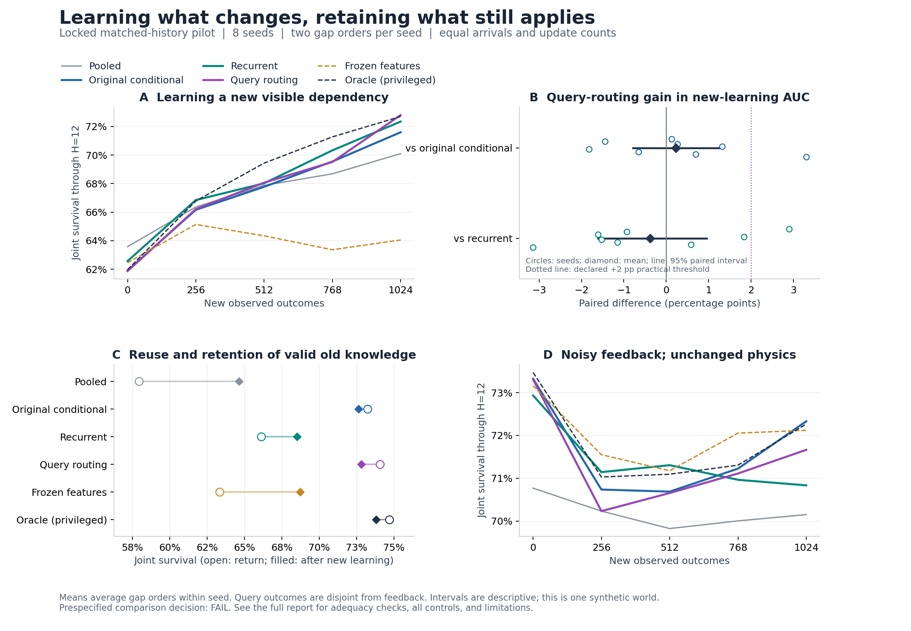

# Matched history, continued feature learning, and query-dependent routing

**The new routing correction failed the predefined continuation screen.** Its
new-dependency learning AUC was 67.78%, versus 68.16% for a qualified recurrent
comparator: -0.38 percentage points, with a descriptive 95% paired bootstrap
interval of [-1.61, +0.95], positive in three of eight seeds. Its improvement
over the original conditional model was only +0.22 points, interval
[-0.78, +1.33], positive in five of eight seeds. Both required at least +2
points and six positive seeds. Keep the original conditional router as the
working reference; do not adopt the correction as an established improvement.

The broader mechanism gained a stronger comparison: the original conditional
model retained advantages over a recurrent learner that received the same
history and demonstrably used it. Continued visual feature learning also helped
the recurrent model learn the new dependency. These are separate findings;
neither turns the failed intervention into a successful one.

## Hypothesis and design

The accepted project identity is **Continual Relational Learning**, with
ACP-CL retained for the historical critical-period studies and compatible
package/command names. The [charter](../docs/research_charter.md) asks whether
learning when stored knowledge applies, and where it needs revision, improves
new learning and retention under bounded resources. It does not claim that
joint survival is a universal learning objective or that explicit symbolic
relationships have been discovered.

The [locked protocol](contextual/protocol_at_lock.md) tests one intervention:
add a zero-initialized linear correction from the current image features to
the original four evidence-routing scores. This lets applicability depend on
the current observation as well as past outcomes. It adds 260 parameters.
The new learner still receives no current-query outcome when predicting.

The intervention was motivated by an exploratory, privileged diagnostic on
eight previously saved models. On separate calibration/query data, selecting
heads separately for known gate values improved gated survival from 63.64%
to 68.19% without changing weights. That selector knew the gate's location
and true condition grouping; it was a diagnostic, not a deployable competitor.
Its improvement did not establish that the ordinary learner could acquire the
same selection rule from its smaller, unlabelled context window.

Each of eight fresh seeds, 5001--5008, used six methods and two orders of the
same prefix data. Short and long absence orders contain identical records,
counts, and total exposure. Every learned prefix was cloned into three branches:

* Return of a previously learned hidden condition.
* A newly visible gate that changes which old consequence mapping applies.
* Unchanged physical conditions with a 20% chance of replacing each measured
  feedback curve by an independent valid curve. Some replacements equal the
  original report; this is not a 20% terminal-label flip rate.

There were **96 prefix fits and 288 challenge branches**, with no excluded
seeds. Branches shared their starting weights, optimizer, replay, history, and
sampling state. They did not share subsequent updates. Ordinary methods saw
the same random performed-action feedback, previous 32 observed records, and
16-packet uniform reservoir. Visual representations started from identical
random encoder tensors per seed; there was no pretraining. Parameter counts
ranged from 57,831 to 58,112, within 0.5%. All methods received 12 Adam updates
per incoming 32-record batch at learning rate .002. Equal updates and raw
exposures do not imply equal FLOPs or active capacity.

Each challenge supplied 1,024 new outcomes. Learning AUC integrates survival
at entry and every 256 arrivals. It includes initial competence and subsequent
adaptation; it is not a pure measure of learning speed. Frozen-weight probes
used four independent support sets and a separate 384-trial query set. Both
original modes remained valid after the novel branch. Query evaluation used
true physical outcomes even in the noisy-feedback branch.

## Comparator qualification and development

The plain GRU failed history-use checks at 3, 6, and 12 updates per batch. A
documented revision appended generic feature/action/outcome interactions and
averaged the causal recurrent outputs. That recipe qualified at the final
budget, 12. Its features were still learned from images; no physical variables,
true modes, or gate labels were supplied. The two encoding changes were tested
as a recipe, not as separate causal interventions. This is a developed baseline,
not a reproduction of a published recurrent continual-learning algorithm.

All six settings, **36 development prefixes and 108 branches**, are preserved
in the [development ledger](contextual/development_ledger.md) and
[complete development summary](contextual/development_summary.md). Only seeds
117 and 118, and pooled/recurrent/oracle outcomes, selected the common budget.
Neither candidate outcomes nor fresh pilot seeds selected settings. The
earlier diagnostic bug in the pooled broken-binding probe is disclosed in the
ledger; it affected none of the training or qualification metrics and was
corrected before the pilot lock.

The recurrent baseline also passed every adequacy check on the fresh cohort:

| Required check | Fresh-cohort gain | Threshold |
|---|---:|---:|
| Oracle initial acquisition over no transfer | +13.75 pp | +5 pp |
| Recurrent initial acquisition over no transfer | +11.52 pp | +5 pp |
| Recurrent return after 32 feedback records over no transfer | +5.19 pp | +5 pp |
| Recurrent correct versus opposite history on return | +12.77 pp | +2 pp |

The return criterion passed narrowly. Qualification is specific to the stated
checks and budget; it does not establish that this is the strongest possible
recurrent baseline.

## Results and decision

Percentages, averaging gap orders within each seed before averaging seeds:

| Method | Old return, no weight updates | New-learning AUC | New endpoint | Valid old modes after new learning | Noisy-feedback AUC |
|---|---:|---:|---:|---:|---:|
| Pooled | 57.94 | 67.44 | 70.10 | 64.64 | 70.13 |
| Original conditional | 73.23 | 67.56 | 71.60 | 72.62 | 71.37 |
| Recurrent | 66.13 | 68.16 | 72.35 | 68.52 | 71.32 |
| Query routing | 74.07 | 67.78 | 72.80 | 72.81 | 71.12 |
| Recurrent, frozen visual features | 63.33 | 64.02 | 64.05 | 68.74 | 71.85 |
| Oracle, privileged mode labels | 74.69 | 68.71 | 72.71 | 73.80 | 71.57 |

The query-routing correction passed the declared mean-loss guardrails:

| Guardrail contrast | Difference | Descriptive 95% interval |
|---|---:|---:|
| Old return versus original conditional | +0.84 pp | [+0.29, +1.49] |
| Valid old-mode retention versus original conditional | +0.19 pp | [-0.44, +0.80] |
| Noisy-feedback AUC versus recurrent | -0.20 pp | [-0.71, +0.43] |
| Noisy-feedback AUC versus original conditional | -0.25 pp | [-0.69, +0.26] |

Each guardrail allowed at most a 2-point mean loss. These are practical pilot
screens, not formal noninferiority tests. Passing them did not compensate for
failing both new-learning improvement criteria. Query routing's higher final
novel endpoint also cannot replace the predefined AUC endpoint.

Three secondary findings help locate the remaining problem:

1. **Conditional reuse survived the stronger comparison.** Original conditional
   routing improved frozen-weight old-condition return by +7.10 pp over the
   recurrent model, interval [+4.49, +9.60], positive in all eight seeds.
   Its post-novel old-mode retention advantage was +4.11 pp, interval
   [+2.78, +5.54], also positive in all eight seeds.
2. **The recurrent model did not clearly improve new-learning AUC over the
   original conditional model.** Its difference was +0.60 pp, interval
   [-0.91, +2.51]. Both remain useful references with different retention
   behavior. Changes from the earlier study include training budget, curriculum
   and seeds, so cross-study improvements cannot be attributed to budget alone.
3. **Continued visual adaptation mattered in the recurrent model.** Its
   new-learning AUC exceeded the frozen-feature control by +4.14 pp, interval
   [+3.12, +5.09], positive in all eight seeds. Freezing left its context GRU
   and decoder trainable. This supports a benefit from updating the visual
   encoder under this stream, not proof of a specific newly discovered feature
   or of lifelong freedom from plasticity loss. The trainable model also lost
   0.53 pp of noisy-feedback AUC versus freezing, interval [-0.82, -0.24].

Gap-specific new-learning AUC differences for query routing versus recurrent
were -0.02 pp after short absence and -0.74 pp after long absence. The two
orders are repeated measurements, not extra independent seeds. All per-seed
outcomes, other contrasts, and both gap orders are in the
[complete summary](contextual/summary.json) and [readable tables](contextual/summary.md).
Intervals use 20,000 paired bootstrap resamples of eight seeds; secondary
intervals are descriptive and unadjusted.

## Next research decision

Keep the original conditional learner and the qualified recurrent learner as
references. Retire this additive query-routing correction as the proposed
new-acquisition improvement; a small return benefit does not meet its purpose.
The next bounded hypothesis should target **how representations change while
preserving still-valid conditional predictions**. The frozen-feature result
supports investigating controlled feature adaptation, but does not specify
the correct protection or update rule. Develop and qualify that mechanism
on fresh development data before locking another comparison.

The broader hypothesis remains open, with stronger evidence for its reuse
component. Do not move to a claim of general continual learning or scale to a
second world on the basis of this failed intervention. The current novel gate
recombines existing physical mappings; it is not a wholly new physical law,
an unlimited sequence of new features, or evidence that relationships are the
uniquely optimal unit of knowledge. The objective remains finite-horizon joint
survival in one conserving synthetic world, not indefinite biological survival.

## Reproducibility and verification

The protocol was locked at 2026-09-27 04:52:53 UTC; the full cohort finished at
05:17:40 UTC. Scientific source SHA-256:

`2956cc96e111228bd45ed4a67e6e37ccf7f5b8190a71344a0dd33295a637515a`

The local suite passed **667 tests**, with two Windows symbolic-link skips.
Lint passed. Checks cover past-only support, replay causality, exact original
reference behavior, shared branch isolation, equal capacity/data/initialization,
feature freezing, crash recovery, seed-level analysis, incomplete-result
rejection, and the inadequate-comparator decision gate.

The [checkpoint audit](contextual/audit.json) recomputes all initial and final
probes, regenerates actual training records, verifies replay contents and RNG
states, and checks model hashes for all 96 prefixes and 288 final branches.
All 36 development prefixes and 108 development branches were similarly
audited using their exact archived source. These are local reproducibility
checks, not independent replications.

See [reproduction commands](../docs/reproduction.md#continual-relational-learning-matched-history-comparison),
[locked config/runtime/source](contextual/manifest.json),
[portable full outcomes](contextual/archive.json.gz),
[training source](contextual/training_source.zip),
[analysis source](contextual/analysis_source.zip), and
[artifact hashes](contextual/artifact_manifest.json).
Figures are also available as [SVG](contextual/overview.svg) and
[PDF](contextual/overview.pdf). Full local checkpoints remain in
`runs/contextual_pilot/` and the six development directories.
