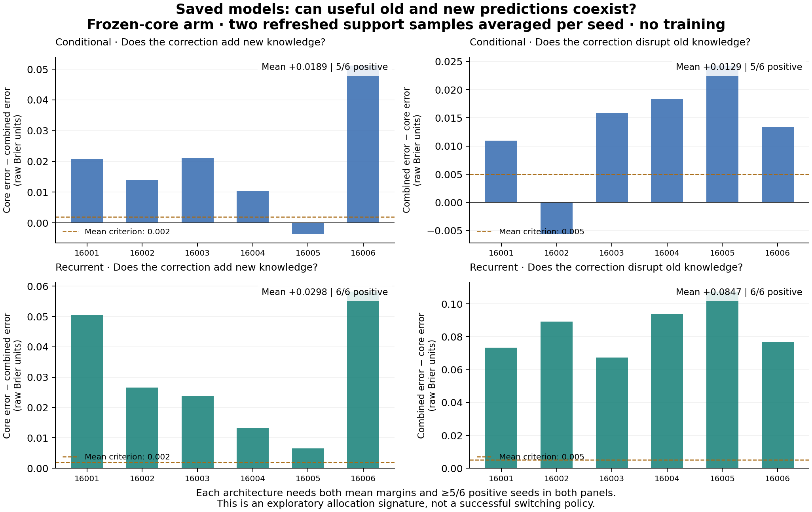

# Adam: saved core, residual, and context diagnostic

Completed 2026-09-28 UTC, using the already completed six-seed core/residual
cohort. **Both architectures meet the predeclared signature for investigating
one causal combination rule. Neither architecture is thereby a successful
continual learner.** The original acquisition/retention screens remain failed.

The useful finding is an output tradeoff: at the same novel-end weights, adding
the trained correction usually improves predictions in the novel environment
and worsens the core's predictions in the returning old environment. This is
evidence that combination matters. It is not sufficient evidence that the core
is competent, that every new dependency was learned, or that an online learner
can recognize which predictor to use.

## Fixed question and complete panel

The [review and decision rules](../docs/core_residual_output_review.md) were
written before computing component scores. This remains an exploratory analysis
of a previously inspected cohort, not an independent confirmation. All six
seeds 16001–16006, both architectures, and both joint and frozen-core arms enter.
No new training, model search, seed exclusions, or threshold changes occurred.

We use four saved-model panels: novel endpoint on the novel law, return entry
on the old law, return endpoint on the old law, and novel law after return.
Novel endpoint and return entry reuse the exact same complete learner state.
Each panel uses its actual saved history once and two archived fresh target-law
support replicates; the two fresh replicates are averaged within seed. The two
novel panels also retain both archived cue-flip probes.

For each input, compute the original full prediction, core alone, and residual
alone. The conditional model additionally crosses core/full expert content with
core/full evidence routing. The residual was trained as a logit correction;
its isolated output is not an independently trained baseline. No component
receives query labels, latent environmental identity, or future outcomes.

## The two allocation contrasts

All numbers in this report are **raw Brier units**, with lower error better.
Intervals are descriptive 95% paired-seed bootstrap intervals, 20,000 draws,
RNG seed 17291. The generated summary.md instead uses 100× Brier units.

| Architecture | Old harm: full − core, return entry | Positive seeds | Novel benefit: core − full, novel endpoint | Positive seeds |
|---|---:|---:|---:|---:|
| Conditional | +.012873 [.004705, .019260] | 5/6 | +.018927 [.006828, .033130] | 5/6 |
| Recurrent | +.084727 [.074380, .096201] | 6/6 | +.029784 [.015568, .045098] | 6/6 |

Old harm uses all-case Brier; novel benefit uses the affected-subset Brier from
the acquisition objective. Both use the separate arm with refreshed support.
The fixed effort-allocation requirements were means ≥.005 and ≥.002 respectively,
each strictly positive in at least five seeds. Both pass. Conditional's two
exceptions are different seeds: 16002 for old harm and 16005 for novel benefit.
This is not a statistical equivalence test or a new algorithmic success screen.

## Why absolute performance changes the interpretation

Refreshed-support mean errors for the frozen-core arm:

| Target and saved state | Conditional core | Conditional full | Recurrent core | Recurrent full |
|---|---:|---:|---:|---:|
| Novel at novel endpoint, affected subset | .114772 | .095845 | .107149 | .077366 |
| Old at return entry, all cases | .085066 | .097939 | .247546 | .332273 |
| Old at return endpoint, all cases | .085066 | .076202 | .247546 | .090948 |
| Novel after return, affected subset | .114772 | .103919 | .107149 | .156058 |

The recurrent old core is only relatively better at return entry: .247546 is
still poor compared with the .090948 reached by its combined model after return
training. A rule that always disables the correction on old conditions would
discard that improvement. After return, its combined novel predictor is worse
than the unchanged core, but using the core would not restore the acquired cue
dependence. The core's novel cue-flip benefit is only .000220, versus .052115
for the combined model at novel end and .019384 after return. Selection among
outputs can conceal lost novel skill if success is measured only against a weak
component. A future test must retain explicit novel-cue and acquisition checks.

The conditional combined predictor also has a specific unresolved acquisition
failure. On the two supply-timing seeds, refreshed novel error improves from
.190170 for core to .154223 for full, while the full model's correct-cue benefit
is only .000051. Better average prediction does not imply learning that timing
dependency. Switching to core-derived expert routing gives only about .000278
cue benefit. This diagnostic does not uncover a strong timing solution hidden
behind the original routing. These two seeds are descriptive, not a basis for
excluding cases or selecting an architecture.

## Context matters, and the moment of return is not the whole trajectory

At return entry, separate-minus-joint full-predictor error is −.048635
conditional and −.029918 recurrent with actual history; separate is better in
all six seeds for both. The previously observed recurrent return-AUC deficit
therefore is not an initial-entry disadvantage. Endpoint ablations cannot
reconstruct the intervening learning trajectory or assign its unique cause.

Refreshing support reduces separate-arm old error by .259603 conditional
(six seeds improve) and .045776 recurrent (four improve, two worsen). With fresh
support, separate-minus-joint gaps are −.038584 and −.042691 respectively. This
does not satisfy the separately specified context-only pivot: its required
initial disadvantage to joint is absent. GO has priority in the fixed hierarchy;
the context measurements remain descriptive rather than an alternative success.

In every seed and architecture, actual-history novel endpoint and return entry
present **identical query observations and identical support** while the physical
law and correct outcomes differ. An inference-only controller cannot infer the
unannounced change from identical inputs. A future causal controller must wait
for informative performed-action outcomes and incur the transition delay.
Evaluator-supplied fresh support cannot be credited as instant recognition.

Conditional routing crossings help localize the old-law output effect. At
return entry with refreshed support, the full-minus-core Brier gap decomposes
as .010797 from changed content at core routing, .000731 from changed routing
on core content, and .001345 interaction, summing to .012873. Thus an expert
routing substitution alone does not remove most of the gap. This is an exact
loss decomposition for fixed weights and data, not a unique cause of how those
weights were learned.

## Recommendation and stopping discipline

The diagnostic justifies **specifying one tightly bounded causal-combination
test** ([draft](../docs/core_residual_output_followup.md)), not launching a width,
replay-dose, or gating sweep. Test whether past
performed-action feedback can control the contribution of the correction while
preserving useful novel predictions. Use one fixed rule, complete transition
costs, joint/core/full controls, and fresh data; no target-law flags or selection
using evaluation truth. First isolate inference from learning so that a failed
selector cannot be explained away by simultaneous training changes. An eventual
continual-learning claim would still require a separate continuous-training
comparison, fresh learner seeds, acquisition and retention guards, and another
task beyond this constructed world.

There is a real risk of spinning wheels if each negative result produces another
nearby tweak on this same task. The current unconditional frozen-core/additive
recipe is not a validated solution. The positive allocation signature merely
identifies a testable output-combination question; the weak recurrent old core
and missing conditional timing skill substantially limit its promise. Preserve
the negative results and stop this branch if a predeclared causal combination
test cannot turn the available output differences into useful online behavior.
No general continual-learning mechanism, long-term compounding advantage, or
novel algorithm has been established. The broader research objective is still
open; these results do not justify abandoning continual learning as a problem.

## Verification and artifacts

The main run locked at 03:26:05.367435 UTC and completed at 03:26:22.804618 UTC.
It loaded 48 saved states, evaluated 384 input/context rows (1,536 component
forecast tensors), and performed zero optimizer updates. All 384 full predictions
exactly reproduce the archived originals. Complete loaded-state signatures and
global random states remain unchanged. Ninety-six repeated-input comparisons
verify identical frozen-core forecasts, including 72 comparisons across saved
endpoints and 24 within the same endpoint.

The independent NumPy analysis recomputes 12,288 raw metrics and checks complete
paired inputs, file/array hashes, forecast reconstruction, and component/context
coverage. The engineering smoke checks 40 rows and eight states and is ineligible
for scientific allocation. An initial smoke metadata check rejected Python
tuples versus their JSON list representation; the documented normalization
repair occurred before any main scores. The failed lock and corrected smoke
remain archived. All 29 component tests pass; lint passes. A separate reviewer
reconstructs all 12,288 metrics, ten allocation statistics and 640 conditional
decomposition statistics. Outside-repository rescoring reproduces the JSON and
Markdown byte-for-byte; five deliberately corrupted copies are rejected.
All 3,253 inventoried prior scientific files, including completed runs and
archives, remain unchanged.

- [Complete numerical summary](core_residual_outputs/development/summary.json)
- [Compact numerical tables](core_residual_outputs/development/summary.md)
- [PNG figure](core_residual_outputs/development/allocation.png) and [SVG figure](core_residual_outputs/development/allocation.svg)
- [Diagnostic source and data index](core_residual_outputs/README.md)
- [Independent outcome review](core_residual_output_checks/outcome_review.md)
- [Independent arithmetic review](core_residual_output_checks/independent_review_results.json)
- [Portability checks](core_residual_output_checks/portability_review.json)

These checks validate the recorded diagnostic. They do not constitute an
independent training replication, a deployable router evaluation, or a complete
portable reconstruction of the saved neural models. The self-contained forecast
archive supports NumPy rescoring; new inference also needs the unchanged base
checkpoints and their locked source.
