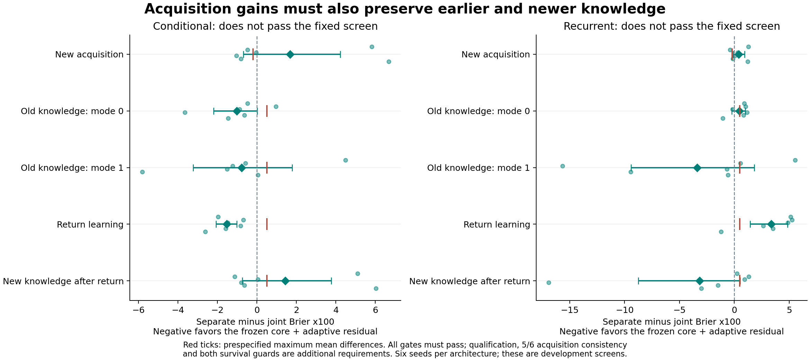
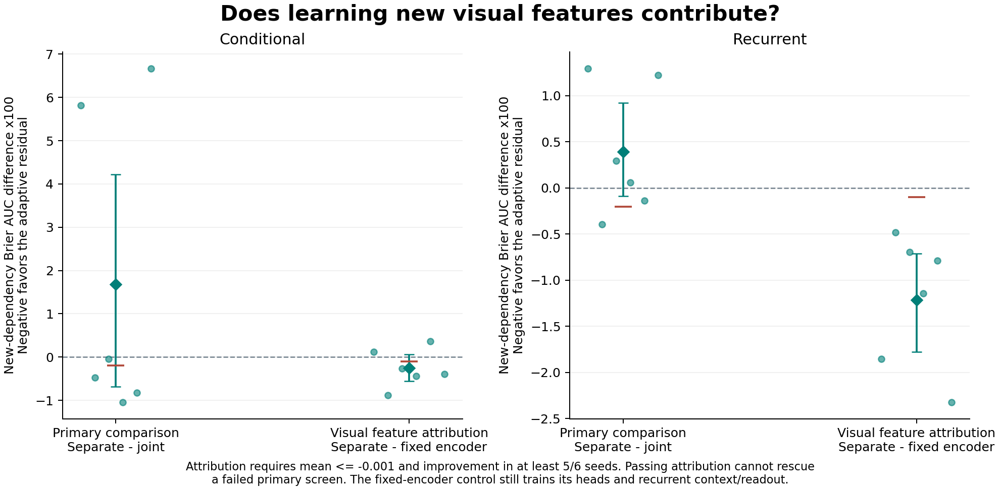
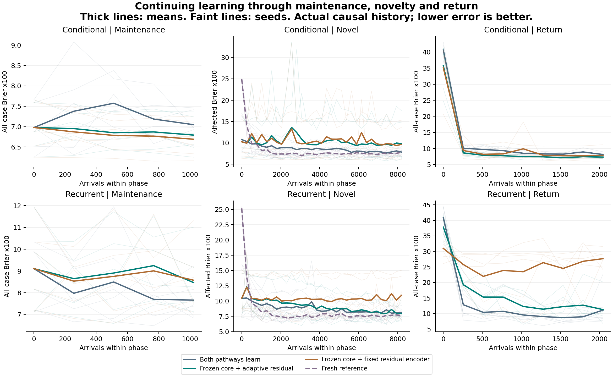

# Adam: a learned core and adaptive residual do not resolve the tradeoff

**The frozen-core candidate fails the prespecified acquisition/retention screen
in both architectures.** All six fresh seeds per architecture completed, and
both fresh-model references passed every learnability check. The conditional
candidate improved prediction when an earlier environment returned, but had
worse mean new-dependency error and higher new-dependency error after that
return. The recurrent candidate also failed acquisition and performed worse
during returns.

There is a narrower positive finding: **adapting the recurrent residual's visual
encoder improves acquisition over keeping that encoder random and fixed, in all
six seeds**. Learning new features helps this architecture. Freezing its entire
learned core still does not earn promotion over training the same architecture
jointly. The fixed-feature control cannot replace the primary candidate.

[Complete tables](core_residual/development/summary.md) ·
[Numerical results](core_residual/development/summary.json) ·
[Prospective protocol](../docs/core_residual_protocol.md) ·
[Archive and verification scope](core_residual/README.md) ·
[Execution ledger](core_residual_checks/run_ledger.md)

## What changed

Each ordinary conditional or recurrent core first learned four alternating
base-condition blocks from random initialization. We then copied the complete
core, Adam state, replay contents/generators and actual recent history into
three arms. Each received the identical small raw-input residual with exactly
zero initial output, preserving initial predictions:

| Arm | Learned core | Residual visual encoder | Residual heads/history/readout |
|---|---|---|---|
| Joint control | Trainable | Trainable | Trainable |
| Separate, primary candidate | Frozen | Trainable | Trainable |
| Fixed-feature control | Frozen | Fixed at random initialization | Trainable |

Conditional pathways add corresponding expert logits before inferring evidence
weights. Recurrent pathways add context-conditioned logits before the sigmoid.
The residual sees raw observations, so it is not restricted to information
already preserved in a frozen embedding. Core Adam moments and counters were
preserved; no optimizer or replay reset accompanied freezing.

The allocation occurred once, before 1,024 maintenance arrivals. The learners
then continued through 8,192 arrivals activating a previously irrelevant cue
and 2,048 arrivals returning to the original base condition. Novelty and return
supplied no boundary signal, reset, extra pathway or law label to the learner.
Every continuing arm retained its own learning state throughout.

Six fresh seeds crossed three first-cue types with two initial modes. Both
architectures received identical streams and uniform 16-packet replay, with
12 Adam updates per packet of 32. A fresh composite model also learned each
novel stream from random weights and empty Adam/replay state, using the same
actual preceding history. It qualifies learnability; its lack of earlier
learning makes it unsuitable as a forgetting control.

## Primary result and retention costs

The acquisition metric is affected-subset all-action Brier error, integrated
over the entire novel-learning curve including its starting point. Lower is
better. Numbers in the tables are **Brier units multiplied by 100**, not accuracy
percentages. Paired descriptive 95% intervals use 20,000 seed bootstrap resamples.
There are six independent units per architecture, not one per query or curve point.

| New-dependency acquisition | Conditional | Recurrent |
|---|---:|---:|
| Joint control | 8.6036 | 8.7811 |
| Separate candidate | 10.2889 | 9.1727 |
| Fixed residual visual features | 10.5378 | 10.3857 |
| Fresh qualification reference | 8.1494 | 8.2058 |
| Separate minus joint [95% interval] | +1.6853 [-0.6848, +4.2192] | +0.3917 [-0.0877, +0.9242] |
| Seeds improved | 4/6 | 2/6 |

The fixed acquisition requirement was a difference no greater than -0.2000
in these table units, with improvement in at least five of six seeds. Neither
architecture meets either condition. Both acquisition intervals cross zero;
this small development cohort does not establish universal inferiority of
freezing. It does fail the declared rule for adopting this candidate.

| Separate minus joint | Conditional [95% interval] | Recurrent [95% interval] |
|---|---:|---:|
| Novel end: valid old mode 0, Brier x100 | -1.0241 [-2.1944, +0.0114] | +0.4605 [-0.2303, +1.0117] |
| Novel end: valid old mode 1, Brier x100 | -0.7719 [-3.2312, +1.7907] | -3.3761 [-9.4210, +1.8242] |
| Return trajectory, all-case Brier AUC x100 | -1.5281 [-2.0676, -1.0242] | +3.3726 [+1.4309, +4.8598] |
| Return end: novel law with correct support, Brier x100 | +1.4376 [-0.7353, +3.7675] | -3.1541 [-8.7660, +0.5408] |
| Novel survival AUC, percentage points | -1.8595 [-4.4963, +0.3698] | -1.2899 [-2.0477, -0.6627] |
| Return survival AUC, percentage points | +0.4435 [+0.0407, +0.9440] | -3.5136 [-4.9357, -2.0101] |

Each Brier retention/return guard allowed at most +0.5000 table units; each
survival guard allowed at most a one-percentage-point loss. Conditional fails
post-return novel retention and novel survival as well as acquisition. Recurrent
fails return prediction and both survival guards as well as acquisition.
Passing a mean-based guard is not proof of noninferiority: several intervals
cross its practical tolerance.

The conditional post-return failure is an **endpoint error gap**, not evidence
that the candidate forgot more during return. Its correct-support novel Brier
rises by .008074 during return, versus .011025 for joint; it already entered
return with worse novel predictions. The recurrent candidate's post-return
advantage is also heterogeneous: only three of six seeds favor it and the
descriptive interval includes zero. Neither observation changes a fixed decision.

Correct-support probes are evaluator diagnostics. They assess a predictor under
appropriate supplied context; they do not demonstrate that it autonomously
identifies which environment is currently present. Actual-history curves and
pre-update performed-action errors are separately preserved in the archive.

## What the controls clarify

Both fresh architectures pass the all-case improvement requirement of .02
over a training-only action/horizon marginal predictor, and the correct-cue
benefit requirement of .002, overall and within each of the three cue groups.
Overall marginal gains are .154961 conditional and .153525 recurrent. Even the
weakest fresh cue-group benefit is .006975. Task qualification is therefore not
the reason these primary screens fail.

The conditional mean hides an interpretable division. Its two supply-timing
seeds have a mean acquisition cost of **+6.2443 Brier x100**, while efficiency
and delay groups average -0.2586 and -0.9297. The recurrent timing group also
has the largest cost, +1.2607, versus -0.0484 and -0.0373 for the other two
groups. Each group has only two seeds. These are descriptive findings from
the complete cohort, not grounds for dropping timing or promoting a subgroup.

The feature-attribution comparison is separate minus fixed_features:

| Visual-encoder adaptation | Acquisition difference, Brier x100 [95% interval] | Improved seeds | Fixed attribution screen |
|---|---:|---:|---|
| Conditional | -0.2489 [-0.5594, +0.0650] | 4/6 | Fail |
| Recurrent | -1.2130 [-1.7754, -0.7131] | 6/6 | Pass |

The recurrent adaptive residual also shows a much larger terminal correct-cue
benefit, .052115 versus .000643 with fixed random visual features. This supports
the usefulness of adapting that encoder in this setting. The control still
trains its heads and history/readout; it does not remove all representation
learning. The comparison also includes feature adaptation during maintenance,
so it does not isolate changes made only after the new dependency appeared.

Retaining old parameters is not equivalent to retaining the overall prediction
function. The audit confirms that frozen core weights and Adam state remained
unchanged, yet the combined predictor can change through residual logits and,
in the conditional architecture, their effect on evidence routing. The observed
return and post-return costs make that distinction concrete. Neither improved
old-condition return in the conditional model nor improved new-knowledge
retention in the recurrent model satisfies the complete objective by itself.

## Resources and verification

The cohort completed 12 prefix fits, 36 continuing learned trajectories and
12 fresh references: 552,960 arrivals, 17,280 packets and 207,360 Adam updates.
It finished at 2026-09-28 02:39:04 UTC, 672.57 seconds after locking, with six
single-thread CPU workers and affinity 1365. No seeds were replaced or exposure
extended after seeing scores.

All continuing arms have 76,568 parameters conditional or 77,190 recurrent.
The separate arms train 18,716 and 19,359 respectively; fixed-feature controls
train 6,204 and 6,847. The archive counts retained and active optimizer tensors,
measurement snapshots, replay/history, ordinary training, prequential forecasts
and evaluator work. The full study executed 838,032 raw-path forward calls.
Equal capacity, update counts and forward exposure do not imply equal FLOPs:
freezing reduces backward work. We did not spend that saving on extra updates.

The scoped suites passed **268 tests** (195 scientific and 73 portable), with
two architecture-inapplicable skips, plus Ruff. The main file-integrity check
passed all 1,026 JSON/ZIP/checkpoint/NPZ files. The independent tensor audit
checked 168 before and 168 final checkpoints, 36 copied-prefix forks, 12 fresh
initializations, all 17,280 causal packets, and all 6,912 evaluator calls. It
reconstructed 4,920 stored evaluator predictions plus 168 first-packet forecasts.
The other 1,992 intermediate evaluator predictions have independently checked
physical truth, raw arithmetic and provenance, but not reconstructed model
states. This is not independent ordinary-stream retraining.

A separate NumPy review reproduced 58,800 raw scalar evaluation metrics,
17,280 prequential packet scores, 120 learning rows, 1,108 seed-bootstrap
distributions, every fresh qualification group, and all 26 primary/attribution
gates. Maximum absolute
disagreement was 2.22e-16. Both sealed archives also verified in place and
outside the repository: 66 smoke artifacts and 366 development artifacts.
The verifier/test files were prospectively excluded from the scientific lock
and sealed separately. Completed-run resumption changed no bytes in either run.

[Tensor audit](core_residual/development/audit.json) ·
[Independent arithmetic](core_residual_checks/independent_arithmetic.json) ·
[Portable verification proof](core_residual_checks/development_portable_proof.json) ·
[Read-only resume proof](core_residual_checks/completed_resume_read_only.json)

All 1,595 earlier scientific files, including 1,313 report artifacts, remain
byte-identical. The final [preservation and lock check](core_residual_checks/preservation_final.json)
also confirms unchanged scientific identities and valid new-document links.

## Decision and next question

Do not adopt this whole-core freezing rule or retune it on these six seeds.
Keep the complete negative result and the narrower recurrent feature-adaptation
finding. The closest architectural precedents and mathematical distinctions
are recorded in the [related-work note](../docs/core_residual_related_work.md);
this study does not establish a novel architectural principle.

The most useful next step is a bounded diagnostic of **where the combined
predictor fails**, before introducing another learning rule: separate the core,
residual and causal-context contributions on the archived models, especially
for supply timing and environmental returns. That would be exploratory analysis
of this cohort; any resulting policy would need a separately locked fresh-data
test. The present experiment does not identify residual capacity, inherited
confidence, routing or context learning as the unique cause.

The broader objective remains learning useful representations from scratch
under bounded resources. This study tests one new dependency and one return,
with a single fixed allocation and clean feedback. It supplies no evidence of
indefinite capacity renewal, biological critical periods, autonomous maturation,
noise discrimination or compounding lifelong advantage. Physical horizons remain
4, 8 and 12; a longer training stream is not a longer planning horizon.
