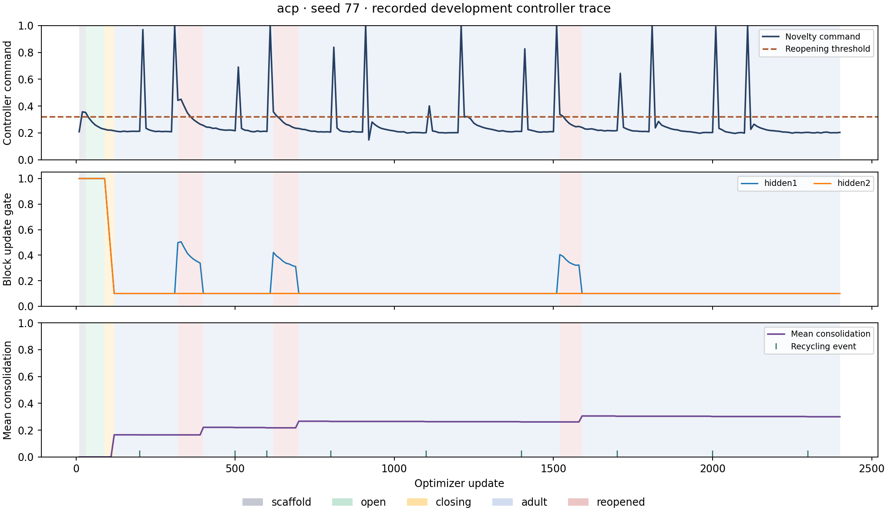

# Development results and decision

**The code and experiment harness run; these pilots do not establish the critical-period hypothesis.** Initial configurations never closed. A documented calibration then produced signal-driven closure and bounded reopening, but the active controller underperformed replay plus recycling on the synthetic stream. This is a useful negative development result, not a confirmatory rejection of the broader idea.

Completed on 2026-09-20: **65 comparative method/seed runs** across three suites, two single-seed calibration probes, five small engineering-smoke runs, and two 100-output ResNet GPU smoke runs. An additional 79 fresh-model fits supply per-experience acquisition references. These are small workloads, not 65 full CIFAR-100/ResNet benchmarks. All reported accuracy and selection use validation data. The official CIFAR test split was not used for training, evaluation, or selection.

## Implementation and verification

The repository implements ACP, ER, CBP-inspired ER+recycling, a DER++ variant, a fixed schedule, and component ablations. It includes MLP/CNN/GroupNorm ResNet models, explicit recycling maps, independent replay RNGs, diagnostics, metric matrices, scratch references, paired bootstrap summaries, plots, and exact experience-boundary checkpoint continuation. See the [algorithm specification](../docs/algorithm.md) and [scientific protocol](../docs/experiment_protocol.md).

**134 tests pass**, covering all 15 methods, momentum gating, gain floors, protection/maturity, adjacent recycling and state clearing, stream pairing, data splits, metrics, evaluation isolation, resumed trajectories, and provenance checks. Ruff checks pass. Every comparative run used source SHA256 `a5110b0bac6f5e0567c44e9212f65ed91f7b7e0aedd704bb5d3cea6608ce01dd`, preserved in implementation commit `3cf5c2a`. Some runs began before that commit: their manifests record a missing revision and/or dirty workspace, while the matching source hash identifies the shared implementation.

CIFAR-100 was downloaded from its Toronto origin and checked against torchvision's archive MD5 `eb9058c3a382ffc7106e4002c42a8d85`. GPU tests used PyTorch 2.8.0+cu128 and an RTX 4070 Ti. The small CNN has 112,564 parameters; its 400-image buffer occupies 1,232,000 tensor bytes including labels. The 100-output ResNet smoke model has 11,208,164 parameters and a 64-wide adapter. Its twenty updates per method demonstrate GPU integration only. The full template uses a 256-wide adapter and larger batches; that complete study has not run.

## Initial synthetic pilot: inactive developmental control

[Configuration](../configs/synthetic_pilot.json): eight experiences of two classes, a 64-wide MLP, replay capacity 256, 100 updates per experience, five paired seeds (11/22/33/44/55), seven methods. [Summary and uncertainty](synthetic_initial/summary.md), [individual results](synthetic_initial/individual_results.json).

ACP achieved 99.36% mean final accuracy, ER+recycling 99.19%, ER 97.81%, and fine-tuning 17.43%. **Every ACP run remained OPEN after scaffold, with zero closure or reopening.** Its no-reopening ablation was identical. Replay-risk contractions can still change OPEN-phase gates, so not every controller operation was absent. However, consolidation and reopening were inactive: these scores cannot validate the proposed critical-period cycle.

## Calibrated synthetic pilot: active mechanism, no demonstrated advantage

The [calibration ledger](controller_calibration.md) retains two unsuccessful reopening probes on development seed 11. Faster monitoring and longer dwell enabled closure, but not reopening at the initial thresholds. A lower threshold was then selected from those training-signal traces, before running fresh development seeds 66/77/88.

The [calibrated configuration](../configs/synthetic_calibrated.json) uses EMA decay 0.7, 300 updates per experience, recycling checks every 100 updates, and novelty above 0.32 for two windows. The replay-risk veto remains active. These are development-tuned choices, not literature-derived constants. [Full summary](synthetic_calibrated/summary.md), [individual results and transitions](synthetic_calibrated/individual_results.json).

| Method | Final accuracy, % | Forgetting, pp | Late early-learning AUC, % |
|---|---:|---:|---:|
| ER | 99.37 | 0.73 | 85.88 |
| ER + recycling | 99.45 | 0.61 | 90.16 |
| Fixed controller | 99.01 | 1.12 | 87.71 |
| ACP | 98.86 | 1.23 | 86.99 |
| ACP without reopening | 99.07 | 1.00 | 87.25 |
| ACP without recycling | 98.81 | 1.34 | 84.97 |

All three ACP learners entered closing from `sustained_stability`, reaching ADULT at steps 130, 120, and 130. They reopened **1, 3, and 1 times**. Each event began 20–40 updates after an experience changed; the learner never receives that boundary. Four events ended at the duration limit and one after stable adaptation. Final mean consolidation was approximately 0.23/0.30/0.24, no row exceeded 0.9, and each run recycled ten units. Short-run saturation was not the immediate limitation.

ACP minus ER+recycling was **−0.59 pp final accuracy** (exploratory paired percentile interval [−0.83, −0.24]) and **−3.17 pp late acquisition AUC** ([−4.16, −1.64]). ACP also failed to improve on its no-reopening ablation. Three development pairs, an accuracy ceiling, and unmatched tuning prevent a general superiority, equivalence, or falsification claim.

Do not compare AUC directly between the original and calibrated suites: increasing dwell from 100 to 300 steps changes the first-20% acquisition horizon from 20 to 60 steps. Comparisons within each suite use identical horizons and paired data.

## CIFAR pilot: real-image feasibility, inactive developmental control

[Configuration](../configs/cifar100_pilot.json): **20 selected CIFAR-100 classes**, four experiences of five classes, 150 training and 50 validation images per class, small CNN, 400-image replay, 100 updates per experience, three paired seeds (11/22/33). This is not the full 100-class ResNet benchmark. [Summary](cifar100_initial/summary.md), [individual results](cifar100_initial/individual_results.json).

| Method | Final accuracy, % | Forgetting, pp | Late early-learning AUC, % |
|---|---:|---:|---:|
| ER | 23.10 | 41.60 | 14.85 |
| ER + recycling | 23.17 | 41.51 | 14.74 |
| Fixed controller | 22.27 | 39.24 | 9.73 |
| ACP | 25.20 | 39.60 | 13.70 |

ACP's final accuracy exceeded ER+recycling by 2.03 pp, while acquisition AUC was 1.04 pp lower. **All three ACP runs stayed OPEN without consolidation or reopening**, recording 2/3/1 replay-risk contractions. The apparent retention change cannot be attributed to developmental control. These runs validate the image/replay/optimization/evaluation pipeline and show why final accuracy alone is inadequate.

This small CNN's synchronized per-run time, including evaluation and checkpoints, averaged about nine seconds. Some runs overlapped other development work. This is not a native-efficiency comparison or a full-study runtime estimate. Shared instrumentation also inflates the simple baselines' allocated state relative to optimized implementations.

## Next experiments

1. **Separate external novelty from learner-induced change.** Recycling causes large feature-drift spikes. Compare input-derived or frozen-feature signals against explicit reset compensation with equal resource budgets. Retain rank/dormancy as learner-health signals. Include stationary, genuine-shift, label-noise, and shift-at-reset controls.
2. **Compare allocation policies fairly.** Tune adult gain, anchor commitment, and opening duration with equal budgets for ACP and ER+recycling. Add a schedule recorded on independent streams with matched opening/replacement budgets. Determine whether locality/timing helps at equal total update opportunity. The always-trainable head may fit labels before feature novelty persists long enough to trigger.
3. **Test fixed-label recurrent domains over longer horizons.** Short class-incremental streams confound growing class competition with plasticity loss. Use at least 100 controlled shifts with fresh-model references, then full CIFAR ResNet development. Verify canonical CBP/DER++ and UPGD comparisons before freezing the planned 20-pair confirmatory study.

The current evidence supports further sensor/controller development. It does not justify spending the full confirmatory budget or presenting ACP as a demonstrated improvement. The original failures, calibration probes, and comparative summaries are retained.

## Reproduction

Commands are in [README](../README.md). Raw runs/events/checkpoints remain under ignored `runs/`; compact manifests, summaries, matrices, individual outcomes, plots, and calibration-probe traces are tracked here. The [environment lock](../requirements-lock.txt) records installed versions. [ResNet GPU smoke artifacts](resnet_gpu_smoke/summary.md) remain separate from comparative results.
