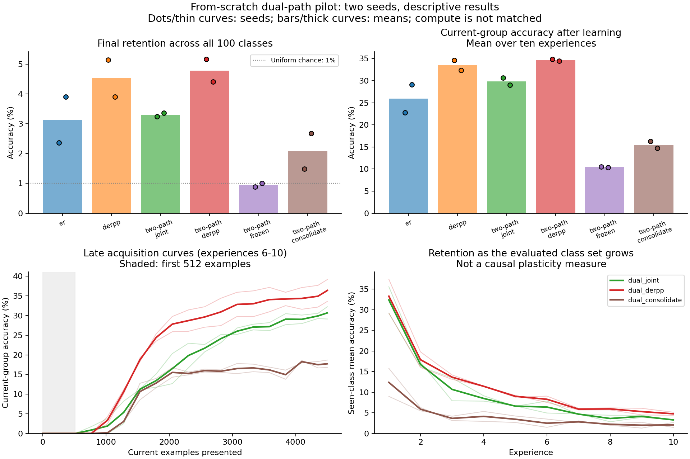

# Dual-path prototype: implemented, initial pilot negative

The first from-scratch architectural prototype is complete and reproducible.
The separated acquisition/consolidation method did **not** outperform joint
training of the same architecture in this pilot. Both seeds had lower final
retention, and acquisition was substantially weaker. This is a negative result
for the initial operating point, not a rejection of complementary learning
systems or proof of a fundamental architectural limitation.

All twelve planned comparative runs completed with the settings fixed in the
[protocol lock](dual_path/protocol_lock.json), plus forty per-experience fresh
fits across two architectures and two seeds. No comparative settings were tuned,
no runs excluded, and no training retries were used to improve outcomes.

## Results

Means over two paired seeds; accuracies are percentages. All predictions use
the same fixed 100-class output support, with no task IDs or seen-class masks.

| Method | Final retained accuracy | Mean current-group accuracy after learning |
|---|---:|---:|
| Single-network replay | 3.13 | 25.92 |
| Single-network DER++ variant | 4.52 | 33.48 |
| Two pathways, jointly trained | 3.30 | 29.82 |
| Two pathways, DER++ variant | 4.78 | 34.65 |
| Fast pathway only, stable path remains random | 0.94 | 10.43 |
| **Separated learning and consolidation** | **2.08** | **15.48** |

Against joint training, the separated learner's final-accuracy differences were
**-1.76 pp** on seed 2027 and **-0.68 pp** on seed 2131. These are descriptive
paired differences, not significance estimates. Its lower forgetting score
does not establish better preservation: it learned less to begin with.



The full [generated summary](dual_path/summary.md) contains every seed, resource
counts, and paired consolidation probes. The [portable archive](dual_path/archive.json)
preserves all learning curves and matrices without dataset or checkpoint payloads.

## The initial acquisition window was uninformative

Every method's late acquisition AUC through the first 512 current examples was
exactly zero. The horizon covers eight online updates after a new group of
classes arrives. Accuracy improves later, as the full curves show. The common
floor prevents this endpoint from distinguishing the algorithms in this pilot.

For context, **post hoc descriptive** integration across the full 4,500-example
experience gives mean AUCs of 14.89% (replay), 19.62% (DER++), 17.12% (joint),
21.26% (two-pathway DER++), 6.11% (frozen stable path), and 10.79% (separated).
These calculations do not replace the planned endpoint or turn the pilot into
a confirmatory study. Current-group endpoint accuracies in the table are also
descriptive summaries of the preserved full curves.

The late scratch differences are negative, but a fresh replay-free learner
does not have the same old-label competition, replay objective, or consolidation
budget. Those gaps cannot by themselves establish loss of plasticity.

## What the diagnostic suggests

The jointly trained systems learn the current class groups considerably better
than they retain all groups at the end. The separated model has both acquisition
and retention problems. The frozen-stable ablation is particularly weak.

The stable predictor starts random and receives no updates until consolidation;
before that, only the smaller fast pathway can learn. Cold start, limited active
feature capacity, and the consolidation schedule are therefore concrete next
diagnostic candidates. Their causal contribution has not been isolated here.

Immediate consolidation/renewal effects on the training-memory probe are mixed:
mean net accuracy changes are +0.35 pp and -1.04 pp for the two seeds. This does
not establish that branch deletion caused the endpoint failure. Probe samples
can overlap the consolidation pool and do not measure global retained knowledge.

**Recommendation:** keep the prototype and diagnostic infrastructure, but do not
scale this frozen recipe or claim an architectural improvement. First diagnose
ordinary learning and the cold start of the separated model. Any revised schedule
should be a separately recorded development experiment, with stationary controls,
a useful acquisition horizon, and explicit memory/compute comparisons. Further
work toward sustained representation learning needs longer benchmarks and stronger
baselines; this ten-group pilot does not establish that property.

## Resource and verification scope

Each run receives 45,000 unique current images and 45,376 online replay examples.
Single-network models have 34,356 parameters; every two-pathway model has 44,800.
The separated method adds nine consolidation events, 216 optimizer updates,
13,824 student example presentations, and teacher/probe computation. These are
equal-arrival comparisons, not matched-compute or matched-total-memory comparisons.
The stored replay has 512 raw images; DER++ variants additionally store logits.

The training revision passed **576 tests with two Windows symlink skips**, Ruff,
six-method CPU and CUDA smoke suites, and the existing legacy/v3 smoke suites.
The [engineering record](dual_path/engineering_verification.json) records its
scope. A subsequent API/cache validation change passed **580 tests with the same
two skips**; see the [final verification record](dual_path/final_verification.json).

The [local audit](dual_path/audit.json) reloaded all twelve completed checkpoints
on CUDA and reproduced their final validation accuracies. It also recomputed
metrics/AUC, checked training/validation separation and unique arrivals, and
compared final reservoir membership and online replay RNG state across methods.
Completed-run resume was checked without retraining. This is local recomputation,
not external replication. The figure was visually inspected.

## Exact source preservation

Training source SHA-256:
`f1517828a6b26be23809fecd16c0805f286bb0f78b4c37b32683701a339ce1b2`.

The [training source archive](dual_path/training_source.zip) and
[file manifest](dual_path/training_source_manifest.json) preserve the actual source,
configurations, and protocol used in the pilot. After training and the checkpoint
audit completed, two defensive checks were added: the legacy constructor rejects
dual-path method names, and fresh-reference caches validate their architecture.
These checks do not change the training path used by the pilot. They do change
the repository's source hash, so exact historical resumption requires the archived
source in a separate checkout. No historical result was relabeled with the new hash.

Current source can run a new experiment using the commands in the
[architecture protocol](../docs/dual_path.md). To regenerate the figure from
the portable archive alone:

```powershell
.venv/Scripts/python.exe scripts/plot_dual_path.py --archive reports/dual_path/archive.json --output reports/dual_path/overview
```
