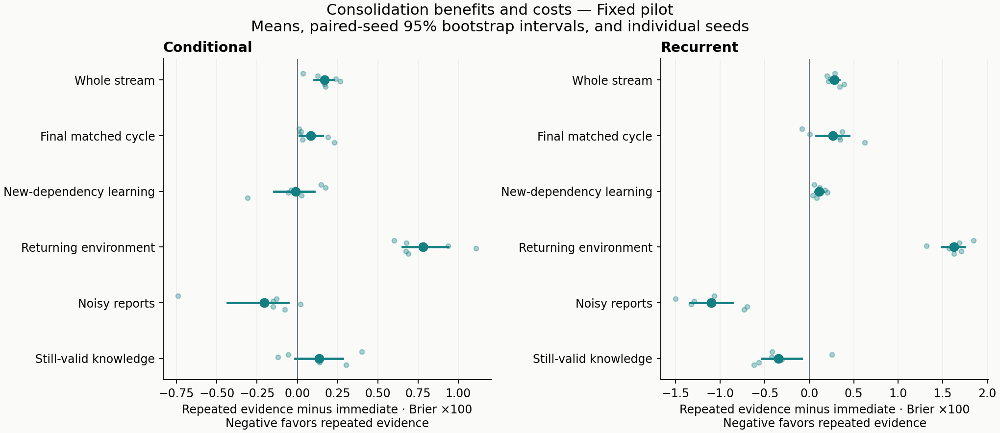
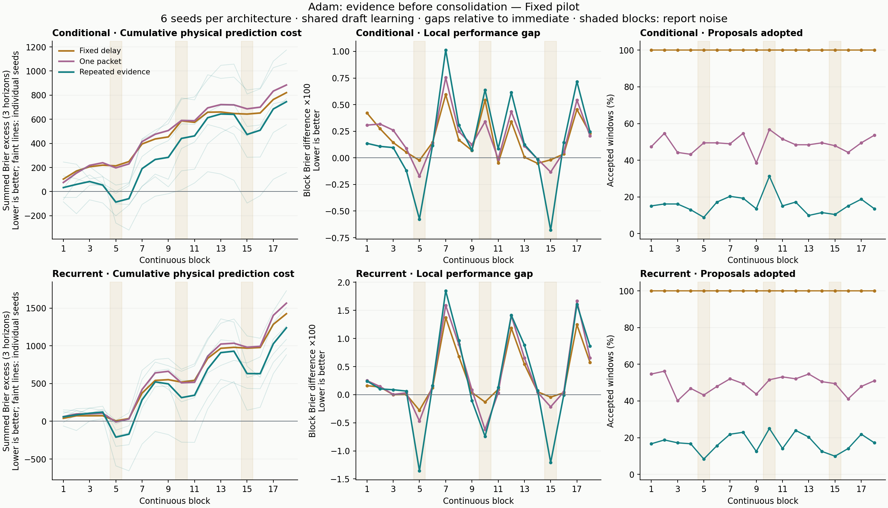

# Adam: evidence before consolidation over a longer stream

Status: development and the fixed pilot are complete and audited.
**The sustained-evidence rule fails the prospective screen in both architectures.**
Every fresh-reference qualification group passes in this pilot. Physical
prediction error nevertheless increases over the whole stream in all six
seeds per architecture. Noise benefits do not recover the costs of delayed
adaptation, especially when the original environment returns.

## What this experiment asks

Does a candidate that predicts subsequent observations better provide a useful
basis for committing learned weights? The comparison separates repeated
evidence from a fixed deployment delay and a decision based on one packet.
All four policies share exactly the same uniformly replay-trained draft.
This is a consolidation diagnostic, not a new representation-learning rule.

The [prospective protocol](../docs/evidence_consolidation_protocol.md) fixes
eight-packet validation windows, a .002 terminal Brier margin, and six positive
packet gains for sustained acceptance. Proposals remain frozen during their
validation window. The accepted weights are those evaluated, never a newer
unvalidated draft. The immediate policy uses live draft weights; periodic and
single-packet policies use the same proposals and decision opportunities as sustained.

The continuous stream contains 18 blocks following the prefix, totaling 151,552
arrivals per draft trajectory. It introduces three dependencies and then cycles
through clean conditions, reporting noise, recovery, an original environment,
and revised cue meaning. The first and third cycles match conditions; the
middle cycle changes the temporal arrangement of corruption into bursts.
No learner receives condition labels or clean evaluation outcomes.

Primary physical prediction error is scored on each arriving packet BEFORE
feedback or training, against clean outcomes of the performed actions. The
acceptance rule instead sees only reported terminal outcomes. Independent
counterfactual panels measure acquisition, retained predictions and chosen-action
survival. These are distinct measurement channels.

## Fixed pilot results

The pilot completed all 12 shared draft trajectories, 216 continuous blocks,
36 fresh references, and 864 policy/block evaluations. Six independent seeds
per architecture determine the estimates; blocks and windows are not additional
independent learners. All planned runs finished without retries or exclusions.

Every fresh-reference stage and cue group passes. The arrival-delay cue benefits
are .005158 conditional and .006705 recurrent, above the fixed .002 minimum.
This qualifies the pilot without changing the earlier development failure.

The following differences are **sustained minus immediate**. Brier differences
are multiplied by 100; negative is better. Brackets are descriptive 95% paired-
seed bootstrap intervals, using 20,000 resamples. Survival uses percentage points.

| Pilot outcome | Conditional | Recurrent |
|---|---:|---:|
| Whole-stream physical error | +0.169 [0.105, 0.226] | +0.280 [0.229, 0.336] |
| Final matched-cycle physical error | +0.083 [0.017, 0.155] | +0.267 [0.079, 0.445] |
| Returning-environment physical error | +0.781 [0.652, 0.937] | +1.624 [1.484, 1.745] |
| Noisy-block physical error | -0.205 [-0.434, -0.058] | -1.101 [-1.333, -0.864] |
| New-dependency acquisition AUC | -0.009 [-0.144, 0.105] | +0.114 [0.068, 0.161] |
| Terminal still-valid error, averaged across blocks | +0.134 [-0.012, 0.280] | -0.346 [-0.534, -0.087] |
| Survival AUC, percentage-point difference | -0.090 [-0.230, 0.058] | -0.068 [-0.140, 0.003] |

Immediate and sustained whole-stream Brier means are .093894 and .095579 for
conditional, and .098852 and .101652 for recurrent. Sustained improves **0 of
6** whole-stream seed pairs in each architecture. Both also exceed the allowed
.005 raw-Brier mean return cost. Acquisition, noisy-block error, still-valid
retention and survival guardrails pass; none of those passing guardrails has
a descriptive interval crossing its tolerance. Passing a mean-based guardrail
is not a formal noninferiority result.

The fixed-delay control itself costs +0.186 and +0.322 in scaled whole-stream
error versus immediate. Sustained offsets a small part of that cost:

| Sustained minus control, whole-stream Brier x100 | Conditional | Recurrent |
|---|---:|---:|
| Fixed delay | -0.017 [-0.063, 0.031] | -0.042 [-0.111, 0.028] |
| One-packet evidence | -0.031 [-0.066, 0.004] | -0.074 [-0.154, 0.010] |

Against fixed delay, sustained improves 4 of 6 seed pairs in each architecture,
below the required 5. Neither its overall nor late mean gain reaches the
required .002 raw-Brier gain against either main control. These small uncertain
advantages over delayed alternatives do not justify replacing immediate use
of the uniformly replay-trained learner.

## Time, noise, and commitment

The mean late-minus-early advantage versus immediate is +0.066 [-0.076, 0.192]
conditional and +0.070 [-0.239, 0.379] recurrent, in Brier x100. The mean gap
narrows slightly, but both intervals include zero and both late mean errors
remain worse. The cumulative extra squared error over all three horizons is
745.46 conditional and 1,238.66 recurrent per trajectory on average. Earlier
costs are not recovered by the end of the declared stream.

Persistent and burst corruption have the same expected replacement rate but
different temporal patterns. Descriptive mean physical-error contrasts expose
an important difference hidden by the pooled noise endpoint:

| Noise arrangement, sustained minus immediate Brier x100 | Conditional | Recurrent |
|---|---:|---:|
| Persistent replacement, cycles 1 and 3 | -0.627 | -1.281 |
| Burst replacement, cycle 2 | +0.639 | -0.742 |

Each architecture has six seeds. The persistent row averages two blocks per
seed; the burst row uses one. These are comparisons on the same noisy stream,
not estimates of noise's causal penalty relative to an uncorrupted twin.
They also do not isolate noise arrangement from learner age or preceding
experience: arrangement and cycle number were not counterbalanced. A noisy-
block adoption is not automatically an incorrect decision.

Sustained accepts 15.68% of post-prefix windows conditional and 17.19% recurrent;
one-packet acceptance is 48.93% and 49.22%, and periodic accepts 100%. Proposals
are always eight packets old when considered. At decision time, sustained
incumbents have median ages of 48 and 40 packets, compared with 16 for periodic.
The sustained age interquartile ranges are 24--80 and 24--72 packets. These ages
describe the weights, while causal history continues to update.

Sustained window-mean reported gains have interquartile ranges -.01050 to
.01071 conditional and -.01023 to +.01171 recurrent, with medians .00036 and
.00074. These are descriptive window distributions, not independent confidence
samples. Every window's score, sign count, age, decision and condition is
preserved in the [complete summary](evidence_consolidation/pilot/summary.json).

The recurrent model retains better predictions on clean-support still-valid
panels while performing worse on actual online returns. Those measurements use
different support conditions and queries. The result does not establish that
all return costs are caused by erased knowledge. Likewise, the costly fixed-
delay control shows that delayed deployment already matters; this experiment
does not isolate every source of adaptation lag or retention damage.

Both figures are also available as
[effect PDF](evidence_consolidation/pilot/consolidation_effects.pdf),
[effect SVG](evidence_consolidation/pilot/consolidation_effects.svg),
[lifetime PDF](evidence_consolidation/pilot/lifetime_consolidation.pdf), and
[lifetime SVG](evidence_consolidation/pilot/lifetime_consolidation.svg).
The [full tables](evidence_consolidation/pilot/summary.md) preserve all controls,
seed values, qualification groups, endpoints and screen decisions.

## Fixed development results

All four development trajectories completed, with 72 continuous blocks and
12 fresh references. Each architecture has only two seeds. Both failed the
arrival-delay cue qualification (.001717 conditional and .001121 recurrent,
against .002); all stage groups and marginal-gain requirements passed. This
limits interpretation and was not corrected by increasing exposure afterward.

Sustained minus immediate, Brier multiplied by 100:

| Development outcome | Conditional | Recurrent |
|---|---:|---:|
| Whole-stream physical error | +0.211 | +0.180 |
| Final matched-cycle physical error | +0.319 | +0.285 |
| Returning-environment physical error | +0.831 | +1.636 |
| Noisy-block physical error | -0.242 | -1.507 |
| Mean terminal still-valid error | -0.746 | -0.198 |

Negative error differences favor sustained acceptance. The recurrent noise
benefit did not cover the return/revision costs over the whole stream. Its
advantage versus immediate decreased from the first to third matched cycle
by .298 in these scaled units; the conditional change was -.018. These are
small development estimates, not a pilot pass or a calibrated confidence claim.
The complete [development summary](evidence_consolidation/development/summary.md)
preserves the periodic and single-packet controls, individual seeds, and every
block. No setting was selected from these results.

## Novelty and interpretation

The [related-work review](../docs/adam_related_work.md) places this work among
concept-drift detection, complementary learning systems, noisy continual replay,
and loss-of-plasticity research. Its broad ingredients are established. Paired Learners (2008) already compared
stable and reactive predictions before replacement; SEA (2001) already tested
a fixed candidate on a later data chunk. The present acceptance diagnostic
does not claim invention of either operation.
Novelty of a particular Adam mechanism or benchmark has not been demonstrated.
The intended contribution must be a precise implementation and reproducible
evidence beyond appropriate controls and, eventually, another environment.

Repeated evidence cannot generally identify the cause of changed reports.
Persistent corruption can be observationally indistinguishable from changed
physical dynamics. Even independent random replacement shifts the reported
conditional mean. This experiment asks whether the declared acceptance rule
helps under the particular specified change/noise processes.

The [noise derivation](../docs/evidence_noise_limits.md) makes this concrete:
the simulator's terminal replacement reports have mean .25. A predictor can
improve its expected reported Brier score by learning that bias while worsening
physical calibration. In an ideal model with action-independent corruption,
action ranking can still be preserved, so prediction and survival must remain
separate outcomes. This is an explanatory limit, not a post-hoc change of metric.

The longer-horizon question is separated into cumulative performance and change
in the local advantage between matched early and late cycles. A fixed benefit
can accumulate without compounding. This design cannot establish compounding
representation learning because every policy shares the same draft training.
Nor does it extend the physical prediction horizon, which remains H=12.

## Research decision and next question

Keep immediate deployment with uniform replay as the working reference.
Do not promote this fixed global acceptance gate or tune its window and margin
using the completed pilot. Its failure concerns this mechanism and this world;
it does not disprove the general aim of learning reusable relationships.

The next useful question is whether evidence can guide **where learning changes
the model**, while preserving immediate access to useful new predictions.
Before another large candidate comparison, a bounded diagnosis should separate
weight age, available retained predictions and context inference on matched
return queries. Actual-history and clean-support probes must use matched
queries; clean support remains a diagnostic upper reference, never an input
silently supplied to an ordinary learner.

That diagnosis can motivate a selective update/protection rule instead of
copying the entire model only after a delay. Such a rule would finally change
the representation-learning trajectory and needs its own fresh development
data, matched memory/compute controls and independent confirmation. To test the
user's compounding hypothesis directly, introduce counterbalanced, equally
learnable new dependencies both early and late, with matched fresh-weight
references. Measure whether prior learning reduces later acquisition cost
without increasing lifetime error or damaging still-valid knowledge. This is
a proposed next experiment, not a claim that the present result has shown it.

## Integrity and limits

Scientific source, both configurations, and protocol were locked before
development fits. Development uses seeds 11001--11002; the pilot uses untouched
12001--12006. There is no parameter search or outcome-selected architecture.
The [attempt ledger](evidence_consolidation/study_ledger.md) preserves engineering
and development attempts. The portable archive retains all raw records.

Engineering validation passed 818 distinct tests across the full suite and
added mechanism, recovery and analysis tests, with two existing Windows symbolic-
link skips. The smoke cohort passed complete checkpoint/probe audits and all
44 stable-file checks; its tiny exposure is not a scientific learning attempt.
Analysis scripts, tests, configurations and protocol were saved before pilot
fitting in [the analysis lock](evidence_consolidation/analysis_at_lock.json).

The pilot's full checkpoint audit passed 516 saved states and 7,104 decision
windows; all 784 stable files passed integrity checks. Development passed
172 saved states, 2,368 windows and 264 file checks. A separate read-only
recomputation from raw pilot JSON matched the primary means, paired seed
differences, bootstrap intervals and prospective screen. All 39 prospectively
locked analysis/configuration/protocol files remain unchanged. All 273 artifacts
across six older archives and their scientific source files retain their hashes.
See the [pilot audit](evidence_consolidation/pilot/audit.json),
[file checks](evidence_consolidation/pilot/file_integrity.json), and
[reproduction commands](../docs/reproduction.md#evidence-before-consolidation).

A standalone delayed policy holds three sets of model weights: draft, proposal,
and committed predictor. It has one draft optimizer and one 16-packet reservoir,
but needs extra inference and scalar evidence state. Immediate deployment is
cheaper. In the implemented matched scaffold it uses 4,736 scoring prediction
passes per trajectory versus 9,472 for a delayed policy; training and evaluator
passes are counted separately. Each draft performs 56,832 optimizer steps.
The conditional/recurrent models contain 57,852/57,831 parameters. Shared
experimental computation does not remove the additional deployment cost, and
these operation counts are not a measured speed benchmark.

The audit regenerates all data and replay, checks exact checkpoint continuity,
recomputes endpoint probes and each block's first prequential prediction/gate
gain, and verifies every recorded gate decision and accepted-snapshot lineage.
Intermediate window weights are not all saved, so their losses and proposal
origins are not independently retrained or rescored. This is local exact-source
verification, not an independent replication.
