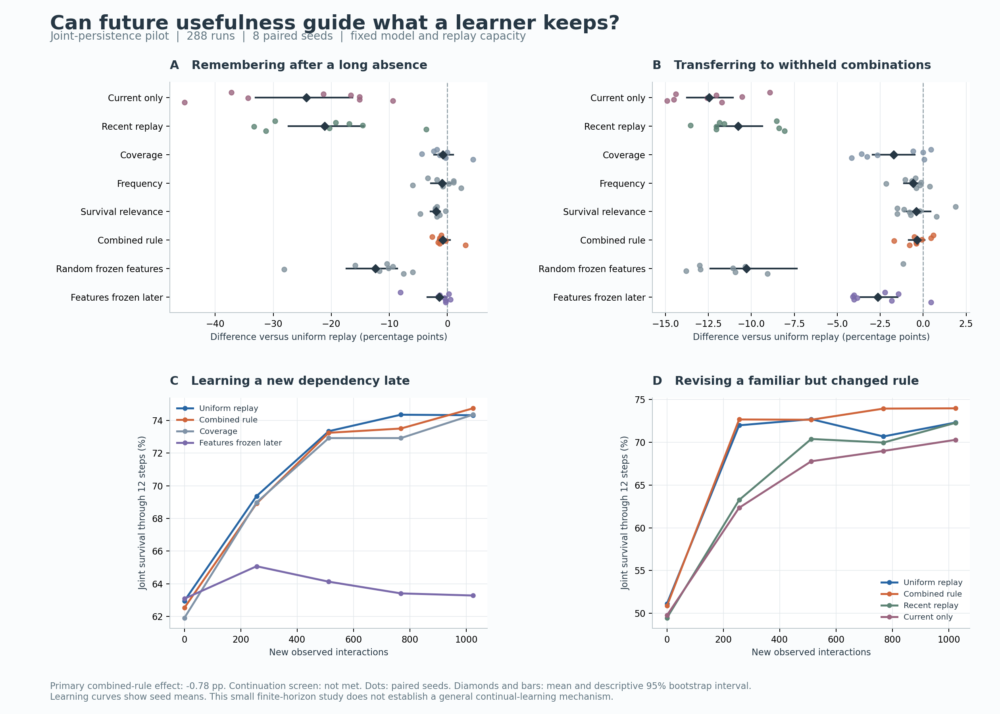

# Joint persistence: useful memory, but no advantage from the proposed selection rule

The first controlled experiment is complete: **288 comparative runs and 32
fresh late-learning references**, with eight paired seeds. The combined rule
based on past observation frequency and predicted survival relevance did not
outperform uniform replay on the predeclared primary endpoint. Its continuation
screen failed. This is a result about the implemented proxies and learning
recipe; it does not disprove the broader value of retaining knowledge for
recurring conditions.

The code, physical world, diagnostic controls, original configurations, source
archives, full curves and verification records are included. Existing ACP and
dual-path experiments remain intact.

## What was tested

One randomly initialized recurrent image predictor learns how a resource
transfer affects the probability that two participants remain functional.
Their supply advantage changes hands during each trial, so a donor must also
survive its later shortage. Resources are conserved, transfers can lose
resources or arrive too late, and survival is evaluated through 12 steps.

Every method receives the same records of randomized actions and their actual
outcomes. At evaluation, it selects an action using its learned predictions.
It receives no task labels, announced boundaries, future schedule or outcomes
of actions that were not performed. The four schedules test short and long
absences, a retired context replaced by a new combination, and an existing
relationship whose consequences reverse.

The tested intervention changes which experiences occupy 128 replay slots.
The proposed rule combines a coarse frequency estimate from observation
sketches with predicted sensitivity of survival to action. These are practical
approximations: neither estimates the causal value of retaining an individual
memory. Controls isolate coverage, frequency and relevance, alongside uniform
replay, recent replay, current-only learning and two frozen-feature diagnostics.

## Main result

On return after five intervening blocks, before any new updates:

- **Uniform replay: 74.06% joint survival.**
- **Combined rule: 73.27%.**
- Paired difference: **−0.78 percentage points**, with a descriptive paired
  bootstrap 95% interval of **−1.66 to +0.46**.
- The combined rule was better in **one of eight seeds** and tied the coverage
  control in its aggregate mean.

The interval includes zero, so this does not establish that the new rule is
universally worse. It provides no demonstrated advantage and fails the
predeclared +2-point/six-positive-seed continuation requirements. The baseline
did learn: its first four context endpoints averaged 9.42 points above the
no-transfer reference, passing the acquisition-adequacy check.

Long-gap schedule; all entries are percentages:

| Method | Survival when old condition returns | Final held-out combinations | Late learning AUC |
|---|---:|---:|---:|
| Current experience only | 49.74 | 61.75 | 63.86 |
| Recent replay | 52.93 | 63.44 | 66.32 |
| **Uniform replay** | **74.06** | **74.20** | **71.42** |
| Combined rule | 73.27 | 73.85 | 71.07 |
| Features frozen after initial learning | 72.66 | 71.57 | 63.95 |



The [complete tables and per-seed primary contrasts](persistence/summary.md)
include all nine methods and all four schedules. Secondary intervals are
exploratory and are not adjusted for multiple comparisons.

## What the experiment does tell us

**Keeping earlier experience was useful.** Uniform replay exceeded current-only
learning by 24.32 points when the dormant condition returned. Keeping only
recent experience also performed poorly. This supports retaining information
beyond what is immediately active in this world; it does not establish our
proposed method for estimating that information's future value.

**Continued feature adaptation helped with late novelty.** Uniform replay reached
74.32% survival after learning the late dependency, versus 63.28% when the frame
encoder and GRU were frozen after the initial four blocks. The matched controls
have identical trajectories before freezing. This supports keeping features
adaptable under this training recipe. It does not isolate one particular newly
created representation or establish indefinite plasticity.

**Adapting faster can still damage other useful knowledge.** In the reversal
schedule, the combined rule improved acquisition AUC by 1.14 points over
uniform replay, but reduced final survival in the other, still-valid familiar
conditions by 4.20 points. The obsolete target relationship is explicitly
excluded from that retention score. The small adaptation gain therefore does
not rescue the overall mechanism.

**The estimates are the next thing to question.** Historical sketch frequency
is not a forecast of when a relationship will apply again. Predicted action
sensitivity is not the marginal benefit of retaining a memory, and it can be
wrong precisely when the learner needs protection. These are plausible failure
points, not causes established by this experiment. The ablations did not
establish a superior selection rule.

## Limits that matter

This is a finite-horizon, one-transfer-per-trial prediction-and-control task.
It does not test open-ended interactive exploration, reproduction, inheritance,
or cooperation between independently motivated learners. The aggregate mean
resource input is below maintenance, so no indefinite survival claim is made.

The four initial training combinations correlate the supply direction with
the loss/delay glyph combination. The withheld combinations break that shortcut,
but the initial observations do not uniquely identify the causal interpretation
of each cue. Strong familiar-context performance is therefore insufficient
evidence of relational understanding. Removing temporal information reduces
uniform replay's final familiar-context survival by 8.06 points in the long
schedule; that is a sensitivity result, not proof of a causal representation.

The learner's GRU sees the four frames within each trial. It does not maintain
a separate recurrent state over previous trials' actions and outcomes. During
an unannounced rule reversal, adaptation must therefore occur through parameter
updates and replay, rather than explicit inference from such a history.

Replay methods have equal parameter counts, slot capacity, optimization steps
and network forward counts. Controls also compute unused sketches and memory
scores to match that work; an optimized uniform implementation could omit them.
Selection bookkeeping costs additional time. The long-schedule learning-plus-
selection time averaged 4.64 seconds for the combined rule versus 3.68 seconds
for uniform in this implementation. These timings are approximate local
measurements, not a strict matched-FLOP or general efficiency result.

Each model has 42,447 parameters. Full-learning replay methods use 169,788 bytes
of model tensor payload, 339,616 bytes of optimizer tensor payload and up to
126,464 bytes of replay/sketch/ID payload. Accounting excludes Python objects,
gradients, activations, allocator overhead and evaluator caches. Initial encoder
snapshots are separate diagnostics and are not available to learning.

## Decision and next research direction

**Keep uniform replay as the working reference; do not scale this priority rule.**
The useful design lesson is to preserve access to earlier information while
allowing representations to keep changing.

A stronger next hypothesis would concern *which relationship currently
applies*: infer from recent action/outcome history whether a familiar rule has
returned or its consequences have changed, and retain conditional knowledge
accordingly. Before another architecture comparison, remove the training-grid
shortcut and define a direct test of that inference. Adding more components
to the failed frequency/sensitivity score would not yet have an evidential basis.

That recommendation is a proposal for subsequent work, not an implemented or
validated solution. The experiment requested here is complete, including its
negative result.

## Verification and reproduction

The full suite passed **615 tests**, with two existing Windows symlink tests
skipped. Ruff passed. The new experiment passed CPU and CUDA smoke runs; the
existing legacy and v3 CPU smoke runs also passed. The scientific cohort ran
on CPU with one PyTorch thread. See the
[engineering record](persistence/engineering_verification.json).

The [checkpoint audit](persistence/audit.json) checked all 288 runs. It
regenerated training records, verified the actual replay contents against
observed arrivals, and recomputed nine final probes per run. The maximum
resource-accounting residual was 2.84e-14 units. Shared data, initialization,
historical counts and replay budgets were also audited. This is local
recomputation, not an independent replication.

The [protocol lock](persistence/protocol_lock.json) and
[original protocol](persistence/protocol_at_lock.md) preceded the comparison.
The [development ledger](persistence/development_ledger.md) preserves the weak
initial world, the justified benchmark revision, the shortcut limitation, and
a floating-point tie correction in analysis. No comparative training settings
were changed, no runs were excluded and no scientific runs were repeated to
improve outcomes.

Training source SHA-256:
`dd9eb69a45f475326e20c101b0fb7ef500e9d59ca9c69f75a0afbae5968a32f3`.

The [portable raw archive](persistence/archive.json.gz),
[training source](persistence/training_source.zip),
[analysis source](persistence/analysis_source.zip),
[manifest](persistence/manifest.json) and
[plot PDF](persistence/overview.pdf) preserve the evidence. Checkpoints remain
under `runs/persistence_pilot`, which is ignored by Git; procedural data can be
regenerated from the recorded seeds.

```powershell
.venv/Scripts/python.exe -m acp_cl.persistence.study --config configs/persistence_pilot.json --output runs/persistence_reproduction --device cpu
.venv/Scripts/python.exe scripts/summarize_persistence.py --input runs/persistence_pilot --output reports/persistence
.venv/Scripts/python.exe scripts/plot_persistence.py --archive reports/persistence/archive.json.gz --output reports/persistence/overview
.venv/Scripts/python.exe scripts/audit_persistence.py --input runs/persistence_pilot --output reports/persistence/audit.json
```

Use a new output path after source/configuration/runtime changes. For an
unchanged interrupted run, add `--resume`. Only load trusted local checkpoints.
