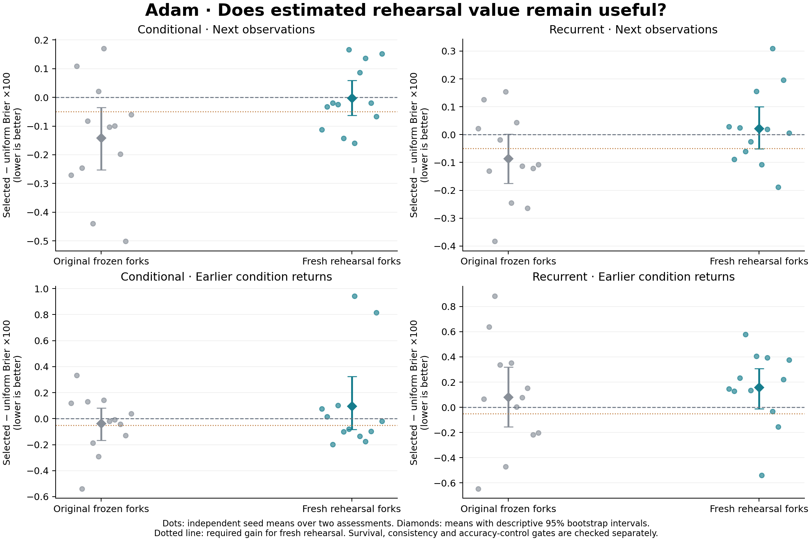

# Adam: does predictive rehearsal value remain useful?

Completed 2026-09-27 local time (2026-09-28 UTC). Both architectures fail
the fixed local and return criteria. The tested rule does not earn promotion
to an adaptive replay or retention policy. Its main lesson is a distinction
between selecting a useful frozen predictor and selecting an experience whose
rehearsal will remain useful as learning continues.

The full cohort completed without a scientific restart or parameter amendment:
24 trajectories, 48 assessments, 1,296 rehearsal forks and 503,808 ordinary
arrivals. Twelve fresh seeds per architecture provide the independent units;
each seed contributes the average of two assessments. The
[protocol](predictive_value/diagnostic/protocol_at_lock.md), source, configuration
and analysis were locked before fitting. All trajectories finished before
scientific outcomes were inspected. Earlier failed studies remain unchanged.

## What was tested

The ordinary learner learns from scratch with an unchanged uniform reservoir
of 16 causal experience packets. Each assessment samples eight candidate
packets and one common replacement using a separate random generator.
An isolated copy of the actual weights, Adam state and gradients rehearses
each packet for 12 updates, paired equally with the latest observed packet.
The resulting predictors are frozen and scored on the next 512 arrivals.

The proposed value is the reduction in future Brier prediction error relative
to rehearsing the replacement. Selection chooses the best of eight candidates.
With one common replacement this is also the most accurate candidate predictor
on that scoring window; those are the same ranking, not separate controls.
The distinct simple control chooses the packet with lowest error recorded
before its original training update. Uniform selection is the exact mean of
candidate losses, not the loss of averaged predictions.

Selection is sealed before validation. The primary test then applies the same
rehearsal recipe to fresh copies of the now-updated ordinary learner, using
the chosen packet and latest anchor. It measures 512 next observations and,
after either 512 or 4,096 intervening arrivals, 512 observations from an earlier
condition. Both gaps occur in each trajectory in counterbalanced order.
Secondary panels retain the original frozen predictors. All predictors see
the same causally available context; no true condition labels enter selection.

This estimates **the value of extra rehearsal relative to a replacement**.
It does not erase a packet's past influence, change the ordinary learning
trajectory, or test deletion of memories. The diagnostic temporarily retains
candidate packets even if ordinary replay later evicts them.

## Primary result

Brier differences below are multiplied by 100; lower favors value selection.
Survival differences are percentage points. Intervals are descriptive 95%
paired seed bootstrap intervals, using 20,000 resamples. The fixed criteria
require Brier improvement of at least 0.05 on this displayed scale, improvement
in at least 9/12 seeds, mean Brier no worse than original-error selection, and
mean survival loss no greater than 0.5 percentage points.

| Architecture | Validation | Value minus uniform Brier [interval] | Improved seeds | Value minus original-error Brier | Survival minus uniform | Decision |
|---|---|---:|---:|---:|---:|---|
| Conditional | Next observations | -0.0030 [-0.0625, +0.0585] | 8/12 | -0.0568 | -0.0092 | Fail |
| Conditional | Earlier condition returns | +0.0956 [-0.0824, +0.3249] | 7/12 | +0.0971 | -0.0682 | Fail |
| Recurrent | Next observations | +0.0224 [-0.0506, +0.1008] | 5/12 | -0.0042 | +0.0417 | Fail |
| Recurrent | Earlier condition returns | +0.1579 [-0.0125, +0.3080] | 3/12 | +0.0896 | -0.1668 | Fail |

Both local tiers fail the gain and consistency criteria. Both return tiers
also lose to original-error selection on mean Brier. Every survival guardrail
passes. All four primary Brier intervals cross zero: failed practical criteria
are not proof of universal harm or equivalence to uniform replay. The uniform
reference errors are .07681/.14477 conditional and .07825/.34701 recurrent
for next/return observations, respectively.

The original-error control itself has no consistent advantage over uniform
selection. Its mean next/return differences on the same displayed scale are
+0.0538/-0.0016 conditional and +0.0266/+0.0683 recurrent. The failure does not
justify promoting that cheaper control. Every seed, control, interval and
decision is retained in the [complete summary](predictive_value/diagnostic/summary.md)
and [machine-readable analysis](predictive_value/diagnostic/summary.json).

The figure is also available as [SVG](predictive_value/diagnostic/predictive_value.svg)
and [PDF](predictive_value/diagnostic/predictive_value.pdf). Gray points describe
the original frozen predictors; teal points are the primary fresh rehearsals.
The dotted line is one required criterion, not the complete decision rule.

## What the secondary comparisons clarify

Original frozen predictors retain more next-window selection benefit:

| Architecture | Frozen next-window Brier difference x100 [interval] | Improved seeds | Change in selection advantage after reapplication x100 [interval] |
|---|---:|---:|---:|
| Conditional | -0.1417 [-0.2522, -0.0346] | 9/12 | +0.1386 [+0.0216, +0.2382] |
| Recurrent | -0.0862 [-0.1745, +0.0015] | 8/12 | +0.1086 [+0.0116, +0.2052] |

The last column compares two selected-minus-uniform contrasts, each within
its own candidate family. It is not the raw performance difference between
the two selected models. The secondary finding is consistent with usefulness
depending on learner state and the accompanying update. Reapplication changes
parent weights, optimizer state and the anchor together; this experiment
cannot assign the effect to one of them. Frozen results remain secondary and
do not replace the failed primary criteria.

Returning-condition candidates occur in 19/24 assessments per architecture.
All assessments, including the five without one, remain in the estimates.
Conditional value selection chooses a return-origin packet in 0/24 assessments;
recurrent selection does so in 3/24. Uniform selection would choose one in
15.625% of assessments in expectation. Origin is an evaluator label, not a
guarantee of usefulness: another packet could help through shared structure.
This pattern describes the preference induced by present-condition scoring;
it does not establish that missing old examples caused each failure.

The five missing-coverage assessments all have short gaps. Both architectures
have returning-condition candidates in every long-gap assessment, yet their
long-gap return means are worse: +0.2167 conditional and +0.2676 recurrent
Brier x100, versus -0.0256 and +0.0482 at short gaps. These are descriptive
comparisons: gap length also changes learning exposure, arrival position and
candidate age. They do not isolate the passage of time.

Candidate predictions are differentiated in the observed validation windows.
An oracle that chooses the best candidate using those validation outcomes has
mean Brier advantages over uniform of 0.2766/0.4976 conditional and
0.2239/1.0243 recurrent x100 for next/return windows. Those optimistic,
nondeployable values show observed candidate variation, not proven achievable
headroom. They cannot rescue the tested selector.

The original-error control also reflects learner maturity. Its selected packets
have mean ages of 179.5 conditional and 132.9 recurrent packets, compared with
226.8 for uniform choice; mean original optimizer steps are 3,354 and 3,913.5,
versus 2,786.1 for uniform. Low original error is not an intrinsic property of
an experience. Complete cue, gap, assessment-order, initial-packet and later-
packet comparisons are preserved in the analysis rather than used to select
a favorable subset.

After inspecting these primary failures, we specified one separate
[retrospective ranking diagnosis](predictive_value_checks/rank_stability/results.md).
It uses the already saved candidate losses, adds no training or tuning, and
has no continuation criteria. Tied-average Spearman correlations compare
the eight candidates' loss rankings; correlations are averaged across the two
assessments within each seed. Positive one means identical ordering, zero
means no monotonic agreement, and negative one means reversed ordering.

| Ranking comparison | Conditional mean correlation | Recurrent mean correlation |
|---|---:|---:|
| Scoring window to next window, frozen predictors | +0.3690 | +0.3681 |
| Scoring window to next window, fresh rehearsals | +0.1200 | +0.0050 |
| Scoring window to return, frozen predictors | +0.0506 | -0.0933 |
| Scoring window to return, fresh rehearsals | +0.0169 | -0.0813 |

All 48 assessments remain included; no constant or tied cohort vectors occur.
The near-window frozen rank means are positive in 10/12 seeds for each model.
Return rankings already have little agreement with frozen predictors, so
changed learner state cannot explain the entire return failure. The exploratory
pattern is consistent with both state-dependent rehearsal effects and changing
conditions/context. Neither contribution is causally isolated. Its separately
dated design, source, checks and raw-input hash are preserved, and the primary
decisions remain unchanged.

## Consequence for the hypothesis

The user's idea asks whether predictive usefulness can guide what a learner
retains. This experiment separates four things: an experience being easy to
predict, its rehearsal helping a fixed model, the same rehearsal helping a
later model, and a retention policy improving a continuing learning trajectory.
Evidence for one does not establish the next.

The working mathematical object should remain conditional:

    value(packet | learner state, optimizer state, context, update, future window).

The present results do not support storing one score as a persistent importance
label. They also do not establish that every state-dependent estimator must
fail. The fixed decision is to stop expansion of this recipe, keep ordinary
uniform replay as the working reference, and avoid retuning the dose, pool or
windows on these seeds. Any later mechanism needs a new protocol and fresh
evaluation. A useful causal question would separate changed weights, optimizer
state and anchor while holding the evaluation observations fixed, before trying
another adaptive memory policy.

The clean synthetic schedule, two assessments per trajectory and unchanged
physical horizons H=4,8,12 do not test corruption, obsolete relationships,
autonomous transition detection, memory eviction, longer planning horizons
or compounding lifelong representation learning. No fresh-model qualification
arm was needed for this score diagnostic, but earlier architecture qualification
does not establish generality to other worlds.

Data valuation and validation-guided updates have substantial precedent,
including [Learning to Reweight Examples](https://proceedings.mlr.press/v80/ren18a.html),
[Data Shapley](https://proceedings.mlr.press/v97/ghorbani19c.html), and
[Adam-aware in-run attribution](https://arxiv.org/abs/2602.00329).
The [focused primary-source review](../docs/predictive_value_related_work.md)
places this diagnostic among those approaches. This study does not establish
a novel general learning algorithm.

## Verification, cost and reproduction

The implementation and checks use separate agents for mechanism verification,
scientific analysis, independent tensor reconstruction and portable arithmetic.
All 140 scoped tests pass: 37 mechanism, 12 runner/resumption, 32 summary,
18 audit and 41 portable-verifier tests. Scoped Ruff checks pass. The engineering
smoke is disjoint and cannot pass scientific criteria.

The complete tensor audit passes: 336 before and 336 final checkpoints,
1,296 independently recreated rehearsal forks, and all 34,560 diagnostic
prediction calls. A separate statistical review independently reproduces all
48 assessments, raw prediction arithmetic and 272 paired metric summaries.
The auditor reconstructs causal data, replay and history, and recomputes all
phase-start original predictions. It does not independently retrain every
ordinary update; other historical prequential errors are recomputed from saved
arrays with provenance checks. It verifies causal dependencies, not historical
wall-clock file-creation order. These are reproducibility checks, not another
scientific cohort.

| Resource | Scientific cohort total |
|---|---:|
| Ordinary arrivals | 503,808 |
| Ordinary Adam updates | 188,928 |
| Additional rehearsal updates | 15,552 (8.23% of ordinary updates) |
| Additional rehearsal forward calls | 31,104 |
| Ordinary prequential forward calls | 15,744 |
| Diagnostic prediction calls | 34,560 |
| Candidate bundle storage per assessment | 444,672 bytes |
| Explicit tensor storage per copied learner | 1,889,960--1,890,328 bytes |

The run used six single-thread CPU workers, up from four, with actual affinity
mask 1365. Lock-to-completion wall time was 478.3 seconds; the full audit took
87.0 seconds. These are host observations, not a comparative speed benchmark.
Copied-state accounting is not measured peak RAM. Extra prediction, copying,
checkpoint and selection work remains material beyond optimizer-step counts.
Uniform and original-error selectors would not require all the discarded
scoring work in deployment, so this diagnostic does not establish equal-cost
policy superiority. Full counters are in
[resource totals](predictive_value/diagnostic/resource_totals.json).

All 1,326 run files pass JSON/ZIP integrity checks. Each portable cohort includes
raw records, checksums, source/protocol/analysis snapshots, audits and a standalone
NumPy verifier. Its independently developed source/tests were explicitly excluded
from the scientific lock and sealed separately; they cannot alter the metrics
or criteria. The [archive index](predictive_value/README.md) and
[reproduction instructions](../docs/reproduction.md) give exact commands.
All 655 report files captured before this study remain unchanged.
