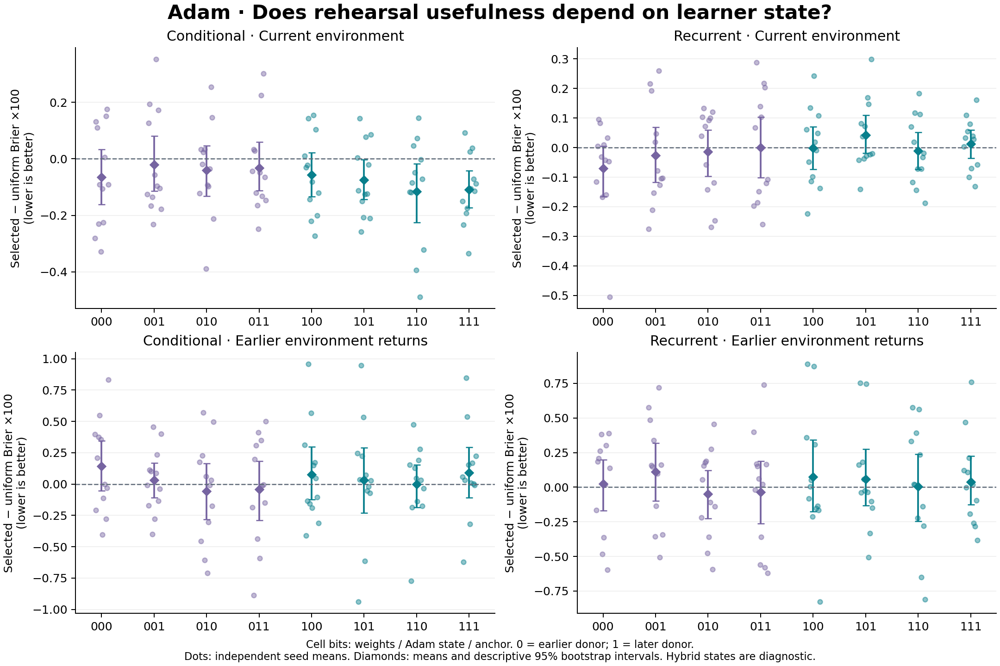

# Adam: memory usefulness across learner states and environments

Completed 2026-09-27 local time (2026-09-28 UTC). **The earlier deterioration
in memory-selection usefulness did not meet the fixed replication criteria in
either architecture.** The conditional model's average moved in the opposite
direction; the recurrent model met the magnitude requirement but missed the
seed-consistency requirement. Both intervals include zero. We therefore keep
component effects descriptive and do not claim to have located a general cause
of the earlier failure or discovered a beneficial state reset.

This does not establish that memory value is independent of learner state or
environment. It weakens the more specific story that continued learning reliably
destroys the usefulness of the previous selection in this testbed. A conditional
definition of value remains appropriate; a dependable estimator and a useful
continual-learning policy remain unproven.

All 24 trajectories, 48 assessments and 3,456 short rehearsal forks completed
on fresh seeds 15001--15012, without a scientific restart or parameter amendment.
The [protocol](rehearsal_state/diagnostic/protocol_at_lock.md), source, configuration,
runtime and analysis were locked before fitting. No main outcomes were inspected
until all trajectories finished. Earlier studies and their decisions remain
unchanged. The [complete tables](rehearsal_state/diagnostic/summary.md) and
[numerical analysis](rehearsal_state/diagnostic/summary.json) preserve every arm.

## What changed in this experiment

The ordinary learner starts with randomly initialized representations and keeps
its uniform 16-packet replay reservoir. At each assessment, eight candidate
memories and one common replacement receive 12 extra rehearsal updates in
isolated learner copies, paired equally with the latest causal experience
packet, called the anchor. Frozen candidate predictors are scored on the next
512 arrivals. That score chooses one memory before validation is observed.

Meanwhile the ordinary learner learns those 512 arrivals. We then construct all
eight combinations of earlier/later **weights, complete Adam optimizer state,
and anchor**. Cell bits follow that order: 000 is all earlier; 111 is all later.
The 000 copies reuse the original score predictors. The 111 active state matches
normal rehearsal from the later learner. Other combinations are controlled
counterfactuals. Their inactive replay, history and bookkeeping stay fixed, and
none of these comparisons changes the ordinary training path.

Every frozen family faces the same next 512 observations and performed actions
under two physical laws: continuing current conditions and an earlier condition
returning. Both branches start with identical actual history; subsequent context
uses each branch's own preceding feedback. Only current-branch data trains the
ordinary learner. Thus the environmental contrast includes changed outcomes and
causal context adaptation, without intervening training or unequal return gaps.
Two zero-update references, outside the candidate pool, provide a comparison
against performing no additional rehearsal.

There are two assessments within each of twelve independent seeds per
architecture. We average those assessments before calculating seed uncertainty.
All intervals below are descriptive 95% bootstrap intervals with 20,000 resamples.
They do not turn the many secondary comparisons into separate discovery tests.

## Primary replication result

Let D be selected-memory Brier minus the exact mean Brier over candidate
memories. This uniform reference averages losses, not predictions. Lower D
favors the selected memory. The fixed primary contrast is T = D111 - D000 in
the current environment. Positive T means selection's relative usefulness
deteriorated. The screen requires mean T >= .0005 and positive T in at least
9/12 seed means. It is an allocation criterion, not a significance test.

All Brier differences in this table are multiplied by 100.

| Architecture | Earlier-state D000 [interval] | Later-state D111 [interval] | T [interval] | Positive T seeds | Replication |
|---|---:|---:|---:|---:|---|
| Conditional | -0.0651 [-0.1612, +0.0329] | -0.1090 [-0.1736, -0.0428] | -0.0439 [-0.1399, +0.0406] | 6/12 | Fail |
| Recurrent | -0.0699 [-0.1655, +0.0054] | +0.0126 [-0.0352, +0.0598] | +0.0825 [-0.0048, +0.1790] | 8/12 | Fail |

The recurrent result is directionally consistent with the previous observation,
but 8/12 cannot replace the specified 9/12. The conditional result does not
replicate the earlier direction. Neither result proves absence of state effects,
and a favorable conditional D111 does not retroactively rescue the earlier
failed policy criteria. The current study did not declare a new policy gate.

[SVG](rehearsal_state/diagnostic/state_cells.svg) and
[PDF](rehearsal_state/diagnostic/state_cells.pdf) versions preserve the figure
for export. Dots are the twelve seed means, not 24 independent assessments.

## Better selection is not necessarily better learning

The conditional model illustrates this distinction directly. From 000 to 111,
selected absolute Brier rises from .0733158 to .0739026. Uniform-candidate Brier
rises more, from .0739663 to .0749923, making D look better even though the
selected predictor's mean error is higher. These absolute changes themselves
are uncertain; the arithmetic explains the contrast without establishing harm.

At 111, the selected conditional predictor has almost the same current-branch
error as its later-weight zero-update reference: .0739026 versus .0739107.
Their paired difference is -.0000081, with interval [-.0019202, +.0019820].
For recurrence it is .0737296 versus .0732637, a difference of +.0004658
[-.0006073, +.0016236]. Neither supplies clear evidence that paying for the
selected extra rehearsal improves on doing no extra rehearsal.
Both zero-update references already benefited from ordinary uniform replay;
this comparison does not test removing replay from continued learning.

The complete factorial includes all conditional substitutions, averaged main
effects, pair interactions and the three-way interaction. Its prespecified
single-component reversions have the following current-branch means; all
differences are 111 minus the corresponding reverted cell, Brier times 100.
Positive numbers mean the reversion reduces that error or selection contrast.

| Architecture | Revert earlier component | Change in D | Change in selected absolute Brier |
|---|---|---:|---:|
| Conditional | Weights | -0.0773 | -0.2349 |
| Conditional | Adam state | -0.0343 | +0.0255 |
| Conditional | Anchor | +0.0063 | -0.0081 |
| Recurrent | Weights | +0.0126 | -0.2457 |
| Recurrent | Adam state | -0.0303 | +0.0319 |
| Recurrent | Anchor | +0.0240 | +0.0213 |

All six D intervals include zero. Reverting recurrent weights slightly improves
the mean ranking contrast while worsening selected absolute error by .002457;
that error increase has a descriptive interval [.000282, .004657]. Conditional
weight reversion also worsens mean selected error. Restoring old optimizer
state slightly improves mean selected error in both models while worsening
their selection contrast. These are incompatible with a simple rule that
the component with a favorable ranking effect should be restored.

Mixed weights and optimizer moments can be poorly aligned, and anchor effects
include their original causal support. These artificial states do not identify
a unique natural contribution of each component. No finite hybrid was excluded.
The [reversion figure](rehearsal_state/diagnostic/state_reversions.png), complete
intervals and survival contrasts are available with the analysis. For survival,
a positive 111-minus-reverted difference means the reversion loses survival;
its interpretation is opposite to a positive error-reduction contrast.

## Environment and coverage

Selected-versus-uniform Brier on the returning branch remains uncertain and
unfavorable on average at both endpoints:

| Architecture | Returning D000, Brier x100 [interval] | Returning D111, Brier x100 [interval] |
|---|---:|---:|
| Conditional | +0.1412 [-0.0533, +0.3474] | +0.0905 [-0.1094, +0.2940] |
| Recurrent | +0.0235 [-0.1691, +0.1984] | +0.0392 [-0.1271, +0.2268] |

With 111 fixed, candidate-rank correlation between current and returning
environments averages only +.0397 conditional and -.0218 recurrent. Original
score-to-validation correlations are +.1885/+.0427 conditional and
-.0040/+.0823 recurrent for current/return branches. These declared descriptive
rank summaries are consistent with poor transport of a single ranking across
conditions. They do not separate physical-law effects from subsequent feedback,
establish a deployable replacement score, or eliminate finite-window uncertainty.

Only 10/24 assessments per architecture contain an exact return-origin
candidate; all 24 remain included. The predictive selector chooses such a
candidate in 0/24 assessments for either model. That coverage limitation matters
when interpreting returns, but origin does not guarantee usefulness and cannot
be used to excuse or remove unfavorable assessments. The previous cohort had
different coverage and timing; cross-study changes are not paired causal effects.

Conditional 111 return error falls from .4150 on the first packet to .1764 on
the remaining packets; recurrent error falls from .4208 to .3524. Parameters
remain frozen during these forecasts, so this is compatible with context
adaptation and changing packet difficulty, not proof of new weight learning.
The physical horizons remain H=4,8,12. No longer planning or lifetime compounding
benefit is established.

## Consequence for the next mechanism

The appropriate mathematical object remains conditional:

    V(m | S, E, U) = expected loss after U(S, replacement), in E
                   - expected loss after U(S, m), in E.

Here S includes weights, optimizer and available context; U is the specified
learning update; E describes evaluation conditions and their feedback. This is
a definition of marginal rehearsal value under a comparison, not an intrinsic
importance label or an algorithm that can observe an unknown future environment.
Retaining an experience, rehearsing it and preserving its learned prediction
are distinct interventions.

We will not expand the cached-score/rollback branch or choose a component from
the secondary tables. Uniform replay remains the working reference. The next
bounded direction is an architectural comparison: a previously learned reusable
core with a small adaptive pathway that can learn new features from observations,
against the identical-capacity architecture trained jointly. Both should begin
from the same prefix learned from random initialization, retain uniform causal
replay, and use matched learning exposure. The adaptive path must be able to
learn representations, rather than only remix fixed features.

This builds on the earlier positive conditional-reuse evidence while directly
testing the unresolved acquisition problem. It also avoids the original
dual-path pilot's randomly initialized stable predictor by starting from a
common learned prefix. That is a proposed design change, not proof that it
fixes the earlier failure. The new study must introduce a genuinely unseen
dependency during continued learning and jointly assess new acquisition,
valid-old retention and return behavior on fresh data. Fixed capacity and
compute accounting are essential; a branch that merely adds capacity is not
evidence for the proposed division of learning.

An additional extra-rehearsal dose study is not a prerequisite unless that
new mechanism actually adds rehearsal work. The current zero references show
why the extra 12-step selection recipe should not be assumed beneficial.
The architecture proposal remains unimplemented and unvalidated by this study.
Even success would not establish indefinite learning, a privileged relational
representation, critical-period development or compounding lifelong advantage.

## Verification, resource costs and reproduction

The scoped suite passes **172 tests**: 60 mechanism, 17 runner/resumption,
23 analysis, 20 tensor audit and 52 portable-verifier tests. Scoped Ruff checks
pass. The disjoint engineering smoke is ineligible for scientific decisions.
Its two trajectories and the full diagnostic were independently reconstructed.

All 2,334 full-run files pass integrity. The tensor auditor checks 240 before
and 240 final ordinary checkpoints, 48 diagnostic boundaries, 3,456 rehearsals,
96 zero-update copies and every one of 120,576 diagnostic prediction calls.
It verifies full Adam transplantation, gradients, parameter ownership, unchanged
ordinary replay/history, 000/111 endpoints, paired physical outcomes, causal
feedback and 12,096 loss-instrumentation forwards. It does not independently
retrain every ordinary learning update; only phase-start original forecasts
are recreated from historical weights, while other original errors are checked
against stored arrays. Audit dependencies do not prove historical file-creation
order. These checks are not a second scientific cohort.

A [separate numerical review](rehearsal_state_checks/independent_review/diagnostic.json)
uses only NumPy and the standard library. Its unchanged smoke-validated script
reconstructs 480 NPZ arrays, 54,558,720 probabilities, all 23 factorial contrasts
and 3,408 seed/bootstrap statistics. Across 213,775 scalar comparisons the
largest discrepancy is 7.22e-16. Both replication decisions match independently.
The [pre-outcome interpretation review](rehearsal_state_checks/interpretation_review.md)
records the limits before the scientific outcomes were opened.

The [portable evidence](rehearsal_state/README.md) carries numerical arrays,
original JSON and hashes, source, protocol and analysis snapshots, audits and
figures. Its independent verifier/tests were explicitly excluded from the
scientific lock and sealed separately. It recomputes arithmetic and checks
tensor-audit coverage without importing the repository or loading model pickles;
it does not rerun training or the physical simulator. Descriptive rank/cue
summaries and figures are checksummed but not independently recalculated by
that verifier.
Both archives pass verification in place and from copies outside the repository
using isolated Python and their copied standalone verifiers. The smoke contains
67 sealed artifacts and the diagnostic 507; original and copied manifest hashes
match. The [external diagnostic check](rehearsal_state_checks/portable_diagnostic_external.json)
records the independent execution. Read-only audits changed no run-file bytes.

Scientific fitting used six single-thread CPU workers with affinity 1365 and
took 592.62 seconds including the lock launch; tensor reconstruction took 212.87
seconds. Ordinary learning consumed 442,368 arrivals and 165,888 Adam updates.
The diagnostic adds 41,472 Adam updates (25% of that update count), 82,944
rehearsal training forwards, 120,576 frozen prediction forwards and 12,096
instrumentation forwards. The 25% update ratio is not a runtime-overhead claim.

Each assessment retains 444,672 explicit candidate-packet bytes. A full learner
copy records 1,890,328 explicit tensor bytes conditional or 1,889,960 recurrent,
including model, optimizer, gradients, initial encoder, replay and history.
Aliases can be conservatively double counted; these figures exclude graphs,
workspaces, Python objects and allocator overhead and are not measured peak RAM.
The selected score did not receive a discount for its expensive diagnostic work.

See the [reproduction commands](../docs/reproduction.md#rehearsal-state-and-paired-environments).
The two cohort archives are sealed. Earlier research is preserved byte for byte:
979 source/config/protocol/report files, including 720 report files. Final
preservation records and the engineering ledger live in
[rehearsal_state_checks](rehearsal_state_checks/engineering_ledger.json).
