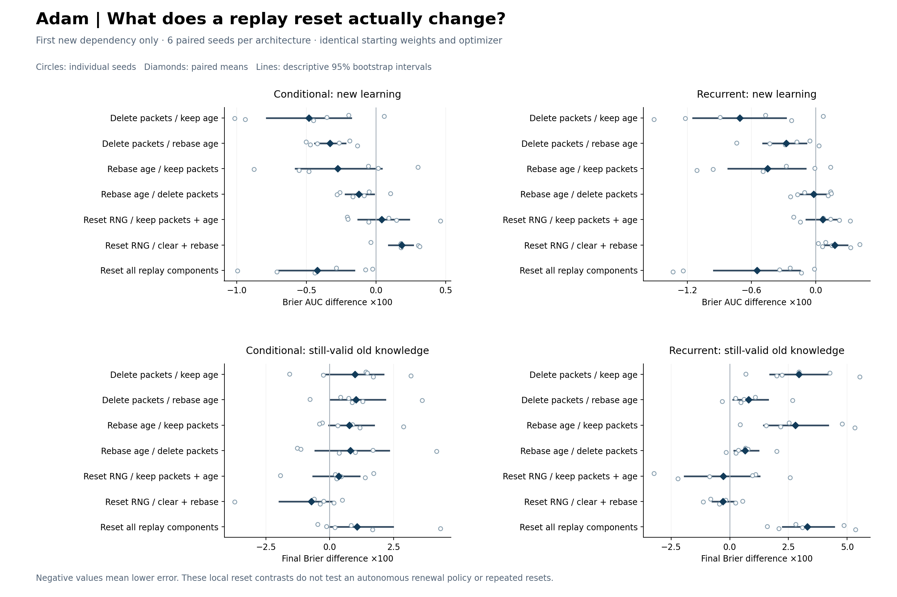
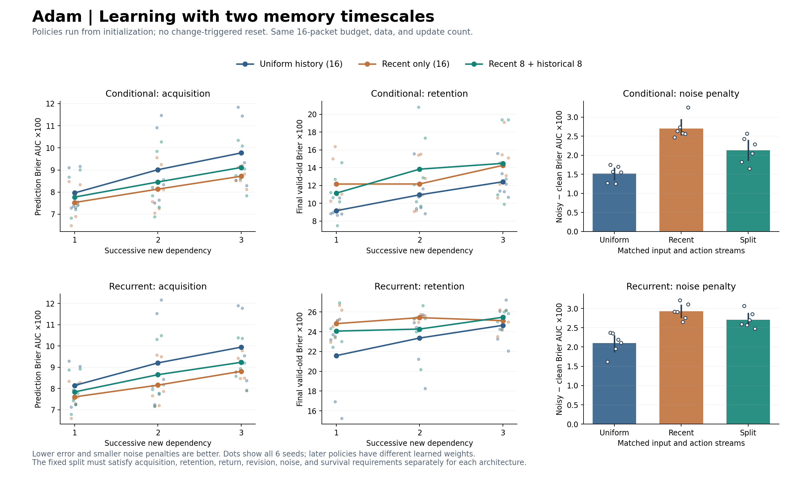
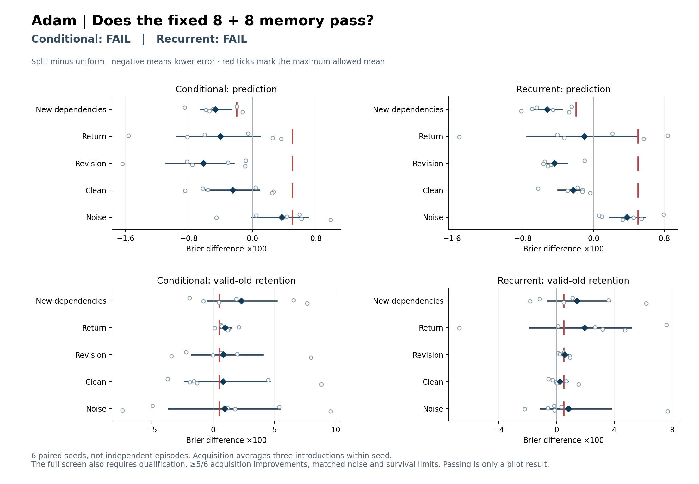

# Adam: replay renewal under changing conditions

Status: both fixed cohorts completed and audited; 48 prefix fits and 372
challenge episodes. All saved-file integrity checks passed.

**The fixed recent-8/historical-8 policy improves acquisition in every seed,
but fails the combined retention and noise screen in both architectures.**
Packet deletion and faster reservoir replacement each contribute to the local
reset benefit. A simple equal memory split does not resolve the resulting
tradeoff. Uniform replay remains the working comparison baseline.

Adam is the working project name; **Adaptive Dynamics and Associative Memory**
is an optional expansion. The name does not denote the Adam optimizer, which
is held constant in these experiments. Existing `acp_cl` package paths preserve
compatibility with the earlier studies.

The [previous diagnostic](training_state_results.md) found that resetting
replay accelerated new-dependency learning, but could hurt retention and noise
resistance. That operation simultaneously removed stored experience, restarted
the reservoir replacement denominator, and reset random generators. The new
work asks which of those changes matters and whether continuous memory renewal
can achieve a better tradeoff without receiving change signals.

## Two fixed experiments

Both experiments were specified and source-locked before either main cohort.
Their [protocol](../docs/replay_renewal_protocol.md),
[analysis snapshot](replay_renewal/analysis_at_lock.json), and
[attempt ledger](replay_renewal/study_ledger.md) preserve that ordering. The
first experiment does not select or tune the second.

**Reset decomposition:** six new seeds (9001--9006), two architectures, 12
shared prefix fits and 84 episodes at the first new dependency. Six learned
arms share exact weights, optimizer state and recent history: keep all replay;
delete packets only; rebase effective reservoir age only; delete and rebase;
reset random generators only; reset all three replay components. A seventh
reference learns from the original random weights with the same recent history.
This is a local first-introduction diagnosis, not a test of repeated resets.

**Continuous policy comparison:** six different seeds (10001--10006), both
architectures, 36 prefix fits and 288 episodes. Uniform replay keeps 16
reservoir packets; recent-only keeps the latest 16; split keeps the latest 8
plus a reservoir of 8 older, disjoint packets. Each policy operates from random
initialization through its own three-introduction trajectory. Four independent
final branches test return, revision, clean continuation and noisy continuation.
There are 36 fresh-weight learning references in the episode count.

All policies train on the same observations and performed actions, use the
same 16-packet capacity, and take the same number of optimizer steps. A policy
always replays one packet per current-packet update. No learning state is reset
at a policy boundary. Their initial weights match, while their later learned
weights intentionally differ. The fixed split is equal allocation, not a
hyperparameter-sweep winner. The [sampler note](../docs/replay_memory_mechanism.md)
gives its probabilities and expected packet ages.

The unchanged conserving world asks two participants to persist under uncertain
conditions. Three initially irrelevant image cues become useful for predicting
transport efficiency, arrival delay and supply timing. All six introduction
orders occur once per main cohort. The encoder learns from scratch; physical
law labels and evaluation counterfactuals are unavailable to ordinary training.

Each challenge supplies 8,192 arrivals, 3,072 optimizer steps and evaluations
every 256 arrivals. Prefixes have four alternating 1,024-arrival blocks. Clean
and noisy final branches share inputs, actions and underlying physical outcomes;
the noisy branch replaces reported survival vectors with probability .2. This
is a report-replacement rate, not a guarantee that 20% of individual labels flip.

## Measures and decision rule

Primary acquisition is affected-subset Brier error integrated over an episode.
Lower is better. Valid-old error measures predictions on still-valid physical
subsets, using correct supporting observations. For the continuous comparison,
the retention guardrail uses the **terminal error level**, because different
policies may start a challenge with different errors. Within-episode damage is
also reported. Survival evaluates the chosen transfer action separately from
the prediction score.

Brier values in the tables and figures are multiplied by 100 for readability;
they are not survival percentage points. Three introduction episodes are
averaged within each seed before policy contrasts. There are six independent
seed replicates per architecture, not hundreds of independent episodes. The
20,000 paired-seed bootstrap intervals are descriptive and unadjusted for
multiple comparisons.

The split policy must improve acquisition by at least .002 Brier in the mean
and improve at least five of six seeds. Terminal valid-old error may rise by
at most .005 across introductions. Each final branch must also stay within
.005 for prediction and terminal retention. Its extra noisy-minus-clean
prediction penalty versus uniform must be at most .005. Mean survival may
decline by at most one percentage point across introductions and separately
in every final branch. Each architecture must independently pass fresh-model
qualification: marginal prediction gain >=.02 and correct-cue benefit >=.002
in every available stage and cue group.

These are prospective pilot thresholds, not universal tolerances or a
noninferiority test. Passing would nominate independent confirmation; failure
rejects this fixed policy under the declared screen. Neither outcome establishes
or rules out general continual learning, explicit relational representations,
or a biological sleep mechanism.

## Results

### Reset decomposition

All 84 episodes completed, and all eight fresh-reference qualification groups
passed. The weakest correct-cue group was conditional arrival-delay learning:
.005326 against the .002 threshold, with only two seeds in that cue group.
The recurrent delay result was .009882. Grouped marginal gains all exceeded
.137. These two-seed cue checks are weaker evidence than the six-seed stage
check and should not be treated as precise estimates.

**Both packet deletion and reservoir-age rebasing contribute to faster
acquisition in the factorial averages. They also cost older knowledge.**
Resetting random generators is not the source of those gains. Full contrasts,
intervals and individual seeds are in the
[decomposition summary](replay_renewal/decomposition/summary.md).

| Factorial contrast | Conditional acquisition | Recurrent acquisition | Conditional valid-old error | Recurrent valid-old error |
|---|---:|---:|---:|---:|
| Packet deletion main effect | −0.407 | −0.492 | +1.010 | +1.868 |
| Reservoir-age rebasing main effect | −0.199 | −0.235 | +0.785 | +1.723 |
| Deletion × rebasing interaction | +0.152 | +0.432 | +0.040 | −2.146 |
| Random-generator reset alone | +0.039 | +0.067 | +0.350 | −0.278 |
| Random-generator reset after deletion + rebasing | +0.184 | +0.178 | −0.719 | −0.292 |
| Full reset minus keeping replay | −0.422 | −0.549 | +1.075 | +3.299 |

Values are Brier ×100; negative acquisition and valid-old differences are
better. Each main effect averages its two settings of the other factor. The
packet-deletion acquisition intervals are [−0.575, −0.242] conditional and
[−0.754, −0.210] recurrent. Rebasing intervals are [−0.387, −0.029] and
[−0.426, −0.044]. The positive recurrent acquisition interaction indicates
less-than-additive benefit from combining these changes.

The isolated contrasts retain nuance. Deleting packets while keeping the old
replacement denominator improves acquisition in five of six seeds for each
architecture: −0.483 [−0.786, −0.181] conditional and −0.708
[−1.146, −0.280] recurrent. Rebasing while keeping packets has a conditional
estimate of −0.275 [−0.577, +0.040], whose interval crosses zero, and a
recurrent estimate of −0.452 [−0.818, −0.094]. The factorial mean evidence
does not make every isolated contrast conclusive.

Keeping replay ends with an average 5 original-prefix packets among the 16
stored; rebasing alone ends with 0.83. These are six memory realizations shared
by the two architectures, not twelve independent samples. Mean final packet
ages are 182.9 and 140.3 batches respectively. Deletion with the old denominator
has mean age 161.4; deletion plus rebasing has mean age 126.6. Clearing a buffer
and changing its subsequent replacement rate therefore have distinct effects
on the remembered sample.

Resetting generators alone has acquisition intervals crossing zero in both
architectures. After deletion and rebasing, resetting them instead worsens
acquisition by +0.184 [+0.090, +0.265] and +0.178 [+0.073, +0.297]. This is
evidence about these particular coupled replay draws, not a universal rule
against resetting randomness.

Full reset improves acquisition in all six seeds per architecture, but raises
mean terminal valid-old error. Conditional forgetting is not uniformly improved:
this first-introduction cohort has a retention cost, unlike the favorable
conditional average across three introductions in the previous study. Different
seeds and stage scope prevent interpreting that comparison as a controlled
stage-effect estimate. The current recurrent retention cost occurs in all six
seeds. Even the keep arm deteriorates from its prefix valid-old error: +1.165
conditional and +7.941 recurrent, before the additional reset cost.

This result diagnoses the replay tradeoff. It neither nominates the fastest
reset as a policy nor changes the already-locked continuous comparison.

### Continuous policies

All 288 episodes completed without retries. Both architectures pass all twelve
fresh-reference stage/cue groups. Conditional and recurrent delay-cue benefits
are .004752 and .003653 against .002; the smallest grouped marginal gain is
.146057 against .02. The
[full policy summary](replay_renewal/policy/summary.md) and
[structured comparisons](replay_renewal/policy/summary.json) preserve every seed,
stage, cue, policy, final branch and gate.

| Policy | Conditional acquisition AUC | Recurrent acquisition AUC | Conditional final valid-old error | Recurrent final valid-old error |
|---|---:|---:|---:|---:|
| Uniform history, 16 packets | 8.915 | 9.096 | 10.837 | 23.201 |
| Recent only, 16 packets | 8.127 | 8.189 | 12.858 | 25.126 |
| Recent 8 + historical 8 | 8.448 | 8.572 | 13.146 | 24.604 |

These are means across the three introductions, in Brier ×100. Fresh-weight
acquisition references average 8.581 conditional and 8.539 recurrent; they
are learnability references, not controls for retaining learned old knowledge.

Split minus uniform acquisition is −0.467 [−0.653, −0.272] conditional and
−0.524 [−0.688, −0.355] recurrent. All six paired seed means improve in each
architecture, and both effects exceed the predeclared minimum .2 in these
scaled units. Because policies operate from initialization, this is an
end-to-end policy effect; it does not isolate a change in acquisition rate at
identical starting weights.

The split's terminal valid-old error rises by +2.309 [−0.465, +5.187]
conditional and +1.403 [−0.629, +3.690] recurrent, against a maximum allowed
mean increase of .5. Both means fail, with wide intervals and four of six
seeds worse in each model. Within-episode damage alone would obscure the
recurrent result: split damage is smaller (+2.367 versus +3.160), but it starts
and ends with worse valid-old predictions. This is why the protocol uses
terminal levels for policy retention.

Recent-only replay produces the largest acquisition improvement versus uniform:
−0.788 [−1.053, −0.537] conditional and −0.906 [−1.172, −0.651] recurrent,
again improving every seed. It also raises mean terminal valid-old error by
2.021 and 1.925. Split is slower on the acquisition score than recent-only in
every seed (+0.321 and +0.383), without a clear retention advantage over it:
conditional +0.288 [−2.504, +2.472], recurrent −0.522 [−1.428, +0.365].
Keeping an historical half did not automatically preserve the learned mappings.

### Final branches and the prospective decision

The following contrasts are **split minus uniform**, in Brier ×100. Each
cell shows prediction AUC / terminal valid-old error. Each mean may increase
by at most .5 under the prospective screen.

| Final branch | Conditional prediction / retention | Recurrent prediction / retention |
|---|---:|---:|
| Return | −0.405 / +0.997 | −0.107 / +1.929 |
| Revision | −0.618 / +0.824 | −0.444 / +0.547 |
| Clean continuation | −0.248 / +0.803 | −0.231 / +0.224 |
| Noisy continuation | +0.369 / +0.928 | +0.377 / +0.818 |

Every final prediction mean stays within its limit. Conditional retention
fails in all four branches; recurrent retention fails in return, revision and
noise. The recurrent revision miss is small (.547 versus .5). Many retention
intervals cross zero or the tolerance, so a failed mean-based screen should
not be described as proof of a tolerance violation in every setting. The
conditional return-retention effect is more clearly adverse: +0.997
[+0.561, +1.505], with the whole descriptive interval above the .5 limit.

Noise penalties use paired noisy-minus-clean branches with identical inputs
and actions. They rise from 1.516 to 2.133 under split for the conditional
learner, and from 2.101 to 2.710 for recurrence. Thus the **extra noise penalty**
is +0.616 [+0.452, +0.797] and +0.608 [+0.403, +0.797], exceeding the .5 mean
limit in both. The increases are positive throughout these intervals, although
their precise excess above .5 remains uncertain. Recent-only penalties are
larger still: 2.703 conditional and 2.927 recurrent. Historical replay moderates
that noise cost without bringing the split within the required tolerance.

All survival guardrails pass. Split improves mean introduction survival by
.738 and .734 percentage points. Final-branch survival effects are +.049,
+1.219, +.770, +.188 conditional and −.023, +.830, +.558, +.174 recurrent
for return, revision, clean and noise respectively. Better average current
decisions can therefore coexist with weaker retained prediction coverage.
The noisy-branch prediction gates pass on means while their upper intervals
cross the error tolerance; recurrent clean retention has the same uncertainty
warning. These are not demonstrated noninferiority results.

The declared decision is **FAIL for both architectures**. Conditional fails
introduction retention, every final retention branch, and extra noise penalty.
Recurrent fails introduction, return, revision and noise retention, plus extra
noise penalty. Acquisition, consistency, qualification, final prediction means
and survival requirements pass. Thresholds have not been relaxed afterward.

## What follows

Keep uniform replay as the working reference and retain this fixed split as
a documented tradeoff control. Do not promote it to a general continual-learning
mechanism or take it directly to the confirmation stage reserved for a passing
candidate. The result rejects this equal split under this protocol, not all
possible uses of recent and historical memory.

A useful next hypothesis is whether **persistent predictive evidence can guide
which relationships to update while protecting still-valid predictions**.
That requires distinguishing a new dependency from noisy reports using only
observed experience, and testing learning updates as well as which packets
remain stored. It is a proposed next direction, not an implemented or validated
solution. The earlier recurrence/survival selection rule already
[failed against uniform replay](persistence_results.md); an evidence-based
selection rule would need its own fresh development data, controls and locked
acquisition/retention/noise requirements. Do not tune it on seeds 9001--9006
or 10001--10006.

The main working hypothesis—learning new relationships, retaining those that
remain useful and revising those that change—remains open. These studies
identify concrete costs to address, without establishing a new architecture,
a privileged joint-survival objective, or indefinitely preserved plasticity.

## Verification and reproducibility

Engineering checks passed: 733 tests, two existing Windows symbolic-link skips,
and repository lint. New tests cover original-reservoir equivalence through
actual training in both architectures, bounded disjoint causal memory, exact
reset isolation, full-reset equivalence, recovery after interruption, complete
small cohorts, and every policy-screen guardrail. Tiny smoke cohorts passed
their state/probe audits; their inadequate exposure failed scientific learning
qualification and was not used to choose settings.

Main training uses four one-thread CPU workers with actual affinity mask 85.
Source, config, runtime and protocol are locked. The runner flushes checkpoint
data before replacing files and preserves complete records in final checkpoints.
The audit regenerates streams and memory contents, verifies exact starting
weights/optimizer/history, and recomputes starting and final evaluation probes.
Intermediate learning curves are preserved; intermediate model weights are not
all independently retrained. This is local exact-source verification, not an
independent replication.

The completed decomposition passed all 12 prefix checks, 84 episode-start
checks and 84 final-checkpoint/probe checks. Its stopped-run integrity scan
passed all 280 JSON/ZIP/checkpoint files. The policy audit passed all 36 prefixes,
288 episode starts and 288 final checkpoints/probes, including 36 matched
clean/noisy branch pairs. All 940 policy files passed integrity checks. In total,
792 model checkpoints were audited and 1,220 stable files passed inspection.
No main fits were excluded or retried, and neither cohort was interrupted.

Portable raw records, summaries and training-source archives are retained
under `reports/replay_renewal/`; trusted full model checkpoints remain under the
ignored `runs/replay_renewal_*` directories. Earlier sealed archives remain
unchanged: 198 files in five prior archives passed their original hashes, and
the earlier scientific source manifests still match. The prospective analysis,
configuration and protocol files remain identical to their saved lock snapshot.
Figures were inspected after rendering. See the
[reproduction instructions](../docs/reproduction.md).
