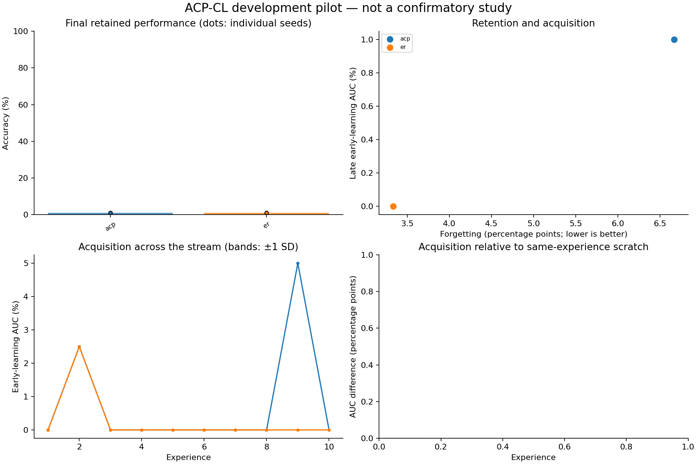

# Exploratory experiment results

Evaluation split: **validation**. Values below are percentages or percentage points.
These runs test implementation and generate hypotheses; they are not confirmatory evidence.

| Method | Seeds | Final accuracy | Forgetting | Late early AUC | Scratch-adjusted AUC | Seconds/run |
|---|---:|---:|---:|---:|---:|---:|
| acp | 1 | 1.00 | 6.67 | 1.00 | — | 3.1 |
| er | 1 | 1.00 | 3.33 | 0.00 | — | 2.9 |

Paired ACP differences (95% unadjusted percentile bootstrap intervals; small-seed intervals are unstable):

| Comparator | Endpoint | Pairs | Difference [95% CI], pp |
|---|---|---:|---:|
| acp - er | final_accuracy | 1 | +0.00 [+0.00, +0.00] |
| acp - er | forgetting | 1 | +3.33 [+3.33, +3.33] |
| acp - er | late_early_auc | 1 | +1.00 [+1.00, +1.00] |

Lower forgetting is better; higher accuracy and acquisition AUC are better.
Scratch-adjusted AUC subtracts a fresh model's AUC on the identical experience; it is a diagnostic, not pure transfer.
Timing includes evaluation, diagnostics, and checkpoint writes. It is not a matched-compute comparison.
The recycling and DER++ comparators are explicitly documented implementation variants.

