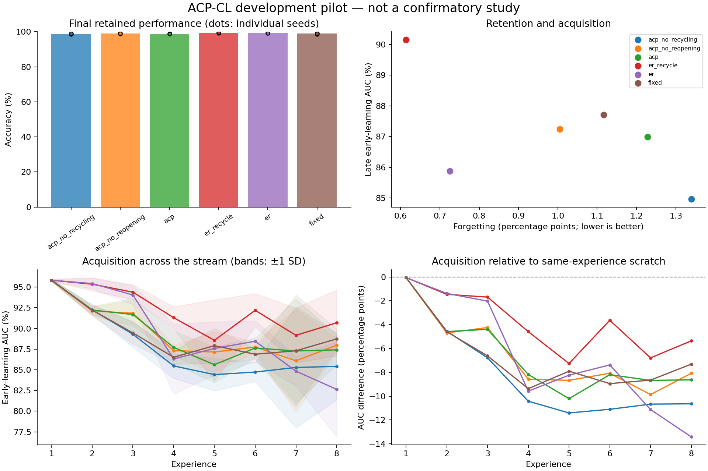

# Exploratory experiment results

Evaluation split: **validation**. Values below are percentages or percentage points.
These runs test implementation and generate hypotheses; they are not confirmatory evidence.

| Method | Seeds | Final accuracy | Forgetting | Late early AUC | Scratch-adjusted AUC | Seconds/run |
|---|---:|---:|---:|---:|---:|---:|
| acp_no_recycling | 3 | 98.81 | 1.34 | 84.97 | -10.95 | 6.4 |
| acp_no_reopening | 3 | 99.07 | 1.00 | 87.25 | -8.67 | 6.4 |
| acp | 3 | 98.86 | 1.23 | 86.99 | -8.93 | 6.8 |
| er_recycle | 3 | 99.45 | 0.61 | 90.16 | -5.76 | 6.3 |
| er | 3 | 99.37 | 0.73 | 85.88 | -10.04 | 6.3 |
| fixed | 3 | 99.01 | 1.12 | 87.71 | -8.20 | 6.5 |

Paired ACP differences (95% unadjusted percentile bootstrap intervals; small-seed intervals are unstable):

| Comparator | Endpoint | Pairs | Difference [95% CI], pp |
|---|---|---:|---:|
| acp - acp_no_recycling | final_accuracy | 3 | +0.05 [-0.24, +0.34] |
| acp - acp_no_recycling | forgetting | 3 | -0.11 [-0.56, +0.28] |
| acp - acp_no_recycling | late_early_auc | 3 | +2.03 [+1.45, +3.15] |
| acp - acp_no_recycling | late_plasticity_gap | 3 | +2.03 [+1.45, +3.15] |
| acp - acp_no_reopening | final_accuracy | 3 | -0.21 [-0.34, +0.05] |
| acp - acp_no_reopening | forgetting | 3 | +0.22 [-0.11, +0.45] |
| acp - acp_no_reopening | late_early_auc | 3 | -0.25 [-0.39, +0.01] |
| acp - acp_no_reopening | late_plasticity_gap | 3 | -0.25 [-0.39, +0.01] |
| acp - er_recycle | final_accuracy | 3 | -0.59 [-0.83, -0.24] |
| acp - er_recycle | forgetting | 3 | +0.61 [+0.17, +0.89] |
| acp - er_recycle | late_early_auc | 3 | -3.17 [-4.16, -1.64] |
| acp - er_recycle | late_plasticity_gap | 3 | -3.17 [-4.16, -1.64] |
| acp - er | final_accuracy | 3 | -0.50 [-0.68, -0.29] |
| acp - er | forgetting | 3 | +0.50 [+0.17, +0.73] |
| acp - er | late_early_auc | 3 | +1.11 [-0.96, +3.67] |
| acp - er | late_plasticity_gap | 3 | +1.11 [-0.96, +3.67] |
| acp - fixed | final_accuracy | 3 | -0.15 [-0.44, +0.29] |
| acp - fixed | forgetting | 3 | +0.11 [-0.45, +0.45] |
| acp - fixed | late_early_auc | 3 | -0.72 [-1.18, -0.08] |
| acp - fixed | late_plasticity_gap | 3 | -0.72 [-1.18, -0.08] |

Lower forgetting is better; higher accuracy and acquisition AUC are better.
Scratch-adjusted AUC subtracts a fresh model's AUC on the identical experience; it is a diagnostic, not pure transfer.
Timing includes evaluation, diagnostics, and checkpoint writes. It is not a matched-compute comparison.
The recycling and DER++ comparators are explicitly documented implementation variants.

