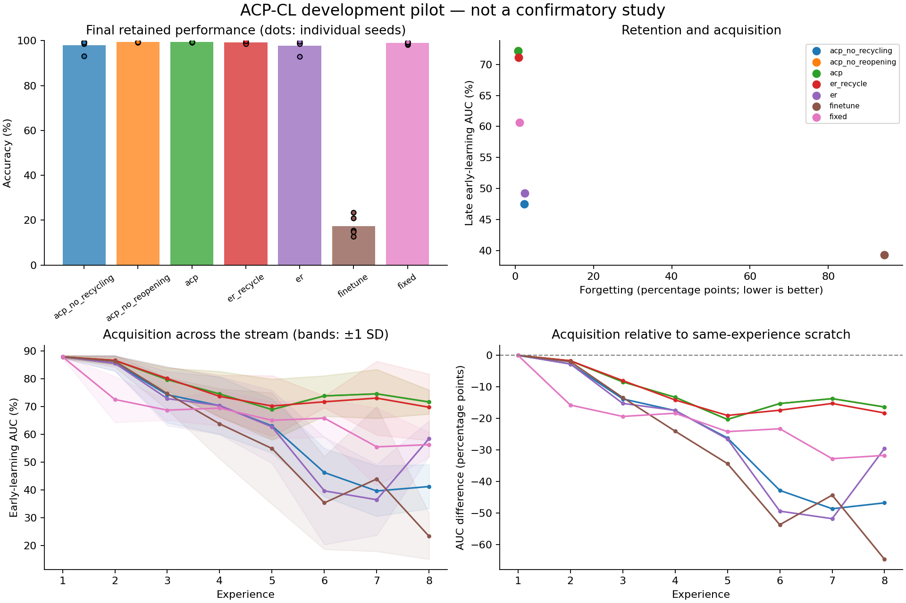

# Exploratory experiment results

Evaluation split: **validation**. Values below are percentages or percentage points.
These runs test implementation and generate hypotheses; they are not confirmatory evidence.

| Method | Seeds | Final accuracy | Forgetting | Late early AUC | Scratch-adjusted AUC | Seconds/run |
|---|---:|---:|---:|---:|---:|---:|
| acp_no_recycling | 5 | 97.95 | 2.31 | 47.47 | -41.14 | 2.2 |
| acp_no_reopening | 5 | 99.36 | 0.74 | 72.18 | -16.43 | 2.2 |
| acp | 5 | 99.36 | 0.74 | 72.18 | -16.43 | 2.2 |
| er_recycle | 5 | 99.19 | 0.90 | 71.11 | -17.50 | 2.2 |
| er | 5 | 97.81 | 2.46 | 49.27 | -39.34 | 2.1 |
| finetune | 5 | 17.43 | 94.35 | 39.31 | -49.30 | 1.4 |
| fixed | 5 | 98.93 | 1.17 | 60.61 | -28.00 | 2.2 |

Paired ACP differences (95% unadjusted percentile bootstrap intervals; small-seed intervals are unstable):

| Comparator | Endpoint | Pairs | Difference [95% CI], pp |
|---|---|---:|---:|
| acp - acp_no_recycling | final_accuracy | 5 | +1.41 [+0.02, +3.87] |
| acp - acp_no_recycling | forgetting | 5 | -1.57 [-4.34, -0.00] |
| acp - acp_no_recycling | late_early_auc | 5 | +24.71 [+20.00, +29.43] |
| acp - acp_no_recycling | late_plasticity_gap | 5 | +24.71 [+20.00, +29.43] |
| acp - acp_no_reopening | final_accuracy | 5 | +0.00 [+0.00, +0.00] |
| acp - acp_no_reopening | forgetting | 5 | +0.00 [+0.00, +0.00] |
| acp - acp_no_reopening | late_early_auc | 5 | +0.00 [+0.00, +0.00] |
| acp - acp_no_reopening | late_plasticity_gap | 5 | +0.00 [+0.00, +0.00] |
| acp - er_recycle | final_accuracy | 5 | +0.17 [-0.14, +0.48] |
| acp - er_recycle | forgetting | 5 | -0.17 [-0.54, +0.19] |
| acp - er_recycle | late_early_auc | 5 | +1.07 [-1.46, +5.64] |
| acp - er_recycle | late_plasticity_gap | 5 | +1.07 [-1.46, +5.64] |
| acp - er | final_accuracy | 5 | +1.54 [+0.07, +4.07] |
| acp - er | forgetting | 5 | -1.72 [-4.55, -0.06] |
| acp - er | late_early_auc | 5 | +22.92 [+15.68, +31.02] |
| acp - er | late_plasticity_gap | 5 | +22.92 [+15.68, +31.02] |
| acp - finetune | final_accuracy | 5 | +81.92 [+78.15, +85.30] |
| acp - finetune | forgetting | 5 | -93.62 [-97.48, -89.32] |
| acp - finetune | late_early_auc | 5 | +32.88 [+27.30, +38.86] |
| acp - finetune | late_plasticity_gap | 5 | +32.88 [+27.30, +38.86] |
| acp - fixed | final_accuracy | 5 | +0.43 [+0.04, +0.86] |
| acp - fixed | forgetting | 5 | -0.44 [-0.93, +0.01] |
| acp - fixed | late_early_auc | 5 | +11.58 [+7.62, +14.35] |
| acp - fixed | late_plasticity_gap | 5 | +11.58 [+7.62, +14.35] |

Lower forgetting is better; higher accuracy and acquisition AUC are better.
Scratch-adjusted AUC subtracts a fresh model's AUC on the identical experience; it is a diagnostic, not pure transfer.
Timing includes evaluation, diagnostics, and checkpoint writes. It is not a matched-compute comparison.
The recycling and DER++ comparators are explicitly documented implementation variants.

