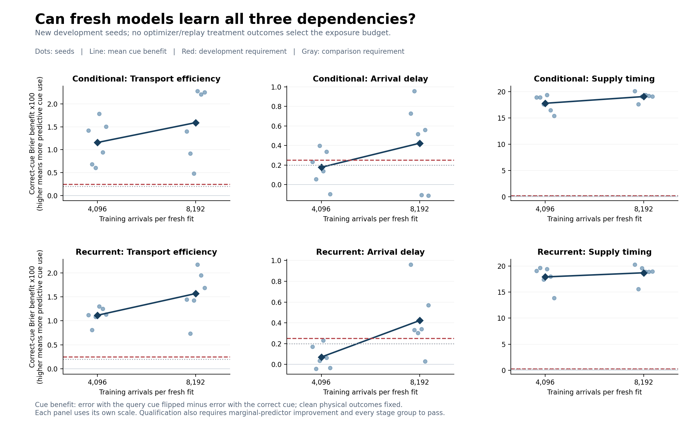
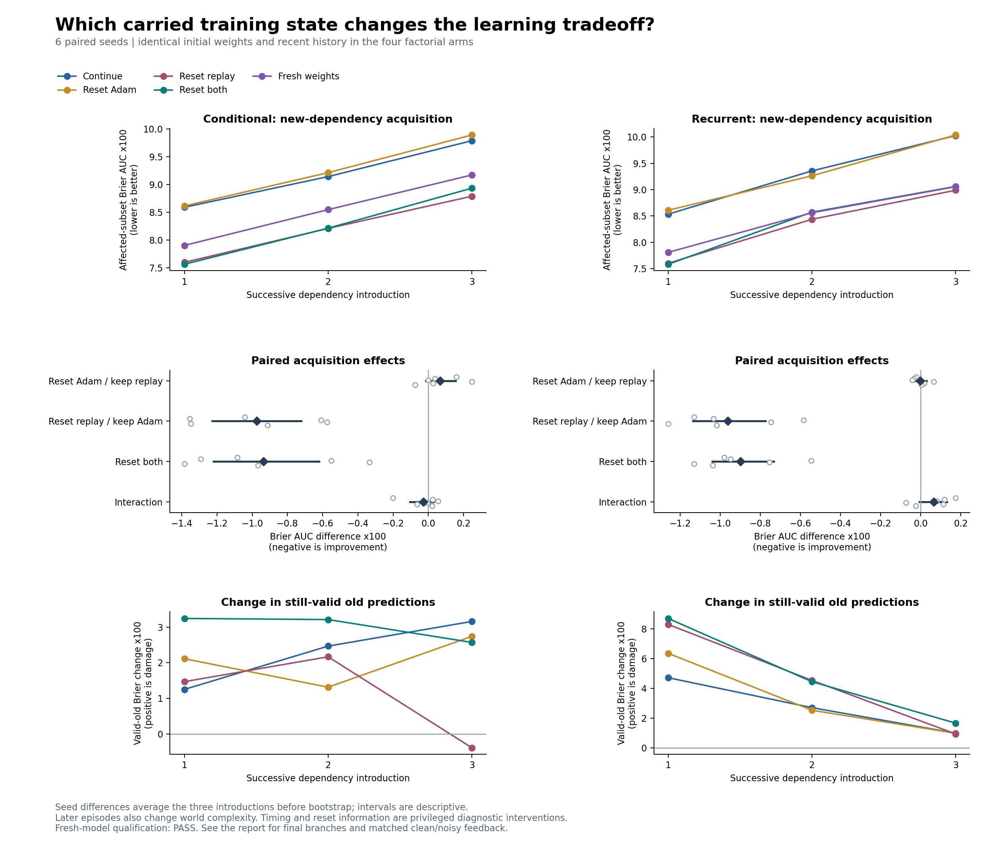
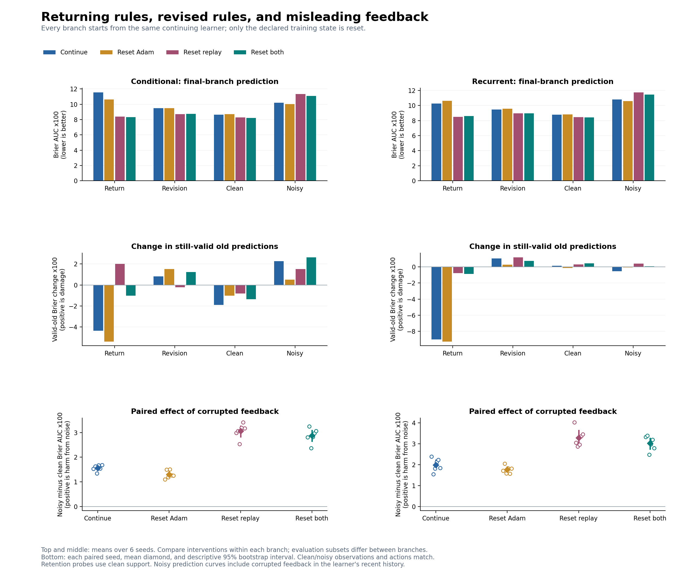

# Optimizer history versus replay history

Status: completed, qualified diagnostic. All 372 episodes completed and the
final checkpoint audit passed; six independent comparison seeds per architecture.

**Replay reset explains most of the new-acquisition benefit in this cohort;
Adam reset alone shows little benefit.** Retention depends on architecture
and circumstance. Clearing replay while keeping Adam reduces forgetting
relative to ordinary continuation in the conditional learner, but increases
forgetting in recurrence. Both become more vulnerable to corrupted feedback,
and have higher error across the old conditions after return than ordinary
continuation does.

The next research target is bounded renewal of replay while retaining useful
historical coverage. These findings support neither indiscriminate memory
clearing nor a sleep/pruning interpretation of the reset operation.

This diagnostic asks which carried training state explains the previous
acquisition/retention tradeoff. It retains the conditional and recurrent
architectures and separates resetting Adam from resetting replay. It tests
these operations at known changes in the experimental world; it does not
introduce an autonomous continual-learning algorithm.

## Design and measures

Twelve learners, covering two architectures and six new seeds (8001--8006),
first learn four blocks of the original alternating physical conditions.
Three image cues subsequently acquire predictive meaning: transport
efficiency, arrival delay, and supply timing. All six introduction orders
occur once. At each introduction, identical learned weights and recent
history are forked into four interventions:

| Arm | Adam moments and counters | Replay packets and reservoir state |
|---|---|---|
| Continue | Keep | Keep |
| Reset Adam | Reset | Keep |
| Reset replay | Keep | Reset |
| Reset both | Reset | Reset |

A fifth reference starts from the original random weights, with fresh Adam
and replay but the same recent history. Only the continuing arm advances the
trajectory. Final independent branches test exact return, a revised cue
meaning, unchanged clean conditions, and unchanged conditions with corrupted
feedback. Each final branch contains the four factorial interventions.

This gives 12 prefix fits, 180 new-dependency episodes, and 192 final episodes.
Every episode receives 8,192 arrivals and 3,072 optimizer steps. Evaluation
counterfactuals and change labels are unavailable to ordinary training.
Clean/noisy final branches receive identical observations and performed
actions; only reported feedback is corrupted. The complete specification is
in the [locked protocol](training_state/protocol_at_lock.md).

The primary measure is prediction Brier error integrated across an episode,
restricted to the subset affected by the new dependency. Lower is better.
Valid-old damage is the change in error on still-valid physical relationships,
measured with correct supporting examples from that subset. Positive damage
means deterioration. Ordinary fresh-support probes use the branch's feedback
distribution, including noise in the noisy branch. Fresh random weights are
a learnability reference, not a forgetting control.

Reported Brier values are multiplied by 100 for readability; they are not
percentage-point changes in survival. The three introductions are averaged
within each seed before contrasts and 20,000 paired bootstrap resamples.
There are six independent seeds per architecture, not 372 independent
replicates. Intervals are descriptive and do not correct for multiple tests.

## Independent development

The declared exposure grid contained 4,096 and 8,192 arrivals. Fresh-only
development used seeds 411--416, with every introduction order represented.
For every stage and every cue group in each architecture, qualification
required marginal-predictor Brier improvement of at least .02 and correct-cue
benefit of at least .0025. The main comparison separately rechecks the
unchanged .002 cue requirement on its own fresh-weight arms.

| Arrivals | Conditional delay-cue benefit | Recurrent delay-cue benefit | Development decision |
|---|---:|---:|---|
| 4,096 | .00176401 | .00070667 | Fail both delay groups; preserve the attempt |
| 8,192 | .00423232 | .00422158 | All twelve stage/cue groups pass; select this budget |

All 72 development fits completed and their starting/final checkpoints passed
the local audit. No comparison outcomes selected the budget. The previous
study's conditional delay failure remains a failure under its original
protocol; this new cohort does not retroactively qualify it.

## Complete acquisition cohort

All 180 new-dependency episodes completed before these estimates were read.
The 36 fresh-weight references pass every comparison qualification group.
Conditional and recurrent delay-cue benefits are .00511995 and .00501560,
respectively, against the declared .002 threshold. The smallest grouped
marginal-predictor improvement is .143735, above .02.

Mean acquisition error across the three introductions, in Brier units x100:

| Arm | Conditional | Recurrent |
|---|---:|---:|
| Continue | 9.173 | 9.305 |
| Reset Adam | 9.239 | 9.303 |
| Reset replay | 8.199 | 8.342 |
| Reset both | 8.237 | 8.405 |
| Fresh weights | 8.541 | 8.475 |

Resetting replay with Adam retained improves acquisition in all six seed
averages for each architecture. Its paired effect is -0.974 [-1.226, -0.721]
for the conditional learner and -0.963 [-1.137, -0.775] for recurrence.
Resetting Adam while retaining replay gives +0.066 [-0.014, +0.155] and
-0.002 [-0.029, +0.029], respectively. Adam reset alone therefore shows no
clear acquisition advantage in this comparison.

The replay main effects, averaged over the two optimizer conditions, are
-0.988 [-1.243, -0.727] and -0.930 [-1.083, -0.747]. Optimizer main effects
are +0.052 [-0.014, +0.136] and +0.030 [+0.006, +0.055]. Acquisition
interactions are small relative to the replay effects: -0.028 [-0.104, +0.030]
conditional and +0.065 [-0.007, +0.130] recurrent. These are descriptive
estimates, not a multiple-testing-adjusted superiority claim.

Retention differs materially between architectures. All four learned-weight
arms start with the same valid-old error: 11.642 conditional and 19.884
recurrent, averaged over the three introductions.

| Arm | Conditional final valid error | Conditional damage | Recurrent final valid error | Recurrent damage |
|---|---:|---:|---:|---:|
| Continue | 13.934 | +2.291 | 22.681 | +2.797 |
| Reset Adam | 13.697 | +2.054 | 23.168 | +3.284 |
| Reset replay | 12.724 | +1.082 | 24.472 | +4.587 |
| Reset both | 14.651 | +3.008 | 24.820 | +4.935 |

With Adam retained, replay reset reduces conditional damage by -1.209
[-2.337, -0.063], improving the paired retention change in five of six seeds.
It increases recurrent damage by +1.790 [+0.988, +2.586], worse in every seed.
The conditional arm still loses valid knowledge on average; reduced damage
does not mean preservation is solved.

Resetting Adam in addition to replay costs the conditional learner another
+1.926 [+0.849, +2.925] in valid-old damage, without a clear acquisition gain.
Its retention interaction is +2.163 [+1.349, +3.006], positive in every seed.
The corresponding recurrent interaction is -0.139 [-0.873, +0.740]. Thus a
pooled replay main effect alone would hide an important conditional-model
interaction with optimizer state.

Replay-reset acquisition gains are largest for supply timing: -2.159
conditional and -1.984 recurrent. Mean gains also appear for efficiency
(-0.436, -0.515) and delay (-0.327, -0.389). These cue-group means describe
heterogeneity; they do not supply additional independent replicates.

The original continuing arms have worse acquisition AUC than fresh weights
on average (+0.632 conditional, +0.830 recurrent). Both-reset versus fresh
is less decisive at this longer exposure: -0.304 [-0.599, +0.003] conditional
and -0.070 [-0.328, +0.146] recurrent. Fresh models end with lower current-task
error than both-reset models, while the conditional learned-weight arms retain
better old predictions. Initial transfer, acquisition AUC, terminal adaptation,
and retention therefore should not be treated as interchangeable outcomes.

The [complete contrast tables](training_state/summary.md#primary-factorial-contrasts)
include all four simple effects, both main effects, interaction, fresh-weight
comparisons, terminal retention levels, and every episode. The
[machine-readable summary](training_state/summary.json) also preserves every
paired seed difference and interval.

## Return, revision, and matched feedback noise

The table below isolates replay reset with Adam kept. Each value is reset
replay minus ordinary continuation, in Brier units x100. Negative prediction
AUC is better; positive valid-old damage means worse retention. Intervals are
descriptive 95% seed bootstrap intervals. Compare interventions within a
branch, since evaluation subsets differ across branches.

| Branch | Model | Prediction AUC difference | Valid-old damage difference |
|---|---|---:|---:|
| Return | Conditional | -3.147 [-5.638, -0.763] | +6.374 [+2.830, +10.330] |
| Return | Recurrent | -1.768 [-2.356, -1.246] | +8.219 [+4.581, +11.593] |
| Revision | Conditional | -0.764 [-1.270, -0.283] | -1.047 [-4.307, +0.863] |
| Revision | Recurrent | -0.526 [-0.875, -0.183] | +0.133 [-0.504, +0.814] |
| Clean continuation | Conditional | -0.357 [-0.735, -0.011] | +1.095 [+0.071, +2.244] |
| Clean continuation | Recurrent | -0.354 [-0.673, -0.040] | +0.167 [-0.508, +0.880] |
| Noisy continuation | Conditional | +1.139 [+0.771, +1.451] | -0.770 [-2.495, +1.662] |
| Noisy continuation | Recurrent | +0.944 [+0.528, +1.259] | +0.950 [+0.682, +1.275] |

Returning to one original world is not the same as retaining both original
conditions. Replay reset improves prediction in the returned world while
worsening the broader valid-old panel in every seed for both architectures.
Conditional terminal valid-old error is 19.606 after replay reset versus
13.232 after continuation; recurrent error is 24.675 versus 16.457. The
conditional acquisition advantage therefore does not extend to reliable
preservation across all tested circumstances.

The clean/noisy comparison holds the physical rules, raw observations, and
performed actions fixed. Noise replaces 20% of reports; it does not flip
exactly 20% of labels. Its paired prediction-AUC cost is:

| Arm | Conditional noisy minus clean | Recurrent noisy minus clean |
|---|---:|---:|
| Continue | +1.567 [+1.462, +1.650] | +1.992 [+1.773, +2.220] |
| Reset Adam | +1.302 [+1.182, +1.422] | +1.762 [+1.641, +1.897] |
| Reset replay | +3.063 [+2.826, +3.261] | +3.290 [+3.011, +3.635] |
| Reset both | +2.880 [+2.657, +3.080] | +3.028 [+2.760, +3.268] |

All eight arm-by-model noise costs are positive in every seed. Retaining
replay offers useful resistance to corrupted feedback here. Adam reset has
a modest noise-branch benefit (main effect -0.223 conditional, -0.249
recurrent), so the acquisition finding should not be generalized into a
claim that optimizer state is irrelevant in every situation. Combining the
two resets still has worse noisy prediction than ordinary continuation.

Small recurrent retention changes on the noisy panel start from an already
high valid-old error of 24.234; they do not demonstrate well-preserved old
knowledge. The [full final-branch tables](training_state/summary.md#final-branch-return)
report every factorial contrast and all starting/ending valid-old levels.

## Next bounded question

**Can replay be renewed enough to learn changed relationships while retaining
enough historical coverage to preserve valid knowledge and resist noise?**

For the next acquisition intervention, keep the learned parameters and Adam
state as controls and vary replay renewal. First distinguish removing stored
packets from resetting reservoir age and random generators; the present study
identifies their combined operation. Compare a recent-experience component
plus a historical reservoir against uniform replay and recent-only replay,
with the same total 16-packet capacity and update budget. A split memory is a
candidate engineering control, not an established novel mechanism or a claim
that particular examples are known to be useful.

Use independent development to choose any memory split, then fresh comparison
seeds. Predeclare meaningful acquisition improvement and acceptable losses
on valid-old retention, return, and matched noise before that comparison.
Include simple age-based policies that require no external change marker;
test learned triggering separately if one is later proposed. Do not tune
these choices on seeds 8001--8006 or infer that a global reset at known task
boundaries is already deployable.

The broader working hypothesis stays intact as a research objective. This
study narrows the engineering question to how experience is rehearsed; it
does not yet demonstrate sustained acquisition with reliable retention.

## Scope of the interventions

Resetting replay empties the buffer and resets its reservoir count and random
generators. The buffer then refills; while empty, the update loop duplicates
the current packet to preserve the update/presentation budget. Thus an effect
belongs to the complete replay reset, not solely the removal of obsolete
examples. Adam reset retains weights, replay, and recent history while
clearing optimizer moments and counters. It does not remove synapses or
features. It also does not separate the effects of Adam's first moments,
second moments, and counters. Neither intervention tests how a learner
detects when to act.
Replay reset changes the effective training distribution, including how much
rehearsal concerns the current law. A gain can reflect that redistribution
without establishing repair of an intrinsic loss of representational capacity.

Optimizer resets are an existing research idea. Asadi, Fakoor, and Sabach
studied resets when target updates change a reinforcement-learning objective
and reported benefits for Rainbow on Atari. Our performed-action prediction
testbed has different targets and measures. Its purpose is to diagnose our
specific tradeoff, not to claim the reset operation as a new invention.
[Primary study, NeurIPS 2023](https://proceedings.neurips.cc/paper_files/paper/2023/file/e4bf5c3245fd92a4554a16af9803b757-Paper-Conference.pdf).

Later stages also differ in physical complexity, and mode by introduction
order is not fully crossed. Stage trends cannot establish a causal loss of
plasticity with age. These results will not by themselves establish a special
role for joint survival, a generally superior relational representation, or
performance outside this small synthetic world.
The selected exposure is longer than in the previous acquisition study, so
effect magnitudes across those studies are not a controlled comparison.

## Restart recovery and reproducibility

A PC restart interrupted the main comparison. A subsequent integrity check
found twelve damaged checkpoint files and four malformed prefix metadata
files. Their original bytes and hashes were preserved in the
[damaged-file archive](training_state/damaged_checkpoint_files.zip) and
[integrity record](training_state/recovery_file_checks.json).

All 52 remaining checkpoints passed archive checks, deserialization, and
finite-weight checks; saved prefix/start hashes matched. Recovery preserved
16 already completed episodes, resumed conditional seeds 8001--8004 from
intact prefixes, and rebuilt recurrent prefixes 8001--8004 using exactly the
same seeds and data. No completed episode was excluded and no retry was
chosen from outcome values. Source, configuration, and protocol stayed fixed.

The resumed eight-worker process tree used one Torch thread per worker and
CPU affinity mask 85 (logical processors 0, 2, 4, 6). This operational detail
supplements the original runtime manifest. The restart cause is unknown;
elapsed training times are not controlled hardware benchmarks. Atomic file
replacement alone did not guarantee power-loss durability. The
[development and recovery ledger](training_state/development_ledger.md)
records the sequence, and [reproduction instructions](../docs/reproduction.md#optimizer-by-replay-diagnostic)
include a read-only integrity preflight for stopped jobs.

## Verification and archive

The local checkpoint audit passed all 12 prefixes, 372 starting models, 372
final models, and 48 matched clean/noisy pairs. It verifies exact intervention
forks, causal data and replay regeneration, and recomputed starting/final
probes without changing learner state. Intermediate curves are retained and
checked against checkpoint records; they are not all independently recomputed
from intermediate weights. This is a local exact-source audit, not independent
replication. The completed run's 1,145 stable JSON/ZIP/checkpoint files passed
the separate integrity scan.

The full suite passed 702 tests with two Windows symbolic-link skips. Five
additional recovery-integrity tests passed after the restart utility was added.
Lint passed. The engineering smoke completed 62 episodes and its checkpoint
audit; it is intentionally too short for learning qualification. All 72
development starting/final checkpoint pairs passed their audits. The scientific
source stayed fixed through both development attempts and the main comparison.
All 117 sealed artifacts across the earlier conditional, contextual, and
acquisition studies still match their recorded hashes.

Figures are exported as PNG, SVG, and PDF. All three PNGs were visually
inspected, and rendered text bounds checked. The detailed
[engineering record](training_state/engineering_verification.json),
[checkpoint audit](training_state/audit.json),
[file-integrity scan](training_state/final_file_integrity.json), and
[recovery history](training_state/recovery_history.json) record those checks.

The portable [artifact manifest](training_state/artifact_manifest.json) covers
the summaries, all episode/probe records, development attempts, source archives,
protocol locks, figures, and audits. The
[analysis-source archive](training_state/analysis_source.zip) includes the
analysis scripts, tests, configurations, report, and current documentation.
Full trusted model checkpoints remain under the ignored local
`runs/training_state_diagnostic/` directory. Reproducing the exact study requires
its archived source and configuration; cross-platform bitwise identity is not
promised.

## Relationship to sleep and pruning

The useful engineering analogy is recalibrating future adaptation while
preserving useful learned structure. Adam statistics have no established
one-to-one biological counterpart. Clearing an example buffer does not
implement sleep replay, and no connections are pruned in this experiment.
The [sleep and training-state note](../docs/sleep_and_training_state.md)
separates these operations from the cited biological observations. A later
selective-rehearsal or recalibration mechanism would need its own controlled
test of both new learning and retention.
