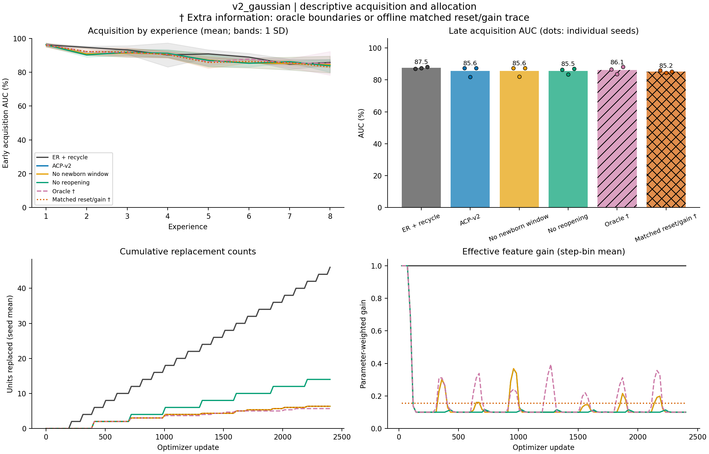

# v2_gaussian: completed-run diagnostics

Completed **30/30** runs: 10 methods x 3 seeds (101, 202, 303). Evaluation split: **validation**.

All table summaries are equal-weight seed means. Method order follows the manifest. Per-seed values, sample SDs, metric counts, source hashes, and full detector audits are in `diagnostics.json`.

A dagger (†) marks an **extra-information diagnostic**: oracle change times or offline allocation traces.

| Method | Seeds | Final accuracy (%) | Late early AUC (%) | Scratch gap (pp) | Input-centroid accuracy (%) |
|---|---:|---:|---:|---:|---:|
| er | 3 | 98.60 | 79.73 | -16.22 | 100.00 |
| er_recycle | 3 | 99.25 | 87.54 | -8.42 | 100.00 |
| acp | 3 | 99.06 | 85.58 | -10.37 | 100.00 |
| acp_v2 | 3 | 99.20 | 85.56 | -10.39 | 100.00 |
| acp_v2_no_newborn | 3 | 99.20 | 85.57 | -10.38 | 100.00 |
| acp_v2_learned_sensor | 3 | 98.93 | 85.65 | -10.30 | 100.00 |
| acp_v2_no_reopening | 3 | 98.78 | 85.54 | -10.41 | 100.00 |
| acp_v2_oracle † | 3 | 98.96 | 86.10 | -9.85 | 100.00 |
| er_recycle_yoked † | 3 | 98.62 | 84.43 | -11.52 | 100.00 |
| er_recycle_yoked_gain † | 3 | 99.27 | 85.19 | -10.76 | 100.00 |

The input-centroid column is an evaluator-only classifier using the final replay reservoir. Scratch gap subtracts a fresh model's acquisition AUC on the identical experience.

| Method | Unit resets | Mean gain | Sum data-update L2 | Local maturations | Useful local consolidations | Final mean c | Reopenings | Sensor bytes |
|---|---:|---:|---:|---:|---:|---:|---:|---:|---:|
| er | 0.0 | 1.0000 | 71.174 | 0.0 | 0.0 | 0.0000 | 0.0 | 0 |
| er_recycle | 46.0 | 1.0000 | 70.438 | 0.0 | 0.0 | 0.0000 | 0.0 | 0 |
| acp | 11.7 | 0.1442 | 23.547 | 0.0 | 0.0 | 0.2129 | 1.0 | 0 |
| acp_v2 | 6.3 | 0.1544 | 29.931 | 6.3 | 6.3 | 0.3210 | 3.3 | 8448 |
| acp_v2_no_newborn | 6.3 | 0.1537 | 30.021 | 0.0 | 0.0 | 0.3158 | 3.3 | 8448 |
| acp_v2_learned_sensor | 6.0 | 0.1534 | 29.466 | 6.0 | 6.0 | 0.2832 | 2.3 | 0 |
| acp_v2_no_reopening | 14.0 | 0.1351 | 22.392 | 14.0 | 14.0 | 0.1706 | 0.0 | 8448 |
| acp_v2_oracle † | 5.7 | 0.1755 | 41.861 | 5.7 | 5.7 | 0.4475 | 7.0 | 8448 |
| er_recycle_yoked † | 6.3 | 1.0000 | 72.791 | 0.0 | 0.0 | 0.0000 | 0.0 | 0 |
| er_recycle_yoked_gain † | 6.3 | 0.1544 | 21.769 | 0.0 | 0.0 | 0.0000 | 0.0 | 0 |

Mean gain covers every optimizer step and weights feature parameters within a step. Summed data-update L2 is path length, not net displacement; it excludes classifier, decay, and anchor forces. Final mean c summarizes final consolidation rather than averaging over time.

Detector proximity below pools counts across seeds. The recorded tolerance is in optimizer updates; these are descriptive proximity counts rather than calibrated detector scores.

| Method | Reopenings | Changes with nearby reopening / post-warmup changes | Reopenings outside change windows | Mean nearby delay (steps) |
|---|---:|---:|---:|---:|
| er | 0 | 0 / 21 | 0 | n/a |
| er_recycle | 0 | 0 / 21 | 0 | n/a |
| acp | 3 | 3 / 21 | 0 | 20.0 |
| acp_v2 | 10 | 9 / 21 | 1 | 20.0 |
| acp_v2_no_newborn | 10 | 9 / 21 | 1 | 20.0 |
| acp_v2_learned_sensor | 7 | 7 / 21 | 0 | 20.0 |
| acp_v2_no_reopening | 0 | 0 / 21 | 0 | n/a |
| acp_v2_oracle † | 21 | 21 / 21 | 0 | 10.0 |
| er_recycle_yoked † | 0 | 0 / 21 | 0 | n/a |
| er_recycle_yoked_gain † | 0 | 0 / 21 | 0 | n/a |

Per-seed results:

| Method | Seed | Final accuracy (%) | Late AUC (%) | Scratch gap (pp) | Unit resets | Mean gain | Local maturations | Reopenings |
|---|---:|---:|---:|---:|---:|---:|---:|---:|
| er | 101 | 98.83 | 81.68 | -14.40 | 0 | 1.0000 | 0 | 0 |
| er | 202 | 97.66 | 74.35 | -21.52 | 0 | 1.0000 | 0 | 0 |
| er | 303 | 99.32 | 83.16 | -12.74 | 0 | 1.0000 | 0 | 0 |
| er_recycle | 101 | 99.41 | 87.01 | -9.07 | 46 | 1.0000 | 0 | 0 |
| er_recycle | 202 | 98.83 | 87.42 | -8.44 | 46 | 1.0000 | 0 | 0 |
| er_recycle | 303 | 99.51 | 88.18 | -7.73 | 46 | 1.0000 | 0 | 0 |
| acp | 101 | 98.39 | 86.94 | -9.14 | 12 | 0.1472 | 0 | 1 |
| acp | 202 | 99.02 | 82.61 | -13.25 | 12 | 0.1427 | 0 | 1 |
| acp | 303 | 99.76 | 87.18 | -8.73 | 11 | 0.1428 | 0 | 1 |
| acp_v2 | 101 | 99.02 | 87.37 | -8.71 | 5 | 0.1693 | 5 | 6 |
| acp_v2 | 202 | 99.02 | 81.92 | -13.95 | 5 | 0.1536 | 5 | 3 |
| acp_v2 | 303 | 99.56 | 87.40 | -8.50 | 9 | 0.1402 | 9 | 1 |
| acp_v2_no_newborn | 101 | 99.02 | 87.35 | -8.73 | 5 | 0.1689 | 0 | 6 |
| acp_v2_no_newborn | 202 | 99.02 | 81.95 | -13.92 | 5 | 0.1531 | 0 | 3 |
| acp_v2_no_newborn | 303 | 99.56 | 87.40 | -8.50 | 9 | 0.1392 | 0 | 1 |
| acp_v2_learned_sensor | 101 | 98.29 | 87.85 | -8.23 | 5 | 0.1604 | 5 | 3 |
| acp_v2_learned_sensor | 202 | 98.88 | 81.81 | -14.05 | 5 | 0.1536 | 5 | 2 |
| acp_v2_learned_sensor | 303 | 99.61 | 87.30 | -8.61 | 8 | 0.1463 | 8 | 2 |
| acp_v2_no_reopening | 101 | 98.00 | 86.28 | -9.80 | 14 | 0.1351 | 14 | 0 |
| acp_v2_no_reopening | 202 | 98.93 | 83.32 | -12.54 | 14 | 0.1351 | 14 | 0 |
| acp_v2_no_reopening | 303 | 99.41 | 87.02 | -8.89 | 14 | 0.1351 | 14 | 0 |
| acp_v2_oracle † | 101 | 98.93 | 86.60 | -9.48 | 7 | 0.1707 | 7 | 7 |
| acp_v2_oracle † | 202 | 98.63 | 83.61 | -12.26 | 4 | 0.1829 | 4 | 7 |
| acp_v2_oracle † | 303 | 99.32 | 88.09 | -7.81 | 6 | 0.1731 | 6 | 7 |
| er_recycle_yoked † | 101 | 99.02 | 85.33 | -10.75 | 5 | 1.0000 | 0 | 0 |
| er_recycle_yoked † | 202 | 97.80 | 78.93 | -16.94 | 5 | 1.0000 | 0 | 0 |
| er_recycle_yoked † | 303 | 99.02 | 89.04 | -6.87 | 9 | 1.0000 | 0 | 0 |
| er_recycle_yoked_gain † | 101 | 99.02 | 85.89 | -10.19 | 5 | 0.1693 | 0 | 0 |
| er_recycle_yoked_gain † | 202 | 99.22 | 84.44 | -11.42 | 5 | 0.1536 | 0 | 0 |
| er_recycle_yoked_gain † | 303 | 99.56 | 85.25 | -10.66 | 9 | 0.1402 | 0 | 0 |

Extra-information access:

- `acp_v2_oracle`: true signal-domain change times; diagnostic only.
- `er_recycle_yoked`: offline ACP-v2 allocation trace; diagnostic only.
- `er_recycle_yoked_gain`: offline ACP-v2 allocation trace; diagnostic only.

The figure uses a fixed condition order. Curves show seed means; AUC bands show one sample SD when multiple seeds exist. Bars show late AUC means and dots show individual seeds. No inferential comparison is computed.

Training source SHA-256: `67ae36402607f257f1e55c4f3ef2bbb477a88555d2111a4bd0139e27668eee0a`.
