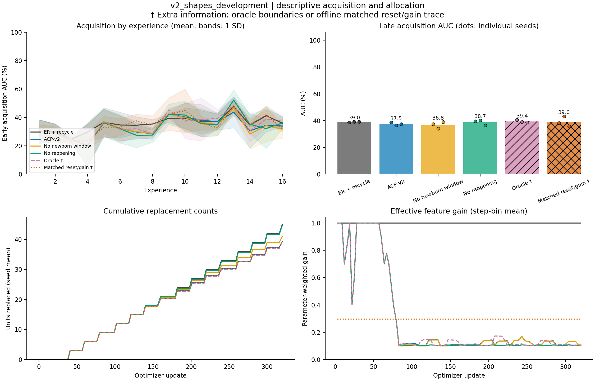

# v2_shapes_development: completed-run diagnostics

Completed **30/30** runs: 10 methods x 3 seeds (101, 202, 303). Evaluation split: **validation**.

All table summaries are equal-weight seed means. Method order follows the manifest. Per-seed values, sample SDs, metric counts, source hashes, and full detector audits are in `diagnostics.json`.

A dagger (†) marks an **extra-information diagnostic**: oracle change times or offline allocation traces.

| Method | Seeds | Final accuracy (%) | Late early AUC (%) | Scratch gap (pp) | Input-centroid accuracy (%) |
|---|---:|---:|---:|---:|---:|
| er | 3 | 39.55 | 40.98 | +14.36 | 24.67 |
| er_recycle | 3 | 39.84 | 39.01 | +12.39 | 24.67 |
| acp | 3 | 39.75 | 39.66 | +13.05 | 24.67 |
| acp_v2 | 3 | 39.47 | 37.52 | +10.90 | 24.67 |
| acp_v2_no_newborn | 3 | 38.67 | 36.83 | +10.21 | 24.67 |
| acp_v2_learned_sensor | 3 | 40.25 | 37.95 | +11.33 | 24.67 |
| acp_v2_no_reopening | 3 | 40.67 | 38.74 | +12.12 | 24.67 |
| acp_v2_oracle † | 3 | 40.33 | 39.42 | +12.80 | 24.67 |
| er_recycle_yoked † | 3 | 41.78 | 39.27 | +12.65 | 24.67 |
| er_recycle_yoked_gain † | 3 | 42.35 | 39.03 | +12.41 | 24.67 |

The input-centroid column is an evaluator-only classifier using the final replay reservoir. Scratch gap subtracts a fresh model's acquisition AUC on the identical experience.

| Method | Unit resets | Mean gain | Sum data-update L2 | Local maturations | Useful local consolidations | Final mean c | Reopenings | Sensor bytes |
|---|---:|---:|---:|---:|---:|---:|---:|---:|---:|
| er | 0.0 | 1.0000 | 27.429 | 0.0 | 0.0 | 0.0000 | 0.0 | 0 |
| er_recycle | 45.0 | 1.0000 | 26.621 | 0.0 | 0.0 | 0.0000 | 0.0 | 0 |
| acp | 45.0 | 0.9766 | 25.849 | 0.0 | 0.0 | 0.0000 | 0.0 | 0 |
| acp_v2 | 39.3 | 0.2968 | 14.340 | 35.0 | 25.3 | 0.1735 | 7.0 | 12544 |
| acp_v2_no_newborn | 41.0 | 0.2959 | 14.454 | 0.0 | 0.0 | 0.1622 | 7.3 | 12544 |
| acp_v2_learned_sensor | 41.7 | 0.2911 | 14.254 | 36.3 | 26.3 | 0.1580 | 5.3 | 0 |
| acp_v2_no_reopening | 44.7 | 0.2861 | 12.657 | 38.7 | 28.7 | 0.1193 | 0.0 | 12544 |
| acp_v2_oracle † | 39.3 | 0.2961 | 14.735 | 34.7 | 25.7 | 0.1804 | 8.0 | 12544 |
| er_recycle_yoked † | 39.3 | 1.0000 | 26.454 | 0.0 | 0.0 | 0.0000 | 0.0 | 0 |
| er_recycle_yoked_gain † | 39.3 | 0.2968 | 14.545 | 0.0 | 0.0 | 0.0000 | 0.0 | 0 |

Mean gain covers every optimizer step and weights feature parameters within a step. Summed data-update L2 is path length, not net displacement; it excludes classifier, decay, and anchor forces. Final mean c summarizes final consolidation rather than averaging over time.

Detector proximity below pools counts across seeds. The recorded tolerance is in optimizer updates; these are descriptive proximity counts rather than calibrated detector scores.

| Method | Reopenings | Changes with nearby reopening / post-warmup changes | Reopenings outside change windows | Mean nearby delay (steps) |
|---|---:|---:|---:|---:|
| er | 0 | 0 / 36 | 0 | n/a |
| er_recycle | 0 | 0 / 36 | 0 | n/a |
| acp | 0 | 0 / 36 | 0 | n/a |
| acp_v2 | 21 | 15 / 36 | 6 | 10.0 |
| acp_v2_no_newborn | 22 | 15 / 36 | 7 | 10.0 |
| acp_v2_learned_sensor | 16 | 15 / 36 | 1 | 10.0 |
| acp_v2_no_reopening | 0 | 0 / 36 | 0 | n/a |
| acp_v2_oracle † | 24 | 24 / 36 | 0 | 7.5 |
| er_recycle_yoked † | 0 | 0 / 36 | 0 | n/a |
| er_recycle_yoked_gain † | 0 | 0 / 36 | 0 | n/a |

Per-seed results:

| Method | Seed | Final accuracy (%) | Late AUC (%) | Scratch gap (pp) | Unit resets | Mean gain | Local maturations | Reopenings |
|---|---:|---:|---:|---:|---:|---:|---:|---:|
| er | 101 | 40.19 | 39.94 | +14.97 | 0 | 1.0000 | 0 | 0 |
| er | 202 | 41.31 | 41.67 | +14.50 | 0 | 1.0000 | 0 | 0 |
| er | 303 | 37.16 | 41.33 | +13.62 | 0 | 1.0000 | 0 | 0 |
| er_recycle | 101 | 36.62 | 38.60 | +13.62 | 45 | 1.0000 | 0 | 0 |
| er_recycle | 202 | 40.77 | 39.21 | +12.04 | 45 | 1.0000 | 0 | 0 |
| er_recycle | 303 | 42.14 | 39.21 | +11.50 | 45 | 1.0000 | 0 | 0 |
| acp | 101 | 40.14 | 39.70 | +14.72 | 45 | 0.9578 | 0 | 0 |
| acp | 202 | 40.77 | 39.21 | +12.04 | 45 | 1.0000 | 0 | 0 |
| acp | 303 | 38.33 | 40.09 | +12.38 | 45 | 0.9719 | 0 | 0 |
| acp_v2 | 101 | 37.70 | 38.72 | +13.75 | 44 | 0.2656 | 38 | 8 |
| acp_v2 | 202 | 41.06 | 36.38 | +9.20 | 35 | 0.3229 | 32 | 6 |
| acp_v2 | 303 | 39.65 | 37.48 | +9.77 | 39 | 0.3020 | 35 | 7 |
| acp_v2_no_newborn | 101 | 35.50 | 37.45 | +12.48 | 45 | 0.2623 | 0 | 8 |
| acp_v2_no_newborn | 202 | 39.70 | 34.06 | +6.88 | 37 | 0.3256 | 0 | 7 |
| acp_v2_no_newborn | 303 | 40.82 | 38.99 | +11.28 | 41 | 0.2998 | 0 | 7 |
| acp_v2_learned_sensor | 101 | 35.84 | 38.84 | +13.87 | 44 | 0.2653 | 38 | 6 |
| acp_v2_learned_sensor | 202 | 41.85 | 40.19 | +13.01 | 36 | 0.3149 | 32 | 5 |
| acp_v2_learned_sensor | 303 | 43.07 | 34.81 | +7.10 | 45 | 0.2932 | 39 | 5 |
| acp_v2_no_reopening | 101 | 39.75 | 39.60 | +14.62 | 44 | 0.2627 | 38 | 0 |
| acp_v2_no_reopening | 202 | 43.26 | 40.16 | +12.99 | 45 | 0.3048 | 39 | 0 |
| acp_v2_no_reopening | 303 | 39.01 | 36.45 | +8.74 | 45 | 0.2908 | 39 | 0 |
| acp_v2_oracle † | 101 | 37.60 | 40.55 | +15.58 | 44 | 0.2659 | 38 | 8 |
| acp_v2_oracle † | 202 | 41.85 | 38.89 | +11.72 | 34 | 0.3239 | 30 | 8 |
| acp_v2_oracle † | 303 | 41.55 | 38.82 | +11.11 | 40 | 0.2984 | 36 | 8 |
| er_recycle_yoked † | 101 | 39.36 | 38.99 | +14.01 | 44 | 1.0000 | 0 | 0 |
| er_recycle_yoked † | 202 | 43.80 | 39.84 | +12.67 | 35 | 1.0000 | 0 | 0 |
| er_recycle_yoked † | 303 | 42.19 | 38.99 | +11.28 | 39 | 1.0000 | 0 | 0 |
| er_recycle_yoked_gain † | 101 | 39.84 | 38.11 | +13.13 | 44 | 0.2656 | 0 | 0 |
| er_recycle_yoked_gain † | 202 | 47.27 | 43.19 | +16.02 | 35 | 0.3229 | 0 | 0 |
| er_recycle_yoked_gain † | 303 | 39.94 | 35.79 | +8.08 | 39 | 0.3020 | 0 | 0 |

Extra-information access:

- `acp_v2_oracle`: true signal-domain change times; diagnostic only.
- `er_recycle_yoked`: offline ACP-v2 allocation trace; diagnostic only.
- `er_recycle_yoked_gain`: offline ACP-v2 allocation trace; diagnostic only.

The figure uses a fixed condition order. Curves show seed means; AUC bands show one sample SD when multiple seeds exist. Bars show late AUC means and dots show individual seeds. No inferential comparison is computed.

Training source SHA-256: `67ae36402607f257f1e55c4f3ef2bbb477a88555d2111a4bd0139e27668eee0a`.
