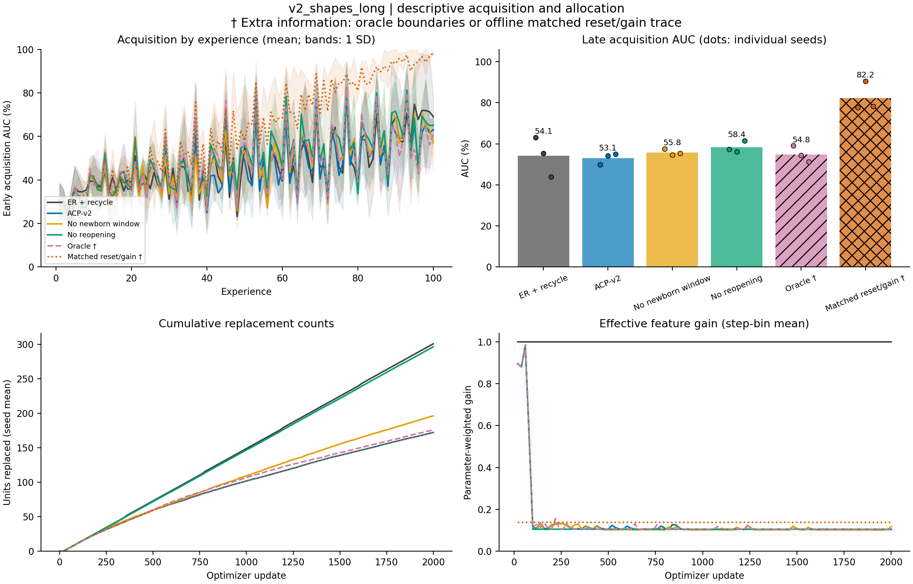

# v2_shapes_long: completed-run diagnostics

Completed **24/24** runs: 8 methods x 3 seeds (101, 202, 303). Evaluation split: **validation**.

All table summaries are equal-weight seed means. Method order follows the manifest. Per-seed values, sample SDs, metric counts, source hashes, and full detector audits are in `diagnostics.json`.

A dagger (†) marks an **extra-information diagnostic**: oracle change times or offline allocation traces.

| Method | Seeds | Final accuracy (%) | Late early AUC (%) | Scratch gap (pp) | Input-centroid accuracy (%) |
|---|---:|---:|---:|---:|---:|
| er | 3 | 65.57 | 53.23 | +26.68 | 25.08 |
| er_recycle | 3 | 73.98 | 54.14 | +27.58 | 25.08 |
| acp_v2 | 3 | 64.83 | 53.05 | +26.50 | 25.08 |
| acp_v2_no_newborn | 3 | 54.71 | 55.84 | +29.29 | 25.08 |
| acp_v2_no_reopening | 3 | 60.98 | 58.37 | +31.81 | 25.08 |
| acp_v2_oracle † | 3 | 61.65 | 54.83 | +28.28 | 25.08 |
| er_recycle_yoked † | 3 | 50.58 | 46.21 | +19.65 | 25.08 |
| er_recycle_yoked_gain † | 3 | 97.71 | 82.20 | +55.64 | 25.08 |

The input-centroid column is an evaluator-only classifier using the final replay reservoir. Scratch gap subtracts a fresh model's acquisition AUC on the identical experience.

| Method | Unit resets | Mean gain | Sum data-update L2 | Local maturations | Useful local consolidations | Final mean c | Reopenings | Sensor bytes |
|---|---:|---:|---:|---:|---:|---:|---:|---:|---:|
| er | 0.0 | 1.0000 | 160.064 | 0.0 | 0.0 | 0.0000 | 0.0 | 0 |
| er_recycle | 301.0 | 1.0000 | 165.586 | 0.0 | 0.0 | 0.0000 | 0.0 | 0 |
| acp_v2 | 172.3 | 0.1368 | 57.972 | 169.7 | 135.3 | 0.2741 | 49.3 | 12544 |
| acp_v2_no_newborn | 196.3 | 0.1349 | 59.919 | 0.0 | 0.0 | 0.2477 | 50.0 | 12544 |
| acp_v2_no_reopening | 296.7 | 0.1339 | 55.409 | 290.7 | 237.3 | 0.1343 | 0.0 | 12544 |
| acp_v2_oracle † | 176.0 | 0.1363 | 60.233 | 173.7 | 140.3 | 0.2627 | 64.0 | 12544 |
| er_recycle_yoked † | 172.3 | 1.0000 | 148.121 | 0.0 | 0.0 | 0.0000 | 0.0 | 0 |
| er_recycle_yoked_gain † | 172.3 | 0.1368 | 73.248 | 0.0 | 0.0 | 0.0000 | 0.0 | 0 |

Mean gain covers every optimizer step and weights feature parameters within a step. Summed data-update L2 is path length, not net displacement; it excludes classifier, decay, and anchor forces. Final mean c summarizes final consolidation rather than averaging over time.

Detector proximity below pools counts across seeds. The recorded tolerance is in optimizer updates; these are descriptive proximity counts rather than calibrated detector scores.

| Method | Reopenings | Changes with nearby reopening / post-warmup changes | Reopenings outside change windows | Mean nearby delay (steps) |
|---|---:|---:|---:|---:|
| er | 0 | 0 / 288 | 0 | n/a |
| er_recycle | 0 | 0 / 288 | 0 | n/a |
| acp_v2 | 148 | 120 / 288 | 28 | 10.0 |
| acp_v2_no_newborn | 150 | 118 / 288 | 32 | 10.0 |
| acp_v2_no_reopening | 0 | 0 / 288 | 0 | n/a |
| acp_v2_oracle † | 192 | 192 / 288 | 0 | 7.5 |
| er_recycle_yoked † | 0 | 0 / 288 | 0 | n/a |
| er_recycle_yoked_gain † | 0 | 0 / 288 | 0 | n/a |

Per-seed results:

| Method | Seed | Final accuracy (%) | Late AUC (%) | Scratch gap (pp) | Unit resets | Mean gain | Local maturations | Reopenings |
|---|---:|---:|---:|---:|---:|---:|---:|---:|
| er | 101 | 71.22 | 53.61 | +27.48 | 0 | 1.0000 | 0 | 0 |
| er | 202 | 64.48 | 51.04 | +23.82 | 0 | 1.0000 | 0 | 0 |
| er | 303 | 61.00 | 55.05 | +28.74 | 0 | 1.0000 | 0 | 0 |
| er_recycle | 101 | 92.42 | 63.16 | +37.03 | 301 | 1.0000 | 0 | 0 |
| er_recycle | 202 | 81.42 | 55.38 | +28.15 | 301 | 1.0000 | 0 | 0 |
| er_recycle | 303 | 48.10 | 43.88 | +17.57 | 301 | 1.0000 | 0 | 0 |
| acp_v2 | 101 | 62.79 | 49.91 | +23.78 | 180 | 0.1318 | 178 | 50 |
| acp_v2 | 202 | 73.89 | 54.26 | +27.04 | 134 | 0.1410 | 132 | 49 |
| acp_v2 | 303 | 57.81 | 54.99 | +28.68 | 203 | 0.1374 | 199 | 49 |
| acp_v2_no_newborn | 101 | 56.34 | 57.57 | +31.44 | 237 | 0.1279 | 0 | 50 |
| acp_v2_no_newborn | 202 | 46.08 | 54.52 | +27.29 | 146 | 0.1418 | 0 | 51 |
| acp_v2_no_newborn | 303 | 61.72 | 55.45 | +29.14 | 206 | 0.1349 | 0 | 49 |
| acp_v2_no_reopening | 101 | 62.44 | 57.28 | +31.15 | 292 | 0.1301 | 286 | 0 |
| acp_v2_no_reopening | 202 | 60.11 | 56.23 | +29.01 | 297 | 0.1369 | 291 | 0 |
| acp_v2_no_reopening | 303 | 60.39 | 61.59 | +35.28 | 301 | 0.1347 | 295 | 0 |
| acp_v2_oracle † | 101 | 62.45 | 59.05 | +32.93 | 168 | 0.1313 | 166 | 64 |
| acp_v2_oracle † | 202 | 66.85 | 54.29 | +27.07 | 160 | 0.1408 | 158 | 64 |
| acp_v2_oracle † | 303 | 55.65 | 51.14 | +24.84 | 200 | 0.1368 | 197 | 64 |
| er_recycle_yoked † | 101 | 51.03 | 46.00 | +19.87 | 180 | 1.0000 | 0 | 0 |
| er_recycle_yoked † | 202 | 51.02 | 47.35 | +20.12 | 134 | 1.0000 | 0 | 0 |
| er_recycle_yoked † | 303 | 49.68 | 45.28 | +18.97 | 203 | 1.0000 | 0 | 0 |
| er_recycle_yoked_gain † | 101 | 96.18 | 77.70 | +51.57 | 180 | 0.1318 | 0 | 0 |
| er_recycle_yoked_gain † | 202 | 99.04 | 90.52 | +63.29 | 134 | 0.1410 | 0 | 0 |
| er_recycle_yoked_gain † | 303 | 97.91 | 78.37 | +52.06 | 203 | 0.1374 | 0 | 0 |

Extra-information access:

- `acp_v2_oracle`: true signal-domain change times; diagnostic only.
- `er_recycle_yoked`: offline ACP-v2 allocation trace; diagnostic only.
- `er_recycle_yoked_gain`: offline ACP-v2 allocation trace; diagnostic only.

The figure uses a fixed condition order. Curves show seed means; AUC bands show one sample SD when multiple seeds exist. Bars show late AUC means and dots show individual seeds. No inferential comparison is computed.

Training source SHA-256: `67ae36402607f257f1e55c4f3ef2bbb477a88555d2111a4bd0139e27668eee0a`.
