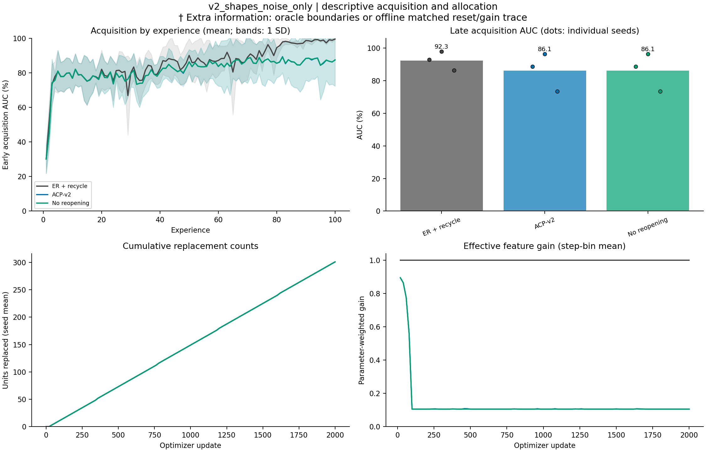

# v2_shapes_noise_only: completed-run diagnostics

Completed **9/9** runs: 3 methods x 3 seeds (101, 202, 303). Evaluation split: **validation**.

All table summaries are equal-weight seed means. Method order follows the manifest. Per-seed values, sample SDs, metric counts, source hashes, and full detector audits are in `diagnostics.json`.

A dagger (†) marks an **extra-information diagnostic**: oracle change times or offline allocation traces.

| Method | Seeds | Final accuracy (%) | Late early AUC (%) | Scratch gap (pp) | Input-centroid accuracy (%) |
|---|---:|---:|---:|---:|---:|
| er_recycle | 3 | 99.43 | 92.32 | +65.49 | 32.40 |
| acp_v2 | 3 | 86.90 | 86.12 | +59.29 | 32.40 |
| acp_v2_no_reopening | 3 | 86.67 | 86.14 | +59.32 | 32.40 |

The input-centroid column is an evaluator-only classifier using the final replay reservoir. Scratch gap subtracts a fresh model's acquisition AUC on the identical experience.

| Method | Unit resets | Mean gain | Sum data-update L2 | Local maturations | Useful local consolidations | Final mean c | Reopenings | Sensor bytes |
|---|---:|---:|---:|---:|---:|---:|---:|---:|---:|
| er_recycle | 301.0 | 1.0000 | 157.171 | 0.0 | 0.0 | 0.0000 | 0.0 | 0 |
| acp_v2 | 301.0 | 0.1319 | 34.200 | 295.0 | 234.0 | 0.1487 | 3.0 | 12544 |
| acp_v2_no_reopening | 301.0 | 0.1317 | 33.574 | 295.0 | 233.3 | 0.1259 | 0.0 | 12544 |

Mean gain covers every optimizer step and weights feature parameters within a step. Summed data-update L2 is path length, not net displacement; it excludes classifier, decay, and anchor forces. Final mean c summarizes final consolidation rather than averaging over time.

Detector proximity below pools counts across seeds. The recorded tolerance is in optimizer updates; these are descriptive proximity counts rather than calibrated detector scores.

| Method | Reopenings | Changes with nearby reopening / post-warmup changes | Reopenings outside change windows | Mean nearby delay (steps) |
|---|---:|---:|---:|---:|
| er_recycle | 0 | 0 / 0 | 0 | n/a |
| acp_v2 | 9 | 0 / 0 | 9 | n/a |
| acp_v2_no_reopening | 0 | 0 / 0 | 0 | n/a |

Per-seed results:

| Method | Seed | Final accuracy (%) | Late AUC (%) | Scratch gap (pp) | Unit resets | Mean gain | Local maturations | Reopenings |
|---|---:|---:|---:|---:|---:|---:|---:|---:|
| er_recycle | 101 | 99.52 | 92.92 | +65.47 | 301 | 1.0000 | 0 | 0 |
| er_recycle | 202 | 99.67 | 97.79 | +72.07 | 301 | 1.0000 | 0 | 0 |
| er_recycle | 303 | 99.09 | 86.25 | +58.93 | 301 | 1.0000 | 0 | 0 |
| acp_v2 | 101 | 88.74 | 88.66 | +61.21 | 301 | 0.1260 | 295 | 3 |
| acp_v2 | 202 | 99.62 | 96.28 | +70.56 | 301 | 0.1347 | 295 | 0 |
| acp_v2 | 303 | 72.32 | 73.43 | +46.11 | 301 | 0.1351 | 295 | 6 |
| acp_v2_no_reopening | 101 | 88.65 | 88.69 | +61.23 | 301 | 0.1257 | 295 | 0 |
| acp_v2_no_reopening | 202 | 99.62 | 96.28 | +70.56 | 301 | 0.1347 | 295 | 0 |
| acp_v2_no_reopening | 303 | 71.75 | 73.47 | +46.15 | 301 | 0.1347 | 295 | 0 |

The figure uses a fixed condition order. Curves show seed means; AUC bands show one sample SD when multiple seeds exist. Bars show late AUC means and dots show individual seeds. No inferential comparison is computed.

Training source SHA-256: `67ae36402607f257f1e55c4f3ef2bbb477a88555d2111a4bd0139e27668eee0a`.
