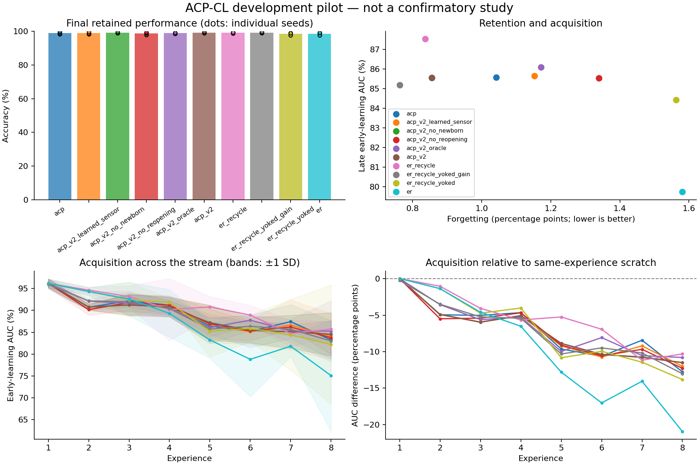

# Exploratory experiment results

Evaluation split: **validation**. Values below are percentages or percentage points.
These runs test implementation and generate hypotheses; they are not confirmatory evidence.

| Method | Seeds | Final accuracy | Forgetting | Late early AUC | Scratch-adjusted AUC | Seconds/run |
|---|---:|---:|---:|---:|---:|---:|
| acp | 3 | 99.06 | 1.04 | 85.58 | -10.37 | 7.6 |
| acp_v2_learned_sensor | 3 | 98.93 | 1.15 | 85.65 | -10.30 | 8.4 |
| acp_v2_no_newborn | 3 | 99.20 | 0.86 | 85.57 | -10.38 | 7.9 |
| acp_v2_no_reopening | 3 | 98.78 | 1.34 | 85.54 | -10.41 | 8.9 |
| acp_v2_oracle | 3 | 98.96 | 1.17 | 86.10 | -9.85 | 9.1 |
| acp_v2 | 3 | 99.20 | 0.86 | 85.56 | -10.39 | 8.6 |
| er_recycle | 3 | 99.25 | 0.84 | 87.54 | -8.42 | 7.3 |
| er_recycle_yoked_gain | 3 | 99.27 | 0.76 | 85.19 | -10.76 | 7.6 |
| er_recycle_yoked | 3 | 98.62 | 1.56 | 84.43 | -11.52 | 7.6 |
| er | 3 | 98.60 | 1.58 | 79.73 | -16.22 | 7.3 |

Paired acp_v2 differences (95% unadjusted percentile bootstrap intervals; small-seed intervals are unstable):

| Comparator | Endpoint | Pairs | Difference [95% CI], pp |
|---|---|---:|---:|
| acp_v2 - acp | final_accuracy | 3 | +0.15 [-0.20, +0.63] |
| acp_v2 - acp | forgetting | 3 | -0.19 [-0.67, +0.11] |
| acp_v2 - acp | late_early_auc | 3 | -0.01 [-0.70, +0.43] |
| acp_v2 - acp | late_plasticity_gap | 3 | -0.01 [-0.70, +0.43] |
| acp_v2 - acp_v2_learned_sensor | final_accuracy | 3 | +0.28 [-0.05, +0.73] |
| acp_v2 - acp_v2_learned_sensor | forgetting | 3 | -0.30 [-0.84, +0.06] |
| acp_v2 - acp_v2_learned_sensor | late_early_auc | 3 | -0.09 [-0.48, +0.11] |
| acp_v2 - acp_v2_learned_sensor | late_plasticity_gap | 3 | -0.09 [-0.48, +0.11] |
| acp_v2 - acp_v2_no_newborn | final_accuracy | 3 | +0.00 [+0.00, +0.00] |
| acp_v2 - acp_v2_no_newborn | forgetting | 3 | +0.00 [+0.00, +0.00] |
| acp_v2 - acp_v2_no_newborn | late_early_auc | 3 | -0.00 [-0.03, +0.02] |
| acp_v2 - acp_v2_no_newborn | late_plasticity_gap | 3 | -0.00 [-0.03, +0.02] |
| acp_v2 - acp_v2_no_reopening | final_accuracy | 3 | +0.42 [+0.10, +1.03] |
| acp_v2 - acp_v2_no_reopening | forgetting | 3 | -0.48 [-1.06, -0.17] |
| acp_v2 - acp_v2_no_reopening | late_early_auc | 3 | +0.02 [-1.40, +1.09] |
| acp_v2 - acp_v2_no_reopening | late_plasticity_gap | 3 | +0.02 [-1.40, +1.09] |
| acp_v2 - acp_v2_oracle | final_accuracy | 3 | +0.24 [+0.10, +0.39] |
| acp_v2 - acp_v2_oracle | forgetting | 3 | -0.32 [-0.45, -0.11] |
| acp_v2 - acp_v2_oracle | late_early_auc | 3 | -0.53 [-1.69, +0.78] |
| acp_v2 - acp_v2_oracle | late_plasticity_gap | 3 | -0.53 [-1.69, +0.78] |
| acp_v2 - er_recycle | final_accuracy | 3 | -0.05 [-0.39, +0.20] |
| acp_v2 - er_recycle | forgetting | 3 | +0.02 [-0.28, +0.50] |
| acp_v2 - er_recycle | late_early_auc | 3 | -1.97 [-5.51, +0.37] |
| acp_v2 - er_recycle | late_plasticity_gap | 3 | -1.97 [-5.51, +0.37] |
| acp_v2 - er_recycle_yoked_gain | final_accuracy | 3 | -0.07 [-0.20, +0.00] |
| acp_v2 - er_recycle_yoked_gain | forgetting | 3 | +0.09 [-0.06, +0.22] |
| acp_v2 - er_recycle_yoked_gain | late_early_auc | 3 | +0.37 [-2.53, +2.15] |
| acp_v2 - er_recycle_yoked_gain | late_plasticity_gap | 3 | +0.37 [-2.53, +2.15] |
| acp_v2 - er_recycle_yoked | final_accuracy | 3 | +0.59 [+0.00, +1.22] |
| acp_v2 - er_recycle_yoked | forgetting | 3 | -0.71 [-1.40, +0.00] |
| acp_v2 - er_recycle_yoked | late_early_auc | 3 | +1.13 [-1.64, +2.99] |
| acp_v2 - er_recycle_yoked | late_plasticity_gap | 3 | +1.13 [-1.64, +2.99] |
| acp_v2 - er | final_accuracy | 3 | +0.60 [+0.20, +1.37] |
| acp_v2 - er | forgetting | 3 | -0.73 [-1.56, -0.22] |
| acp_v2 - er | late_early_auc | 3 | +5.83 [+4.24, +7.57] |
| acp_v2 - er | late_plasticity_gap | 3 | +5.83 [+4.24, +7.57] |

Lower forgetting is better; higher accuracy and acquisition AUC are better.
Methods with oracle boundaries or offline yoked traces are extra-information diagnostics, not task-free competitors.
Scratch-adjusted AUC subtracts a fresh model's AUC on the identical experience; it is a diagnostic, not pure transfer.
Timing includes evaluation, diagnostics, and checkpoint writes. It is not a matched-compute comparison.
The recycling and DER++ comparators are explicitly documented implementation variants.

