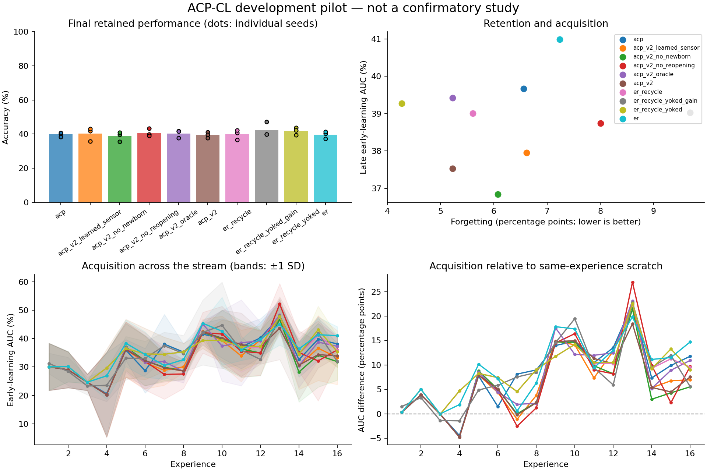

# Exploratory experiment results

Evaluation split: **validation**. Values below are percentages or percentage points.
These runs test implementation and generate hypotheses; they are not confirmatory evidence.

| Method | Seeds | Final accuracy | Forgetting | Late early AUC | Scratch-adjusted AUC | Seconds/run |
|---|---:|---:|---:|---:|---:|---:|
| acp | 3 | 39.75 | 6.56 | 39.66 | 13.05 | 8.2 |
| acp_v2_learned_sensor | 3 | 40.25 | 6.61 | 37.95 | 11.33 | 10.0 |
| acp_v2_no_newborn | 3 | 38.67 | 6.08 | 36.83 | 10.21 | 9.8 |
| acp_v2_no_reopening | 3 | 40.67 | 8.00 | 38.74 | 12.12 | 9.7 |
| acp_v2_oracle | 3 | 40.33 | 5.23 | 39.42 | 12.80 | 10.2 |
| acp_v2 | 3 | 39.47 | 5.23 | 37.52 | 10.90 | 10.4 |
| er_recycle | 3 | 39.84 | 5.61 | 39.01 | 12.39 | 7.7 |
| er_recycle_yoked_gain | 3 | 42.35 | 9.69 | 39.03 | 12.41 | 7.9 |
| er_recycle_yoked | 3 | 41.78 | 4.27 | 39.27 | 12.65 | 7.8 |
| er | 3 | 39.55 | 7.24 | 40.98 | 14.36 | 7.4 |

Paired acp_v2 differences (95% unadjusted percentile bootstrap intervals; small-seed intervals are unstable):

| Comparator | Endpoint | Pairs | Difference [95% CI], pp |
|---|---|---:|---:|
| acp_v2 - acp | final_accuracy | 3 | -0.28 [-2.44, +1.32] |
| acp_v2 - acp | forgetting | 3 | -1.34 [-5.83, +4.32] |
| acp_v2 - acp | late_early_auc | 3 | -2.14 [-2.83, -0.98] |
| acp_v2 - acp | late_plasticity_gap | 3 | -2.14 [-2.83, -0.98] |
| acp_v2 - acp_v2_learned_sensor | final_accuracy | 3 | -0.78 [-3.42, +1.86] |
| acp_v2 - acp_v2_learned_sensor | forgetting | 3 | -1.39 [-2.45, +0.31] |
| acp_v2 - acp_v2_learned_sensor | late_early_auc | 3 | -0.42 [-3.81, +2.66] |
| acp_v2 - acp_v2_learned_sensor | late_plasticity_gap | 3 | -0.42 [-3.81, +2.66] |
| acp_v2 - acp_v2_no_newborn | final_accuracy | 3 | +0.80 [-1.17, +2.20] |
| acp_v2 - acp_v2_no_newborn | forgetting | 3 | -0.85 [-2.14, +0.00] |
| acp_v2 - acp_v2_no_newborn | late_early_auc | 3 | +0.69 [-1.51, +2.32] |
| acp_v2 - acp_v2_no_newborn | late_plasticity_gap | 3 | +0.69 [-1.51, +2.32] |
| acp_v2 - acp_v2_no_reopening | final_accuracy | 3 | -1.20 [-2.20, +0.63] |
| acp_v2 - acp_v2_no_reopening | forgetting | 3 | -2.78 [-8.96, +1.67] |
| acp_v2 - acp_v2_no_reopening | late_early_auc | 3 | -1.21 [-3.78, +1.03] |
| acp_v2 - acp_v2_no_reopening | late_plasticity_gap | 3 | -1.21 [-3.78, +1.03] |
| acp_v2 - acp_v2_oracle | final_accuracy | 3 | -0.86 [-1.90, +0.10] |
| acp_v2 - acp_v2_oracle | forgetting | 3 | -0.00 [-0.83, +1.61] |
| acp_v2 - acp_v2_oracle | late_early_auc | 3 | -1.90 [-2.51, -1.34] |
| acp_v2 - acp_v2_oracle | late_plasticity_gap | 3 | -1.90 [-2.51, -1.34] |
| acp_v2 - er_recycle | final_accuracy | 3 | -0.37 [-2.49, +1.07] |
| acp_v2 - er_recycle | forgetting | 3 | -0.38 [-2.50, +1.25] |
| acp_v2 - er_recycle | late_early_auc | 3 | -1.48 [-2.83, +0.12] |
| acp_v2 - er_recycle | late_plasticity_gap | 3 | -1.48 [-2.83, +0.12] |
| acp_v2 - er_recycle_yoked_gain | final_accuracy | 3 | -2.88 [-6.20, -0.29] |
| acp_v2 - er_recycle_yoked_gain | forgetting | 3 | -4.46 [-14.64, +3.07] |
| acp_v2 - er_recycle_yoked_gain | late_early_auc | 3 | -1.51 [-6.81, +1.68] |
| acp_v2 - er_recycle_yoked_gain | late_plasticity_gap | 3 | -1.51 [-6.81, +1.68] |
| acp_v2 - er_recycle_yoked | final_accuracy | 3 | -2.31 [-2.73, -1.66] |
| acp_v2 - er_recycle_yoked | forgetting | 3 | +0.95 [-1.46, +2.60] |
| acp_v2 - er_recycle_yoked | late_early_auc | 3 | -1.75 [-3.47, -0.27] |
| acp_v2 - er_recycle_yoked | late_plasticity_gap | 3 | -1.75 [-3.47, -0.27] |
| acp_v2 - er | final_accuracy | 3 | -0.08 [-2.49, +2.49] |
| acp_v2 - er | forgetting | 3 | -2.01 [-8.44, +4.32] |
| acp_v2 - er | late_early_auc | 3 | -3.46 [-5.30, -1.22] |
| acp_v2 - er | late_plasticity_gap | 3 | -3.46 [-5.30, -1.22] |

Lower forgetting is better; higher accuracy and acquisition AUC are better.
Methods with oracle boundaries or offline yoked traces are extra-information diagnostics, not task-free competitors.
Scratch-adjusted AUC subtracts a fresh model's AUC on the identical experience; it is a diagnostic, not pure transfer.
Timing includes evaluation, diagnostics, and checkpoint writes. It is not a matched-compute comparison.
The recycling and DER++ comparators are explicitly documented implementation variants.

