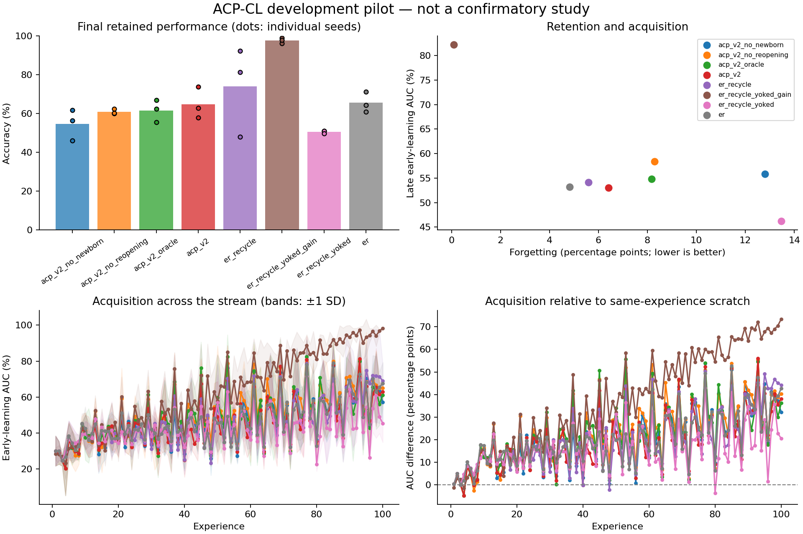

# Exploratory experiment results

Evaluation split: **validation**. Values below are percentages or percentage points.
These runs test implementation and generate hypotheses; they are not confirmatory evidence.

| Method | Seeds | Final accuracy | Forgetting | Late early AUC | Scratch-adjusted AUC | Seconds/run |
|---|---:|---:|---:|---:|---:|---:|
| acp_v2_no_newborn | 3 | 54.71 | 12.80 | 55.84 | 29.29 | 63.9 |
| acp_v2_no_reopening | 3 | 60.98 | 8.29 | 58.37 | 31.81 | 66.4 |
| acp_v2_oracle | 3 | 61.65 | 8.16 | 54.83 | 28.28 | 67.2 |
| acp_v2 | 3 | 64.83 | 6.41 | 53.05 | 26.50 | 67.8 |
| er_recycle | 3 | 73.98 | 5.59 | 54.14 | 27.58 | 51.4 |
| er_recycle_yoked_gain | 3 | 97.71 | 0.10 | 82.20 | 55.64 | 48.5 |
| er_recycle_yoked | 3 | 50.58 | 13.46 | 46.21 | 19.65 | 49.4 |
| er | 3 | 65.57 | 4.83 | 53.23 | 26.68 | 49.7 |

Paired acp_v2 differences (95% unadjusted percentile bootstrap intervals; small-seed intervals are unstable):

| Comparator | Endpoint | Pairs | Difference [95% CI], pp |
|---|---|---:|---:|
| acp_v2 - acp_v2_no_newborn | final_accuracy | 3 | +10.12 [-3.91, +27.81] |
| acp_v2 - acp_v2_no_newborn | forgetting | 3 | -6.39 [-18.06, +3.59] |
| acp_v2 - acp_v2_no_newborn | late_early_auc | 3 | -2.79 [-7.66, -0.26] |
| acp_v2 - acp_v2_no_newborn | late_plasticity_gap | 3 | -2.79 [-7.66, -0.26] |
| acp_v2 - acp_v2_no_reopening | final_accuracy | 3 | +3.85 [-2.58, +13.78] |
| acp_v2 - acp_v2_no_reopening | forgetting | 3 | -1.88 [-8.70, +1.63] |
| acp_v2 - acp_v2_no_reopening | late_early_auc | 3 | -5.31 [-7.37, -1.97] |
| acp_v2 - acp_v2_no_reopening | late_plasticity_gap | 3 | -5.31 [-7.38, -1.97] |
| acp_v2 - acp_v2_oracle | final_accuracy | 3 | +3.18 [+0.34, +7.04] |
| acp_v2 - acp_v2_oracle | forgetting | 3 | -1.75 [-2.82, -0.28] |
| acp_v2 - acp_v2_oracle | late_early_auc | 3 | -1.78 [-9.15, +3.85] |
| acp_v2 - acp_v2_oracle | late_plasticity_gap | 3 | -1.78 [-9.15, +3.85] |
| acp_v2 - er_recycle | final_accuracy | 3 | -9.15 [-29.63, +9.71] |
| acp_v2 - er_recycle | forgetting | 3 | +0.82 [-4.68, +7.69] |
| acp_v2 - er_recycle | late_early_auc | 3 | -1.09 [-13.25, +11.11] |
| acp_v2 - er_recycle | late_plasticity_gap | 3 | -1.09 [-13.25, +11.11] |
| acp_v2 - er_recycle_yoked_gain | final_accuracy | 3 | -32.88 [-40.10, -25.15] |
| acp_v2 - er_recycle_yoked_gain | forgetting | 3 | +6.31 [+0.43, +10.80] |
| acp_v2 - er_recycle_yoked_gain | late_early_auc | 3 | -29.14 [-36.26, -23.38] |
| acp_v2 - er_recycle_yoked_gain | late_plasticity_gap | 3 | -29.14 [-36.26, -23.38] |
| acp_v2 - er_recycle_yoked | final_accuracy | 3 | +14.26 [+8.13, +22.88] |
| acp_v2 - er_recycle_yoked | forgetting | 3 | -7.05 [-7.78, -5.68] |
| acp_v2 - er_recycle_yoked | late_early_auc | 3 | +6.85 [+3.91, +9.71] |
| acp_v2 - er_recycle_yoked | late_plasticity_gap | 3 | +6.85 [+3.91, +9.71] |
| acp_v2 - er | final_accuracy | 3 | -0.73 [-8.43, +9.41] |
| acp_v2 - er | forgetting | 3 | +1.58 [-3.20, +5.58] |
| acp_v2 - er | late_early_auc | 3 | -0.18 [-3.70, +3.21] |
| acp_v2 - er | late_plasticity_gap | 3 | -0.18 [-3.70, +3.21] |

Lower forgetting is better; higher accuracy and acquisition AUC are better.
Methods with oracle boundaries or offline yoked traces are extra-information diagnostics, not task-free competitors.
Scratch-adjusted AUC subtracts a fresh model's AUC on the identical experience; it is a diagnostic, not pure transfer.
Timing includes evaluation, diagnostics, and checkpoint writes. It is not a matched-compute comparison.
The recycling and DER++ comparators are explicitly documented implementation variants.

