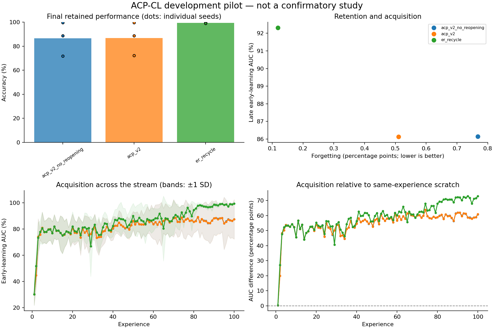

# Exploratory experiment results

Evaluation split: **validation**. Values below are percentages or percentage points.
These runs test implementation and generate hypotheses; they are not confirmatory evidence.

| Method | Seeds | Final accuracy | Forgetting | Late early AUC | Scratch-adjusted AUC | Seconds/run |
|---|---:|---:|---:|---:|---:|---:|
| acp_v2_no_reopening | 3 | 86.67 | 0.77 | 86.14 | 59.32 | 70.5 |
| acp_v2 | 3 | 86.90 | 0.51 | 86.12 | 59.29 | 70.1 |
| er_recycle | 3 | 99.43 | 0.12 | 92.32 | 65.49 | 56.3 |

Paired acp_v2 differences (95% unadjusted percentile bootstrap intervals; small-seed intervals are unstable):

| Comparator | Endpoint | Pairs | Difference [95% CI], pp |
|---|---|---:|---:|
| acp_v2 - acp_v2_no_reopening | final_accuracy | 3 | +0.22 [+0.00, +0.57] |
| acp_v2 - acp_v2_no_reopening | forgetting | 3 | -0.26 [-0.69, +0.00] |
| acp_v2 - acp_v2_no_reopening | late_early_auc | 3 | -0.02 [-0.04, +0.00] |
| acp_v2 - acp_v2_no_reopening | late_plasticity_gap | 3 | -0.02 [-0.04, +0.00] |
| acp_v2 - er_recycle | final_accuracy | 3 | -12.53 [-26.77, -0.05] |
| acp_v2 - er_recycle | forgetting | 3 | +0.39 [-0.01, +1.09] |
| acp_v2 - er_recycle | late_early_auc | 3 | -6.20 [-12.82, -1.51] |
| acp_v2 - er_recycle | late_plasticity_gap | 3 | -6.20 [-12.82, -1.51] |

Lower forgetting is better; higher accuracy and acquisition AUC are better.
Methods with oracle boundaries or offline yoked traces are extra-information diagnostics, not task-free competitors.
Scratch-adjusted AUC subtracts a fresh model's AUC on the identical experience; it is a diagnostic, not pure transfer.
Timing includes evaluation, diagnostics, and checkpoint writes. It is not a matched-compute comparison.
The recycling and DER++ comparators are explicitly documented implementation variants.

