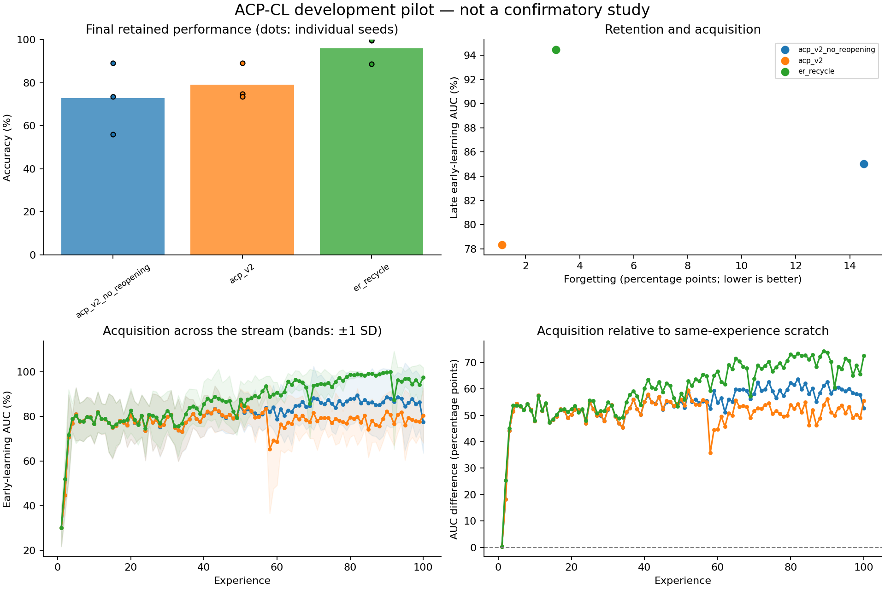

# Exploratory experiment results

Evaluation split: **validation**. Values below are percentages or percentage points.
These runs test implementation and generate hypotheses; they are not confirmatory evidence.

| Method | Seeds | Final accuracy | Forgetting | Late early AUC | Scratch-adjusted AUC | Seconds/run |
|---|---:|---:|---:|---:|---:|---:|
| acp_v2_no_reopening | 3 | 72.93 | 14.52 | 85.03 | 58.31 | 73.2 |
| acp_v2 | 3 | 79.20 | 1.12 | 78.31 | 51.59 | 71.8 |
| er_recycle | 3 | 96.10 | 3.12 | 94.48 | 67.76 | 52.8 |

Paired acp_v2 differences (95% unadjusted percentile bootstrap intervals; small-seed intervals are unstable):

| Comparator | Endpoint | Pairs | Difference [95% CI], pp |
|---|---|---:|---:|
| acp_v2 - acp_v2_no_reopening | final_accuracy | 3 | +6.26 [+0.02, +18.72] |
| acp_v2 - acp_v2_no_reopening | forgetting | 3 | -13.40 [-40.17, +0.02] |
| acp_v2 - acp_v2_no_reopening | late_early_auc | 3 | -6.72 [-20.39, +0.14] |
| acp_v2 - acp_v2_no_reopening | late_plasticity_gap | 3 | -6.72 [-20.39, +0.14] |
| acp_v2 - er_recycle | final_accuracy | 3 | -16.91 [-26.23, +0.50] |
| acp_v2 - er_recycle | forgetting | 3 | -2.00 [-8.95, +2.92] |
| acp_v2 - er_recycle | late_early_auc | 3 | -16.18 [-25.50, -2.62] |
| acp_v2 - er_recycle | late_plasticity_gap | 3 | -16.18 [-25.50, -2.62] |

Lower forgetting is better; higher accuracy and acquisition AUC are better.
Methods with oracle boundaries or offline yoked traces are extra-information diagnostics, not task-free competitors.
Scratch-adjusted AUC subtracts a fresh model's AUC on the identical experience; it is a diagnostic, not pure transfer.
Timing includes evaluation, diagnostics, and checkpoint writes. It is not a matched-compute comparison.
The recycling and DER++ comparators are explicitly documented implementation variants.

