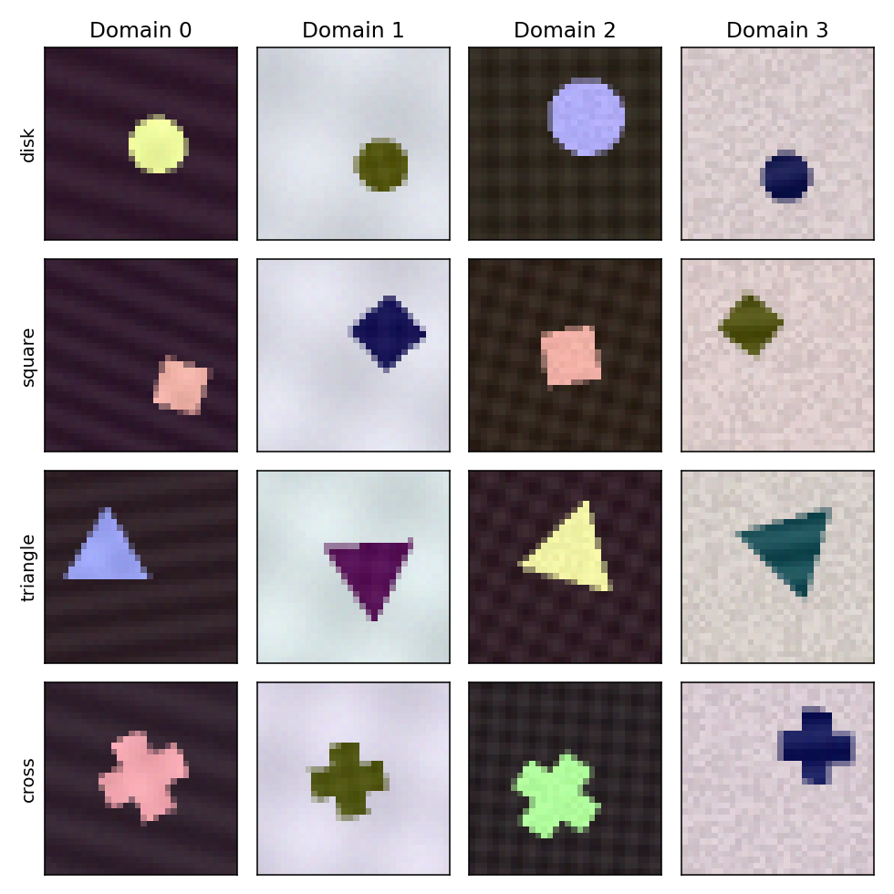

# V2 mechanism study

Completed: **102 comparative runs, 972 per-experience scratch fits, and one
exact instrumented failure reproduction**. All five planned suites finished
with three paired development seeds. No configuration was selected using the
long-run outcomes. These are exploratory results, not confirmatory evidence.

**The present v2 policy does not establish an advantage over replay plus
recycling.** The most informative result is that a simpler constant feature
gain, with exactly v2's reset counts and the same average nominal gain, performs
much better. Its advantage survives removal of the color shortcut. This points
toward revising plasticity allocation and early representation learning before
investing in a more elaborate novelty detector.

## Main result: 100 recurring-domain experiences

Seed means; higher final accuracy and acquisition AUC are better:

| Method | Final accuracy | Late acquisition AUC |
|---|---:|---:|
| Replay | 65.57% | 53.23% |
| Replay + recycling | 73.98% | 54.14% |
| ACP-v2 | 64.83% | 53.05% |
| No newborn mechanism | 54.71% | 55.84% |
| No mature reopening | 60.98% | 58.37% |
| Boundary oracle (diagnostic) | 61.65% | 54.83% |
| Matched reset counts/times (diagnostic) | 50.58% | 46.21% |
| Matched reset counts/times + constant mean gain (diagnostic) | **97.71%** | **82.20%** |

The strongest control uses the completed v2 run's trace, including its future
average gain. It is an extra-information diagnostic, not a deployable task-free
baseline or evidence of a fully tuned algorithm. It matches 172.3 unit resets
per run on average and a 0.1368 average feature multiplier. Unrestricted replay
plus recycling uses 301 unit resets and gain 1. Actual gradient displacements differ.
Controls choose their own low-utility units; reset identities are not matched.

The unrestricted comparator is variable: its final accuracies are 92.42%,
81.42%, and 48.10%. V2 averages 9.15 points lower, but the three-pair exploratory
bootstrap interval spans -29.63 to +9.71 points. A universal superiority claim
is unwarranted. In contrast, the constant-gain diagnostic wins both reported
endpoints on all three seeds.

Removing newborn maturation lowers mean final accuracy but raises late AUC;
that is a tradeoff, not unqualified support for newborn periods. Removing mature
reopening raises late AUC on every seed, by 5.31 points on average. The active
oracle averages 64 reopenings per run versus v2's 49.3. It improves late AUC by
1.78 points but lowers final accuracy by 3.18 points. Better boundary timing
alone therefore does not rescue this policy under the tested pulse constraints.

[All paired results and intervals](v2/shapes_long/summary.md),
[allocation and detector diagnostics](v2/diagnostics/v2_shapes_long/diagnostics.md).

## Does the result depend on a synthetic shortcut?

The final replay-buffer centroid classifier scores 25.08% on the long shape
stream, close to 25% chance. More importantly, fresh post-hoc renders remove
foreground color-label correlation while retaining paired shape geometry:

| Method | Fresh original domains | Colors independent of labels |
|---|---:|---:|
| Replay + recycling | 74.19% | 61.38% |
| ACP-v2 | 65.01% | 37.45% |
| Boundary oracle (diagnostic) | 62.09% | 32.19% |
| Matched reset/gain control (diagnostic) | **97.43%** | **95.39%** |

The constant-gain control's improvement is not explained solely by the color
cue tested here. V2 remains much more sensitive to that cue. Early closure
protecting immature or shortcut-based representations is a plausible explanation,
not an identified causal mechanism. Other generator shortcuts remain possible.
The audit uses 2,048 fresh images per seed and rendering condition, evenly
weighted across eight domains; it is distinct from the training study's final
validation measure. [Complete color audit](v2/shortcuts_long/shortcut_audit.md).

## What changed

The revised learner gives reset units their own brief gain schedule and local
consolidation, measures input drift through a frozen sensor, and records actual
reset counts and update multipliers. All v2 variants share a fixed initial
developmental schedule, followed by the tested mature reopening policy.
The boundary oracle, no-newborn/no-reopening ablations, and two offline reset/
gain controls test parts of that design. See the [protocol](../docs/experiment_v2.md)
and [equations and implementation details](../docs/algorithm_v2.md).

The new stream has four fixed shape labels and eight recurring rendering
domains. Training presents fresh images once, with a bounded 256-image replay
buffer. Each experience supplies 640 current examples; acquisition AUC uses
the first 256. Full retention evaluation occurs every ten experiences and at
the end. Sparse forgetting is a lower bound on densely measured forgetting.

## Completed short studies

Three paired development seeds, 101, 202, and 303:

| Stream | ER + recycling final | V2 final | ER + recycling late AUC | V2 late AUC |
|---|---:|---:|---:|---:|
| Gaussian audit, 8 experiences | 99.25% | 99.20% | 87.54% | 85.56% |
| Shapes, 16 experiences | 39.84% | 39.47% | 39.01% | 37.52% |

The Gaussian replay-buffer centroid classifier reaches 100% for every seed.
The final shape-buffer centroid classifier averages 24.67%, around 25% chance.
The simple Gaussian geometry was therefore a real limitation of the original
experiment. Replacing it does not, by itself, establish a benefit for v2.

The post-hoc short-shape color audit provides a stronger caution: ER + recycling
falls from 39.52% on fresh original-domain images to 25.70% when foreground
colors are independent of labels. V2 falls from 39.03% to 25.81%; the oracle
falls from 40.28% to 25.50%. These early models mostly exploit the color cue.
Audit geometry is paired; branch-dependent jitter/noise realizations differ
while their distributions remain fixed. This is an exploratory shortcut
diagnostic, not confirmatory held-out performance.

Full artifacts: [Gaussian comparisons](v2/gaussian/summary.md),
[shape development comparisons](v2/shapes_development/summary.md),
[Gaussian mechanisms](v2/diagnostics/v2_gaussian/diagnostics.md),
[shape mechanisms](v2/diagnostics/v2_shapes_development/diagnostics.md), and
[short-run color audit](v2/shortcuts_development/shortcut_audit.md).

## Stationary and noise-only controls

All nine runs in each 100-experience control are complete:

| Condition | ER + recycling final / late AUC | V2 final / late AUC | No reopening final / late AUC |
|---|---:|---:|---:|
| Stationary | 96.10% / 94.48% | 79.20% / 78.31% | 72.93% / 85.03% |
| Noise only | 99.43% / 92.32% | 86.90% / 86.12% | 86.67% / 86.14% |

V2 produces 2, 2, and 4 reopenings in stationary runs, and 3, 0, and 6 in
noise-only runs. Infrequent activation does not establish a performance benefit.
The stationary no-reopening mean is especially sensitive to seed 202: accuracy
on the same first-90-experience validation pool falls from 99.50% at update
1800 to 55.99% at update 2000. Its final experience also oscillates substantially.
Paired replay-loss spikes occur both at and between resets, so the existing
logs alone cannot attribute the collapse exclusively to recycling.

An additional instrumented CUDA reproduction matched all 13 final model-state
tensors bitwise, plus allocation traces, acquisition curves, cost counters,
and controller state. On the fixed 128-example final-experience validation set,
all ten reset events (30 units) in updates 1801-2000 changed accuracy by 0.00 percentage points.
At update 1980, the optimizer step reduced accuracy from 97.66% to 60.16%; the
following reset made no further accuracy change. The largest single-update
drop was 47.66 points at update 1982, when no reset occurred. This identifies
immediate update instability on that sample. It does not rule out later
effects of earlier recycling or newborn gain.

The replay guard contracts mature feature gates after sampled damage; it
does not roll back updates, constrain the full-rate classifier, or suppress
the newborn gain exception. The current guard therefore does not establish
stability. See the [exact failure audit](v2/reset_damage/instrumented_audit.md)
and [all stationary endpoint comparisons](v2/reset_damage/endpoint_audit.md).

See [stationary comparisons](v2/shapes_stationary/summary.md) and
[noise-only comparisons](v2/shapes_noise_only/summary.md). Full acquisition
curves and late AUC should accompany final snapshots; endpoint failure is
preserved in the results rather than omitted as an outlier.

## Interpretation rules

The oracle is a bounded timing-information diagnostic, not an optimal policy
or an upper bound. It can drop or expire notifications. The constant-gain
control also changes initial development, so differences cannot isolate adult
timing alone. Newborn removal changes gain, eligibility, and consolidation.
Gain matching is nominal and parameter-weighted, not matched displacement.

Noise-only changes the input distribution even though the signal domain stays
fixed; openings are nuisance responsiveness, not automatically statistical
false positives. One hundred experiences across eight recurring domains test
prolonged recurrence, not one hundred novel domains or indefinite plasticity.
The first sixteen experiences of the long run reuse the development prefix;
the long run is not an independent held-out cohort. Three-seed intervals are
descriptive and unadjusted.

All runs use validation data. Reopening sees no evaluation measurements;
ordinary methods receive no boundaries. Oracle and yoked conditions are
labeled extra-information diagnostics throughout. Simultaneous local jobs
share hardware, so wall times are not a controlled compute comparison.

## Suggested next experiment

Do not scale the current global closure/reopening policy unchanged. Use the
constant-gain finding to simplify the next comparison:

1. Establish a task-free replay/recycling baseline with a fixed feature gain
   chosen on separate development seeds, then locked. The winning diagnostic
   here uses future information and cannot serve as that baseline directly.
2. Give every condition identical initial warmup. Compare ordinary recycling
   with local newborn gain/maturation while keeping the mature backbone's
   update rule fixed. Match actual reset counts and the post-warmup nominal
   gain budget; separate gain, protection, and consolidation ablations.
3. Diagnose and bound damaging updates across the classifier and newborn rows
   as well as mature features. Apply shared stability controls to comparators;
   a delayed feature-only gate cannot guarantee stable predictions.
4. Repeat with color independent of class throughout training, and with an
   explicitly biased early curriculum. This directly tests whether early
   consolidation entrenches shortcuts. Keep recurrent, stationary, and noise
   controls and report full trajectories rather than only endpoint accuracy.
5. Move to an established benchmark and new seeds after a component improves
   the tuned task-free comparator without repeating stationary instability.

This keeps the local developmental-window hypothesis testable while removing
the coupled global schedule that currently obscures its effect.

## Reproducibility and implementation checks

All planned training used local commit `ad09b75`, with source SHA-256
`67ae36402607f257f1e55c4f3ef2bbb477a88555d2111a4bd0139e27668eee0a`.
The environment was Python 3.10.11, PyTorch 2.8.0+cu128, NumPy 2.2.6, and an
RTX 4070 Ti; the Gaussian audit ran on CPU and image studies on CUDA.
The [run inventory](v2/run_inventory.json) records all configurations and counts.
Raw checkpoints, events, allocation traces, and scratch curves remain in the
ignored `runs/v2_*` directories. Compact artifacts are committed with this report.

Actual checkpoint audits verified identical replay tensors, membership and
sampling RNGs, and training exposures across all compared methods for each
seed. Long runs reproduce the short runs' complete 320-update prefixes exactly
where the policy is prefix-independent; the constant-gain diagnostic is excluded
because its gain depends on the completed horizon. Exact reset schedule and
gain-budget checks also pass. [Long-run pairing audit](v2/shapes_long/pairing_checks.json).

The completed implementation passes **271 tests** and Ruff. Subsequent
runtime-provenance hardening leaves learning rules unchanged but intentionally
changes the source hash: new runs reject changed Python/library/CUDA runtime
identities before resuming. Historical results remain analyzable. Reproducing
or resuming these archived training trajectories requires their recorded source
and runtime; current-source experiments should use fresh output directories.
