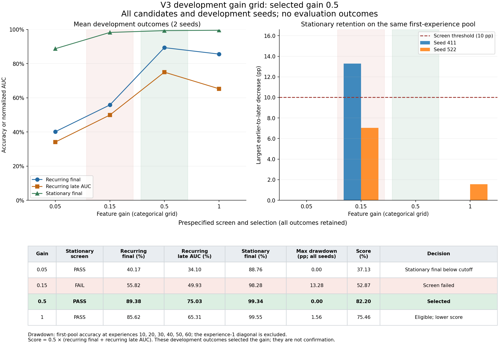

# V3 development gain selection

The prespecified rule selected feature gain **0.5**.

All 16 completed runs are included: 4 gains × 2 regimes × 2 seeds (411, 522). Every run uses `recycle_v3`, independent colors, and the validation split. These outcomes were used for selection; they are not confirmatory evaluation.

Values are percentages, except drawdown in percentage points. CSV values retain the original 0–1 scale.

| Gain | Stationary screen | Recurring final | Recurring late AUC | Stationary final | Max drawdown | Score | Decision |
|---:|:---:|---:|---:|---:|---:|---:|---|
| 0.05 | PASS | 40.17 | 34.10 | 88.76 | 0.00 | 37.13 | Stationary final below cutoff |
| 0.15 | FAIL | 55.82 | 49.93 | 98.28 | 13.28 | 52.87 | Screen failed |
| 0.5 | PASS | 89.38 | 75.03 | 99.34 | 0.00 | 82.20 | Selected |
| 1 | PASS | 85.62 | 65.31 | 99.55 | 1.56 | 75.46 | Eligible; lower score |

Drawdown is the maximum earlier-to-later loss on the same first-experience validation pool at experiences 10, 20, 30, 40, 50, 60. The acquisition diagonal at experience 1 is excluded. Every seed must have drawdown ≤ 10 pp. Passing candidates must then be within 2 pp of the best passing stationary final mean. Among those candidates, the rule maximizes 0.5 × (mean recurring final accuracy + mean recurring late AUC); scores within 0.5 pp of the eligible maximum tie, and the smallest gain wins.

The original selection bytes are preserved in [selection.json](selection.json). Result, allocation, and manifest byte hashes were checked against that artifact before archiving. Additional event-file hashes are recorded in [archive_manifest.json](archive_manifest.json); events were not inputs to the selection score. No held-out evaluation result was read.

Selection SHA-256: `7729363726009d08d76bad1c8c67b571657eb0a7bc615cdb9d1e470ca6d21a60`.

Training source SHA-256: `cccbb40b2fe578be511f49c31d9629abd823f89bf078ccc9781b1d38c17c5efe`.

Training runtime SHA-256: `eaa3eeb6552fb64e38fa3af4a81505d5ae7a8b57ecbfe506da7a03677ccc17cf`.

Complete suite archives:

- [gain_005_recurring](gain_005_recurring/summary.md)
- [gain_005_stationary](gain_005_stationary/summary.md)
- [gain_015_recurring](gain_015_recurring/summary.md)
- [gain_015_stationary](gain_015_stationary/summary.md)
- [gain_050_recurring](gain_050_recurring/summary.md)
- [gain_050_stationary](gain_050_stationary/summary.md)
- [gain_100_recurring](gain_100_recurring/summary.md)
- [gain_100_stationary](gain_100_stationary/summary.md)

[Numeric candidate table](gain_grid.csv) · [Vector figure](gain_grid.svg)
