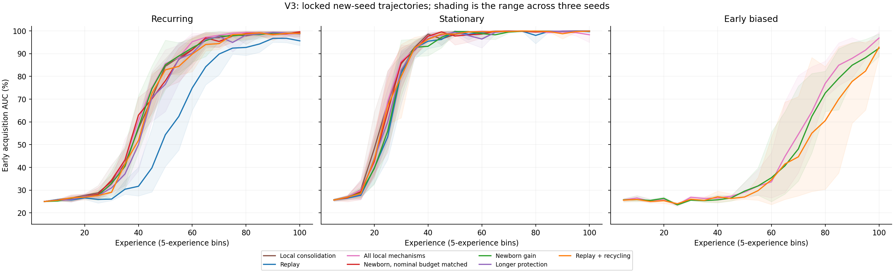

# V3 locked evaluation

Three new seeds; no parameter selection on this cohort.

Primary contrast: newborn gain minus replay + recycling on recurring late acquisition AUC.
Mean difference: +1.15 pp [95% unadjusted paired percentile bootstrap: +0.08, +3.04]. Entire seed pairs are resampled; these three-seed intervals are unstable.
Per-seed primary differences: 731: +0.08 pp, 842: +3.04 pp, 953: +0.34 pp.

| Condition | Method | Final % | Late AUC % | Max observed fixed-set drawdown, pp |
|---|---|---:|---:|---:|
| recurring | Local consolidation | 98.57 | 96.65 | 7.81 |
| recurring | Replay | 97.22 | 88.00 | 7.81 |
| recurring | All local mechanisms | 97.72 | 97.27 | 9.38 |
| recurring | Newborn, nominal budget matched | 99.43 | 96.42 | 1.56 |
| recurring | Newborn gain | 99.59 | 96.66 | 3.12 |
| recurring | Longer protection | 98.95 | 96.08 | 7.81 |
| recurring | Replay + recycling | 98.18 | 95.51 | 7.03 |
| stationary | Local consolidation | 99.97 | 99.82 | 6.25 |
| stationary | Replay | 99.95 | 99.45 | 9.38 |
| stationary | All local mechanisms | 99.93 | 99.51 | 6.25 |
| stationary | Newborn, nominal budget matched | 99.99 | 99.57 | 0.78 |
| stationary | Newborn gain | 99.98 | 99.58 | 0.00 |
| stationary | Longer protection | 99.98 | 99.33 | 7.81 |
| stationary | Replay + recycling | 99.96 | 99.68 | 3.91 |
| early_biased | All local mechanisms | 98.56 | 66.75 | 4.69 |
| early_biased | Newborn gain | 93.21 | 63.60 | 3.91 |
| early_biased | Replay + recycling | 96.16 | 58.91 | 5.47 |

Maturation and positive local consolidation counts (mean per run):

| Condition | Method | Maturations | Local consolidations |
|---|---|---:|---:|
| recurring | Local consolidation | 288.0 | 221.3 |
| recurring | Replay | 0.0 | 0.0 |
| recurring | All local mechanisms | 288.0 | 218.0 |
| recurring | Newborn, nominal budget matched | 0.0 | 0.0 |
| recurring | Newborn gain | 0.0 | 0.0 |
| recurring | Longer protection | 0.0 | 0.0 |
| recurring | Replay + recycling | 0.0 | 0.0 |
| stationary | Local consolidation | 288.0 | 203.7 |
| stationary | Replay | 0.0 | 0.0 |
| stationary | All local mechanisms | 288.0 | 205.3 |
| stationary | Newborn, nominal budget matched | 0.0 | 0.0 |
| stationary | Newborn gain | 0.0 | 0.0 |
| stationary | Longer protection | 0.0 | 0.0 |
| stationary | Replay + recycling | 0.0 | 0.0 |
| early_biased | All local mechanisms | 288.0 | 221.7 |
| early_biased | Newborn gain | 0.0 | 0.0 |
| early_biased | Replay + recycling | 0.0 | 0.0 |

Complete per-seed endpoints, gain/protection activation diagnostics, and the paired early-bias interaction are in [diagnostics.json](diagnostics.json). Activation does not establish a beneficial causal effect.

The nominal budget match precedes clipping. Every recycling condition has the same scheduled counts/times,
but selects its own units. The optimizer cap excludes structural resets and is not a prediction-stability guarantee.
Fixed-set drawdown is measured sparsely and can miss intermediate failures.

