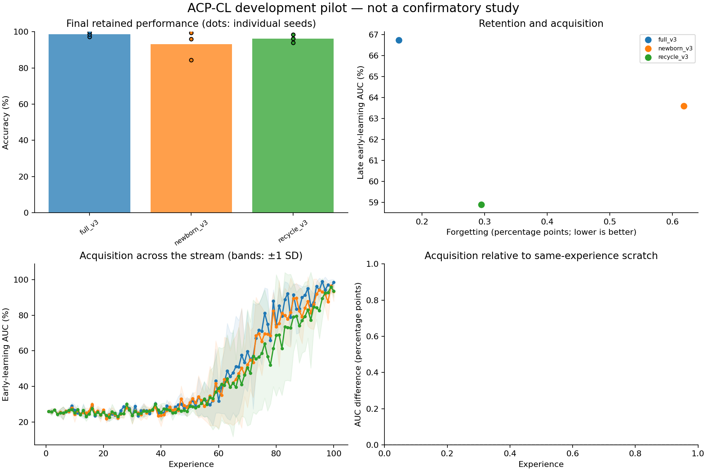

# Exploratory experiment results

Evaluation split: **validation**. Values below are percentages or percentage points.
These runs test implementation and generate hypotheses; they are not confirmatory evidence.

| Method | Seeds | Final accuracy | Forgetting | Late early AUC | Scratch-adjusted AUC | Seconds/run |
|---|---:|---:|---:|---:|---:|---:|
| full_v3 | 3 | 98.56 | 0.16 | 66.75 | — | 140.2 |
| newborn_v3 | 3 | 93.21 | 0.62 | 63.60 | — | 134.2 |
| recycle_v3 | 3 | 96.16 | 0.29 | 58.91 | — | 131.7 |

Paired newborn_v3 differences (95% unadjusted percentile bootstrap intervals; small-seed intervals are unstable):

| Comparator | Endpoint | Pairs | Difference [95% CI], pp |
|---|---|---:|---:|
| newborn_v3 - full_v3 | final_accuracy | 3 | -5.35 [-12.97, -0.41] |
| newborn_v3 - full_v3 | forgetting | 3 | +0.46 [+0.12, +0.88] |
| newborn_v3 - full_v3 | late_early_auc | 3 | -3.15 [-6.68, -1.02] |
| newborn_v3 - recycle_v3 | final_accuracy | 3 | -2.95 [-11.78, +1.97] |
| newborn_v3 - recycle_v3 | forgetting | 3 | +0.32 [-0.35, +1.36] |
| newborn_v3 - recycle_v3 | late_early_auc | 3 | +4.69 [+0.03, +12.97] |

Lower forgetting is better; higher accuracy and acquisition AUC are better.
Methods with oracle boundaries or offline yoked traces are extra-information diagnostics, not task-free competitors.
Scratch-adjusted AUC subtracts a fresh model's AUC on the identical experience; it is a diagnostic, not pure transfer.
Timing includes evaluation, diagnostics, and checkpoint writes. It is not a matched-compute comparison.
The recycling and DER++ comparators are explicitly documented implementation variants.

