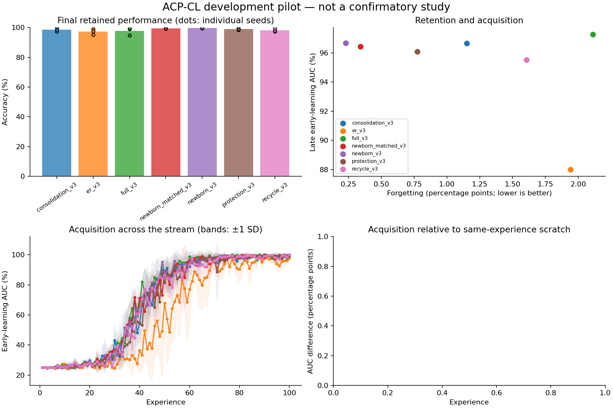

# Exploratory experiment results

Evaluation split: **validation**. Values below are percentages or percentage points.
These runs test implementation and generate hypotheses; they are not confirmatory evidence.

| Method | Seeds | Final accuracy | Forgetting | Late early AUC | Scratch-adjusted AUC | Seconds/run |
|---|---:|---:|---:|---:|---:|---:|
| consolidation_v3 | 3 | 98.57 | 1.15 | 96.65 | — | 116.9 |
| er_v3 | 3 | 97.22 | 1.94 | 88.00 | — | 121.1 |
| full_v3 | 3 | 97.72 | 2.11 | 97.27 | — | 117.0 |
| newborn_matched_v3 | 3 | 99.43 | 0.34 | 96.42 | — | 126.2 |
| newborn_v3 | 3 | 99.59 | 0.23 | 96.66 | — | 118.6 |
| protection_v3 | 3 | 98.95 | 0.77 | 96.08 | — | 113.2 |
| recycle_v3 | 3 | 98.18 | 1.61 | 95.51 | — | 122.6 |

Paired newborn_v3 differences (95% unadjusted percentile bootstrap intervals; small-seed intervals are unstable):

| Comparator | Endpoint | Pairs | Difference [95% CI], pp |
|---|---|---:|---:|
| newborn_v3 - consolidation_v3 | final_accuracy | 3 | +1.02 [-0.22, +2.32] |
| newborn_v3 - consolidation_v3 | forgetting | 3 | -0.92 [-2.49, +0.21] |
| newborn_v3 - consolidation_v3 | late_early_auc | 3 | +0.01 [-0.62, +0.93] |
| newborn_v3 - er_v3 | final_accuracy | 3 | +2.37 [+0.65, +4.32] |
| newborn_v3 - er_v3 | forgetting | 3 | -1.71 [-4.16, -0.18] |
| newborn_v3 - er_v3 | late_early_auc | 3 | +8.66 [+2.40, +13.03] |
| newborn_v3 - full_v3 | final_accuracy | 3 | +1.87 [+0.10, +4.93] |
| newborn_v3 - full_v3 | forgetting | 3 | -1.88 [-4.90, -0.03] |
| newborn_v3 - full_v3 | late_early_auc | 3 | -0.61 [-1.48, +0.21] |
| newborn_v3 - newborn_matched_v3 | final_accuracy | 3 | +0.16 [-0.20, +0.41] |
| newborn_v3 - newborn_matched_v3 | forgetting | 3 | -0.11 [-0.36, +0.04] |
| newborn_v3 - newborn_matched_v3 | late_early_auc | 3 | +0.24 [-0.02, +0.64] |
| newborn_v3 - protection_v3 | final_accuracy | 3 | +0.64 [-0.19, +1.31] |
| newborn_v3 - protection_v3 | forgetting | 3 | -0.54 [-1.29, +0.04] |
| newborn_v3 - protection_v3 | late_early_auc | 3 | +0.59 [-1.73, +3.20] |
| newborn_v3 - recycle_v3 | final_accuracy | 3 | +1.41 [+0.20, +2.24] |
| newborn_v3 - recycle_v3 | forgetting | 3 | -1.38 [-2.31, -0.06] |
| newborn_v3 - recycle_v3 | late_early_auc | 3 | +1.15 [+0.08, +3.04] |

Lower forgetting is better; higher accuracy and acquisition AUC are better.
Methods with oracle boundaries or offline yoked traces are extra-information diagnostics, not task-free competitors.
Scratch-adjusted AUC subtracts a fresh model's AUC on the identical experience; it is a diagnostic, not pure transfer.
Timing includes evaluation, diagnostics, and checkpoint writes. It is not a matched-compute comparison.
The recycling and DER++ comparators are explicitly documented implementation variants.

