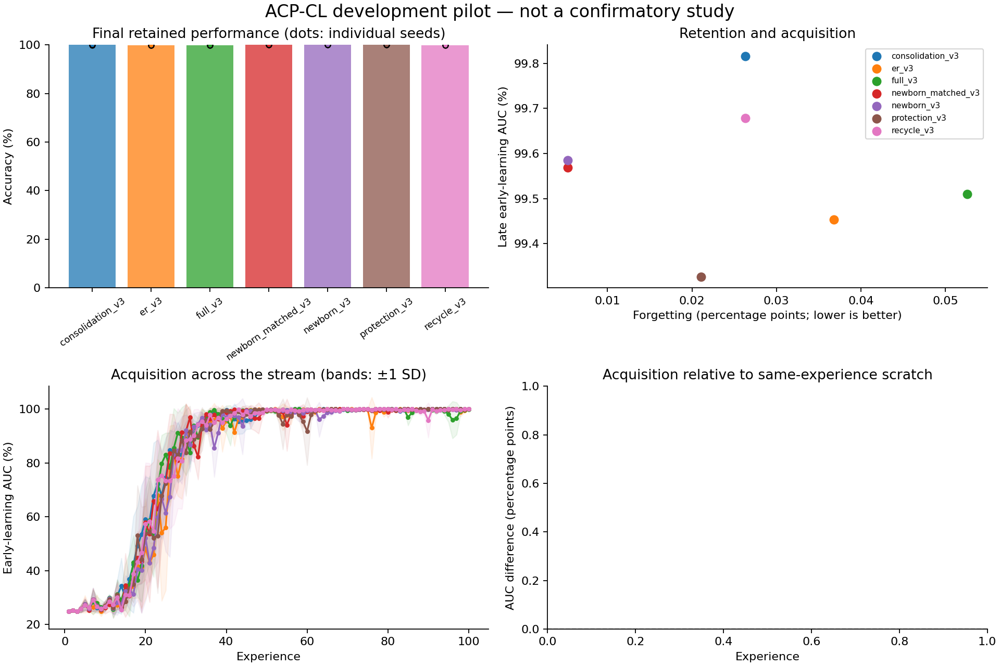

# Exploratory experiment results

Evaluation split: **validation**. Values below are percentages or percentage points.
These runs test implementation and generate hypotheses; they are not confirmatory evidence.

| Method | Seeds | Final accuracy | Forgetting | Late early AUC | Scratch-adjusted AUC | Seconds/run |
|---|---:|---:|---:|---:|---:|---:|
| consolidation_v3 | 3 | 99.97 | 0.03 | 99.82 | — | 116.8 |
| er_v3 | 3 | 99.95 | 0.04 | 99.45 | — | 121.1 |
| full_v3 | 3 | 99.93 | 0.05 | 99.51 | — | 116.9 |
| newborn_matched_v3 | 3 | 99.99 | 0.01 | 99.57 | — | 126.0 |
| newborn_v3 | 3 | 99.98 | 0.01 | 99.58 | — | 118.4 |
| protection_v3 | 3 | 99.98 | 0.02 | 99.33 | — | 113.3 |
| recycle_v3 | 3 | 99.96 | 0.03 | 99.68 | — | 122.5 |

Paired newborn_v3 differences (95% unadjusted percentile bootstrap intervals; small-seed intervals are unstable):

| Comparator | Endpoint | Pairs | Difference [95% CI], pp |
|---|---|---:|---:|
| newborn_v3 - consolidation_v3 | final_accuracy | 3 | +0.02 [+0.00, +0.04] |
| newborn_v3 - consolidation_v3 | forgetting | 3 | -0.02 [-0.05, -0.01] |
| newborn_v3 - consolidation_v3 | late_early_auc | 3 | -0.23 [-0.29, -0.12] |
| newborn_v3 - er_v3 | final_accuracy | 3 | +0.03 [+0.02, +0.05] |
| newborn_v3 - er_v3 | forgetting | 3 | -0.03 [-0.06, -0.02] |
| newborn_v3 - er_v3 | late_early_auc | 3 | +0.13 [-0.29, +0.35] |
| newborn_v3 - full_v3 | final_accuracy | 3 | +0.05 [+0.01, +0.10] |
| newborn_v3 - full_v3 | forgetting | 3 | -0.05 [-0.09, +0.00] |
| newborn_v3 - full_v3 | late_early_auc | 3 | +0.07 [-0.30, +0.68] |
| newborn_v3 - newborn_matched_v3 | final_accuracy | 3 | -0.01 [-0.01, +0.00] |
| newborn_v3 - newborn_matched_v3 | forgetting | 3 | +0.00 [-0.01, +0.01] |
| newborn_v3 - newborn_matched_v3 | late_early_auc | 3 | +0.02 [-0.04, +0.11] |
| newborn_v3 - protection_v3 | final_accuracy | 3 | +0.01 [+0.00, +0.02] |
| newborn_v3 - protection_v3 | forgetting | 3 | -0.02 [-0.02, -0.01] |
| newborn_v3 - protection_v3 | late_early_auc | 3 | +0.26 [-0.07, +0.90] |
| newborn_v3 - recycle_v3 | final_accuracy | 3 | +0.02 [-0.01, +0.05] |
| newborn_v3 - recycle_v3 | forgetting | 3 | -0.02 [-0.05, +0.01] |
| newborn_v3 - recycle_v3 | late_early_auc | 3 | -0.09 [-0.19, -0.01] |

Lower forgetting is better; higher accuracy and acquisition AUC are better.
Methods with oracle boundaries or offline yoked traces are extra-information diagnostics, not task-free competitors.
Scratch-adjusted AUC subtracts a fresh model's AUC on the identical experience; it is a diagnostic, not pure transfer.
Timing includes evaluation, diagnostics, and checkpoint writes. It is not a matched-compute comparison.
The recycling and DER++ comparators are explicitly documented implementation variants.

