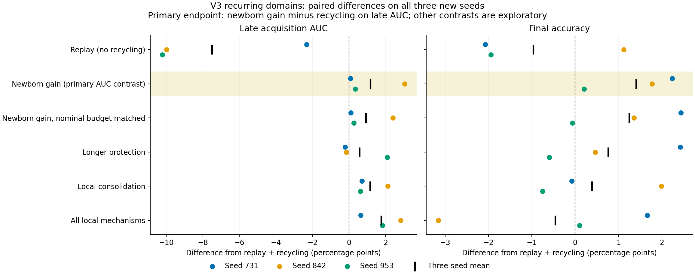

# V3: local allocation after recycling

Completed on 2026-09-20: **67 comparative runs** (16 development and 51 locked
evaluation), with 121,200 optimizer updates. All planned runs completed; none
was excluded. Twenty-one engineering smoke runs are recorded separately.

**A temporary newborn gain has a modest positive signal in this setting.**
On three new seeds, it improves the prespecified recurring-domain late
acquisition AUC by **1.15 percentage points** over replay plus recycling.
The nominal-budget-matched version improves it by **0.92 points**. Both AUC
contrasts are positive on all three seeds, but most of their mean improvement
comes from one seed. The combined policy trades higher late AUC for lower mean
final accuracy. These results support a focused follow-up, not a validated
continual-learning algorithm or a novelty claim.

## Primary result and complete recurring comparison

Mean percentages across seeds 731, 842, and 953; higher is better:

| Method | Final accuracy | Late acquisition AUC |
|---|---:|---:|
| Replay | 97.22 | 88.00 |
| Replay + recycling | 98.18 | 95.51 |
| Newborn gain | **99.59** | 96.66 |
| Newborn gain, nominal budget matched | 99.43 | 96.42 |
| Longer protection | 98.95 | 96.08 |
| Local consolidation | 98.57 | 96.65 |
| All local mechanisms | 97.72 | **97.27** |

The primary comparison was fixed before evaluation: newborn gain minus replay
plus recycling on early-learning AUC over the last 50 experiences. Each AUC
uses the first 256 current presentations, including the initial measurement.
It combines retained knowledge, transfer, and adaptation; it is not a pure
measurement of learning speed.

| Seed | Recycling late AUC | Newborn late AUC | AUC difference, pp | Final-accuracy difference, pp |
|---:|---:|---:|---:|---:|
| 731 | 98.133 | 98.211 | +0.078 | +2.242 |
| 842 | 95.398 | 98.441 | +3.043 | +1.773 |
| 953 | 92.988 | 93.332 | +0.344 | +0.203 |

The mean primary difference is +1.15495 pp, with an exploratory 95% paired
percentile bootstrap interval of [+0.07813, +3.04297] pp. It resamples whole
seed pairs 10,000 times using analysis seed 37119. With only three pairs this
interval is unstable; two observed gains are below 0.35 pp. It is not a
confirmatory superiority result. Mean final accuracy improves by 1.40625 pp.

The matched variant's AUC gains are +0.09375, +2.40234, and +0.25000 pp. Its
mean final gain is +1.24479 pp, with a small negative final difference on seed
953 (-0.06250 pp). A small AUC benefit therefore remains when nominal feature
gain is matched, but actual update displacements still differ.

The full combination improves mean late AUC by 1.76042 pp while lowering final
accuracy by 0.46354 pp. Seed 842 loses 3.15625 final-accuracy points. Longer
protection improves mean late AUC but loses on two of three seeds. Consolidation
alone improves AUC on all three but has mixed final-accuracy differences.
The higher full-method AUC is a diagnostic result, not a replacement primary
hypothesis. These comparisons are not a full factorial or conditional
leave-one-out decomposition.



Points are seed-paired differences; black marks are means. See the
[numeric figure data](v3/paired_contrasts.csv), [suite summary](v3/recurring/summary.md),
and [all recycling-reference contrasts and per-seed diagnostics](v3/diagnostics.json).

## Stationary and early-bias checks

All stationary mean final accuracies lie between 99.93% and 99.99%, so this
control has a pronounced ceiling. Newborn gain changes late AUC by -0.09375 pp
relative to recycling, slightly negative on every seed. Its maximum observed
fixed-pool drawdown is 0 pp, versus 3.90625 pp for recycling. Across all
stationary methods/seeds, the largest observed drawdown is 9.375 pp. These
sparse measurements do not establish uninterrupted stability.

An early-biased curriculum changes only the first eight training experiences:
color-label correlation is 0.95 there, then zero. Evaluation colors are
independent throughout. Evaluation tensors are bitwise identical between
the two curricula for every shared seed; the generator also pairs subsequent
training data. Despite removal of the cue, learning is substantially delayed:

| Method | Independent colors: final / late AUC | Early bias: final / late AUC |
|---|---:|---:|
| Replay + recycling | 98.18 / 95.51 | 96.16 / 58.91 |
| Newborn gain | 99.59 / 96.66 | 93.21 / 63.60 |
| All local mechanisms | 97.72 / 97.27 | 98.56 / 66.75 |

Under early bias, newborn gain improves mean late AUC but loses 2.94792 pp of
mean final accuracy against recycling; seed 731 loses 11.78125 pp. The combined
method improves both endpoints on all three early-biased seeds, but the
prespecified interaction is inconsistent: `(full - recycle)_biased -
(full - recycle)_independent` has late-AUC differences of **+19.01953,
-0.00781, and -0.77344 pp**. Its mean is +6.07943 pp, with an exploratory
interval [-0.77344, +19.01953]. The final-accuracy interaction averages +2.86198
pp, interval [-0.47656, +7.78125].

The curriculum matters strongly in these runs. These contrasts do not identify
early consolidation as the cause, or show a consistent special benefit of
the full policy under bias. V3 has no global closure/reopening controller.


Trajectories show nonoverlapping five-experience means; shading is the range
across three seeds, not a confidence band. Full tables:
[stationary](v3/stationary/summary.md), [early bias](v3/early_biased/summary.md).

## Were the mechanisms and controls active?

After a common 40-update warmup at feature gain 1, mature feature gain is 0.5.
The newborn variant boosts a replaced unit's incoming rows to 2.0, declining
linearly to 0.5 over 30 updates. Initial model units receive no newborn window.
The protection variant extends previously reset units' replacement eligibility
age from 30 to 60 updates. Consolidation uses a local 30-update SI window and
anchors useful rows. The classifier retains nominal gain 1 in all conditions.

Every recycling condition performed **98 scheduled events and 294 unit resets
per run**, at identical times and counts. Units were selected using each
learner's current utility; identities were not matched. Replay alone performed
no resets. All learners had the same 40-update warmup and paired data, replay
contents, replay sampling RNGs, and training exposure within each condition.

Recurring means; gain averages exclude warmup, while clipping and displacement
totals cover all 2,000 updates:

| Method | Nominal gain | Gain after clipping | Clipped updates | Summed feature / head data displacement |
|---|---:|---:|---:|---:|
| Replay | 0.5000 | 0.4578 | 25.07% | 107.12 / 40.71 |
| Recycling | 0.5000 | 0.4631 | 22.28% | 102.12 / 40.51 |
| Newborn | 0.5080 | 0.4777 | 20.38% | 99.69 / 37.50 |
| Matched newborn | 0.5000 | 0.4649 | 21.05% | 101.70 / 38.98 |
| Protection | 0.5000 | 0.4668 | 21.27% | 102.27 / 40.47 |
| Consolidation | 0.4843 | 0.4518 | 20.78% | 100.15 / 39.98 |
| Full | 0.4923 | 0.4606 | 20.63% | 98.15 / 38.39 |

These displacement values sum per-update L2 norms of the data component; they
are not endpoint distances or compute budgets. The matched variant redistributes
gain away from mature features and matches the per-step nominal feature mean
to within the audit tolerance of 2e-6. Post-clipping gain, gradients, and
displacements are not matched. Thus nominal budget matching does not isolate
timing from every other learning-allocation effect.

The largest recorded complete optimizer displacement across the cohort is
approximately 0.1000000060, within 1e-6 of the shared 0.1 bound. That bound includes head,
momentum, decay, and anchors, but **excludes structural resets** and does not
bound prediction damage. Sampled events show six simultaneous newborn units
in gain variants and nine protected units in protection variants. Every
consolidation/full run records 288 maturations and 186-226 positive local
consolidations. Zero maturation counters in gain-only variants mean that no
SI consolidation was scheduled; their gain windows still operated.

## Selection, provenance, and resources

Development used seeds 411 and 522, four candidate gains, and both recurring
and stationary 60-experience streams. The written rule selected **0.5**:

| Gain | Recurring final | Recurring late AUC | Stationary final | Maximum stationary drawdown, pp | Outcome |
|---:|---:|---:|---:|---:|---|
| 0.05 | 40.17 | 34.10 | 88.76 | 0.00 | Below final-accuracy cutoff |
| 0.15 | 55.82 | 49.93 | 98.28 | 13.28 | Failed stability screen |
| 0.5 | 89.38 | 75.03 | 99.34 | 0.00 | Selected |
| 1.0 | 85.62 | 65.31 | 99.55 | 1.56 | Eligible; lower score |

The [development archive](v3/development/summary.md) preserves all candidates.
The [selection and locked configurations](../configs/v3/locked/selection.json)
were committed at `7fbb270` at 23:06:50 UTC, before evaluation manifests at
approximately 23:07:15 UTC. Local timestamps record chronology but are not
independently trusted clock evidence. Result/config hashes preserve the
development-to-selection-to-evaluation dependency.

Training source was frozen at `bac05cf`, SHA-256
`cccbb40b2fe578be511f49c31d9629abd823f89bf078ccc9781b1d38c17c5efe`.
Documentation and analysis commits during training did not change that source.
All 67 comparative runs share runtime SHA-256
`eaa3eeb6552fb64e38fa3af4a81505d5ae7a8b57ecbfe506da7a03677ccc17cf`:
Windows, Python 3.10.11, Torch 2.8.0+cu128, NumPy 2.2.6, RTX 4070 Ti.

A separate [numerical audit](v3/independent_audit.md) reintegrated all 5,100
acquisition curves, checked 102,000 per-update allocations, reconstructed reset
ages and matched gains, and recomputed the contrasts without the project's
metric/report helpers. It found no numerical or identity discrepancies. This
is independent arithmetic and implementation checking, not a training rerun
or an external replication of the scientific result.

Each evaluation run has 28,116 model parameters, 64,000 current presentations,
63,968 replay presentations, 25,600 probe-image forwards, 3,999 backward calls,
and a 256-image replay buffer occupying 788,480 bytes. All comparative runs'
logged elapsed times sum to 7,247.79 seconds, with concurrent jobs; this is
neither GPU compute time nor an equal-throughput comparison. Per-run timing,
costs, identities, and raw-file hashes are in the [inventory](v3/run_inventory.json).

The shared gain was selected for recycling and then used for every method.
This is not equal per-method tuning. The stream has four labels across eight
recurring domains, not 100 novel tasks. Only the terminal adapter is recycled.
Test images were neither generated nor evaluated; these are new validation
seeds on a benchmark and model already chosen during development. Cross-version
v2/v3 differences also change controls and rendering, so their aggregate scores
are not a controlled version comparison.

## What to carry forward and publish

Carry **newborn gain and its matched control** into the proposed
[single-pass CIFAR-10 pilot](../docs/next_experiment.md), alongside replay and
recycling. It keeps fixed labels and paired stationary/recurring conditions,
using natural base images. Its adapter is still proposed, not implemented.
Delay additional global control or a larger combined policy: the present
combination has tradeoffs, and the strongest unaddressed issue is whether the
small gains survive a different data source and a less saturated task.

The repository is ready to share as a transparent research work in progress.
Preferential newborn learning and maturation have close
[computational precedents](../docs/algorithm_v3.md#close-computational-precedents).
The contribution here is the implementation, controls, and recorded evidence.
A public repository does not establish novelty, biological fidelity, or
general algorithmic benefit.

The CPU test suite passes **443 tests**, with one CUDA and two Windows symlink
privilege skips. All seven methods pass CPU, GPU, and
[clean-clone installation smokes](v3/clean_clone_check.md); Ruff passes.
See [public-readiness notes](../docs/public_readiness.md) for the remaining
license, author, and GitHub destination decisions. No hosted CI result or
GitHub publication is claimed.

## Reproduction and archived evidence

Follow the [README](../README.md#completed-v3-study) to reproduce the development
grid and freeze a fresh selection artifact before evaluating. Then run:

```powershell
.venv\Scripts\python.exe scripts/summarize_v3.py --results runs/v3_reproduction --locked configs/v3/reproduction_lock --output reports/my_v3
.venv\Scripts\python.exe scripts/plot_v3_contrasts.py --archive reports/my_v3 --output reports/my_v3
.venv\Scripts\python.exe scripts/inventory_v3.py --locked configs/v3/reproduction_lock --evaluation runs/v3_reproduction --output reports/my_v3/run_inventory.json
```

The compact archives contain per-seed matrices, AUCs, diagnostic summaries,
figures, and identities. Raw allocation/event traces, checkpoints, and full
learning curves remain in ignored local `runs/`; their hashes are recorded,
but they are not a downloadable complete raw archive. The ordinary `analyze`
command requires original per-run results or a reproduction, not these compact
summary files. Independent runs produce new artifact hashes because provenance
and timing are recorded. See the [protocol](../docs/experiment_v3.md),
[allocation rules](../docs/algorithm_v3.md), and
[independent numerical audit](v3/independent_audit.md).
